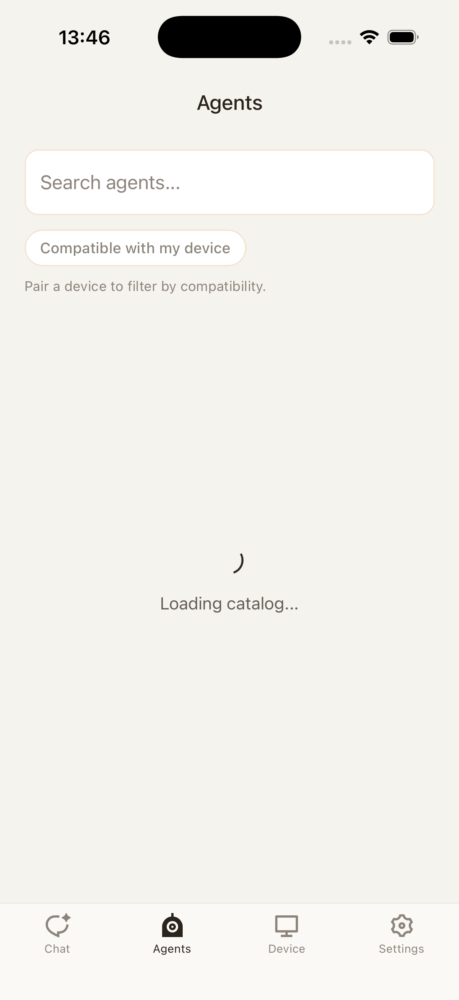
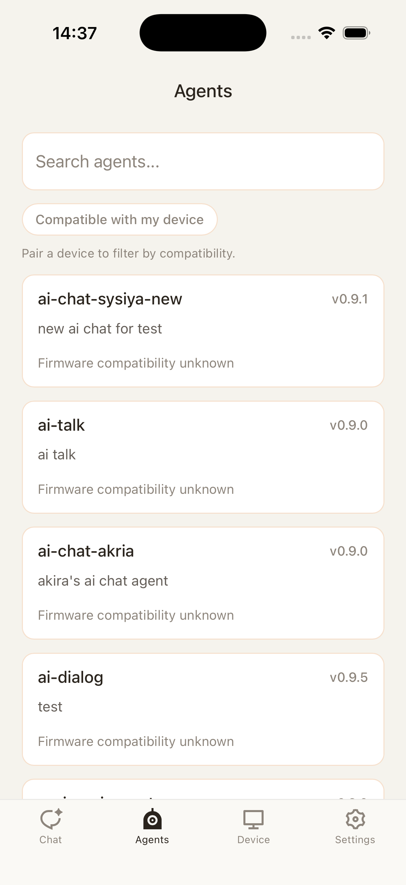
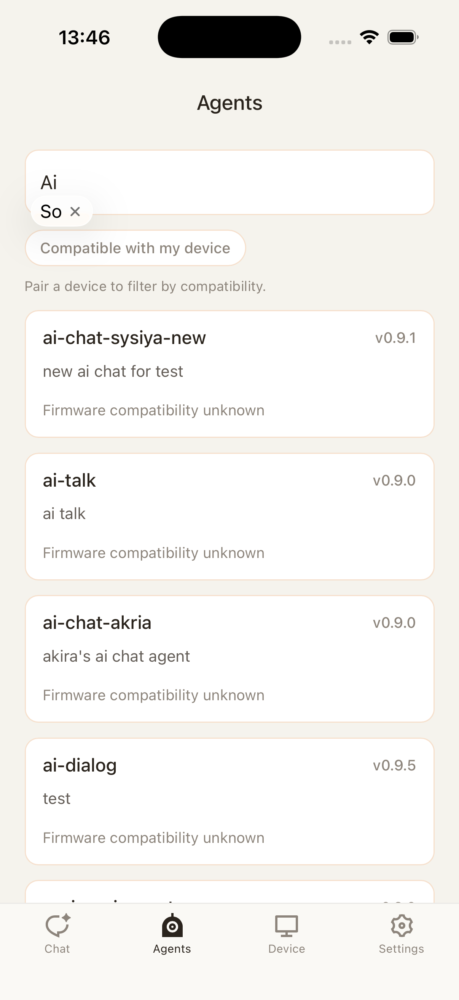
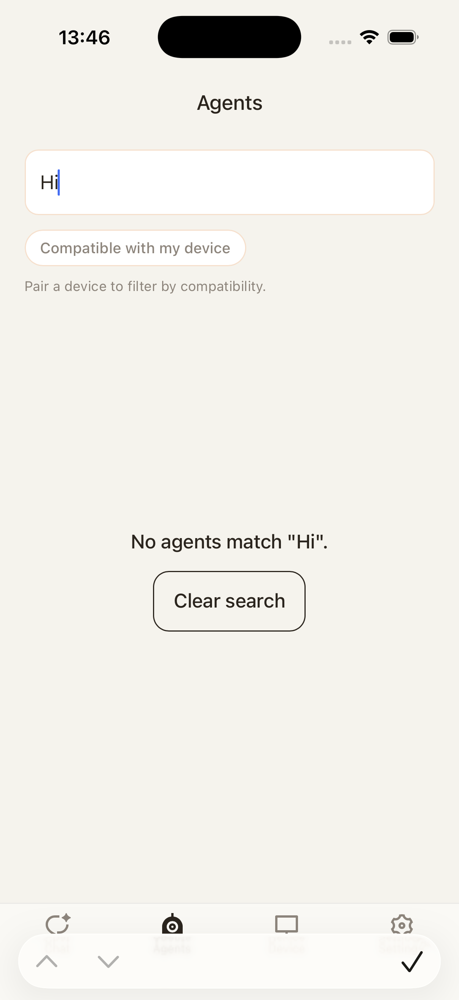
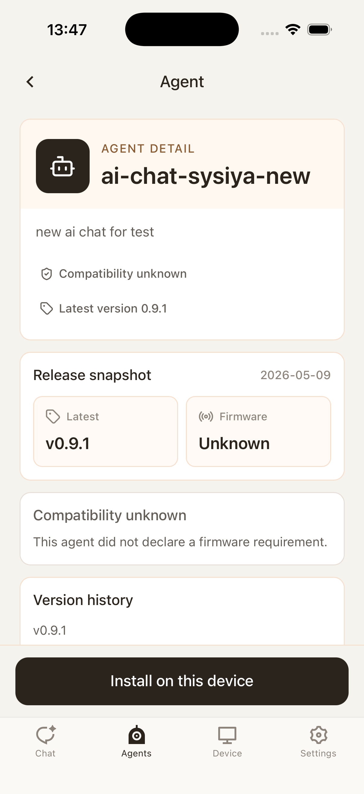
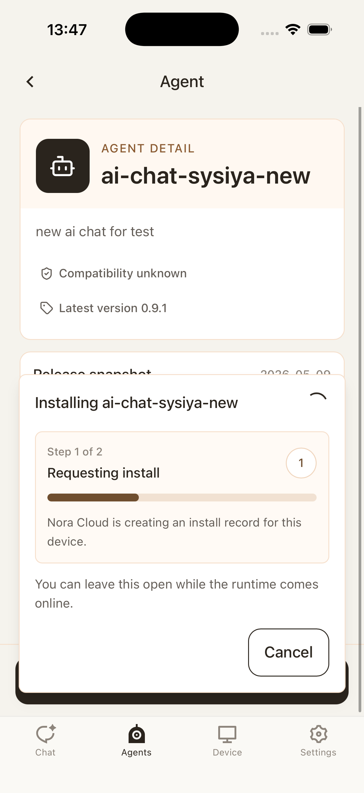
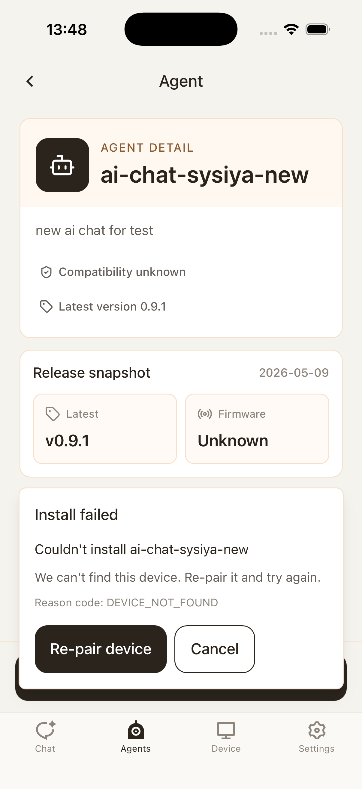
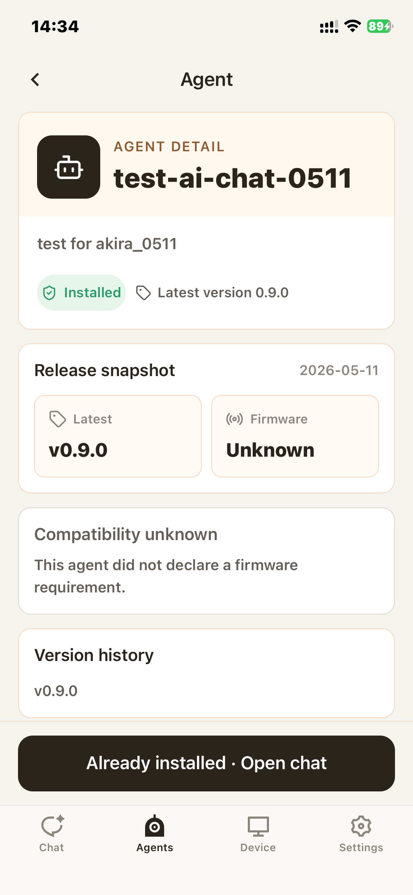

# MOB-05 Agents

This document defines the Agents journey for HH Mobile Chat. It covers browsing agents, searching the catalog, opening agent detail, installing an agent, handling install failure, and recognizing installed state.

## User Journey

### 1. User opens the Agents tab

The catalog may load before any cards are visible. During this state, the user should understand that the agent list is being fetched.

After loading succeeds, the user sees the available agents. Tapping a card opens the detail page for that agent.

### 2. User searches the catalog

Typing in search narrows the catalog while staying on the Agents tab. The query should not affect onboarding agent lists or other surfaces.

If no agents match the query, the user gets an empty state and can recover by editing or clearing the search text.

### 3. User opens an agent detail page

The detail page explains the selected agent and shows whether it can be installed. This is the decision point before changing the active device/runtime state.

When the user taps install, the detail page enters an installing state and should prevent duplicate install submissions.

If install fails, the error should stay scoped to this agent detail attempt. The user can retry or go back without polluting the catalog state.

After install succeeds, the page shows the installed state so the user understands the agent is already available.

## Control Contract

| Control             | Required behavior                                                                   |
| ------------------- | ----------------------------------------------------------------------------------- |
| Search              | Filters visible agents without destroying the fetched list cache.                   |
| Agent card          | Opens detail for that agent.                                                        |
| Back from detail    | Returns to the previous list/search state.                                          |
| Install             | Starts install for the selected agent and disables duplicate submits while pending. |
| Retry after failure | Clears the previous install error and restarts install.                             |

## State Contract

| State           | Required UI                                  | Exit condition                            |
| --------------- | -------------------------------------------- | ----------------------------------------- |
| Loading catalog | Progress/loading surface.                    | Catalog fetch succeeds or fails.          |
| Catalog ready   | Agent cards, search, and navigation.         | User searches or opens detail.            |
| Empty search    | No-result message with editable search.      | Query changes or clears.                  |
| Detail ready    | Agent metadata and install/installed status. | User installs or navigates away.          |
| Installing      | Pending install affordance.                  | Install succeeds or fails.                |
| Install failed  | Recoverable error state.                     | Retry or navigation clears state.         |
| Installed       | Installed badge/action state.                | Agent state changes from backend refresh. |

## Notes

- The screenshots cover install failure on agent detail, but not catalog fetch failure. Settings captures a related agent-load failure in MOB-07.
- Search should remain local to the Agents tab and not affect onboarding agent lists.
