# MOB-04 Chat

This document defines the chat journey for HH Mobile Chat. It covers the primary conversation surface, text send and response, new session creation, and voice input permission, recording, and send states.

## User Journey

### 1. User opens the chat tab

The chat page is the default conversation surface after setup. The user should see the current session, composer, and the controls needed to start a new interaction.

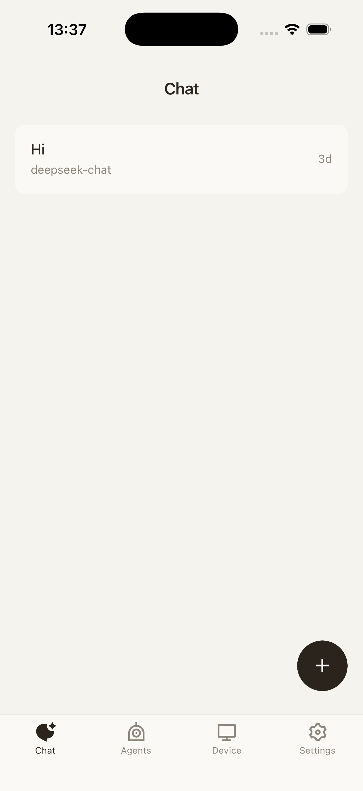

### 2. User sends a text message

The user types a message and taps send. The message should appear immediately in the thread so the user has confidence that the request was accepted.

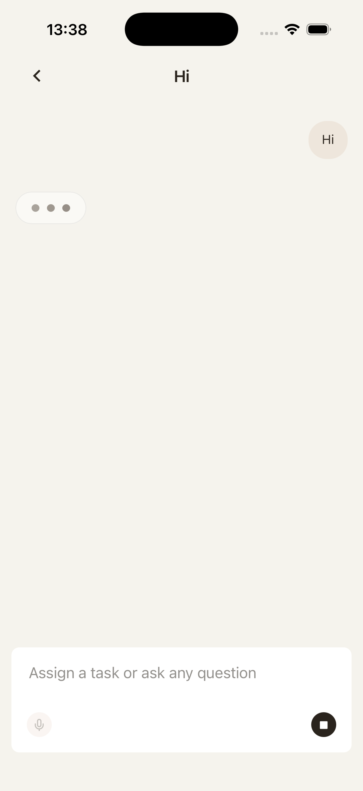

The agent response then appears in the same conversation. After the response is complete, the composer should be ready for the next message.

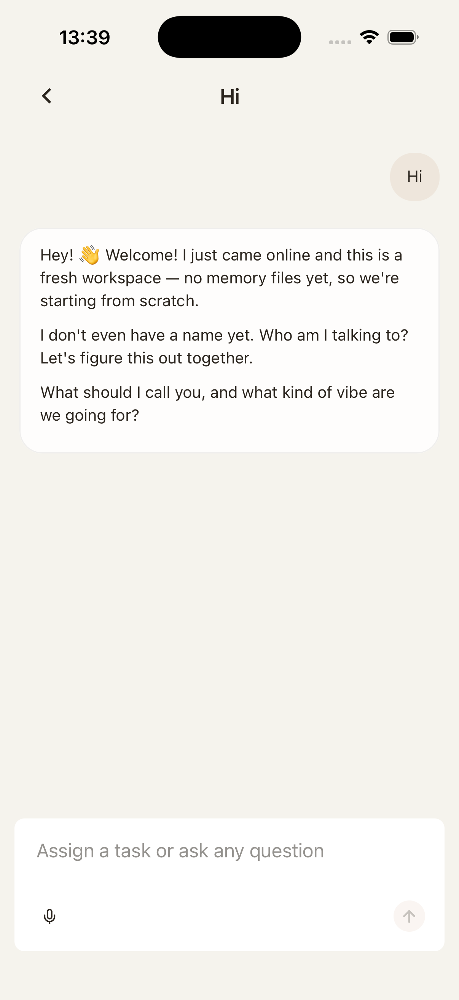

If the user starts a new session, the app should create a fresh conversation context without affecting account, device, or agent state.

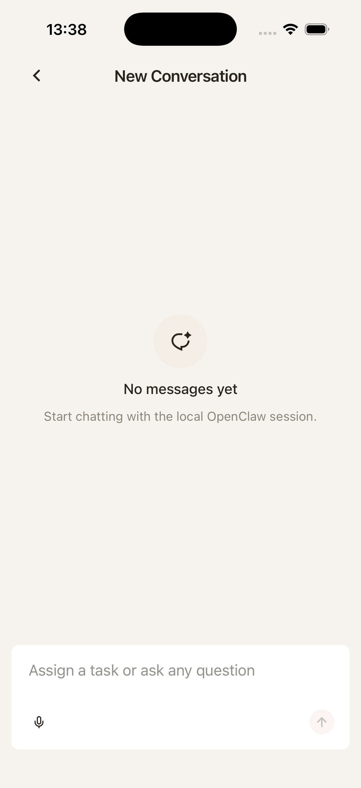

### 3. User starts voice input

When the user taps the microphone for the first time, the app requests voice permission. The permission prompt is part of the journey and should be recoverable if the user cancels or denies.

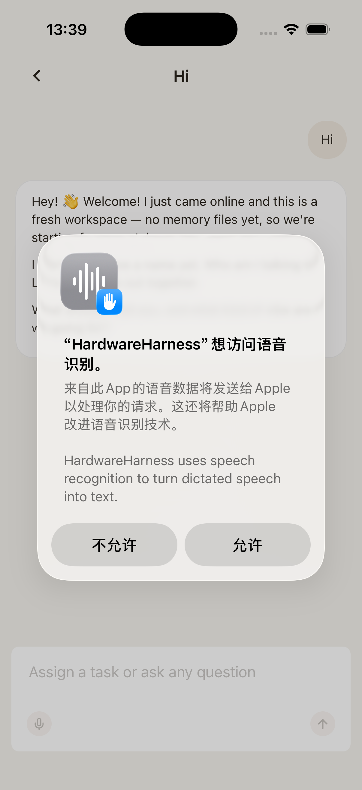

If the user cancels at this stage, the app should return to the normal chat composer without sending audio or leaving a recording indicator active.

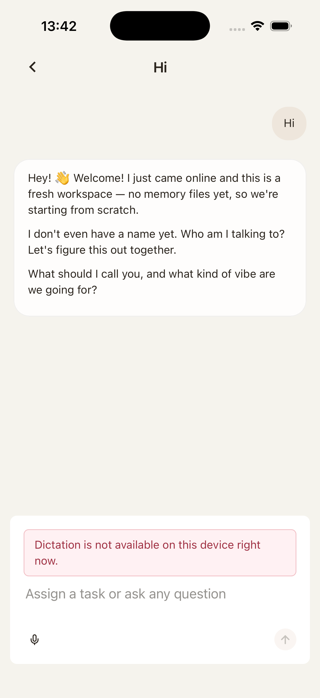

Some platforms show a second permission or confirmation surface. Allowing should move into recording; denying should return to chat.

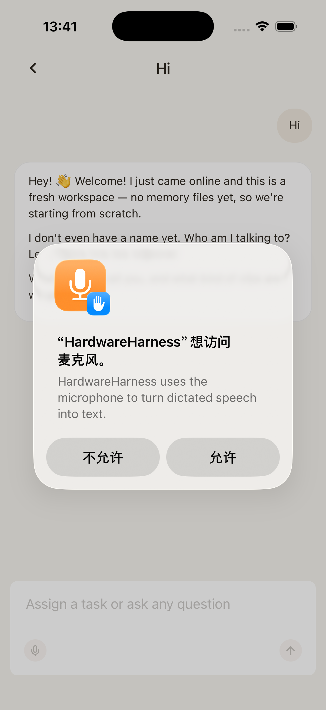

The cancel control remains available during the voice flow. Canceling should clear temporary recording state.

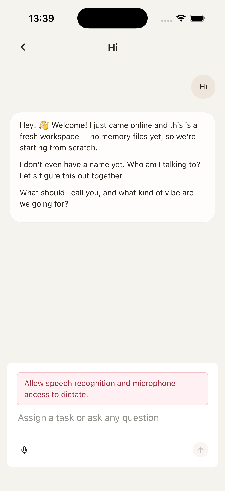

### 4. User records and sends voice

During recording, the UI should clearly show that the app is listening. The user can continue speaking or cancel before creating a message.

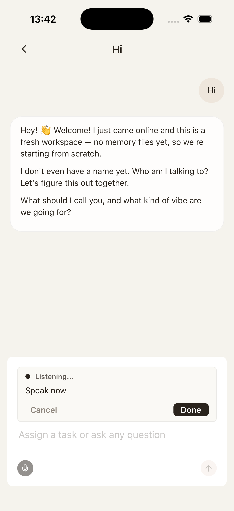

The alternate speaking state is the same contract with different captured audio/transcript progress. The journey is still in active capture.

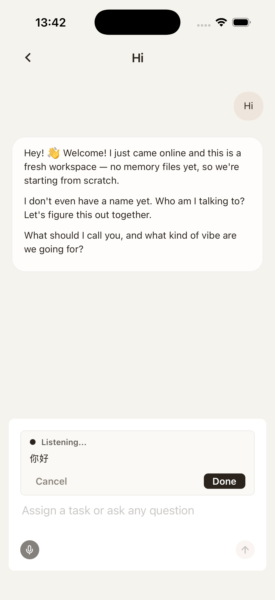

When recording is done, the user gets a review/send state. At this point the app has a captured voice payload ready to submit.

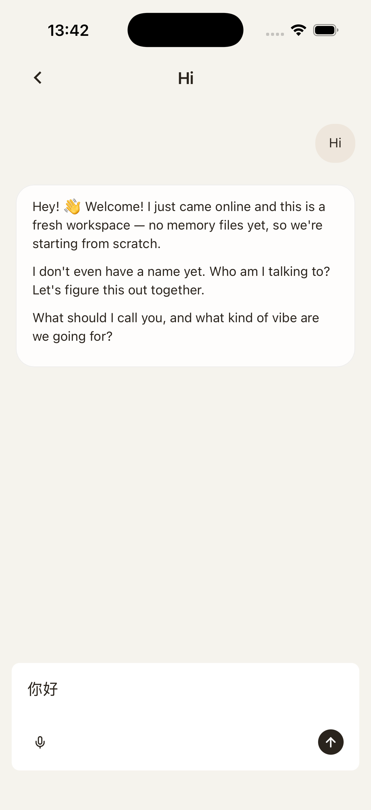

After the user taps send, the voice payload or transcript is submitted into the current chat session.

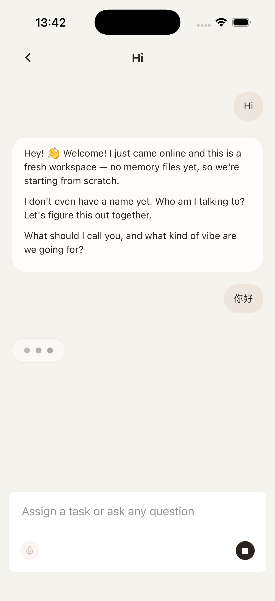

## Control Contract

| Control       | Required behavior                                                            |
| ------------- | ---------------------------------------------------------------------------- |
| Text composer | Accepts user text and clears after successful send.                          |
| Send          | Appends the user message locally and submits it to the active session.       |
| New session   | Creates a fresh chat context without losing account/device state.            |
| Microphone    | Requests permission when needed, then starts voice capture.                  |
| Cancel voice  | Stops recording or dismisses permission state and returns to the composer.   |
| Send voice    | Sends the captured voice payload or transcript into the active chat session. |

## State Contract

| State                | Required UI                                       | Exit condition                                           |
| -------------------- | ------------------------------------------------- | -------------------------------------------------------- |
| Idle chat            | Thread and composer.                              | User sends text, starts voice, or creates a new session. |
| Awaiting response    | User message visible; response pending/streaming. | Agent response finishes or fails.                        |
| Permission requested | Native microphone permission surface.             | User allows or denies.                                   |
| Recording voice      | Active recording affordance and cancel path.      | User stops, sends, or cancels.                           |
| Voice ready          | Captured audio ready to send.                     | User sends or cancels.                                   |

## Notes

- The screenshots do not capture a chat send error state. A future contract pass should add a failed-send or offline-device screenshot.
- Voice cancellation is part of the core journey and must clear all temporary recording state.
