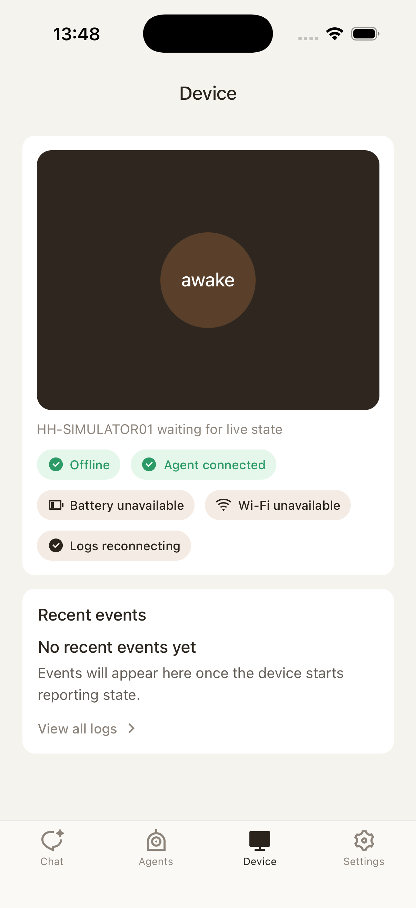
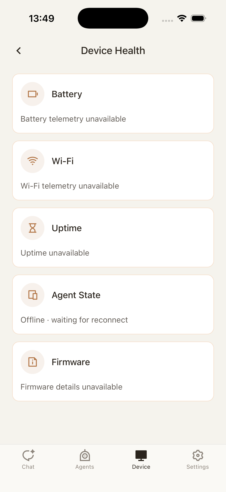
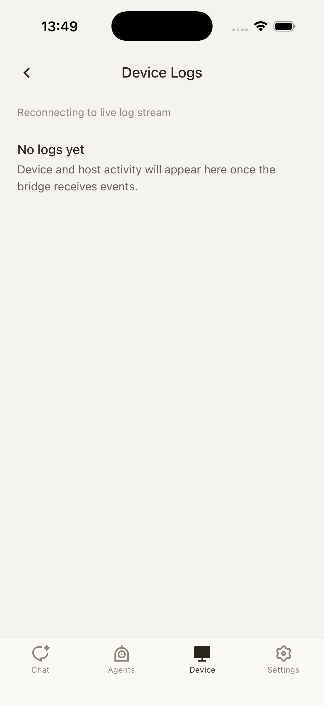
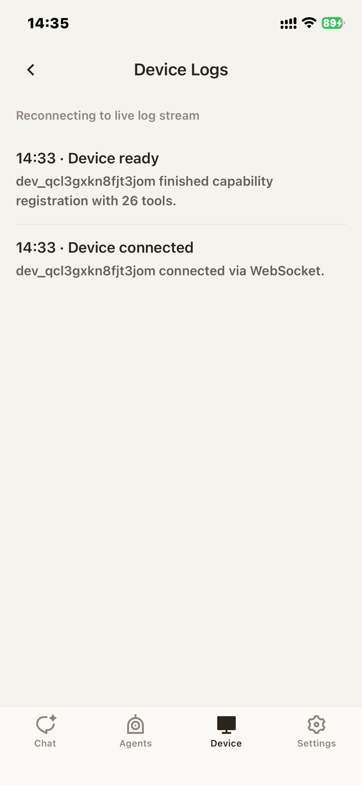

# MOB-06 Device

This document defines the Device journey for HH Mobile Chat. It covers connected-device overview, health details, and runtime logs used to inspect device state after onboarding.

## User Journey

### 1. User opens the Device tab

The device overview gives the user a quick read on the connected device identity and status. From here, the user can drill into health or logs.

### 2. User checks device health

When the user opens health, they should see device-level status and diagnostics for the active device. Going back should return to the same device overview.

### 3. User reads device logs

The logs page is for diagnostics after setup. Logs should be readable, scrollable, and tied to the active device context.

When the user scrolls, the page should preserve log content and not reset the device session.

## Control Contract

| Control      | Required behavior                                                       |
| ------------ | ----------------------------------------------------------------------- |
| Health entry | Opens health detail for the active device.                              |
| Logs entry   | Opens runtime logs for the active device.                               |
| Back         | Returns to device overview while preserving the current device context. |
| Log scroll   | Allows reading long logs without changing device connection state.      |

## State Contract

| State           | Required UI                               | API/runtime dependency                           |
| --------------- | ----------------------------------------- | ------------------------------------------------ |
| Device overview | Device identity, status, and action rows. | Active device session and device metadata.       |
| Health detail   | Health/status metrics.                    | Device health endpoint or cached runtime health. |
| Logs detail     | Log stream/list with scroll.              | Device logs endpoint or cached log snapshot.     |

## Notes

- The screenshots do not capture disconnected, stale, or failed-to-load device states. Add those states if the device tab becomes a primary diagnostic surface.
- Device page controls should never trigger onboarding reset unless the user explicitly chooses a settings action from MOB-07.
