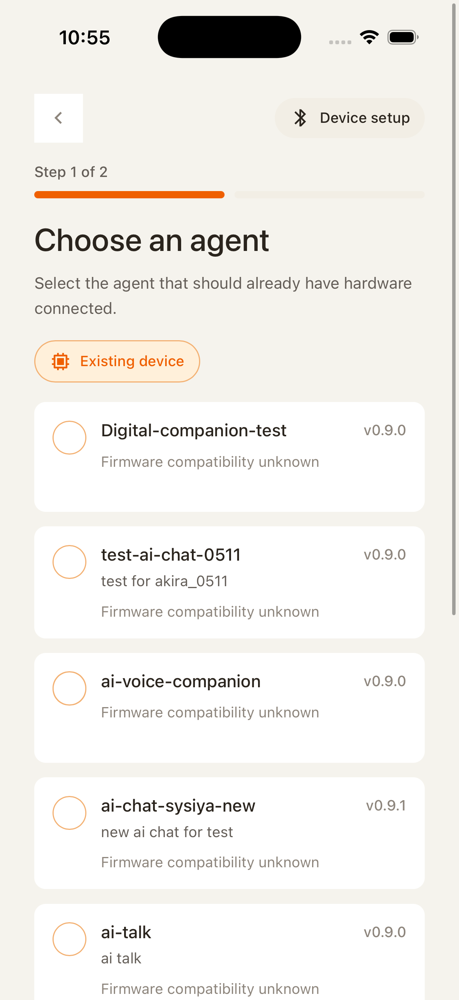
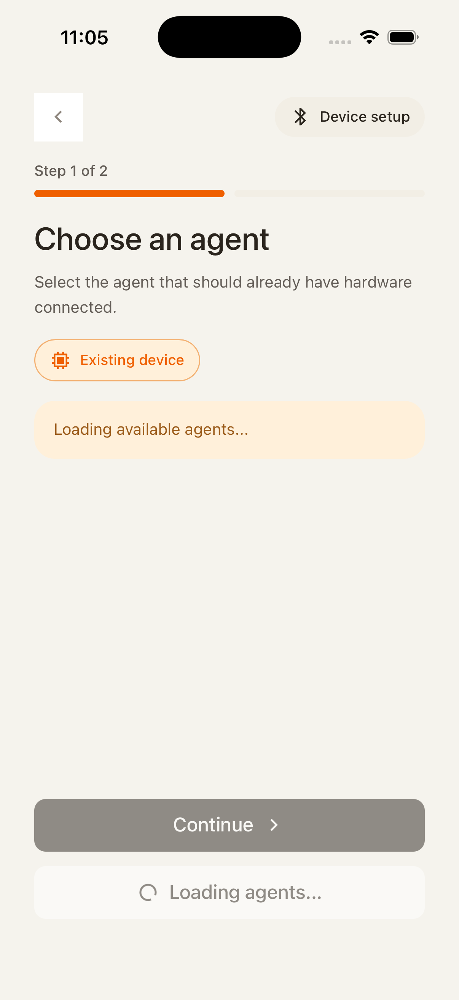
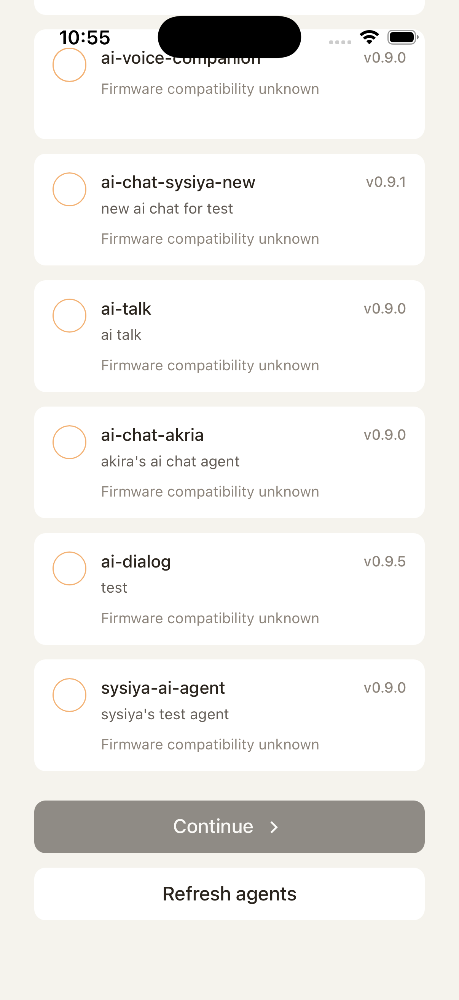
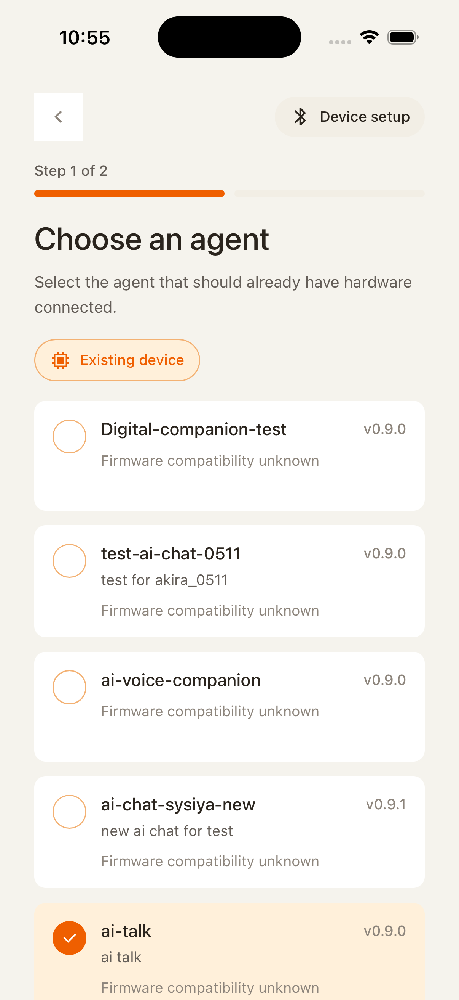
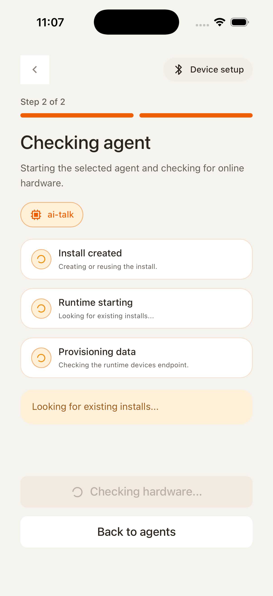
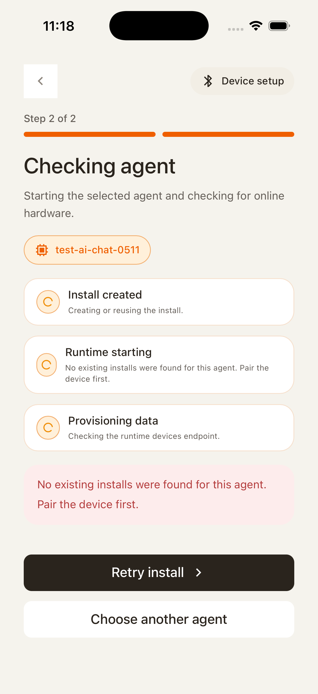
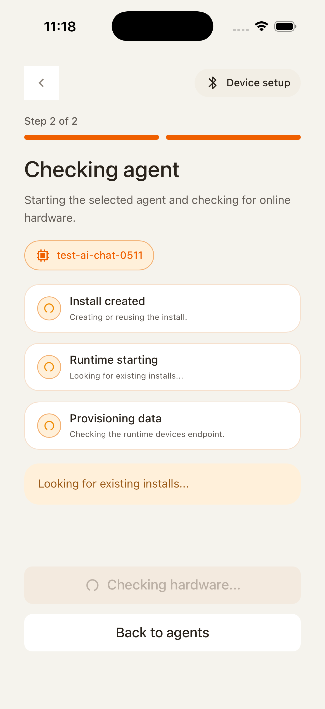

# MOB-03 Existing-device Onboarding

This document defines the existing-device onboarding journey for HH Mobile Chat. It covers reconnecting through an existing agent, reinstalling or reusing runtime state, and returning to the main app after runtime preparation completes.

## User Journey

### 1. User chooses the existing-device path

When BLE is unavailable or the user already has a paired device, they enter this flow from "Existing device?". The first useful screen is an agent list, because the user is reconnecting through an existing agent instead of pairing new hardware.

If the user refreshes the list, the page should show a loading state while keeping the journey context clear: they are still choosing an existing agent.

The bottom controls finish the list step. Continue should require a selected agent; refresh should restart list loading and clear any list-load error.

### 2. User selects an agent to reconnect

After tapping an agent, the selected row is highlighted. This selected agent becomes the target for the reinstall/runtime preparation step.

If loading the agent list fails, the error should stay scoped to the list. The user can retry refresh without losing the broader existing-device journey.

If reinstall fails after the user continues, the error belongs to the selected agent attempt. When the user goes back to the list, both the selected agent and this error should be cleared so the next choice starts clean.

### 3. App reinstalls or reuses the runtime

Once the user continues with a selected agent, the app prepares the runtime. The user should see a loading screen until the reinstall/reuse path has a ready endpoint.

## Control Contract

| Control                   | Required behavior                                                                                       |
| ------------------------- | ------------------------------------------------------------------------------------------------------- |
| Agent card                | Toggles the current selected agent. Only one agent can be selected.                                     |
| Continue                  | Disabled or ineffective until an agent is selected. Starts reinstall/runtime preparation once selected. |
| Refresh agents            | Clears list-load error state and reloads agents.                                                        |
| Back from reinstall/error | Returns to the agent list and clears both selected agent and reinstall error state.                     |
| Retry reinstall           | Restarts the runtime preparation for the current selected agent.                                        |

## State Contract

| State             | Required UI                                        | Exit condition                                             |
| ----------------- | -------------------------------------------------- | ---------------------------------------------------------- |
| Listing agents    | Agent cards plus continue/refresh controls.        | Agent is selected or refresh starts.                       |
| Refreshing agents | Loading indicator over the list state.             | Agent fetch succeeds or fails.                             |
| Agent load failed | Recoverable error message and refresh action.      | Refresh starts.                                            |
| Selected agent    | Highlighted selected card and enabled continue.    | Continue starts reinstall, or back/reset clears selection. |
| Reinstalling      | Loading surface for reinstall/runtime preparation. | Runtime preparation succeeds or fails.                     |
| Reinstall failed  | Error banner with retry/back path.                 | Retry starts or back clears state.                         |

## Notes

- This flow is the required fallback when BLE is unavailable in simulator or hardware discovery cannot be used.
- Error and selection are transient state. They should not survive a deliberate back navigation to the agent list after a failed install attempt.
