# MOB-02 New-device Onboarding

This document defines the new-device onboarding journey for HH Mobile Chat. It covers BLE discovery, device pairing, agent selection, runtime installation, Wi-Fi configuration, and connected-device confirmation.

## User Journey

### 1. User starts device discovery

After sign-in, the user enters step 1 and the app starts scanning nearby BLE devices. The user can wait for discovery or manually run scan again.

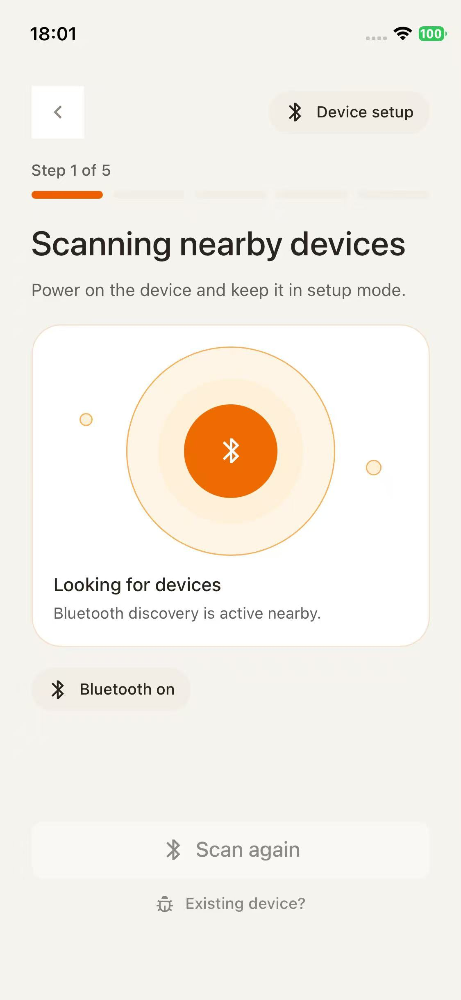

On iOS simulator, BLE may be unavailable. This is still part of the supported journey: the page should remain interactive, the error should be explanatory, and "Existing device?" should stay available.

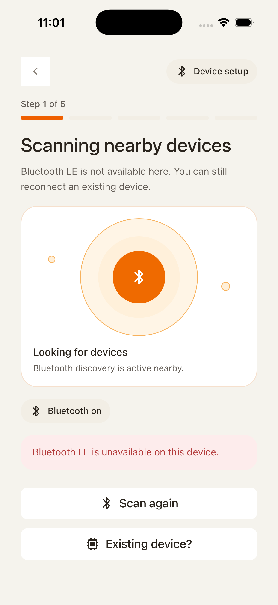

### 2. User selects or confirms the device

Once a device is discovered or mocked, the journey advances to the device confirmation/pairing transition. The user is no longer choosing an auth provider; they are now binding the mobile app to hardware.

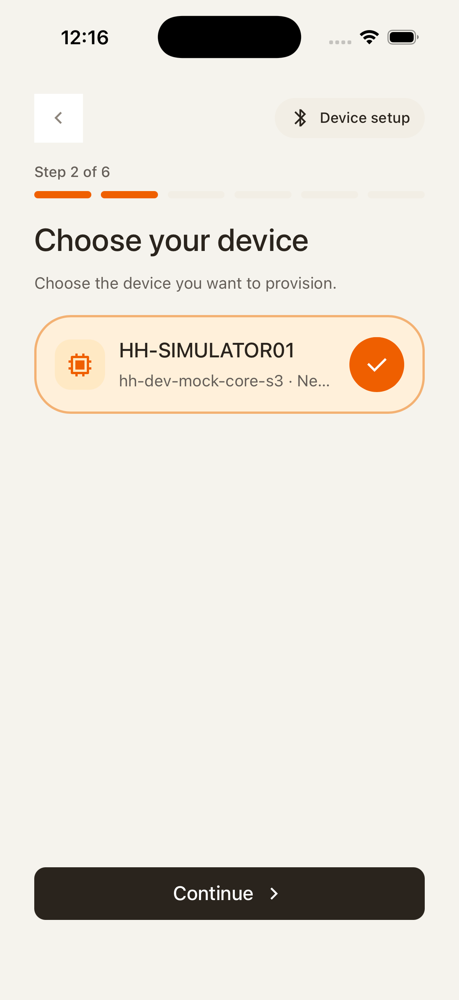

### 3. User pairs with an agent endpoint

The standard path asks the user for the pairing code. Entering the code should validate the selected device and resolve the agent context needed for setup.

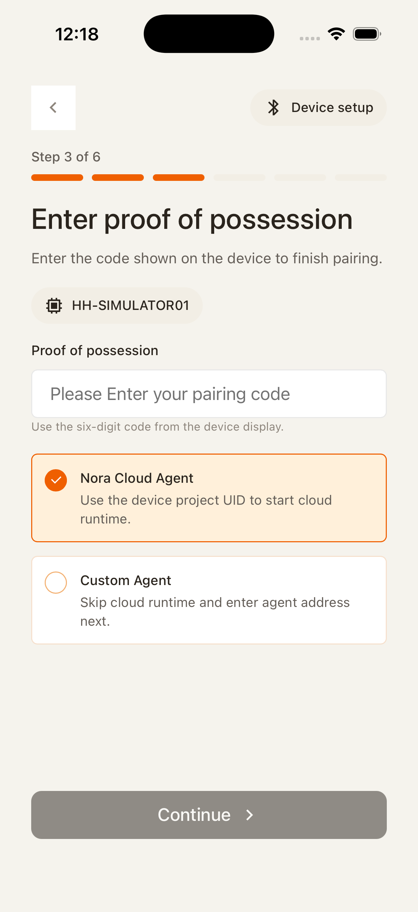

The custom-address branch lets the user type an agent address directly. This is useful when the app cannot infer the endpoint from the scanned device.

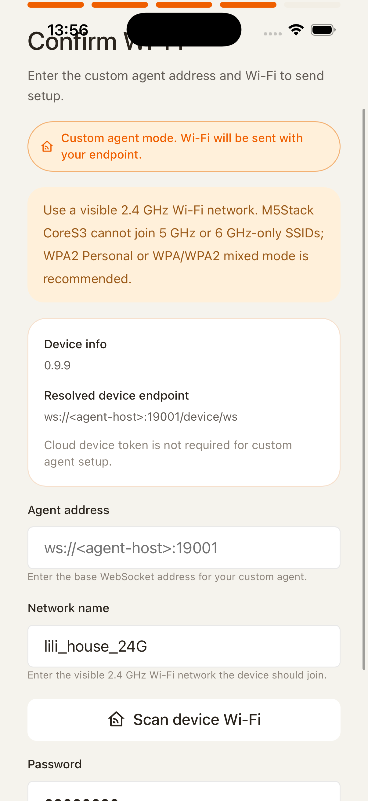

After the address is complete, continue should become meaningful and the app should check the agent before letting the user move on.

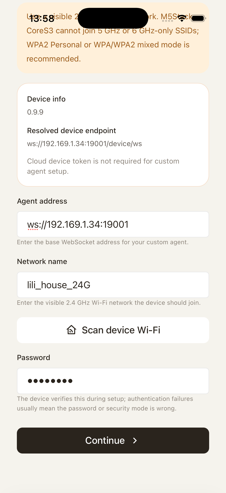

During that check, the user sees a loading state. This loading state protects the next screen from showing a stale or unreachable agent.

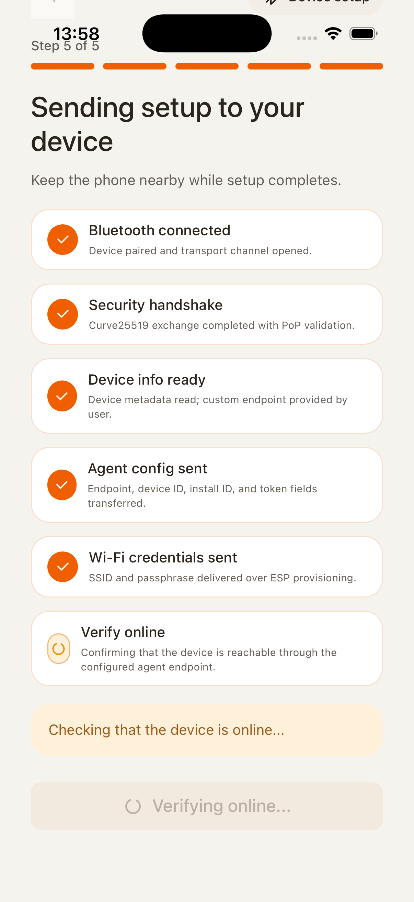

### 4. User chooses which agent to install

The agent list is the decision point for setup. The user scans the available agents and chooses one for this device.

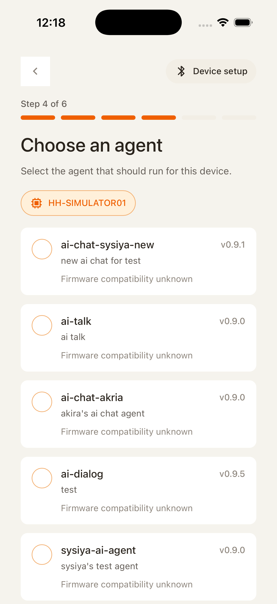

The bottom controls belong to the same list state. Continue should only advance after an agent is selected, and refresh should reload this list without leaking old install errors.

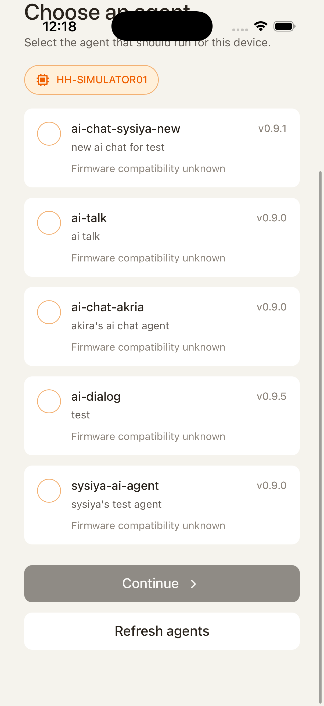

When the user taps an agent, the selected card is highlighted. This selection is the payload used by the next Wi-Fi/install steps.

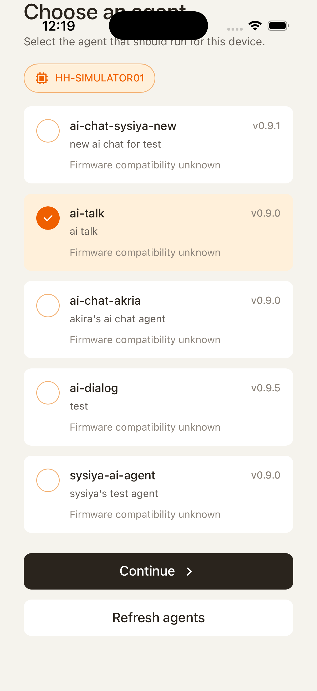

### 5. User configures Wi-Fi for the device

The user enters the SSID and password needed by the hardware. The selected agent context should remain visible or recoverable while the user fills this form.

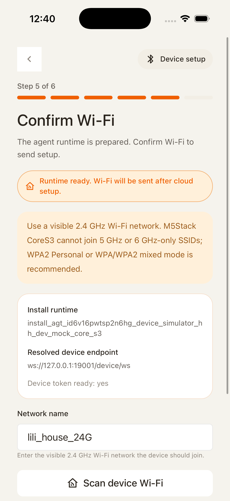

If the user taps "Scan device Wi-Fi", the results shown here come from the device runtime in normal hardware flow, or from simulator mock data in simulator-only development. Compatible 2.4 GHz networks are usable; incompatible networks are blocked with an explanation.

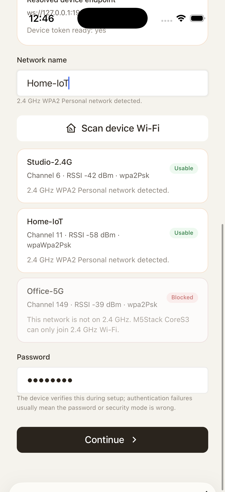

At the bottom of the form, the user submits the Wi-Fi credentials. This action must not jump straight to step 6; it starts the install/runtime preparation gate.

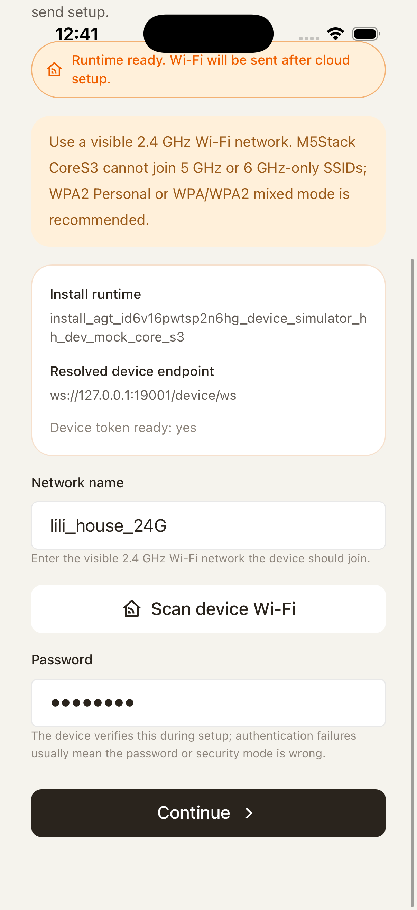

When scan results are long, the user can scroll through the list and still complete password entry. The selected/typed network and password should survive scrolling.

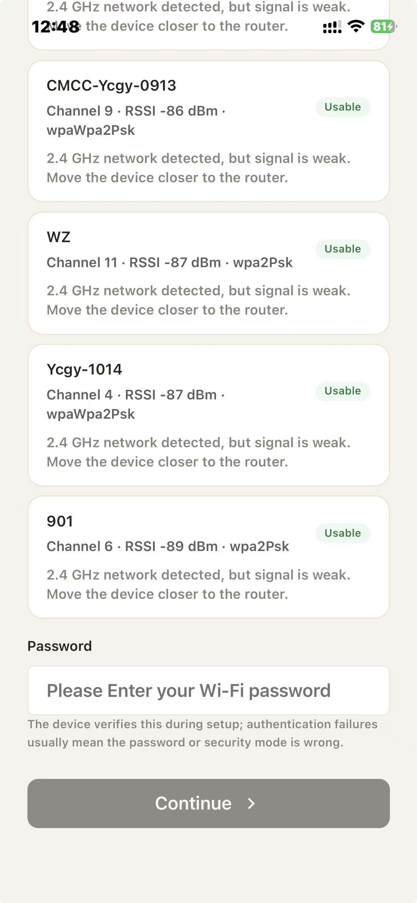

### 6. App prepares the install and runtime before success

After Wi-Fi submit, the user sees the install/runtime loading screen. The app creates or reuses the install, waits for runtime readiness, and prepares scoped device data.

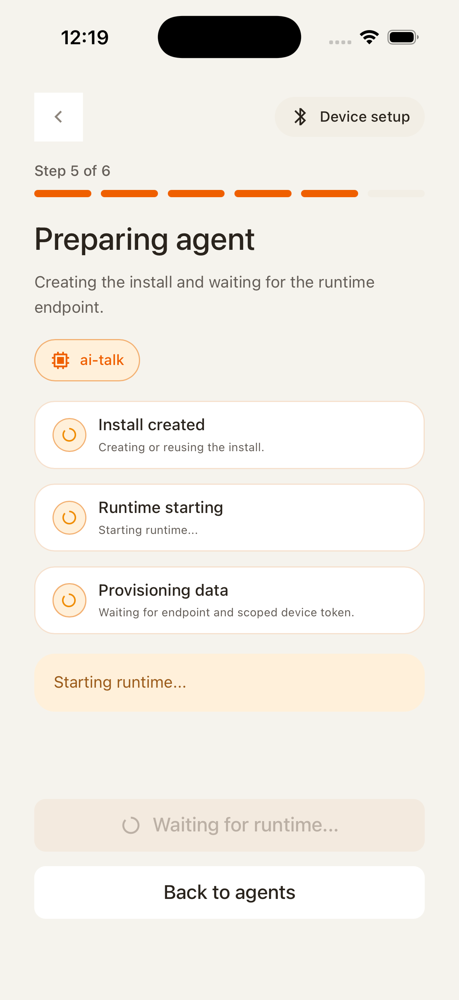

If runtime preparation fails, the error belongs to this install attempt. Retry should restart the install gate; choosing another agent should clear the selected agent and the error before returning to the list.

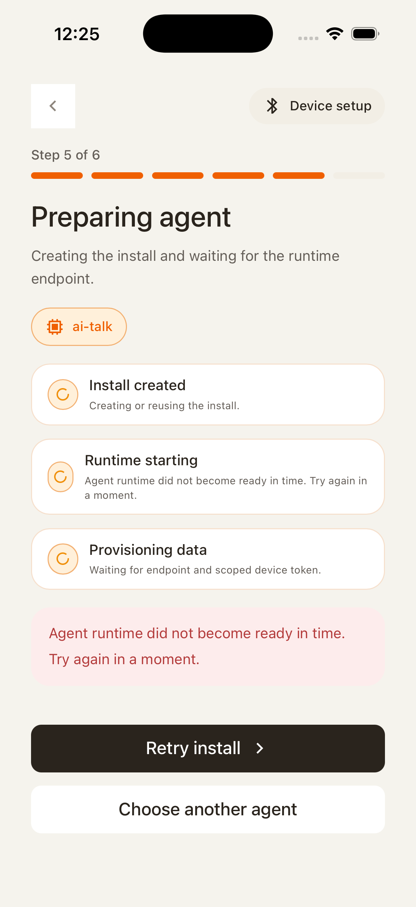

### 7. User reaches connected success

Only after the install is running, runtime is ready, and device token/endpoint are available should the app move to the connected success screen.

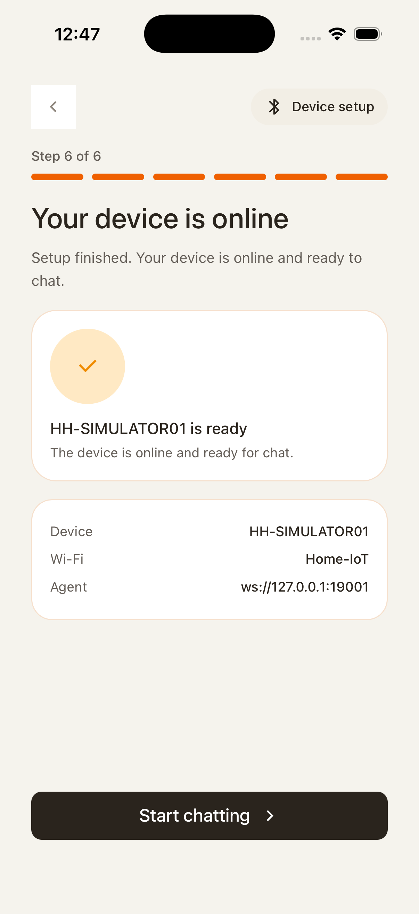

## Control Contract

| Control                  | Required behavior                                                                                                         |
| ------------------------ | ------------------------------------------------------------------------------------------------------------------------- |
| Back                     | Returns to the previous onboarding state and clears transient errors owned by the abandoned state.                        |
| Scan again               | Re-runs BLE discovery or simulator mock discovery. It must not freeze the screen when BLE is unavailable.                 |
| Existing device?         | Opens MOB-03 even when BLE is unavailable.                                                                                |
| Continue from agent list | Requires a selected agent. If returning from an install error, previous selected agent and error state should be cleared. |
| Scan device Wi-Fi        | Requests Wi-Fi networks from the device runtime and marks incompatible networks as blocked.                               |
| Submit Wi-Fi             | Starts the install/runtime preparation gate before success.                                                               |
| Retry install            | Reuses or recreates the install and restarts runtime readiness polling.                                                   |
| Choose another agent     | Returns to agent selection and clears install/runtime error state.                                                        |

## State Contract

| State               | Required UI                                                 | API/runtime dependency                                                |
| ------------------- | ----------------------------------------------------------- | --------------------------------------------------------------------- |
| BLE scanning        | Step 1 scan card and scan action.                           | Capacitor provisioning plugin `scan`.                                 |
| BLE unavailable     | Non-blocking error banner and enabled existing-device path. | Native plugin reports unavailable BLE capability.                     |
| Agent validation    | Loading state for custom agent address.                     | Cloud/device endpoint reachability check.                             |
| Agent selection     | Agent list with selected card state.                        | Cloud agent list.                                                     |
| Wi-Fi configuration | SSID/password form and device scan results.                 | Device runtime Wi-Fi scan endpoint.                                   |
| Install runtime     | Install cards with created/runtime/provisioning stages.     | Cloud install create/status/ensure endpoints and scoped device token. |
| Success             | Connected confirmation.                                     | Device endpoint and token are ready.                                  |

## Loading And Error Contract

- Wi-Fi submission must not jump straight to the success screen. It should show the install/runtime loading surface until install status is running, runtime is ready, and device provisioning data is available.
- Runtime polling may call install status and runtime ensure repeatedly while the install is not complete. Once both return ready data, the loading state should resolve.
- Install failure text should be scoped to the failed install attempt. Navigating back to choose an agent clears the selected agent and install error.
- BLE unavailable is recoverable. The user can enter existing-device onboarding or, in simulator builds, proceed through a mockable scan/device path.
