# MOB-07 Settings

This document defines the Settings journey for HH Mobile Chat. It covers account information, agent status and reload, device chat settings, device management actions, and about/version details.

## User Journey

### 1. User opens Settings

Settings home is the hub for account, agent, device, and about information. Each row should behave like a clear entry into one focused settings task.

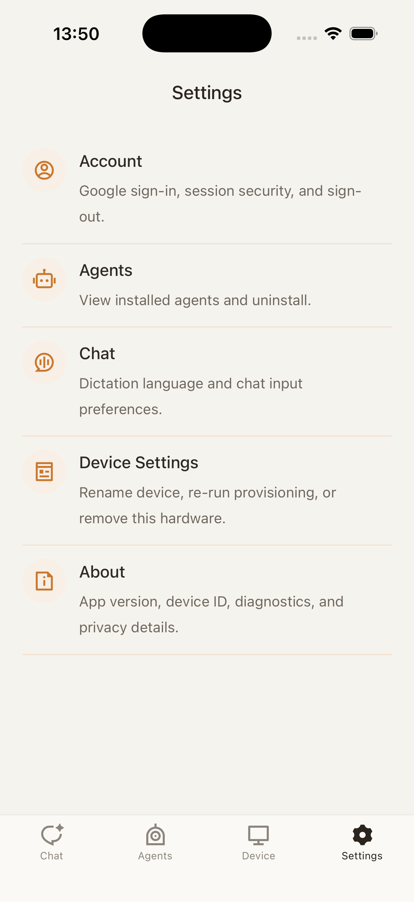

### 2. User reviews account information

The account page shows the signed-in identity. It should be read-only unless an explicit account action is present.

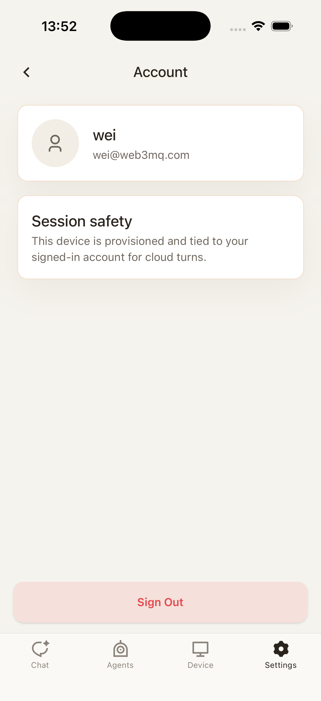

### 3. User manages agent state

Agent settings show the current agent relationship and expose status/reload actions.

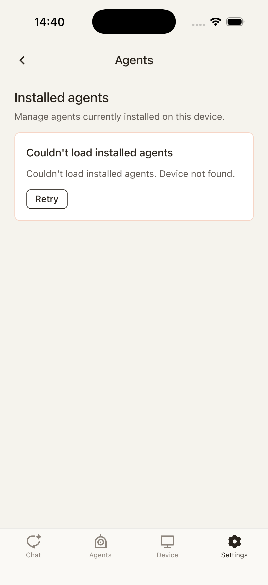

Opening status gives a more detailed view of the active agent state. Back should return to the agent settings page.

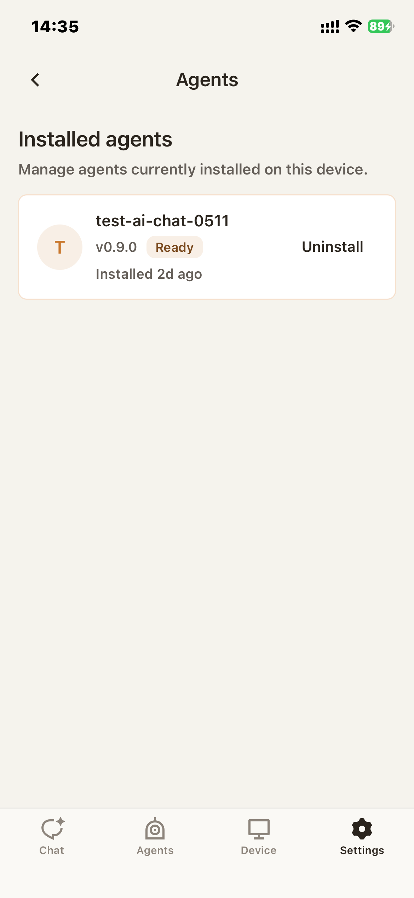

When the user reloads agents, the page enters a loading state. Any previous load error should clear as soon as the new reload starts.

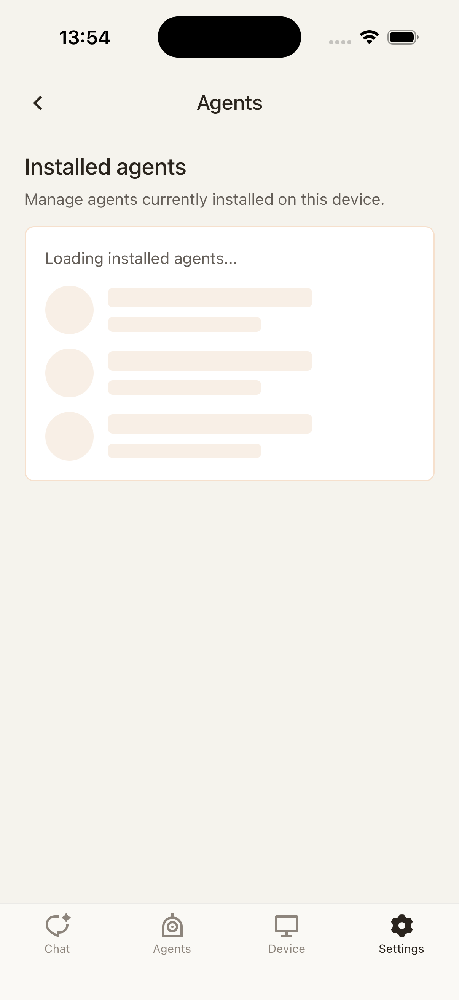

If reload fails, the error should be recoverable from the same page and should not leak into onboarding or the Agents tab.

### 4. User edits device chat settings

Device chat settings affect how this device participates in chat. Any editable control here should persist through the relevant settings API before the user leaves the screen.

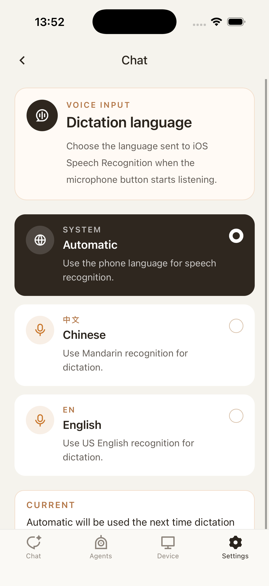

### 5. User manages the active device

Device settings collect actions that can change pairing, naming, removal, or onboarding state. These actions are higher-risk than simple navigation and should be explicit.

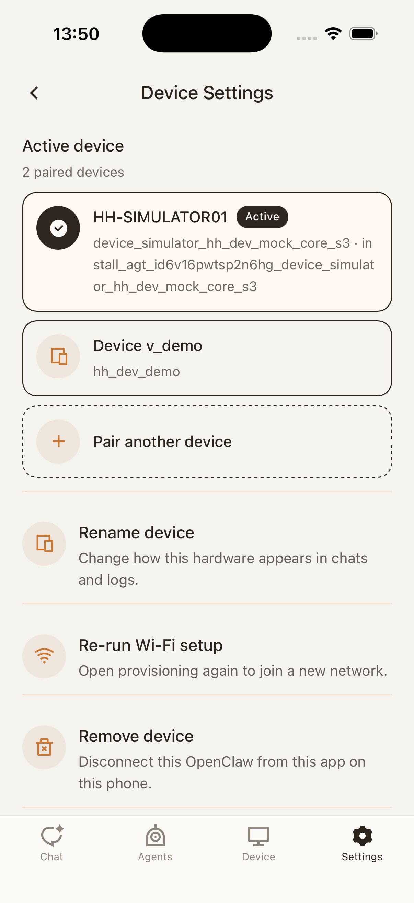

Pair another device sends the user into new-device onboarding while preserving the authenticated account.

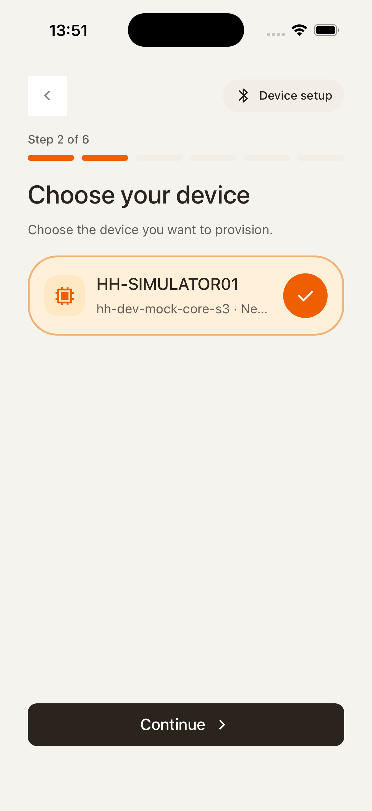

Rename device should require an explicit save or confirmation before changing the device name.

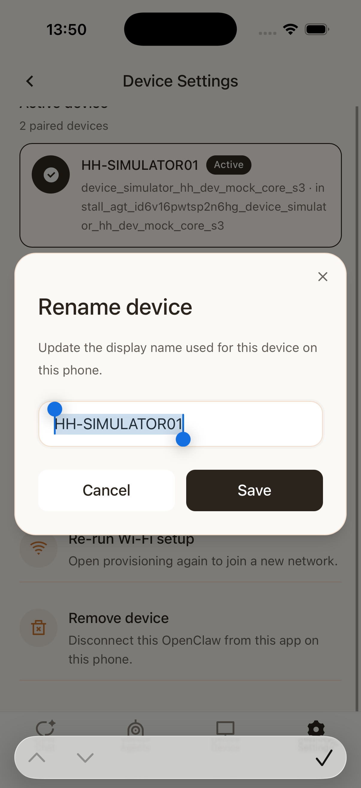

Remove device should require confirmation and then route the user to setup if no active device remains.

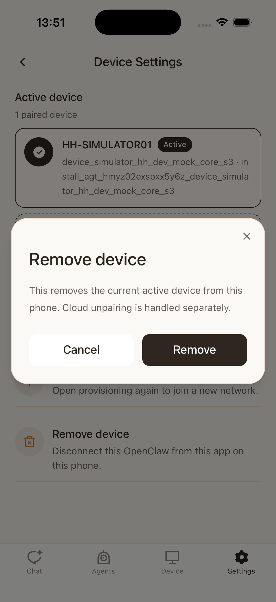

Re-run onboarding sends the user back through MOB-02 from an authenticated settings context.

### 6. User checks app information

The about page shows version/build information and any static app metadata. It should not change runtime state.

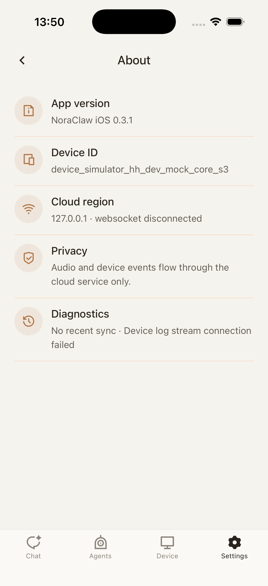

## Control Contract

| Control             | Required behavior                                                                  |
| ------------------- | ---------------------------------------------------------------------------------- |
| Settings row        | Opens the matching detail page.                                                    |
| Back                | Returns to the previous settings surface without applying unrelated state changes. |
| Reload agents       | Clears prior load errors and refreshes agent status/list data.                     |
| Pair another device | Starts MOB-02 without clearing the authenticated account.                          |
| Rename device       | Requires explicit save/confirmation before updating the device name.               |
| Remove device       | Requires confirmation before removing the active device.                           |
| Re-run onboarding   | Starts MOB-02 and preserves enough account state to finish setup.                  |

## State Contract

| State                | Required UI                            | Exit condition                     |
| -------------------- | -------------------------------------- | ---------------------------------- |
| Settings home        | Grouped settings entry rows.           | User opens a detail page.          |
| Account detail       | Account identity and sign-in metadata. | Back.                              |
| Agent settings       | Agent status and reload controls.      | Reload, status detail, or back.    |
| Agent reload pending | Loading affordance.                    | Reload succeeds or fails.          |
| Agent reload failed  | Recoverable error and retry path.      | Reload starts again or back.       |
| Device settings      | Device management actions.             | User opens an action or goes back. |
| About                | Version/build information.             | Back.                              |

## Notes

- Device actions that route into onboarding should use the same contracts as MOB-02 and MOB-03, including BLE simulator fallback behavior.
- Agent reload failure is separate from onboarding agent selection errors and should not leak into those flows.
