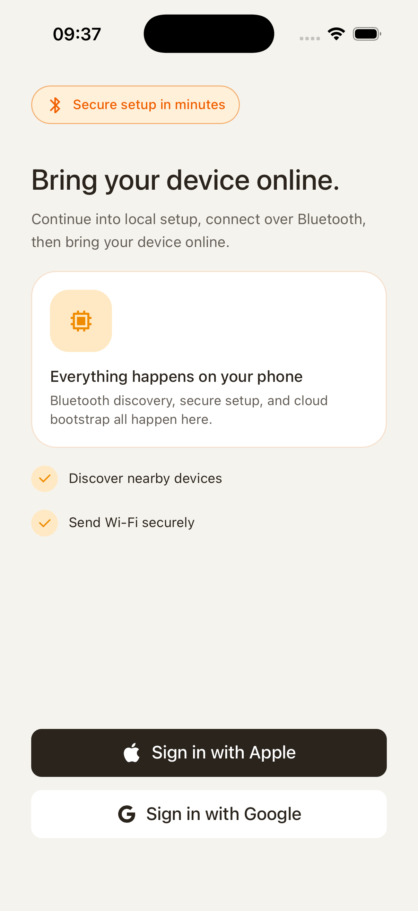
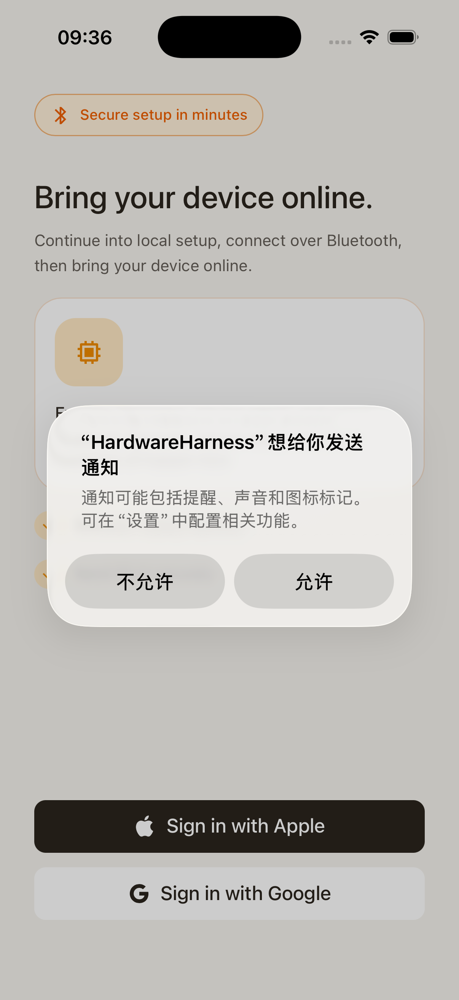
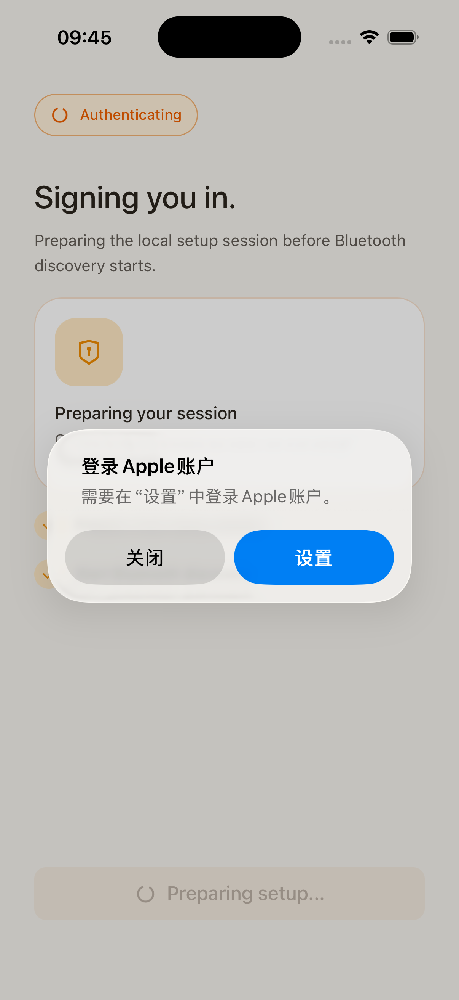
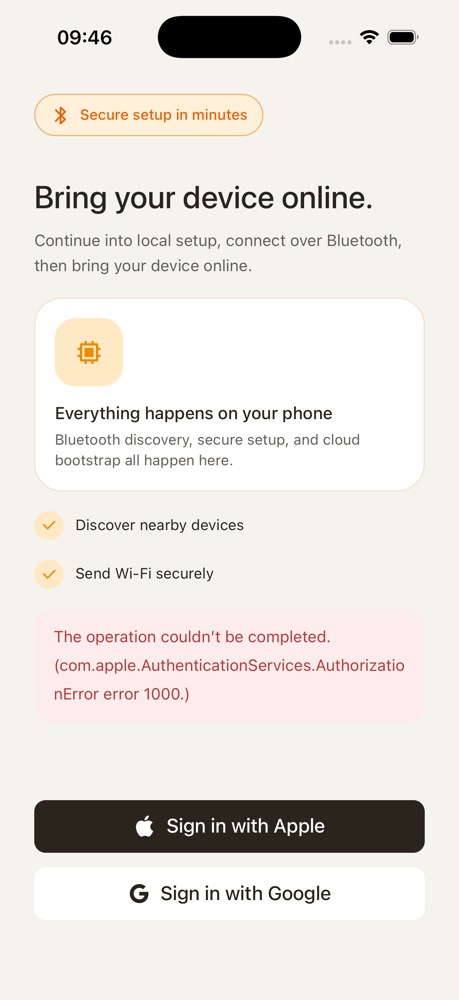
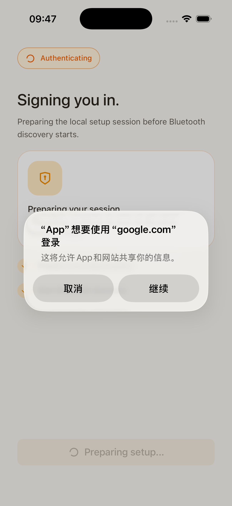
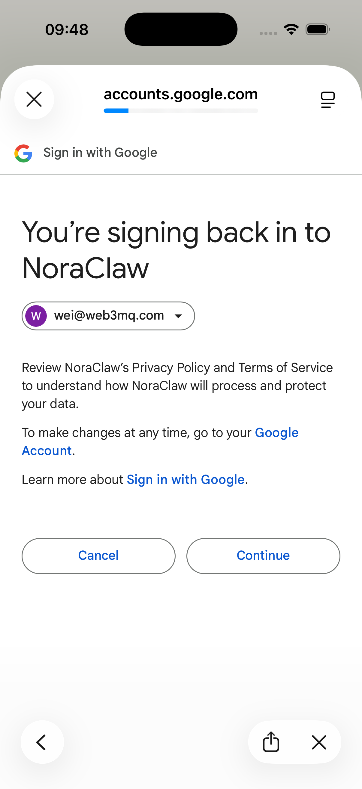
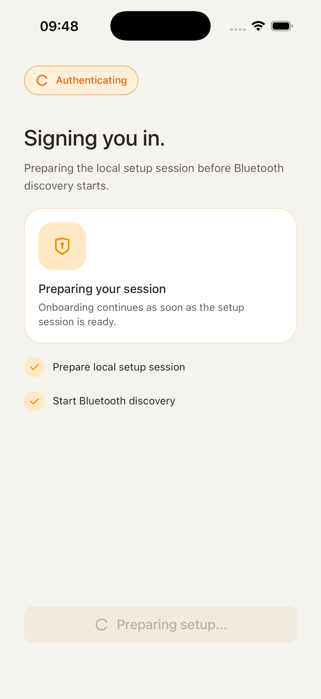

# MOB-01 Sign-in And First Launch

This document defines the sign-in and first-launch journey for HH Mobile Chat. It covers the path from opening the app, handling permission and provider branches, completing Google sign-in, and entering device setup.

## User Journey

### 1. User lands on the unauthenticated home screen

The first screen should make the sign-in choices clear and keep the user in an unauthenticated state until one provider succeeds.

If the app requests notification permission during first launch, that prompt is allowed to appear here. The important contract is that allowing or denying notifications must not block sign-in.

### 2. Apple sign-in is a recoverable branch

When the user taps Apple sign-in on a simulator or device without an Apple account, the native Apple flow can fail before authentication. The app should show the system error and keep the user in the sign-in journey.

After the user dismisses the dialog, they should be back at the sign-in surface with other providers still available. This is a dead-end prevention state, not a completed login.

### 3. Google sign-in completes authentication

When the user taps Google sign-in, the Google authorization surface opens. The user selects or confirms the account here.

After the user authorizes, the app returns from the provider flow with an authenticated account. The sign-in controls should disappear and the app should begin the post-login transition.

The final sign-in handoff is the setup loading state. At this point auth is complete; the app is initializing device setup and should move into onboarding once BLE/provisioning readiness is resolved.

## Control Contract

| Control                        | Required behavior                                                                                                                           |
| ------------------------------ | ------------------------------------------------------------------------------------------------------------------------------------------- |
| Apple sign-in                  | Starts native Apple auth. If the simulator/device has no usable Apple account, show the native failure dialog and keep the user on sign-in. |
| Google sign-in                 | Starts Google auth and transitions to onboarding after a successful session.                                                                |
| Notification permission prompt | Must not block sign-in or onboarding if denied.                                                                                             |
| Dialog close                   | Clears the transient auth error state and restores provider choices.                                                                        |

## State Contract

| State                | Required UI                                    | Exit condition                            |
| -------------------- | ---------------------------------------------- | ----------------------------------------- |
| Unauthenticated      | First-launch sign-in surface.                  | Provider auth succeeds.                   |
| Permission requested | Native permission modal above current surface. | User allows or denies.                    |
| Apple unavailable    | Native error dialog.                           | User closes dialog.                       |
| Google authenticated | Transitional loading or onboarding entry.      | BLE/provisioning initialization resolves. |

## Notes

- This flow owns auth and first-run permission friction only. BLE capability handling is documented in [MOB-02 Onboarding](./../onboarding/onboarding.md).
- Apple failure in the simulator is expected when no Apple account is configured; it should remain a recoverable dialog, not a dead end.
