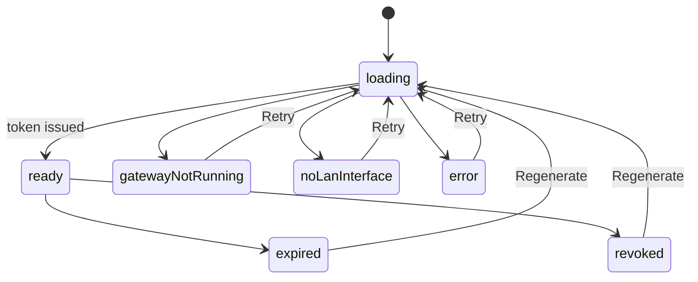
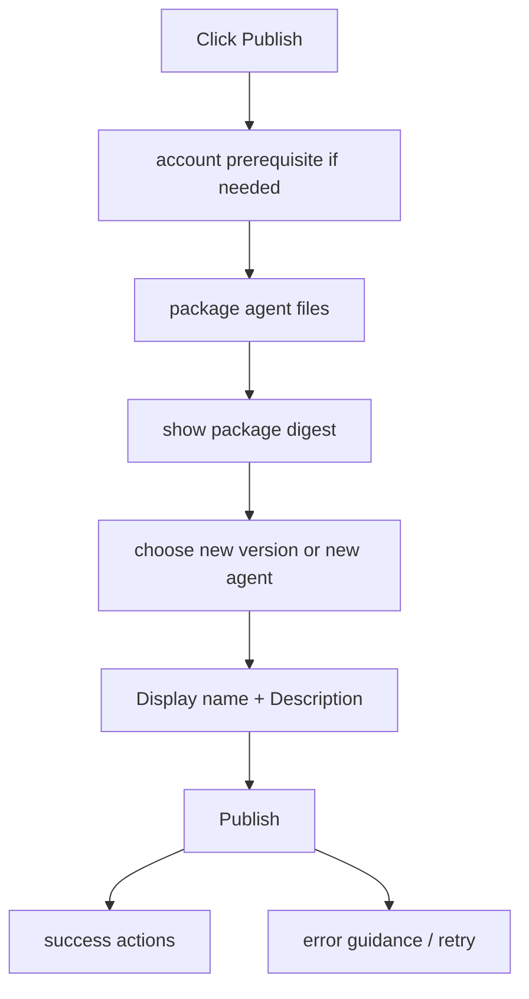

# Agent Authoring Runtime Contract

Source rows: `AUTH-01` through `AUTH-05`

Entry path: Code mode → WorkingDirBar → Edit Agent

Status: Draft, source-anchored

## Scope

Agent Authoring is a tab inside Code mode. It opens from `Edit Agent` when the active workspace has a resolved agent root. Use this file to understand the visible authoring areas: editable agent files, skills, capabilities, mobile preview, publish, and export.

The default authoring surface starts with the Soul editor and keeps the left section rail, save controls, mobile preview, and publish actions visible.

## Interaction Contract

| Row       | Surface        | User action                     | UI result                                                                                                                               | IPC/API path                                     | Evidence                                                                                                                                                                                                                                                                                                                                                                                                                                                      | Coverage   |
| --------- | -------------- | ------------------------------- | --------------------------------------------------------------------------------------------------------------------------------------- | ------------------------------------------------ | ------------------------------------------------------------------------------------------------------------------------------------------------------------------------------------------------------------------------------------------------------------------------------------------------------------------------------------------------------------------------------------------------------------------------------------------------------------- | ---------- |
| `AUTH-01` | Authoring tab  | Open Edit Agent                 | Agent tab appears with title, Preview on Mobile, Publish, section rail, personality fields, editor, save controls.                      | Local tab store; workspace file IPC on load/save | `apps/electron/src/renderer/src/components/agent-authoring/AgentAuthoringTab.tsx:212`; `apps/electron/src/renderer/src/components/agent-authoring/AgentAuthoringTab.tsx:219`; `apps/electron/src/renderer/src/components/agent-authoring/AgentAuthoringTab.tsx:241`; `apps/electron/src/renderer/src/components/agent-authoring/AgentAuthoringTab.tsx:288`; `apps/electron/src/renderer/src/components/ui/markdown-editor.tsx:130`                            | L2 partial |
| `AUTH-02` | Capabilities   | Click View/View Diff or Refresh | Shows manifest/diff panels or refreshed capability state.                                                                               | Workspace/project gateway helpers                | `apps/electron/src/renderer/src/components/agent-authoring/CapabilitiesSection.tsx:36`; `apps/electron/src/renderer/src/components/agent-authoring/CapabilitiesSection.tsx:126`; `apps/electron/src/renderer/src/components/agent-authoring/CapabilitiesSection.tsx:164`; `apps/electron/src/renderer/src/components/agent-authoring/CapabilitiesSection.tsx:174`                                                                                             | L2 partial |
| `AUTH-03` | Skills         | Create/edit/probe skill         | Skill list/detail updates; probe runs and shows result.                                                                                 | Project gateway chat probe                       | `apps/electron/src/renderer/src/components/agent-authoring/SkillsSection.tsx:119`; `apps/electron/src/renderer/src/components/agent-authoring/NewSkillDialog.tsx:90`; `apps/electron/src/renderer/src/components/agent-authoring/SkillsSection.tsx:193`; `apps/electron/src/renderer/src/components/agent-authoring/SkillTestPanel.tsx:173`                                                                                                                   | L2 partial |
| `AUTH-04` | Mobile preview | Click Preview on Mobile         | Dialog opens; can show loading, no deployed agent warning, Retry, QR ready state, LAN picker, Copy, Regenerate, Revoke.                 | Mobile preview IPC                               | `apps/electron/src/renderer/src/components/agent-authoring/AgentAuthoringTab.tsx:212`; `apps/electron/src/renderer/src/components/agent-authoring/MobilePreviewDialog.tsx:149`; `apps/electron/src/renderer/src/components/agent-authoring/MobilePreviewDialog.tsx:174`; `apps/electron/src/renderer/src/components/agent-authoring/MobilePreviewDialog.tsx:222`; `apps/electron/src/renderer/src/components/agent-authoring/MobilePreviewDialog.tsx:361`     | No L3 test |
| `AUTH-05` | Publish/export | Click Publish or export         | Publish to Catalog dialog shows account prerequisite, package digest, mode radio, display fields, success/error/retry; export creates tarball. | Publish/export IPC/cloud calls                   | `apps/electron/src/renderer/src/components/agent-authoring/AgentAuthoringTab.tsx:221`; `apps/electron/src/renderer/src/components/agent-authoring/PublishCatalogDialog.tsx:239`; `apps/electron/src/renderer/src/components/agent-authoring/PublishCatalogDialog.tsx:283`; `apps/electron/src/renderer/src/components/agent-authoring/PublishCatalogDialog.tsx:303`; `apps/electron/src/renderer/src/components/agent-authoring/PublishCatalogDialog.tsx:468` | No L3 test |

## Mobile Preview State Machine

This diagram explains the visible states of the mobile preview dialog after the user clicks `Preview on Mobile`. It is not the mobile runtime protocol; it only tracks what the authoring dialog can show and how Retry/Regenerate moves the dialog back to loading.

State responsibilities:

| State               | Meaning                                                | User-visible outcome                                         |
| ------------------- | ------------------------------------------------------ | ------------------------------------------------------------ |
| `loading`           | Dialog is requesting preview prerequisites or a token. | Loading/progress state is shown.                             |
| `ready`             | Preview token and connection details are available.    | QR, copy, regenerate, and revoke actions can appear.         |
| `gatewayNotRunning` | Gateway is unavailable for preview setup.              | User sees guidance and can retry after fixing gateway state. |
| `noLanInterface`    | No usable LAN interface is available.                  | User sees network-interface guidance and Retry.              |
| `expired`           | Previously issued token is no longer valid.            | User can regenerate.                                         |
| `revoked`           | User or system revoked the token.                      | User can regenerate.                                         |
| `error`             | Preview setup failed for another reason.               | Error guidance and Retry are shown.                          |

Evidence:

- Dialog state branch: `apps/electron/src/renderer/src/components/agent-authoring/MobilePreviewDialog.tsx:149`
- Gateway not running/no deployed warning: `apps/electron/src/renderer/src/components/agent-authoring/MobilePreviewDialog.tsx:174`; `apps/electron/src/renderer/src/components/agent-authoring/MobilePreviewDialog.tsx:222`
- Ready QR and actions: `apps/electron/src/renderer/src/components/agent-authoring/MobilePreviewDialog.tsx:361`

## Publish Dialog State

This diagram explains the publish dialog's user journey from opening the dialog to success or retryable error. It does not describe the catalog backend internals; it describes the visible preparation and submit states.

Read the flow in this order:

| Step | Node                              | Purpose                                                                   | User-visible outcome                         |
| ---- | --------------------------------- | ------------------------------------------------------------------------- | -------------------------------------------- |
| 1    | `Click Publish`                   | User starts catalog publish from Agent Authoring.                         | Publish dialog opens.                        |
| 2    | `account prerequisite if needed`  | Dialog preserves publish context while any required account session is handled by the shared login flow. | User returns to publish controls without making login the publish journey. |
| 3    | `package agent files`             | Agent files are bundled for publishing.                                   | Package metadata can be computed.            |
| 4    | `show package digest`             | Digest identifies the package content.                                    | User can verify what will be published.      |
| 5    | `choose new version or new agent` | User selects publish mode.                                                | Form fields reflect the selected mode.       |
| 6    | `Display name + Description`      | User fills catalog-facing metadata.                                       | Submit becomes meaningful and reviewable.    |
| 7    | `Publish`                         | Dialog sends the publish request.                                         | Success actions or error guidance appear.    |

Evidence:

- Dialog title: `apps/electron/src/renderer/src/components/agent-authoring/PublishCatalogDialog.tsx:239`
- Package digest: `apps/electron/src/renderer/src/components/agent-authoring/PublishCatalogDialog.tsx:283`
- Mode picker: `apps/electron/src/renderer/src/components/agent-authoring/PublishCatalogDialog.tsx:303`
- New agent fields: `apps/electron/src/renderer/src/components/agent-authoring/PublishCatalogDialog.tsx:468`

## Gaps

- Mobile preview requires device/gateway conditions and has no e2e coverage.
- Publish flow has no safe full e2e because it can be externally visible.
- Skill probe behavior needs clearer integration coverage.
