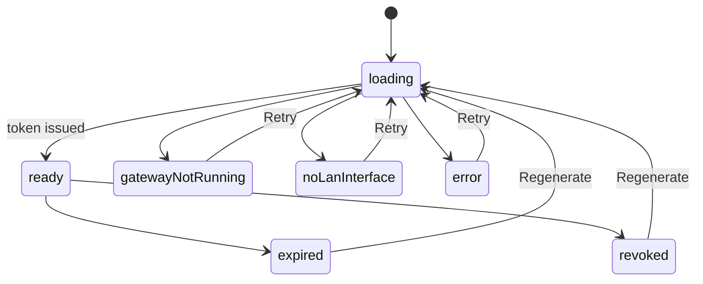
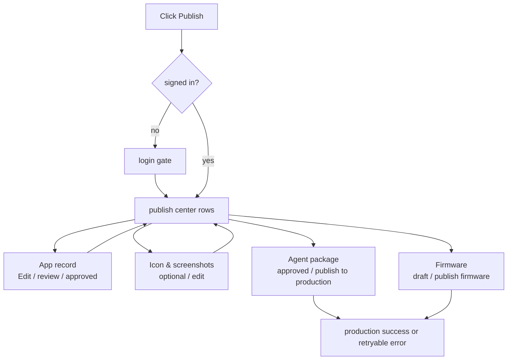

# Agent Authoring Runtime Contract

Source rows: `AUTH-01` through `AUTH-05`

Entry path: Code mode → WorkingDirBar → Edit Agent

Status: Draft, source-anchored

## Scope

Agent Authoring is a tab inside Code mode. It opens from `Edit Agent` when the active workspace has a resolved agent root. Use this file to understand the visible authoring areas: editable agent files, skills, capabilities, secondary mobile preview, and the unified publish center.

The default authoring surface starts with the Soul editor and keeps the left section rail, save controls, optional review-state badge, secondary mobile preview, and publish action visible.

## Interaction Contract

| Row       | Surface        | User action                     | UI result                                                                                                                               | IPC/API path                                     | Evidence                                                                                                                                                                                                                                                                                                                                                                                                                                                      | Coverage   |
| --------- | -------------- | ------------------------------- | --------------------------------------------------------------------------------------------------------------------------------------- | ------------------------------------------------ | ------------------------------------------------------------------------------------------------------------------------------------------------------------------------------------------------------------------------------------------------------------------------------------------------------------------------------------------------------------------------------------------------------------------------------------------------------------- | ---------- |
| `AUTH-01` | Authoring tab  | Open Edit Agent                 | Agent tab appears with title, optional review-state badge such as `Approved`, secondary Preview on Mobile, Publish, section rail, personality fields, editor, save controls. | Local tab store; workspace file IPC on load/save | `apps/electron/src/renderer/src/components/agent-authoring/AgentAuthoringTab.tsx:212`; `apps/electron/src/renderer/src/components/agent-authoring/AgentAuthoringTab.tsx:219`; `apps/electron/src/renderer/src/components/agent-authoring/AgentAuthoringTab.tsx:241`; `apps/electron/src/renderer/src/components/agent-authoring/AgentAuthoringTab.tsx:288`; `apps/electron/src/renderer/src/components/ui/markdown-editor.tsx:130`; `electron-user-journeys-hierarchy-v2/09-catalog-review/catalog-review-publish.pm.md` | L2 partial |
| `AUTH-02` | Capabilities   | Click View/View Diff or Refresh | Shows manifest/diff panels or refreshed capability state.                                                                               | Workspace/project gateway helpers                | `apps/electron/src/renderer/src/components/agent-authoring/CapabilitiesSection.tsx:36`; `apps/electron/src/renderer/src/components/agent-authoring/CapabilitiesSection.tsx:126`; `apps/electron/src/renderer/src/components/agent-authoring/CapabilitiesSection.tsx:164`; `apps/electron/src/renderer/src/components/agent-authoring/CapabilitiesSection.tsx:174`                                                                                             | L2 partial |
| `AUTH-03` | Skills         | Create/edit/probe skill         | Skill list/detail updates; probe runs and shows result.                                                                                 | Project gateway chat probe                       | `apps/electron/src/renderer/src/components/agent-authoring/SkillsSection.tsx:119`; `apps/electron/src/renderer/src/components/agent-authoring/NewSkillDialog.tsx:90`; `apps/electron/src/renderer/src/components/agent-authoring/SkillsSection.tsx:193`; `apps/electron/src/renderer/src/components/agent-authoring/SkillTestPanel.tsx:173`                                                                                                                   | L2 partial |
| `AUTH-04` | Mobile preview | Click Preview on Mobile         | Secondary dialog opens; can show loading, no deployed agent warning, Retry, QR ready state, LAN picker, Copy, Regenerate, Revoke.       | Mobile preview IPC                               | `apps/electron/src/renderer/src/components/agent-authoring/AgentAuthoringTab.tsx:212`; `apps/electron/src/renderer/src/components/agent-authoring/MobilePreviewDialog.tsx:149`; `apps/electron/src/renderer/src/components/agent-authoring/MobilePreviewDialog.tsx:174`; `apps/electron/src/renderer/src/components/agent-authoring/MobilePreviewDialog.tsx:222`; `apps/electron/src/renderer/src/components/agent-authoring/MobilePreviewDialog.tsx:361`     | Secondary |
| `AUTH-05` | Unified publish center | Click Publish                  | Publish center opens with App record, Icon & screenshots, Agent package, and Firmware rows; row badges/actions cover login gate, review, approval, production publish, firmware publish, and retry. | Account, catalog review, production publish, firmware publish, and package export boundaries | `electron-user-journeys-hierarchy-v2/09-catalog-review/catalog-review-publish.pm.md`; latest review screenshots; update component anchors when the Electron source tree is present in this checkout. | No L3 test |

## Mobile Preview State Machine

This diagram explains the visible states of the mobile preview dialog after the user clicks `Preview on Mobile`. It is not the mobile runtime protocol; it only tracks what the authoring dialog can show and how Retry/Regenerate moves the dialog back to loading.

State responsibilities:

| State               | Meaning                                                | User-visible outcome                                         |
| ------------------- | ------------------------------------------------------ | ------------------------------------------------------------ |
| `loading`           | Dialog is requesting preview prerequisites or a token. | Loading/progress state is shown.                             |
| `ready`             | Preview token and connection details are available.    | QR, copy, regenerate, and revoke actions can appear.         |
| `gatewayNotRunning` | Gateway is unavailable for preview setup.              | User sees guidance and can retry after fixing gateway state. |
| `noLanInterface`    | No usable LAN interface is available.                  | User sees network-interface guidance and Retry.              |
| `expired`           | Previously issued token is no longer valid.            | User can regenerate.                                         |
| `revoked`           | User or system revoked the token.                      | User can regenerate.                                         |
| `error`             | Preview setup failed for another reason.               | Error guidance and Retry are shown.                          |

Evidence:

- Dialog state branch: `apps/electron/src/renderer/src/components/agent-authoring/MobilePreviewDialog.tsx:149`
- Gateway not running/no deployed warning: `apps/electron/src/renderer/src/components/agent-authoring/MobilePreviewDialog.tsx:174`; `apps/electron/src/renderer/src/components/agent-authoring/MobilePreviewDialog.tsx:222`
- Ready QR and actions: `apps/electron/src/renderer/src/components/agent-authoring/MobilePreviewDialog.tsx:361`

## Unified Publish Center State

This diagram explains the publish center's user journey from opening the modal to review or publish outcome. It does not describe catalog backend internals; it describes visible row states and actions.

Read the flow in this order:

| Step | Node                              | Purpose                                                                   | User-visible outcome                         |
| ---- | --------------------------------- | ------------------------------------------------------------------------- | -------------------------------------------- |
| 1    | `Click Publish`        | User starts publish from Agent Authoring.                              | Publish center opens or login gate appears. |
| 2    | `signed in?`           | The flow determines whether account-gated actions can continue.        | Signed-out users see login; signed-in users see rows. |
| 3    | `App record`           | User reviews or edits catalog identity and app metadata.               | Row can become draft, pending, approved, rejected, or revoked. |
| 4    | `Icon & screenshots`   | User reviews optional or required listing media.                       | Row can stay optional or move through edit/upload state. |
| 5    | `Agent package`        | User reviews package review state and production availability.         | Approved package can expose `Publish to production`. |
| 6    | `Firmware`             | User reviews firmware build/metadata readiness.                       | Ready firmware can expose `Publish firmware`; draft remains blocked or incomplete. |
| 7    | `success or retryable error` | Production package or firmware publish completes or fails.       | Affected row refreshes or keeps retry. |

Evidence:

- Journey source: `electron-user-journeys-hierarchy-v2/09-catalog-review/catalog-review-publish.pm.md`
- Latest review-state screenshots show Agent Authoring header `Approved` and publish center rows: App record `Approved`, Icon & screenshots `Optional`, Agent package `Approved`, Firmware `Draft`.
- Legacy publish dialog anchors should be replaced with publish-center anchors when the Electron source tree is present in this checkout.

## Gaps

- Mobile preview requires device/gateway conditions and is secondary to the current primary journey inventory.
- Unified publish center has no safe full e2e because it can be externally visible; use controlled cloud stubs for L2 and explicit test environments for L3.
- Skill probe behavior needs clearer integration coverage.
