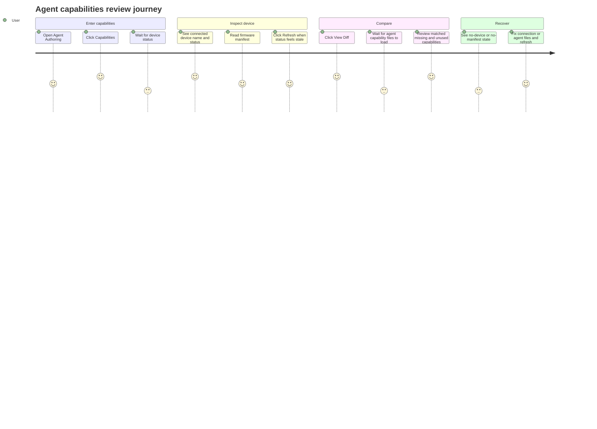

# Agent Authoring Capabilities

Source rows: `AUTH-02`
Entry path: Code mode -> active workspace -> `Edit Agent` -> `Capabilities`
Status: Draft, evidence-only

## User Journey

### Overview

| Attribute      | Value                                                                                            |
| -------------- | ------------------------------------------------------------------------------------------------ |
| Priority       | High                                                                                             |
| User type      | Agent developer validating device-facing capabilities                                            |
| Frequency      | Frequent during device integration and debugging                                                 |
| Success metric | User can understand whether the connected device supports the capabilities declared by the agent |

### User Goal

> "I want to compare what my agent says it can do with what the connected device actually reports, so I can fix mismatches before testing on hardware."

### Preconditions

- User is in the Agent Authoring tab for a workspace.
- Device stream IPC is available.
- A device may or may not be connected and reporting a tool manifest.
- Agent files may include `agent/manifest.json`, `agent/TOOLS.md`, or `agent/tools.md`.

### Journey Map



### Journey Steps

#### Step 1: Open capabilities

**User action:** The user clicks `Capabilities` in the Agent Authoring rail.
**System response:** The section renders, loads current device status, and subscribes to workspace device events.
**Success criteria:**

- [ ] The user can tell whether a device is connected.
- [ ] Loading state clears when a device status event arrives.
- [ ] Leaving the section does not leave a stale stream subscription behind.

**Potential friction:**

- There is no direct renderer test for subscription cleanup.

#### Step 2: Inspect the focused device

**User action:** The user reads the current manifest view or clicks `Refresh`.
**System response:** The UI shows the focused device display name or device id, online/offline state, and firmware manifest when available.
**Success criteria:**

- [ ] No-device state is explicit.
- [ ] Firmware manifest absence is described separately from device absence.
- [ ] Refresh is disabled while already loading.

**Potential friction:**

- Users may not know which connected device becomes the focused device.

#### Step 3: Compare agent and device capabilities

**User action:** The user clicks `View Diff`.
**System response:** The UI reads agent capability sources, computes the diff, and renders matched, missing, and unused capability groups.
**Success criteria:**

- [ ] Diff loading state is visible while files are read.
- [ ] Missing agent-declared capabilities are visible.
- [ ] Extra device capabilities are not treated as blockers.

**Potential friction:**

- If neither manifest nor tools Markdown can be read, the diff shows an unable-to-compute state without a direct fix action.

### Error Scenarios

#### E1: No device connected

**Trigger:** No focused device exists after status load.
**User sees:** `No device connected` and a message explaining that a device must report a tool manifest.
**Recovery path:** Connect or deploy to a device, then refresh or wait for a device event.
**Test:** No direct renderer L2 test.

#### E2: Diff cannot be computed

**Trigger:** Agent capability sources are unavailable or cannot be parsed into declared capabilities.
**User sees:** Unable-to-compute message.
**Recovery path:** Add or fix `agent/manifest.json`, `agent/TOOLS.md`, or `agent/tools.md`, then click `View Diff` again or refresh state.
**Test:** `CapabilityDiffPanel` rendering is covered; section-level file-read path is not.

### Metrics To Track

- Device status load time.
- Percent of capability views with no connected device.
- Missing capability count per workspace.
- Refresh usage after error or stale status.

### E2E Test Reference

Future L3 scenario: `AUTH-02 opens capabilities, refreshes device state, and reviews a capability diff`.

## UI Surface

### Wireframe

```text
+--------------------------------------------------------------------------------+
| Capabilities        <focused device / No device connected>  [View] [View Diff] [Refresh] |
+--------------------------------------------------------------------------------+
| Error banner, when device status or diff loading fails                         |
+--------------------------------------------------------------------------------+
|                                                                                |
| Manifest view                                                                  |
| +----------------------------------------------------------------------------+ |
| | Device manifest grouped by firmware-reported tools                          | |
| | Source: cached firmware manifest <relative time>                            | |
| +----------------------------------------------------------------------------+ |
|                                                                                |
| Diff view                                                                      |
| +------------------------------+  +------------------------------------------+ |
| | Agent-declared capabilities  |  | Device-reported capabilities             | |
| | OK / Missing badges          |  | OK / Unused badges                       | |
| +------------------------------+  +------------------------------------------+ |
|                                                                                |
| Empty states: no device, no manifest, or unable to compute diff                |
+--------------------------------------------------------------------------------+
```

- Header title: `Capabilities`.
- Focused device status line: online/offline dot, display name or device id, and offline last-seen text when available.
- Empty state: `No device connected`.
- View toggles: `View` and `View Diff`.
- Refresh button with `data-testid="capabilities-refresh"`.
- Manifest view: `DeviceManifestPanel`, plus cached firmware manifest source timestamp when available.
- Diff view: loading state, `CapabilityDiffPanel`, and unable-to-compute empty state.
- Error banner for device or diff failures.

## Interaction Contract

| User action                           | UI precondition                                               | UI result                                                                                                              | Backend/API path                                                                                                                         | Evidence                                                                                                                                                                                                                                                                                                                                                                                                                                                                                                                                                                                                                                                                                                                                                                                                     | Test coverage                                                                                                                                       |
| ------------------------------------- | ------------------------------------------------------------- | ---------------------------------------------------------------------------------------------------------------------- | ---------------------------------------------------------------------------------------------------------------------------------------- | ------------------------------------------------------------------------------------------------------------------------------------------------------------------------------------------------------------------------------------------------------------------------------------------------------------------------------------------------------------------------------------------------------------------------------------------------------------------------------------------------------------------------------------------------------------------------------------------------------------------------------------------------------------------------------------------------------------------------------------------------------------------------------------------------------------ | --------------------------------------------------------------------------------------------------------------------------------------------------- |
| Open Capabilities section             | Agent Authoring tab is mounted and user clicks `Capabilities` | Capabilities section renders and starts loading device state                                                           | `getWorkspaceDeviceStatus(workspacePath)` and `subscribeWorkspaceDeviceStream(workspacePath)`                                            | [AgentAuthoringTab.tsx:310](../../../../apps/electron/src/renderer/src/components/agent-authoring/AgentAuthoringTab.tsx#L310), [CapabilitiesSection.tsx:40](../../../../apps/electron/src/renderer/src/components/agent-authoring/CapabilitiesSection.tsx#L40), [CapabilitiesSection.tsx:66](../../../../apps/electron/src/renderer/src/components/agent-authoring/CapabilitiesSection.tsx#L66)                                                                                                                                                                                                                                                                                                                                                                                                              | L2 renderer section no direct test; main stream side partial                                                                                        |
| Receive workspace device status event | Device stream is subscribed                                   | Devices are replaced from the event; loading clears; error clears                                                      | `onWorkspaceDeviceEvent` listener filters by `workspacePath` and event kind `workspace-device-status`                                    | [CapabilitiesSection.tsx:56](../../../../apps/electron/src/renderer/src/components/agent-authoring/CapabilitiesSection.tsx#L56), [CapabilitiesSection.tsx:57](../../../../apps/electron/src/renderer/src/components/agent-authoring/CapabilitiesSection.tsx#L57)                                                                                                                                                                                                                                                                                                                                                                                                                                                                                                                                             | L2 main side partial: [workspace-device-stream-manager.test.ts](../../../../apps/electron/src/main/workspace-device-stream-manager.test.ts)         |
| Leave Capabilities section            | Component unmounts                                            | Device event listener is removed and device stream subscription is unsubscribed                                        | `unsubscribeWorkspaceDeviceStream(subscriptionId)`                                                                                       | [CapabilitiesSection.tsx:80](../../../../apps/electron/src/renderer/src/components/agent-authoring/CapabilitiesSection.tsx#L80), [CapabilitiesSection.tsx:83](../../../../apps/electron/src/renderer/src/components/agent-authoring/CapabilitiesSection.tsx#L83)                                                                                                                                                                                                                                                                                                                                                                                                                                                                                                                                             | L2 no renderer test                                                                                                                                 |
| Click Refresh                         | Workspace path exists and button is enabled                   | Reloads device status; spinner animates while loading                                                                  | `getWorkspaceDeviceStatus(workspacePath)`                                                                                                | [CapabilitiesSection.tsx:36](../../../../apps/electron/src/renderer/src/components/agent-authoring/CapabilitiesSection.tsx#L36), [CapabilitiesSection.tsx:178](../../../../apps/electron/src/renderer/src/components/agent-authoring/CapabilitiesSection.tsx#L178), [CapabilitiesSection.tsx:180](../../../../apps/electron/src/renderer/src/components/agent-authoring/CapabilitiesSection.tsx#L180)                                                                                                                                                                                                                                                                                                                                                                                                        | L2 no renderer test                                                                                                                                 |
| Click `View`                          | Focused device state may or may not exist                     | Manifest view becomes active                                                                                           | Local state only                                                                                                                         | [CapabilitiesSection.tsx:164](../../../../apps/electron/src/renderer/src/components/agent-authoring/CapabilitiesSection.tsx#L164), [CapabilitiesSection.tsx:202](../../../../apps/electron/src/renderer/src/components/agent-authoring/CapabilitiesSection.tsx#L202)                                                                                                                                                                                                                                                                                                                                                                                                                                                                                                                                         | L2 no renderer test                                                                                                                                 |
| Click `View Diff`                     | Focused device exists                                         | Diff view becomes active; if no diff is cached, agent capability files are loaded and compared to focused device tools | Reads `agent/manifest.json`, `agent/TOOLS.md`, fallback `agent/tools.md`; then `extractDeclaredCapabilities` and `computeCapabilityDiff` | [CapabilitiesSection.tsx:93](../../../../apps/electron/src/renderer/src/components/agent-authoring/CapabilitiesSection.tsx#L93), [CapabilitiesSection.tsx:96](../../../../apps/electron/src/renderer/src/components/agent-authoring/CapabilitiesSection.tsx#L96), [CapabilitiesSection.tsx:104](../../../../apps/electron/src/renderer/src/components/agent-authoring/CapabilitiesSection.tsx#L104), [CapabilitiesSection.tsx:108](../../../../apps/electron/src/renderer/src/components/agent-authoring/CapabilitiesSection.tsx#L108), [CapabilitiesSection.tsx:115](../../../../apps/electron/src/renderer/src/components/agent-authoring/CapabilitiesSection.tsx#L115), [CapabilitiesSection.tsx:121](../../../../apps/electron/src/renderer/src/components/agent-authoring/CapabilitiesSection.tsx#L121) | L2 partial for panel rendering: [capability-diff-panel.test.tsx:13](../../../../apps/electron/src/renderer/test/capability-diff-panel.test.tsx#L13) |

## Data And Events

| Data/event               | Shape or source                                                                          | Evidence                                                                                                                                                                                                                                                                                                                                                                                              |
| ------------------------ | ---------------------------------------------------------------------------------------- | ----------------------------------------------------------------------------------------------------------------------------------------------------------------------------------------------------------------------------------------------------------------------------------------------------------------------------------------------------------------------------------------------------- |
| Focused device           | Derived from loaded `WorkspaceDeviceStatus[]` by `pickFocusedDevice`                     | [CapabilitiesSection.tsx:87](../../../../apps/electron/src/renderer/src/components/agent-authoring/CapabilitiesSection.tsx#L87)                                                                                                                                                                                                                                                                       |
| Device manifest source   | `focused.toolManifest` passed to `DeviceManifestPanel`                                   | [CapabilitiesSection.tsx:204](../../../../apps/electron/src/renderer/src/components/agent-authoring/CapabilitiesSection.tsx#L204)                                                                                                                                                                                                                                                                     |
| Agent capability sources | `agent/manifest.json`, `agent/TOOLS.md`, `agent/tools.md`                                | [CapabilitiesSection.tsx:96](../../../../apps/electron/src/renderer/src/components/agent-authoring/CapabilitiesSection.tsx#L96), [CapabilitiesSection.tsx:104](../../../../apps/electron/src/renderer/src/components/agent-authoring/CapabilitiesSection.tsx#L104), [CapabilitiesSection.tsx:108](../../../../apps/electron/src/renderer/src/components/agent-authoring/CapabilitiesSection.tsx#L108) |
| L3 selector              | `data-testid="capabilities-refresh"` and `data-testid="capabilities-toggle-view(-diff)"` | [CapabilitiesSection.tsx:180](../../../../apps/electron/src/renderer/src/components/agent-authoring/CapabilitiesSection.tsx#L180), [CapabilitiesSection.tsx:261](../../../../apps/electron/src/renderer/src/components/agent-authoring/CapabilitiesSection.tsx#L261)                                                                                                                                  |

## Gaps

- No direct L2 test covers `CapabilitiesSection` loading, subscription cleanup, refresh, or view toggles.
- `CapabilityDiffPanel` is tested, but the section-level file-read and diff-computation path is not.
- No L3 Electron scenario covers `AUTH-02`.
