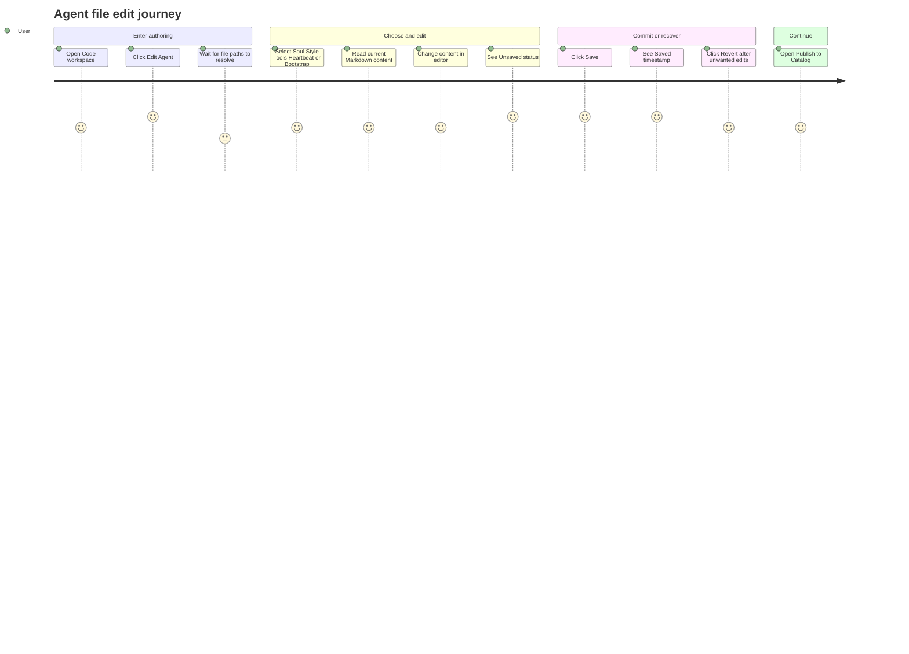
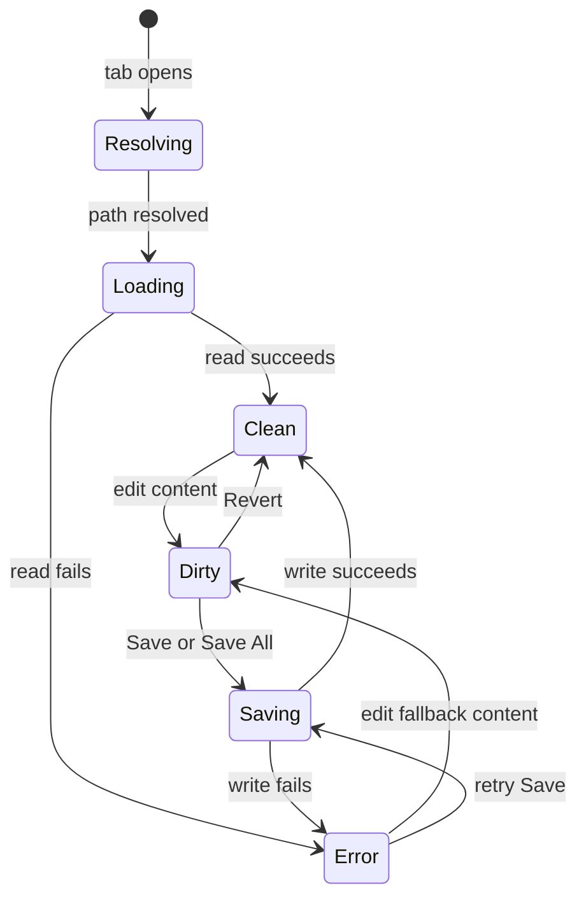

# Agent Authoring File Edit

Source rows: `AUTH-01`
Entry path: Code mode -> active workspace -> `Edit Agent` -> Agent authoring tab
Status: Draft, evidence-only

## User Journey

### Overview

| Attribute      | Value                                                                                    |
| -------------- | ---------------------------------------------------------------------------------------- |
| Priority       | High                                                                                     |
| User type      | Returning user editing a hardware-harness agent workspace                                |
| Frequency      | Frequent during agent development                                                        |
| Success metric | User can open, edit, save, and recover from mistakes without losing workspace file state |

### User Goal

> "I want to tune my agent files in place, save only the changes I intend, and quickly recover if I edit the wrong thing."

### Preconditions

- User is in Code mode with an active workspace that resolves to an agent root.
- `Edit Agent` is visible in the working directory bar.
- Workspace file IPC is available for reading and writing agent files.

### Journey Map



### Journey Steps

#### Step 1: Enter the authoring surface

**User action:** From a Code workspace, the user clicks `Edit Agent`.
**System response:** A tab of type `agent-authoring` opens or focuses, then `AgentAuthoringTab` starts resolving the editable agent file paths.
**Success criteria:**

- [ ] The tab opens without leaving Code mode.
- [ ] A resolving state is shown while paths are still unknown.
- [ ] The header and rail make the available authoring sections visible.

**Potential friction:**

- `Edit Agent` is hidden if agent-root discovery fails; this remains a known discovery gap.
- No stable tab-root selector exists yet for L3 automation.

#### Step 2: Pick a file section

**User action:** The user selects `Soul`, `Style`, `Tools`, `Heartbeat`, or `Bootstrap`.
**System response:** The selected file path appears in the sub-header and the editor displays the file content.
**Success criteria:**

- [ ] The active section is visually distinct.
- [ ] The path in the sub-header matches the selected section.
- [ ] `Revert` and `Save` are disabled until content changes.

**Potential friction:**

- Section names are short and domain-specific; users may need prior knowledge of what each file controls.

#### Step 3: Edit and decide

**User action:** The user changes Markdown content.
**System response:** The shared authoring store marks the file dirty and the status bar shows `Unsaved`.
**Success criteria:**

- [ ] Dirty status appears after content diverges from saved content.
- [ ] Switching sections preserves each file's dirty state.
- [ ] `Save All (N)` appears only when at least two core file sections are dirty.

**Potential friction:**

- Skills use the same parent save controls, but the Save All button only counts core file sections.

#### Step 4: Save or recover

**User action:** The user clicks `Save`, `Save All`, or `Revert`.
**System response:** Save writes the file through workspace IPC; success shows a saved timestamp, failure shows an error state and retry toast. Revert restores saved content locally.
**Success criteria:**

- [ ] Save cannot double-submit while the file is already saving.
- [ ] Save failure preserves edited content and gives a retry path.
- [ ] Revert clears dirty and error state for the active file.

**Potential friction:**

- Save failures are surfaced through toast and status text, but there is no L3 test proving focus and recovery behavior.

### Error Scenarios

#### E1: File read fallback

**Trigger:** The editor cannot read a file during initial load.
**User sees:** The editor initializes with empty content when no template path is involved.
**Recovery path:** User can still edit and save content through the same workspace write path.
**Test:** No direct L2 test for this full tab path.

#### E2: Save failure

**Trigger:** `writeWorkspaceFile` rejects.
**User sees:** Error status text plus a retry toast.
**Recovery path:** User retries the same save action after fixing the underlying workspace issue.
**Test:** Store error transition covered in `apps/electron/src/renderer/src/stores/agent-authoring-store.test.ts`; full UI recovery is untested.

### Metrics To Track

- Time from clicking `Edit Agent` to first editable content visible.
- Save success and failure rate per section.
- Revert usage after dirty state.
- Drop-off from dirty state without save or revert.

### E2E Test Reference

Future L3 scenario: `AUTH-01 opens agent authoring, edits a core file, saves, and reverts a second edit`.

## UI Surface


The authoring tab keeps section navigation, the selected agent file path, personality controls, Markdown toolbar, editor content, Publish, Revert, and Save visible in one Code-mode tab. Mobile Preview is secondary priority for this inventory; the primary downstream journey remains Publish to Catalog and package export.

### Wireframe

```text
+--------------------------------------------------------------------------------+
| Agent <workspace>          [Approved] [Save All (N)] [Publish]             |
+----------------------+---------------------------------------------------------+
| Soul                 | agent/SOUL.md                         [Revert] [Save]   |
| Style                +---------------------------------------------------------+
| Tools                |                                                         |
| Heartbeat            |  Markdown editor for selected single-file section       |
| Bootstrap            |                                                         |
| -------------------- |                                                         |
| Skills               |                                                         |
| Capabilities         |                                                         |
+----------------------+---------------------------------------------------------+
| Unsaved / Saving... / Saved <time> / Save error     Last published <version>   |
+--------------------------------------------------------------------------------+
```

- Header title showing the agent workspace name.
- Header state/action area: optional reviewed-state badge such as `Approved`, `Save All (N)` when at least two core file sections are dirty, and primary `Publish`.
- Left rail sections: `Soul`, `Style`, `Tools`, `Heartbeat`, `Bootstrap`, then `Skills` and `Capabilities`.
- Editable file sub-header for single-file sections: workspace-relative path, `Revert`, `Save`, and `Saving...` button state.
- Main editor: section-specific editor for Soul, Style, Tools, Heartbeat, and Bootstrap.
- Empty/loading state: `Resolving files...`.
- Status bar states: saving, saved timestamp with file path, unsaved file path, error text, and last-published catalog link when present.
- Publish entry: opens the Publish to Catalog dialog documented in `publish-export.md`; it does not replace the editor or discard dirty state.
- Review state: an `Approved` badge in the header means catalog/package review has approved a related publish row. It does not mean optional media or firmware has been published.

## File Edit State Machine

This diagram covers one editable file section. `Save All` runs the same save path once per dirty core file.



State responsibilities:

| State       | Meaning                                                          | User-facing responsibility                                                                              |
| ----------- | ---------------------------------------------------------------- | ------------------------------------------------------------------------------------------------------- |
| `Resolving` | The authoring tab is resolving workspace-relative section paths. | Show `Resolving files...` and keep file actions unavailable.                                            |
| `Loading`   | The selected file path is known and content is being read.       | Avoid presenting stale content as editable state.                                                       |
| `Clean`     | Editor content matches the last saved content.                   | Disable `Save`/`Revert` and show saved status when known.                                               |
| `Dirty`     | Editor content differs from saved content.                       | Show `Unsaved`, enable `Save`/`Revert`, and count the file for `Save All`.                              |
| `Saving`    | A write is in flight for the selected file or a Save All member. | Disable duplicate saves and keep edited content visible.                                                |
| `Error`     | Read or write failed.                                            | Keep the user in context, preserve editable content after save failure, and offer retry through `Save`. |

Transition labels:

| Label              | Trigger                                      | Expected result                                                |
| ------------------ | -------------------------------------------- | -------------------------------------------------------------- |
| `path resolved`    | `AgentAuthoringTab` resolves a section file. | The editor can start reading content.                          |
| `edit content`     | User changes Markdown content.               | Store marks the file dirty.                                    |
| `Save or Save All` | User clicks save action while dirty.         | Workspace write begins.                                        |
| `write succeeds`   | `writeWorkspaceFile` resolves.               | Dirty/error state clears and saved timestamp updates.          |
| `write fails`      | `writeWorkspaceFile` rejects.                | Error state is visible and edited content remains.             |
| `Revert`           | User clicks revert while dirty.              | Content returns to saved content and dirty/error state clears. |

## Interaction Contract

| User action                    | UI precondition                                   | UI result                                                                                                                                                                | Backend/API path                                                                               | Evidence                                                                                                                                                                                                                                                                                                                                                                                                                                                                                        | Test coverage                                                                                                                                                                                                                                                                                                                                                                                                                        |
| ------------------------------ | ------------------------------------------------- | ------------------------------------------------------------------------------------------------------------------------------------------------------------------------ | ---------------------------------------------------------------------------------------------- | ----------------------------------------------------------------------------------------------------------------------------------------------------------------------------------------------------------------------------------------------------------------------------------------------------------------------------------------------------------------------------------------------------------------------------------------------------------------------------------------------- | ------------------------------------------------------------------------------------------------------------------------------------------------------------------------------------------------------------------------------------------------------------------------------------------------------------------------------------------------------------------------------------------------------------------------------------ |
| Open Agent Authoring tab       | Active tab type is `agent-authoring`              | `AgentAuthoringTab` renders for the tab workspace path                                                                                                                   | None beyond tab store                                                                          | [TabContentArea.tsx:45](../../../../apps/electron/src/renderer/src/components/code/TabContentArea.tsx#L45), [AgentAuthoringTab.tsx:63](../../../../apps/electron/src/renderer/src/components/agent-authoring/AgentAuthoringTab.tsx#L63)                                                                                                                                                                                                                                                         | L2 no direct component test                                                                                                                                                                                                                                                                                                                                                                                                          |
| Resolve editable section paths | Tab mounts with `workspacePath`                   | Core section files resolve before editors render                                                                                                                         | `resolveAgentFile(workspacePath, base)` for `SOUL`, `STYLE`, `TOOLS`, `HEARTBEAT`, `BOOTSTRAP` | [AgentAuthoringTab.tsx:85](../../../../apps/electron/src/renderer/src/components/agent-authoring/AgentAuthoringTab.tsx#L85), [AgentAuthoringTab.tsx:90](../../../../apps/electron/src/renderer/src/components/agent-authoring/AgentAuthoringTab.tsx#L90)                                                                                                                                                                                                                                        | L1 partial: [agent-files-resolve.test.ts:26](../../../../apps/electron/src/renderer/test/agent-files-resolve.test.ts#L26)                                                                                                                                                                                                                                                                                                            |
| Switch rail section            | User clicks a rail section                        | Active section changes; editable sections show file path and editor; Skills/Capabilities route to their own components                                                   | Renderer state only                                                                            | [AgentAuthoringTab.tsx:244](../../../../apps/electron/src/renderer/src/components/agent-authoring/AgentAuthoringTab.tsx#L244), [AgentAuthoringTab.tsx:261](../../../../apps/electron/src/renderer/src/components/agent-authoring/AgentAuthoringTab.tsx#L261), [AgentAuthoringTab.tsx:310](../../../../apps/electron/src/renderer/src/components/agent-authoring/AgentAuthoringTab.tsx#L310)                                                                                                     | L2 no direct test                                                                                                                                                                                                                                                                                                                                                                                                                    |
| Edit an editable file          | File editor has loaded content                    | Store marks the file dirty when content differs from saved content                                                                                                       | `readWorkspaceFile` on editor load; local `useAgentAuthoringStore.setContent` on edit          | [MarkdownFileEditor.tsx:55](../../../../apps/electron/src/renderer/src/components/agent-authoring/MarkdownFileEditor.tsx#L55), [MarkdownFileEditor.tsx:74](../../../../apps/electron/src/renderer/src/components/agent-authoring/MarkdownFileEditor.tsx#L74)                                                                                                                                                                                                                                    | L1 covered: [agent-authoring-store.test.ts:23](../../../../apps/electron/src/renderer/src/stores/agent-authoring-store.test.ts#L23)                                                                                                                                                                                                                                                                                                  |
| Save selected file             | Active file state is dirty and not already saving | Save button enters saving, writes current content, then status becomes clean and saved timestamp appears; on failure the status becomes error and a retry toast is shown | `writeWorkspaceFile(workspacePath, activeRelativePath, state.content)`                         | [AgentAuthoringTab.tsx:121](../../../../apps/electron/src/renderer/src/components/agent-authoring/AgentAuthoringTab.tsx#L121), [AgentAuthoringTab.tsx:127](../../../../apps/electron/src/renderer/src/components/agent-authoring/AgentAuthoringTab.tsx#L127), [AgentAuthoringTab.tsx:132](../../../../apps/electron/src/renderer/src/components/agent-authoring/AgentAuthoringTab.tsx#L132), [workspace-client.ts:263](../../../../apps/electron/src/renderer/src/lib/workspace-client.ts#L263) | L1 store transitions covered: [agent-authoring-store.test.ts:36](../../../../apps/electron/src/renderer/src/stores/agent-authoring-store.test.ts#L36), [agent-authoring-store.test.ts:43](../../../../apps/electron/src/renderer/src/stores/agent-authoring-store.test.ts#L43), [agent-authoring-store.test.ts:54](../../../../apps/electron/src/renderer/src/stores/agent-authoring-store.test.ts#L54); L2 save flow no direct test |
| Save all dirty core files      | At least two core file sections are dirty         | Header shows `Save All (N)` and writes each dirty core file; failures show per-file error toasts                                                                         | `writeWorkspaceFile` once per dirty core file                                                  | [AgentAuthoringTab.tsx:138](../../../../apps/electron/src/renderer/src/components/agent-authoring/AgentAuthoringTab.tsx#L138), [AgentAuthoringTab.tsx:146](../../../../apps/electron/src/renderer/src/components/agent-authoring/AgentAuthoringTab.tsx#L146), [AgentAuthoringTab.tsx:201](../../../../apps/electron/src/renderer/src/components/agent-authoring/AgentAuthoringTab.tsx#L201)                                                                                                     | L2 no direct test                                                                                                                                                                                                                                                                                                                                                                                                                    |
| Revert selected file           | Active file is dirty                              | Content returns to saved content and dirty/error state clears                                                                                                            | Local store only                                                                               | [AgentAuthoringTab.tsx:158](../../../../apps/electron/src/renderer/src/components/agent-authoring/AgentAuthoringTab.tsx#L158), [AgentAuthoringTab.tsx:290](../../../../apps/electron/src/renderer/src/components/agent-authoring/AgentAuthoringTab.tsx#L290)                                                                                                                                                                                                                                    | L1 covered: [agent-authoring-store.test.ts:63](../../../../apps/electron/src/renderer/src/stores/agent-authoring-store.test.ts#L63)                                                                                                                                                                                                                                                                                                  |
| Open last published URL        | `lastPublished` exists in store                   | Footer shows semver and opens the catalog URL via Electron external-open                                                                                                 | `window.electronAPI.openExternal(lastPublished.catalogUrl)`                                    | [AgentAuthoringTab.tsx:357](../../../../apps/electron/src/renderer/src/components/agent-authoring/AgentAuthoringTab.tsx#L357), [AgentAuthoringTab.tsx:362](../../../../apps/electron/src/renderer/src/components/agent-authoring/AgentAuthoringTab.tsx#L362)                                                                                                                                                                                                                                    | L2 no direct test                                                                                                                                                                                                                                                                                                                                                                                                                    |
| Open Publish to Catalog dialog | Agent Authoring tab is mounted                    | Publish dialog opens as a modal over the editor with package digest, publish mode, metadata, success/error, and retry states.                                               | Catalog publish and package export boundaries; see `publish-export.md`.                         | [AgentAuthoringTab.tsx:223](../../../../apps/electron/src/renderer/src/components/agent-authoring/AgentAuthoringTab.tsx#L223), [PublishCatalogDialog.tsx:239](../../../../apps/electron/src/renderer/src/components/agent-authoring/PublishCatalogDialog.tsx#L239)                                                                                                                                                                | L3 planned                                                                                                                                                                                                                                                                                                                                                                                                                           |

## Data And Events

| Data/event                    | Shape or source                                                              | Evidence                                                                                                                                                                                                                                                       |
| ----------------------------- | ---------------------------------------------------------------------------- | -------------------------------------------------------------------------------------------------------------------------------------------------------------------------------------------------------------------------------------------------------------- |
| Editable sections             | `soul`, `style`, `tools`, `heartbeat`, `bootstrap` mapped to base file names | [AgentAuthoringTab.tsx:30](../../../../apps/electron/src/renderer/src/components/agent-authoring/AgentAuthoringTab.tsx#L30)                                                                                                                                    |
| Read-only/multi-file sections | `skills`, `capabilities`                                                     | [AgentAuthoringTab.tsx:54](../../../../apps/electron/src/renderer/src/components/agent-authoring/AgentAuthoringTab.tsx#L54)                                                                                                                                    |
| File state key                | `fileStateKey(workspacePath, relativePath)`                                  | [AgentAuthoringTab.tsx:108](../../../../apps/electron/src/renderer/src/components/agent-authoring/AgentAuthoringTab.tsx#L108), [agent-authoring-store.test.ts:8](../../../../apps/electron/src/renderer/src/stores/agent-authoring-store.test.ts#L8)           |
| Workspace file APIs           | `workspace:read-file`, `workspace:write-file` through `workspace-client.ts`  | [workspace-client.ts:263](../../../../apps/electron/src/renderer/src/lib/workspace-client.ts#L263), [ipc-channels.ts:47](../../../../apps/electron/src/main/ipc-channels.ts#L47), [ipc-channels.ts:72](../../../../apps/electron/src/main/ipc-channels.ts#L72) |

## Gaps

- No direct L2 test covers `AgentAuthoringTab` rail switching, save/revert buttons, Save All, or last-published footer.
- No L3 Electron scenario covers `AUTH-01`.
- TODO: add stable selectors for the tab root, rail sections, Save, Revert, Save All, Preview, and Publish controls before computer-use can drive this surface reliably.
