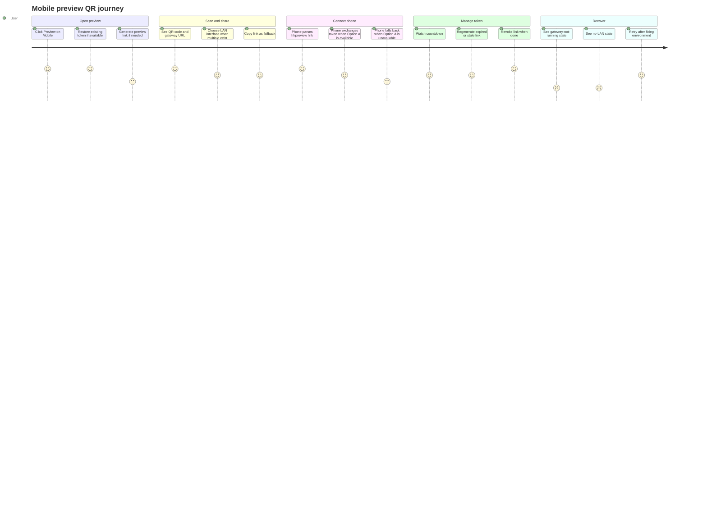
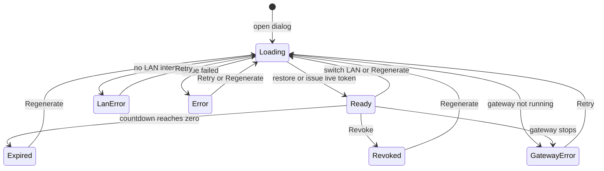
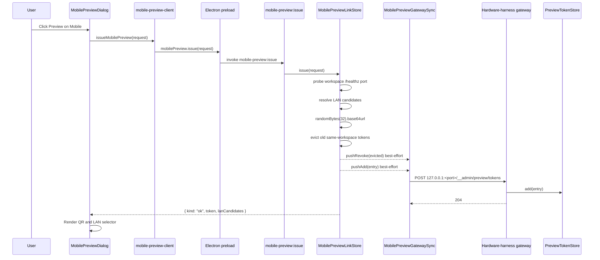
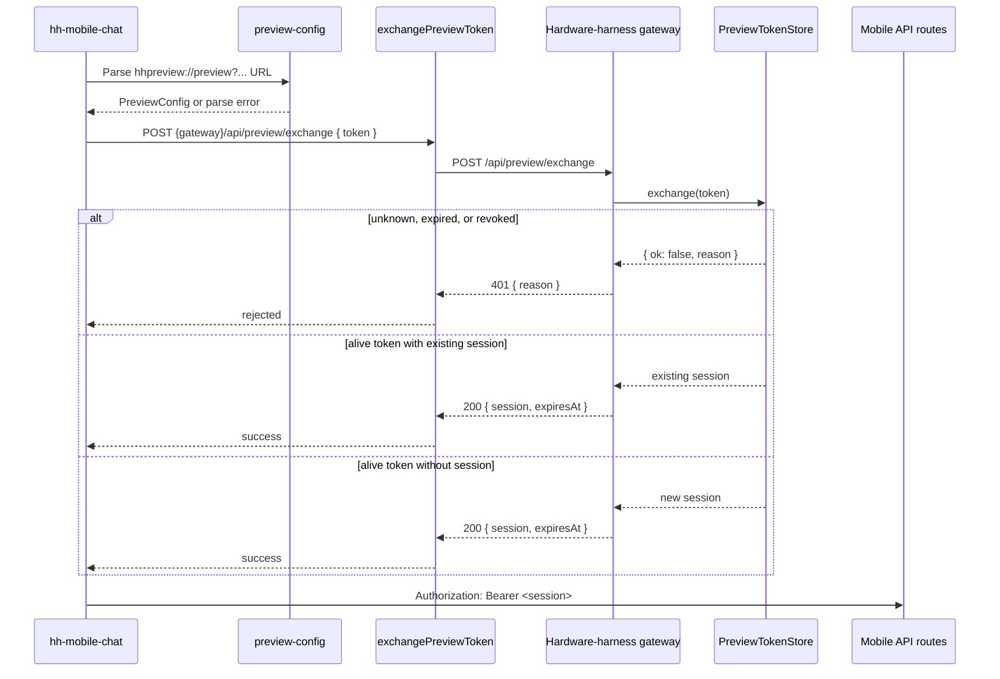
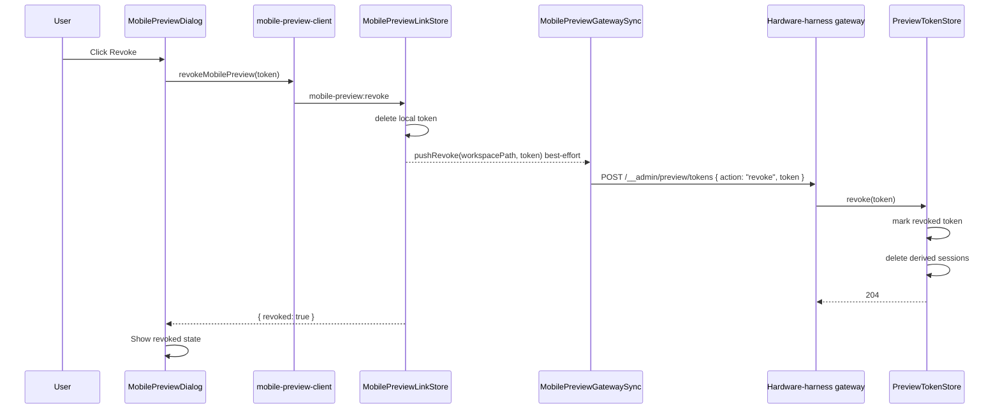

# Agent Authoring Mobile Preview

Source rows: `AUTH-04`
Entry path: Code mode -> active workspace -> `Edit Agent` -> `Preview on Mobile`
Status: Draft, evidence-only, as-built contract

## Scope

This contract covers the full mobile-preview handoff from the desktop agent
authoring UI to `hh-mobile-chat`. The preview flow is not just a renderer IPC
surface. It crosses four runtime boundaries:

```text
Renderer
  AgentAuthoringTab -> MobilePreviewDialog -> mobile-preview-client
    issueMobilePreview / listMobilePreviews / revokeMobilePreview

Electron preload
  window.electronAPI.mobilePreview.issue/list/revoke

Electron main
  ipc-mobile-preview.ts
  MobilePreviewLinkStore
  MobilePreviewGatewaySync

Hardware-harness gateway
  PreviewTokenStore
  POST /__admin/preview/tokens
  POST /api/preview/exchange

Phone
  hhpreview://preview deep link
  exchangePreviewToken
  bearer-session runtime requests
```

The UI contract therefore documents these public and semi-public contracts:

- Desktop renderer request and response shapes.
- The `hhpreview://preview` URL scheme and query parameters.
- The loopback-only admin route used by Electron main.
- The LAN route used by the mobile client to exchange a token for a session.
- The fallback behavior when the gateway does not support Option A auth.

## User Journey

### Overview

| Attribute      | Value                                                                                                |
| -------------- | ---------------------------------------------------------------------------------------------------- |
| Priority       | High                                                                                                 |
| User type      | Agent developer previewing an agent on mobile hardware-harness chat                                  |
| Frequency      | Common during local device and mobile preview testing                                                |
| Success metric | User can get a valid QR link or a clear recovery path when local gateway or LAN state blocks preview |

### User Goal

> "I want to scan a short-lived preview link on my phone, using the correct LAN address, so I can test the agent from mobile without manual URL setup."

### Preconditions

- User is in the Agent Authoring tab for a workspace.
- The workspace may already have an active preview token.
- Hardware-harness gateway may or may not be running for the workspace.
- The laptop may have zero, one, or multiple usable LAN interfaces.
- The phone and laptop need to be on a network where the selected LAN IP can reach
  the gateway port.

### Journey Map



### Journey Steps

#### Step 1: Open The Preview Dialog

**User action:** The user clicks `Preview on Mobile`.
**System response:** The dialog opens and attempts to restore a live token or
issue a new one.
**Success criteria:**

- [ ] Loading state appears immediately.
- [ ] Existing unexpired token is reused instead of issuing a duplicate token.
- [ ] Stale issue responses are ignored when state changes mid-request.

**Potential friction:**

- The parent button click has no direct test; most coverage starts at the dialog.

#### Step 2: Scan Or Copy The Link

**User action:** The user scans the QR, picks a LAN interface if needed, or
clicks `Copy Link`.
**System response:** Ready state displays QR, gateway base URL, countdown, and
optional LAN radio list.
**Success criteria:**

- [ ] QR has an accessible label for test and assistive tooling.
- [ ] LAN switching reissues a link with the chosen IP.
- [ ] Copy action does not fail visibly when clipboard is unavailable in tests.

**Potential friction:**

- If the wrong LAN interface is selected, the phone may not reach the gateway
  even though the QR renders.

#### Step 3: Connect The Phone

**User action:** The user opens the `hhpreview://preview?...` link on the phone.
**System response:** The mobile app parses the deep link, attempts Option A token
exchange, and stores either a bearer session or an Option B fallback mode.
**Success criteria:**

- [ ] Wrong scheme, wrong host, unsupported version, missing fields, and expired
      links are rejected before connecting.
- [ ] `401` exchange failures force the user to reissue a preview link.
- [ ] `404`, network failure, or other non-OK exchange failures fall back to
      Option B so older gateways still work.

**Potential friction:**

- Option B keeps the preview usable but means the LAN URL itself is the secret.

#### Step 4: Manage Token Lifetime

**User action:** The user watches expiration, regenerates, or revokes the link.
**System response:** Expired state grays the QR; regenerate issues a new token;
revoke flips the UI to revoked state even if server-side cleanup is best-effort.
**Success criteria:**

- [ ] Regenerate replaces the prior same-workspace token.
- [ ] Revoked links are not presented as scan-ready.
- [ ] Expired links clearly show `Link expired`.

**Potential friction:**

- The QR token lifetime is visible, but an already exchanged Option A session has
  its own server-side TTL.

#### Step 5: Recover From Environment Failures

**User action:** The user sees gateway or LAN errors, fixes the environment, then
retries.
**System response:** Gateway-not-running and no-LAN states explain what changed
and offer `Retry`.
**Success criteria:**

- [ ] Gateway crash during a ready/loading state revokes current token where
      possible.
- [ ] Benign gateway transitions do not interrupt the QR.
- [ ] Retry returns to the same issue flow.

**Potential friction:**

- The deploy hint mentions hardware-harness details and may be hard for
  non-firmware users.

### Error Scenarios

#### E1: Gateway Not Running

**Trigger:** Issue request returns `gateway-not-running` or gateway status
changes while the dialog is active.
**User sees:** Deploy-agent hint and `Retry`.
**Recovery path:** Deploy/start the local hardware-harness gateway for the
workspace, then retry.
**Test:** `apps/electron/src/renderer/test/mobile-preview-dialog.test.tsx`.

#### E2: No LAN Interface

**Trigger:** Issue request returns `no-lan-interface`.
**User sees:** Wi-Fi connection hint and `Retry`.
**Recovery path:** Connect laptop and phone to the same Wi-Fi, then retry.
**Test:** `apps/electron/src/main/mobile-preview-link.test.ts`.

#### E3: Token Expired Or Revoked

**Trigger:** Countdown expires, user revokes the token, or the phone exchange is
rejected as `expired` or `revoked`.
**User sees:** Expired or revoked state with `Regenerate`, or a mobile error that
asks the user to re-scan.
**Recovery path:** Click `Regenerate` to issue a fresh token.
**Test:** `apps/electron/src/renderer/test/mobile-preview-dialog.test.tsx`,
`apps/hh-mobile-chat/src/components/preview/PreviewShell.test.tsx`.

#### E4: Option A Unavailable

**Trigger:** Phone exchange receives `404`, a network error, or a non-OK response
other than `401`.
**User sees:** Preview continues in Option B mode.
**Recovery path:** None required for preview. Developers should treat this as
unauthenticated LAN preview.
**Test:** `apps/hh-mobile-chat/src/services/preview-auth.ts`.

### Metrics To Track

- Preview issue success rate.
- Gateway-not-running and no-LAN error rates.
- Option A exchange success, rejection, and fallback rates.
- Regenerate and revoke usage.
- Time from opening dialog to ready QR.
- Time from phone deep-link receipt to first successful runtime request.

### E2E Test Reference

Future L3 scenario: `AUTH-04 opens mobile preview, selects a LAN IP, copies link,
regenerates, revokes, and verifies phone exchange/fallback behavior`.

## UI Surface

### Wireframe

```text
                 +------------------------------------------+
                 | Preview on Mobile                    [x] |
                 +------------------------------------------+
                 |                                          |
                 | Loading: Generating preview link...      |
                 |                                          |
                 | Ready:                                   |
                 | +--------------------------------------+ |
                 | |              QR code                 | |
                 | +--------------------------------------+ |
                 | Gateway: http://<lan-ip>:<port>          |
                 | Expires in mm:ss                         |
                 |                                          |
                 | LAN interface, when multiple exist       |
                 | ( ) 192.168.1.10                         |
                 | ( ) 10.0.0.5                             |
                 |                                          |
                 | hhpreview:// explanation                 |
                 |                         [Copy Link]      |
                 |                         [Regenerate]     |
                 |                         [Revoke]         |
                 +------------------------------------------+

Alternate bodies: gateway-not-running, no-LAN, generic error, expired, revoked.
```

- Header: `Preview on Mobile` and close button.
- Loading state: `Generating preview link...`.
- Gateway-not-running state with deploy hint and `Retry`.
- No-LAN-interface state with Wi-Fi hint and `Retry`.
- Generic error state with message and `Retry`.
- Expired state: grayed QR, `Link expired`, gateway line, and `Regenerate`.
- Revoked state: `Preview link revoked.` and `Regenerate`.
- Ready state: QR code with `aria-label="mobile preview QR code"`, gateway line,
  countdown, optional LAN interface radio group, deep-link explanation,
  `Copy Link`, `Regenerate`, and `Revoke`.

## Preview Link State Machine

This diagram covers the desktop dialog body after `Preview on Mobile` opens.



State responsibilities:

| State          | Meaning                                                               | User-facing responsibility                                      |
| -------------- | --------------------------------------------------------------------- | --------------------------------------------------------------- |
| `Loading`      | The dialog is restoring or issuing a token.                           | Show progress and suppress stale responses from older requests. |
| `Ready`        | A live token and gateway URL are available.                           | Render QR, link actions, countdown, and optional LAN selector.  |
| `Expired`      | The token lifetime has elapsed.                                       | Make the QR non-scan-ready and offer `Regenerate`.              |
| `Revoked`      | User revoked the token or the UI treated it as revoked after cleanup. | Stop presenting the old link and offer `Regenerate`.            |
| `GatewayError` | The gateway is not running or stopped during preview.                 | Explain the gateway requirement and offer `Retry`.              |
| `LanError`     | No usable LAN interface is available.                                 | Explain network requirements and offer `Retry`.                 |
| `Error`        | Any other issue/list/revoke failure affected the flow.                | Show the message and keep a retry path visible.                 |

Transition labels:

| Label                         | Trigger                                            | Expected result                                            |
| ----------------------------- | -------------------------------------------------- | ---------------------------------------------------------- |
| `restore or issue live token` | Existing token is valid or issue succeeds.         | QR becomes scan-ready.                                     |
| `switch LAN or Regenerate`    | User changes LAN radio or asks for a new link.     | A new issue request replaces the current token state.      |
| `countdown reaches zero`      | Expiry timestamp passes.                           | Dialog shows expired state.                                |
| `Revoke`                      | User revokes the active token.                     | Dialog shows revoked state even if cleanup is best-effort. |
| `Retry`                       | User retries after environment or generic failure. | Dialog returns to the issue flow.                          |

## Client Request And Response Types

These are the desktop IPC types exported from
`apps/electron/src/shared/mobile-preview-types.ts`.

### Constants

| Constant                             | Value       | Meaning                                                           |
| ------------------------------------ | ----------- | ----------------------------------------------------------------- |
| `MOBILE_PREVIEW_URL_SCHEME`          | `hhpreview` | Custom URL scheme registered by the mobile app.                   |
| `MOBILE_PREVIEW_URL_HOST`            | `preview`   | Route slot inside the custom scheme.                              |
| `MOBILE_PREVIEW_SCHEMA_VERSION`      | `1`         | URL contract version, serialized as query parameter `v=1`.        |
| `MOBILE_PREVIEW_DEFAULT_TTL_SECONDS` | `600`       | Default QR token TTL in seconds. This is 10 minutes.              |
| `DEFAULT_SESSION_TTL_MS`             | `1800000`   | Gateway Option A session TTL in milliseconds. This is 30 minutes. |

`DEFAULT_SESSION_TTL_MS` is server-local in
`src/hardware-harness-core/preview-token-store.ts`.

### MobilePreviewIssueRequest

| Field            | Type     | Required | Meaning                                                                 |
| ---------------- | -------- | -------- | ----------------------------------------------------------------------- |
| `workspacePath`  | `string` | Yes      | Workspace/project path used to locate the matching gateway process.     |
| `workspaceLabel` | `string` | Yes      | Display label serialized into the deep link as `workspace`.             |
| `projectId`      | `string` | Yes      | Project id serialized into the deep link as `project`.                  |
| `ttlSeconds`     | `number` | No       | Overrides the default 600 second token TTL. Values are clamped to >= 1. |
| `preferredLanIp` | `string` | No       | LAN IP selected by the dialog radio group. Ignored if not a candidate.  |

The desktop dialog currently sends `workspacePath`, `workspaceLabel`,
`projectId`, and optionally `preferredLanIp`.

### MobilePreviewToken

| Field            | Type     | Meaning                                                                |
| ---------------- | -------- | ---------------------------------------------------------------------- |
| `token`          | `string` | 32 random bytes encoded as base64url.                                  |
| `workspacePath`  | `string` | Workspace used for single-active-token policy and gateway lookup.      |
| `workspaceLabel` | `string` | Display label mirrored into the URL.                                   |
| `projectId`      | `string` | Project id mirrored into the URL.                                      |
| `gatewayBaseUrl` | `string` | LAN gateway origin, `http://<lanIp>:<port>`.                           |
| `lanIp`          | `string` | Selected LAN IPv4 address.                                             |
| `port`           | `number` | Per-workspace mobile API port.                                         |
| `issuedAt`       | `number` | Unix milliseconds when the token was issued.                           |
| `expiresAt`      | `number` | Unix milliseconds when the QR token expires.                           |
| `schemaVersion`  | `string` | Currently `1`.                                                         |
| `url`            | `string` | Full `hhpreview://preview?...` deep link encoded in the QR and copied. |

### MobilePreviewIssueResult

| Variant                                | Meaning                                                       |
| -------------------------------------- | ------------------------------------------------------------- |
| `{ kind: "ok", token, lanCandidates }` | Token was issued. `lanCandidates` drives the LAN radio group. |
| `{ kind: "gateway-not-running" }`      | No live mobile API port could be resolved and probed.         |
| `{ kind: "no-lan-interface" }`         | No usable non-virtual IPv4 LAN interface was found.           |

### Other Client Results

| Type                        | Shape                                                                 | Meaning                                       |
| --------------------------- | --------------------------------------------------------------------- | --------------------------------------------- |
| `MobilePreviewLookupResult` | `{ kind: "ok"; token } \| { kind: "unknown" } \| { kind: "expired" }` | Main-process lookup result.                   |
| `MobilePreviewListResult`   | `{ active: MobilePreviewToken[] }`                                    | Active, non-expired tokens known to Electron. |
| `MobilePreviewRevokeResult` | `{ revoked: boolean }`                                                | Whether Electron had a local token to revoke. |

## hhpreview Deep Link Spec

The QR code and Copy Link action encode exactly one URL shape:

```text
hhpreview://preview?gateway=<base>&workspace=<label>&project=<id>&token=<base64url-32B>&exp=<unix-sec>&v=1
```

The source of truth is `buildPreviewUrl()` in
`apps/electron/src/main/mobile-preview-link.ts`.

| Query key   | Source                          | Meaning                                                               |
| ----------- | ------------------------------- | --------------------------------------------------------------------- |
| `gateway`   | `http://<lanIp>:<port>`         | LAN origin the phone should call. `URLSearchParams` handles encoding. |
| `workspace` | `workspaceLabel`                | Display label for the phone preview shell.                            |
| `project`   | `projectId`                     | Project id carried into mobile runtime scope.                         |
| `token`     | Generated preview token         | One-time preview token for Option A exchange, or Option B credential. |
| `exp`       | `Math.floor(expiresAt/1000)`    | Unix seconds expiration used by the mobile parser.                    |
| `v`         | `MOBILE_PREVIEW_SCHEMA_VERSION` | Protocol version. Only `1` is accepted today.                         |

Mobile parsing behavior:

- Scheme must be `hhpreview`.
- Host must be `preview`.
- Version must be `1`.
- `gateway`, `workspace`, `project`, `token`, and `exp` are required.
- `gateway` must start with `http://` or `https://`.
- `exp` is parsed as Unix seconds and stored as Unix milliseconds.
- Expired links are rejected before network calls.

## Runtime Architecture And Sequence Diagrams

### Issue And Push



Read the sequence:

| Step | Behavior                                                                                  |
| ---- | ----------------------------------------------------------------------------------------- |
| 1    | The renderer calls the typed client, which crosses preload and IPC into Electron main.    |
| 2    | `MobilePreviewLinkStore` probes the per-workspace mobile API port with `/healthz`.        |
| 3    | LAN candidates are resolved from OS network interfaces and filtered to real IPv4 LAN IPs. |
| 4    | A 32 byte base64url token is created and embedded into the `hhpreview://preview` URL.     |
| 5    | Any existing token for the same workspace is deleted locally and revoked in the gateway.  |
| 6    | The add/revoke pushes are best-effort so QR issuance remains responsive.                  |

### Phone Scan And Exchange



Fallback interpretation:

| Exchange result        | Mobile behavior                                                     |
| ---------------------- | ------------------------------------------------------------------- |
| `200` with session     | Store session, mark auth mode `option-a`, use bearer session.       |
| `401`                  | Treat as a real rejection and ask the user to reissue/re-scan.      |
| `404`                  | Mark auth mode `option-b`; continue without server-side token auth. |
| Network error or 5xx   | Mark auth mode `option-b`; continue with a warning/fallback state.  |
| Malformed success body | Treat like network fallback because the server contract drifted.    |

### Revoke And Cascade



Read the sequence:

| Step | Behavior                                                                                    |
| ---- | ------------------------------------------------------------------------------------------- |
| 1    | Revocation deletes the desktop token first.                                                 |
| 2    | Gateway cleanup is best-effort from Electron main, but the UI still stops showing the link. |
| 3    | Gateway `PreviewTokenStore.revoke()` records the token as revoked for future 401 semantics. |
| 4    | All active sessions derived from the token are deleted immediately.                         |

## Server API Contract

### Preview Exchange Route

`POST /api/preview/exchange` is the public LAN route used by `hh-mobile-chat`
to exchange a preview token for a runtime session.

Request:

```http
POST /api/preview/exchange
Content-Type: application/json

{ "token": "<base64url-32B>" }
```

Responses:

| Status | Body                                                 | Meaning                                                     |
| ------ | ---------------------------------------------------- | ----------------------------------------------------------- |
| `200`  | `{ "session": "<base64url-32B>", "expiresAt": 123 }` | Token accepted. `expiresAt` is Unix milliseconds.           |
| `400`  | `{ "reason": "malformed", "detail"?: "..." }`        | Body is missing, too large, wrong content type, or invalid. |
| `401`  | `{ "reason": "unknown" }`                            | Token is not in the gateway store.                          |
| `401`  | `{ "reason": "expired" }`                            | Token expired. Expired-token exchange also prunes sessions. |
| `401`  | `{ "reason": "revoked" }`                            | Token was explicitly revoked.                               |
| `405`  | `{ "reason": "method-not-allowed" }`                 | Any non-POST method. `Allow: POST` is set.                  |

Probe semantics:

- `GET /api/preview/exchange` intentionally returns `405`.
- A client may use `405` as "route exists but method is wrong".
- `404` means the route is absent or the gateway is older than Option A.

### Admin Token Sync Route

`POST /__admin/preview/tokens` is the internal loopback route used by Electron
main to push token add/revoke events into the gateway process. Mobile clients
must not call this route.

Security controls:

| Control       | Contract                                                                                    |
| ------------- | ------------------------------------------------------------------------------------------- |
| Loopback only | `remoteAddress` must be `127.0.0.1`, `::1`, or `::ffff:127.0.0.1`; otherwise `403`.         |
| Bearer secret | `Authorization: Bearer <NH7_ADMIN_SECRET>` is required.                                     |
| Timing safety | Secret comparison uses `crypto.timingSafeEqual`.                                            |
| Invisibility  | If the secret is empty or missing, the handler returns `null` and the route is not mounted. |

Add request:

```http
POST /__admin/preview/tokens
Authorization: Bearer <NH7_ADMIN_SECRET>
Content-Type: application/json

{
  "action": "add",
  "entry": {
    "token": "<base64url-32B>",
    "workspaceId": "<workspace-path>",
    "expiresAt": 123,
    "source": "preview"
  }
}
```

Revoke request:

```http
POST /__admin/preview/tokens
Authorization: Bearer <NH7_ADMIN_SECRET>
Content-Type: application/json

{ "action": "revoke", "token": "<base64url-32B>" }
```

Responses:

| Status | Body                                          | Meaning                                        |
| ------ | --------------------------------------------- | ---------------------------------------------- |
| `204`  | Empty                                         | Add or revoke accepted.                        |
| `400`  | `{ "reason": "malformed", "detail"?: "..." }` | Body, action, token, or entry shape invalid.   |
| `401`  | `{ "reason": "no-secret" }`                   | Bearer header missing or malformed.            |
| `401`  | `{ "reason": "bad-secret" }`                  | Bearer value does not match the admin secret.  |
| `403`  | `{ "reason": "loopback-only" }`               | Request did not come from loopback.            |
| `405`  | `{ "reason": "method-not-allowed" }`          | Non-POST method. `Allow: POST` is set.         |
| `404`  | Normal server not-found response              | Route is not mounted because no secret exists. |

### Admin Secret Lifecycle

Electron main creates one admin secret per app process:

- `crypto.randomBytes(32).toString("base64url")`.
- Injected into every spawned gateway process as `NH7_ADMIN_SECRET`.
- Paired with `MOBILE_API_AUTH_REQUIRED=1`.
- Never written to disk.
- Lost when the Electron process or gateway process exits.

`NH7_ADMIN_SECRET` controls the admin sync route. `MOBILE_API_AUTH_REQUIRED=1`
controls whether non-preview mobile API routes require a valid Option A session.
It does not turn `/api/preview/exchange` on or off; that route always performs
token exchange when mounted in the gateway request handler.

### Runtime Auth For Mobile API

When `MOBILE_API_AUTH_REQUIRED=1`, the gateway gates non-preview mobile API
routes with the session returned by `/api/preview/exchange`.

HTTP clients should prefer:

```http
Authorization: Bearer <session>
```

The middleware also accepts:

```text
?session=<session>
```

The query parameter exists for SSE or constrained clients, but headers are
preferred because query strings are easier to leak through logs.

HTTP auth failures return:

| Status | Body                              | Meaning                    |
| ------ | --------------------------------- | -------------------------- |
| `401`  | `{ "reason": "no-session" }`      | No session was supplied.   |
| `401`  | `{ "reason": "invalid-session" }` | Session is not recognized. |
| `401`  | `{ "reason": "expired-session" }` | Session has expired.       |

WebSocket log streams use first-frame auth instead of URL auth:

```json
{ "type": "auth", "session": "<session>" }
```

The frame must arrive within 5 seconds. Invalid, missing, or expired sessions
close the socket with code `4401`.

### CORS And OPTIONS

The mobile API handler sets permissive CORS headers before route dispatch:

- `Access-Control-Allow-Origin: *`
- `Access-Control-Allow-Headers`: requested headers when supplied, otherwise
  `Content-Type`
- `Access-Control-Allow-Methods: GET,POST,OPTIONS`

`OPTIONS` requests return `204` before preview route or auth processing.

## Mobile Client Fallback

`hh-mobile-chat` uses Option A first and falls back only when the route or
network path is unavailable.

| Condition                         | Mobile result                                   | Product meaning                                      |
| --------------------------------- | ----------------------------------------------- | ---------------------------------------------------- |
| `200` exchange with valid session | `success`; store session; `authMode="option-a"` | Runtime calls use `Authorization: Bearer <session>`. |
| `401 unknown`                     | `rejected`; clear config and show re-scan error | Gateway has Option A but does not know the token.    |
| `401 expired`                     | `rejected`; clear config and show expired error | User must regenerate.                                |
| `401 revoked`                     | `rejected`; clear config and show re-scan error | Developer revoked the link.                          |
| `401` with other reason           | `rejected` as `unspecified`                     | Treat as a real auth failure.                        |
| `404`                             | `fallback` as `not-implemented`; Option B       | Gateway does not expose Option A.                    |
| Network error                     | `fallback` as `network`; Option B               | Gateway route is unreachable.                        |
| Other non-OK status               | `fallback` as `network`; Option B               | Keep preview usable despite route failure.           |
| Malformed `200` body              | `fallback` as `network`; Option B               | Contract drift; continue unauthenticated.            |

The mobile app stores preview config in `localStorage` under
`hhpreview.config`. Stored fields include the original token, expiration time,
auth mode, and the Option A session when one exists. `getPreviewConfig()` drops
the stored config once the deep-link `expiresAt` has passed. Option A session
validation is still server-owned; the server may reject an expired session even
if the local config has not been cleared yet.

## Data And Events

| Data/event                     | Contract                                                                                          | Evidence                                                                                                          |
| ------------------------------ | ------------------------------------------------------------------------------------------------- | ----------------------------------------------------------------------------------------------------------------- |
| Desktop entry point            | `AgentAuthoringTab` opens `MobilePreviewDialog`; the dialog calls `mobile-preview-client`.        | `apps/electron/src/renderer/src/components/agent-authoring/AgentAuthoringTab.tsx`, `MobilePreviewDialog.tsx`      |
| IPC channels                   | `mobile-preview:issue`, `mobile-preview:revoke`, `mobile-preview:list`.                           | `apps/electron/src/main/ipc-channels.ts`                                                                          |
| Token shape                    | 11 fields: token, workspace path/label, project id, gateway, LAN IP, port, times, version, URL.   | `apps/electron/src/shared/mobile-preview-types.ts`                                                                |
| LAN candidate output           | `lanCandidates: string[]` drives the LAN radio group in ready state.                              | `apps/electron/src/shared/mobile-preview-types.ts`, `apps/electron/src/main/mobile-preview-link.ts`               |
| Deep link shape                | `hhpreview://preview` with `gateway`, `workspace`, `project`, `token`, `exp`, and `v`.            | `apps/electron/src/main/mobile-preview-link.ts`, `apps/hh-mobile-chat/src/lib/preview-config.ts`                  |
| Token TTL                      | Default QR token TTL is 600 seconds; request can override with `ttlSeconds`.                      | `apps/electron/src/shared/mobile-preview-types.ts`, `apps/electron/src/main/mobile-preview-link.ts`               |
| Session TTL                    | Option A session TTL defaults to 30 minutes and is independent of token TTL during validation.    | `src/hardware-harness-core/preview-token-store.ts`                                                                |
| Single-active policy           | New issue invalidates all existing Electron tokens for the same workspace.                        | `apps/electron/src/main/mobile-preview-link.ts`                                                                   |
| Best-effort gateway sync       | Add/revoke push failures are logged and swallowed; QR issue/revoke UI keeps moving.               | `apps/electron/src/main/mobile-preview-gateway-sync.ts`                                                           |
| Idempotent exchange            | Repeated exchange for the same token returns the current live session.                            | `src/hardware-harness-core/preview-token-store.ts`                                                                |
| Cascade revoke                 | Explicit token revoke deletes every derived session immediately.                                  | `src/hardware-harness-core/preview-token-store.ts`                                                                |
| Expired-token exchange cleanup | Exchanging an expired token deletes the token and derived sessions before returning `expired`.    | `src/hardware-harness-core/preview-token-store.ts`                                                                |
| Token re-add                   | Re-adding a token clears the revoked marker for that token.                                       | `src/hardware-harness-core/preview-token-store.ts`                                                                |
| Gateway restart behavior       | Token and session store is process-local; gateway restart clears all preview auth state.          | `src/hardware-harness-core/preview-token-store.ts`                                                                |
| LAN interface filtering        | Excludes virtual prefixes and APIPA; accepts non-internal IPv4 addresses only.                    | `apps/electron/src/main/mobile-preview-link.ts`                                                                   |
| Per-workspace port             | Port is resolved per workspace and probed through `GET /healthz` before QR issue.                 | `apps/electron/src/main/workspace-device-stream-manager.ts`                                                       |
| Admin route                    | `POST /__admin/preview/tokens`; loopback-only; bearer admin secret; 204 on success.               | `src/hardware-harness-core/preview-auth-routes.ts`                                                                |
| Public exchange route          | `POST /api/preview/exchange`; 200/400/401/405 contract.                                           | `src/hardware-harness-core/preview-auth-routes.ts`                                                                |
| Auth gate flag                 | `MOBILE_API_AUTH_REQUIRED=1` gates non-preview mobile API routes, not the exchange route itself.  | `src/hardware-harness-core/mobile-api-server.ts`                                                                  |
| HTTP session auth              | Runtime requests use `Authorization: Bearer <session>` or fallback `?session=<session>`.          | `src/hardware-harness-core/preview-auth-middleware.ts`, `apps/hh-mobile-chat/src/services/api-client.ts`          |
| WebSocket session auth         | Log WebSocket sends `{ "type": "auth", "session": "<session>" }` as first frame.                  | `src/hardware-harness-core/preview-auth-middleware.ts`, `apps/hh-mobile-chat/src/services/device-log-stream.ts`   |
| CORS and preflight             | CORS headers are set for all mobile API requests; `OPTIONS` returns `204`.                        | `src/hardware-harness-core/mobile-api-server.ts`                                                                  |
| Mobile fallback                | `404`, network errors, and non-OK non-401 exchange failures enter Option B; `401` is a rejection. | `apps/hh-mobile-chat/src/services/preview-auth.ts`, `apps/hh-mobile-chat/src/components/preview/PreviewShell.tsx` |
| Session persistence            | Mobile stores `session` only after Option A exchange and uses it as bearer auth.                  | `apps/hh-mobile-chat/src/lib/preview-config.ts`, `apps/hh-mobile-chat/src/services/harness-api/default-client.ts` |

LAN interface filtering excludes interface names whose lowercase name starts
with any of these prefixes:

```text
lo, utun, awdl, llw, bridge, tun, tap, gif, stf, anpi, ipsec
```

It also excludes internal interfaces, non-IPv4 addresses, and APIPA
`169.254.*` addresses.

## Interaction Contract

| User action                    | UI precondition                                                                     | UI result                                                                  | Backend/API path                                                                                                                 | Evidence                                                                                                                            | Test coverage                                                                                                          |
| ------------------------------ | ----------------------------------------------------------------------------------- | -------------------------------------------------------------------------- | -------------------------------------------------------------------------------------------------------------------------------- | ----------------------------------------------------------------------------------------------------------------------------------- | ---------------------------------------------------------------------------------------------------------------------- |
| Click `Preview on Mobile`      | Agent Authoring tab is mounted                                                      | Dialog opens and begins issuing/restoring preview token                    | Local renderer state; dialog calls mobile-preview client                                                                         | `apps/electron/src/renderer/src/components/agent-authoring/AgentAuthoringTab.tsx`                                                   | Parent click no direct test; dialog internals covered at L2                                                            |
| Issue preview token            | Dialog has no restorable live token                                                 | Shows loading, then ready/error state based on issue result                | `issueMobilePreview(request)` -> preload `mobilePreview.issue` -> IPC `mobile-preview:issue` -> `MobilePreviewLinkStore.issue()` | `apps/electron/src/renderer/src/components/agent-authoring/MobilePreviewDialog.tsx`, `apps/electron/src/main/ipc-mobile-preview.ts` | `apps/electron/src/renderer/test/mobile-preview-dialog.test.tsx`, `apps/electron/src/main/mobile-preview-link.test.ts` |
| Restore existing token         | Dialog mounts and `listMobilePreviews` returns an unexpired token for the workspace | Ready state renders without issuing a fresh token                          | `listMobilePreviews()` -> preload `mobilePreview.list` -> IPC `mobile-preview:list`                                              | `apps/electron/src/renderer/src/components/agent-authoring/MobilePreviewDialog.tsx`                                                 | `apps/electron/src/renderer/test/mobile-preview-dialog.test.tsx`                                                       |
| Switch LAN IP                  | Ready state has multiple LAN candidates                                             | Radio selection changes and a new token is issued for the chosen IP        | `issueMobilePreview` with `preferredLanIp`                                                                                       | `apps/electron/src/renderer/src/components/agent-authoring/MobilePreviewDialog.tsx`                                                 | `apps/electron/src/renderer/test/mobile-preview-dialog.test.tsx`                                                       |
| Copy link                      | Ready state is visible                                                              | Clipboard receives token URL and button temporarily reads `Copied`         | `navigator.clipboard.writeText(state.token.url)`                                                                                 | `apps/electron/src/renderer/src/components/agent-authoring/MobilePreviewDialog.tsx`                                                 | L2 no direct copy assertion                                                                                            |
| Regenerate                     | Dialog is in ready, expired, revoked, gateway-not-running, no-LAN, or error state   | Starts a fresh issue request and replaces prior state with latest response | `issueMobilePreview`; same-workspace old token is evicted and pushed as revoke                                                   | `apps/electron/src/main/mobile-preview-link.ts`                                                                                     | `apps/electron/src/renderer/test/mobile-preview-dialog.test.tsx`, `apps/electron/src/main/mobile-preview-link.test.ts` |
| Revoke token                   | Ready state is visible                                                              | Server-side token is revoked where possible and UI flips to revoked state  | `revokeMobilePreview(token)` -> IPC `mobile-preview:revoke` -> best-effort admin revoke push                                     | `apps/electron/src/main/mobile-preview-link.ts`, `apps/electron/src/main/mobile-preview-gateway-sync.ts`                            | `apps/electron/src/renderer/test/mobile-preview-dialog.test.tsx`, `apps/electron/src/main/mobile-preview-link.test.ts` |
| Gateway crashes during preview | Ready/loading state is active and gateway status becomes not running                | UI revokes live token where possible and switches to gateway-not-running   | Gateway status listener inside dialog                                                                                            | `apps/electron/src/renderer/src/components/agent-authoring/MobilePreviewDialog.tsx`                                                 | `apps/electron/src/renderer/test/mobile-preview-dialog.test.tsx`                                                       |
| Phone scans QR                 | Mobile app receives `hhpreview://preview?...`                                       | Parser stores preview config or shows parse error                          | `parsePreviewUrl()`                                                                                                              | `apps/hh-mobile-chat/src/lib/preview-config.ts`                                                                                     | `apps/hh-mobile-chat/src/lib/preview-config.test.ts`                                                                   |
| Phone exchanges token          | Parsed config has `authMode="unknown"`                                              | Option A stores session; Option B marks fallback; 401 clears config        | `POST {gateway}/api/preview/exchange`                                                                                            | `apps/hh-mobile-chat/src/services/preview-auth.ts`, `apps/hh-mobile-chat/src/components/preview/PreviewShell.tsx`                   | `apps/hh-mobile-chat/src/components/preview/PreviewShell.test.tsx`                                                     |

## Gaps

- No L3 Electron scenario covers the full `AUTH-04` path.
- Parent `Preview on Mobile` button click is not directly covered; dialog
  internals are covered well at L2.
- No cross-process end-to-end test proves Electron main admin sync plus gateway
  `/api/preview/exchange` plus mobile bearer session in one scenario.
- TODO: add stable selectors for dialog root, Retry, Copy Link, Regenerate,
  Revoke, LAN radio group, and close button.
- TODO: add a mobile-facing regression test for session-expired runtime calls and
  the re-scan/recover path after gateway restart.
