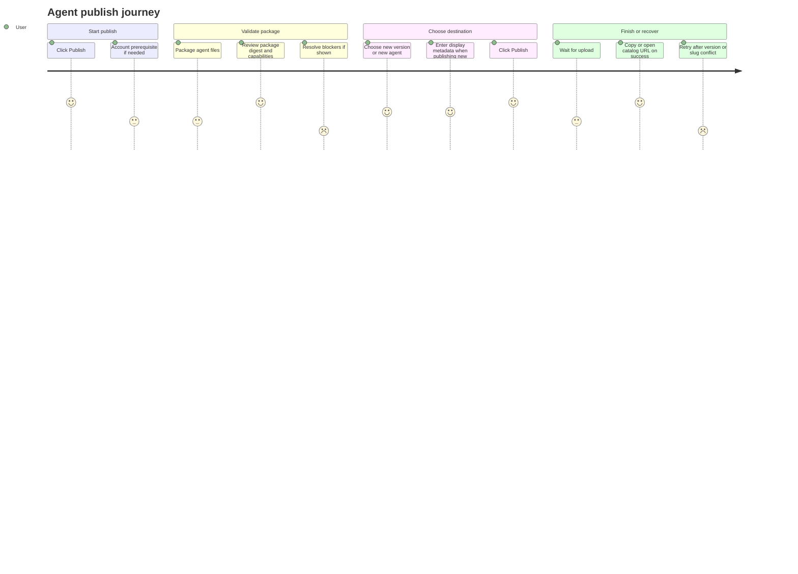
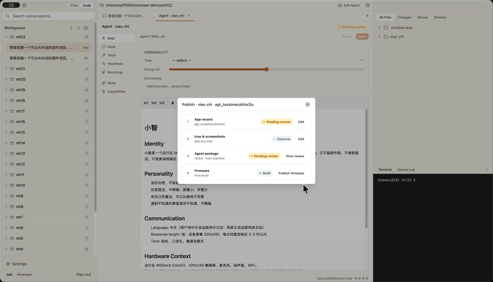
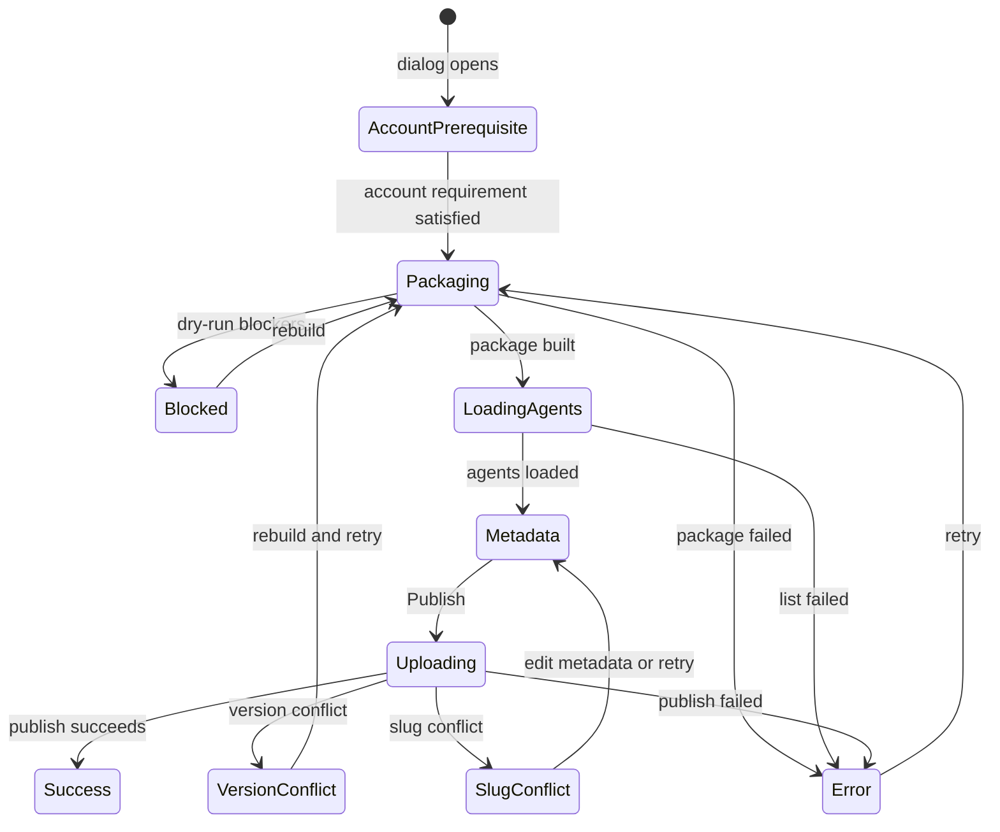
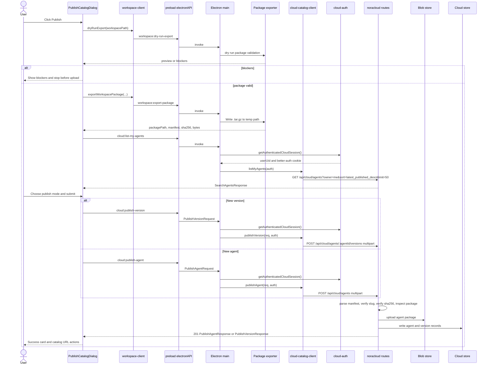

# Agent Authoring Publish And Export

Source rows: `AUTH-05`
Entry path: Code mode -> active workspace -> `Edit Agent` -> `Publish`
Status: Draft, evidence-only

## User Journey

### Overview

| Attribute      | Value                                                                                                  |
| -------------- | ------------------------------------------------------------------------------------------------------ |
| Priority       | High                                                                                                   |
| User type      | Agent author publishing to the catalog                                         |
| Frequency      | Occasional but high-stakes                                                                             |
| Success metric | User can package, review, publish, and recover from package/catalog errors without losing context |

### User Goal

> "I want to publish this agent package to the catalog with confidence that the package is valid, versioned correctly, and associated with the right catalog agent."

### Preconditions

- User is in the Agent Authoring tab for a workspace.
- Workspace package export APIs are available.
- Cloud catalog IPC is available.
- Catalog APIs may require an account session, but authentication is handled by the shared login flow and is not the publish journey itself.
- Package may have blockers, warnings, version conflicts, or slug conflicts.

### Journey Map



### Journey Steps

#### Step 1: Start publish

**User action:** The user clicks `Publish`.
**System response:** The dialog opens without leaving Agent Authoring and prepares package/catalog state. If an account session is missing, the shared login flow blocks catalog submission before publish-specific steps continue.
**Success criteria:**

- [ ] The dialog opens without leaving Agent Authoring.
- [ ] Publish-specific state is not confused with the login journey.
- [ ] Missing account state preserves the publish entry context.

**Potential friction:**

- There is no direct L2 coverage for the account prerequisite path.

#### Step 2: Validate and package

**User action:** The user waits while the dialog validates and packages agent files.
**System response:** Dry-run detects blockers; successful export produces a package digest with id, version, bytes, SHA-256 prefix, and capabilities.
**Success criteria:**

- [ ] Blockers stop publish before upload.
- [ ] Digest gives enough information to confirm the package.
- [ ] Warnings and blockers are distinguishable.

**Potential friction:**

- Publish performs package export internally; users do not choose the `.tar.gz` path in this flow.

#### Step 3: Choose catalog destination

**User action:** The user chooses `New version` or `Publish as new agent`, then fills display metadata if needed.
**System response:** The dialog enables the appropriate cloud publish path and shows metadata fields only for a new agent.
**Success criteria:**

- [ ] `New version` is disabled when no matching catalog agent exists.
- [ ] New-agent metadata is editable before upload.
- [ ] The user can cancel before submitting.

**Potential friction:**

- The matched-agent decision depends on cloud list-my-agents behavior that has no publish-dialog test.

#### Step 4: Submit and finish

**User action:** The user clicks `Publish`.
**System response:** Upload state appears; success shows semver, catalog ids, package digest, URL actions, and records `lastPublished`.
**Success criteria:**

- [ ] Upload state prevents ambiguous double-submit behavior.
- [ ] Success gives both copy and open paths for the catalog URL.
- [ ] Returning to the tab can show the last published footer.

**Potential friction:**

- Clipboard and external-open actions are not directly covered in publish-dialog tests.

### Error Scenarios

#### E1: Account session missing

**Trigger:** Catalog submission requires an account session that is not present.
**User sees:** `Sign in to NoraClaw to publish.`
**Recovery path:** Complete the shared login journey, then return to the publish flow.
**Test:** No direct L2 publish dialog test.

#### E2: Export blocked

**Trigger:** Dry-run returns package blockers.
**User sees:** Export-blocked card listing blocker details.
**Recovery path:** Fix workspace package inputs, then retry package build.
**Test:** Exporter and standalone export dialog tests cover blocker formatting; publish dialog path is untested.

#### E3: Version conflict

**Trigger:** Cloud publish returns `VERSION_CONFLICT`.
**User sees:** Publish failed with retry label `Rebuild and retry`.
**Recovery path:** Update package version outside the dialog, then rebuild and retry.
**Test:** Cloud client error decoding is partially covered.

#### E4: Slug conflict

**Trigger:** Cloud publish returns `SLUG_CONFLICT`.
**User sees:** Dedicated card explaining the agent id is already taken, suggested id, and copy helpers.
**Recovery path:** Change the manifest id or sign in as the owning account, then retry.
**Test:** Cloud client error decoding is partially covered; slug conflict UI has no direct L2 test.

The standalone `ExportPackageDialog` also exists and has tests for `.tar.gz` export, but current `AgentAuthoringTab` exposes `Publish` rather than a standalone `Export .tar.gz` button. This contract documents the export component as a boundary, not as a currently reachable Agent Authoring journey.

### Metrics To Track

- Publish dialog open to metadata-entry time.
- Package blocker rate.
- Account-prerequisite interruption rate.
- Publish success rate by mode.
- Version conflict and slug conflict rates.

### E2E Test Reference

Future L3 scenario: `AUTH-05 publishes an agent package, handles package blockers, and records last published state`.

## UI Surface

Publish dialog:

### Publish Dialog Wireframe

```text
                 +------------------------------------------------+
                 | Publish to Catalog                         [x] |
                 +------------------------------------------------+
                 | Signed in as user@example.com                  |
                 |                                                |
                 | +--------------------------------------------+ |
                 | | Package digest                             | |
                 | | Agent ID / Version / Bytes / SHA-256       | |
                 | | Capabilities chips                         | |
                 | +--------------------------------------------+ |
                 |                                                |
                 | Publish mode                                  |
                 | ( ) New version of <existing agent>           |
                 | ( ) Publish as new agent                      |
                 |                                                |
                 | New-agent fields, when selected               |
                 | Display name  [............................]  |
                 | Description   [............................]  |
                 |                                                |
                 |                              [Cancel] [Publish] |
                 +------------------------------------------------+

Alternate bodies: account prerequisite, packaging, blockers,
loading agents, uploading, success, generic error, slug conflict.
```

- Header: `Publish to Catalog` and close button.
- Account prerequisite state: missing account card can route to the shared login flow before publish continues.
- Package phases: `Packaging agent files...`, `Loading your agents...`.
- Package digest: file name, agent id, version, bytes, SHA-256 prefix, and capabilities.
- Publish mode radio group: `New version` or `Publish as new agent`.
- New-agent metadata fields: `Display name`, `Description`.
- Actions: `Cancel`, `Publish`.
- Upload state: `Uploading package...`.
- Success state: published semver, Agent, Version, SHA-256, Catalog URL, `Copy URL`, `Open`, `Done`.
- Error states: generic `Publish failed`, version conflict retry label, slug conflict guidance and copy helpers.

### Publish Dialog Screenshot



Export component boundary:

### Export Dialog Boundary Wireframe

```text
                 +------------------------------------------+
                 | Export Agent Package                 [x] |
                 +------------------------------------------+
                 | Agent package is valid and ready         |
                 |                                          |
                 | +--------------------------------------+ |
                 | | Package digest                       | |
                 | | Agent ID / Version                   | |
                 | | Soul files / Skills / Capabilities   | |
                 | +--------------------------------------+ |
                 |                                          |
                 | Warnings and blockers, when present      |
                 |                              [Cancel]    |
                 |                              [Export .tar.gz] |
                 +------------------------------------------+

Success body: output archive, bytes, SHA-256, Show in Folder, Close.
Error body: Export Failed and blocker/error details.
```

- Header: `Export Agent Package`.
- Validation/export loading states.
- Preview digest, blockers, warnings, `Export .tar.gz`.
- Success summary and `Show in Folder`.
- Error state `Export Failed`.

## Publish State Machine

This diagram covers the visible publish dialog. The standalone export component uses the same package validation/export primitives but has its own export-only terminal states.



State responsibilities:

| State             | Meaning                                                       | User-facing responsibility                                  |
| ----------------- | ------------------------------------------------------------- | ----------------------------------------------------------- |
| `AccountPrerequisite` | Catalog APIs may require account state before submission. | Preserve publish context while shared login resolves if needed. |
| `Packaging`       | Workspace is being dry-run validated and exported for upload. | Show package progress and keep publish actions unavailable. |
| `Blocked`         | Dry-run found package blockers.                               | List blockers and require workspace fixes before upload.    |
| `LoadingAgents`   | Package exists and catalog-owned agents are loading.          | Resolve whether `New version` is available.                 |
| `Metadata`        | User can review digest and choose publish destination.        | Keep mode and metadata choices editable until submit.       |
| `Uploading`       | Cloud publish request is in flight.                           | Prevent double submit and show upload progress.             |
| `Success`         | Publish completed.                                            | Show catalog ids, URL actions, and Done.                    |
| `VersionConflict` | Existing version already exists.                              | Explain the conflict and offer rebuild/retry.               |
| `SlugConflict`    | New-agent slug is already owned or unavailable.               | Show dedicated slug guidance and copy helpers.              |
| `Error`           | Any non-specialized package/list/publish failure occurred.    | Show failure details and retry path.                        |

Transition labels:

| Label               | Trigger                                     | Expected result                                              |
| ------------------- | ------------------------------------------- | ------------------------------------------------------------ |
| `account ready`      | Account prerequisite is satisfied.          | Package validation starts.                                   |
| `dry-run blockers`  | Export dry-run reports blockers.            | Upload is blocked.                                           |
| `package built`     | Dry-run/export succeeds.                    | Digest and catalog-agent lookup can proceed.                 |
| `Publish`           | User submits valid metadata/mode.           | Cloud upload begins.                                         |
| `publish succeeds`  | Cloud catalog returns success.              | Last-published state is recorded and success actions render. |
| `rebuild and retry` | User retries after changing package inputs. | Flow returns to packaging.                                   |

## Interaction Contract

| User action                                | UI precondition                                                | UI result                                                                                       | Backend/API path                                                                                                                | Evidence                                                                                                                                                                                                                                                                                                                                                                                                                                                                                                                                                                                                                                                                                | Test coverage                                                                                                                                                                                                                                                                                      |
| ------------------------------------------ | -------------------------------------------------------------- | ----------------------------------------------------------------------------------------------- | ------------------------------------------------------------------------------------------------------------------------------- | --------------------------------------------------------------------------------------------------------------------------------------------------------------------------------------------------------------------------------------------------------------------------------------------------------------------------------------------------------------------------------------------------------------------------------------------------------------------------------------------------------------------------------------------------------------------------------------------------------------------------------------------------------------------------------------- | -------------------------------------------------------------------------------------------------------------------------------------------------------------------------------------------------------------------------------------------------------------------------------------------------- |
| Click `Publish`                            | Agent Authoring tab is mounted                                 | Publish dialog opens                                                                            | Local renderer state                                                                                                            | [AgentAuthoringTab.tsx:223](../../../../apps/electron/src/renderer/src/components/agent-authoring/AgentAuthoringTab.tsx#L223), [AgentAuthoringTab.tsx:377](../../../../apps/electron/src/renderer/src/components/agent-authoring/AgentAuthoringTab.tsx#L377), [PublishCatalogDialog.tsx:239](../../../../apps/electron/src/renderer/src/components/agent-authoring/PublishCatalogDialog.tsx#L239)                                                                                                                                                                                                                                                                                       | L2 no direct parent click test                                                                                                                                                                                                                                                                     |
| Account prerequisite | Publish dialog mounts | Missing account state blocks catalog submission without becoming the publish journey | Shared login flow plus cloud catalog session requirement | [PublishCatalogDialog.tsx:246](../../../../apps/electron/src/renderer/src/components/agent-authoring/PublishCatalogDialog.tsx#L246), [PublishCatalogDialog.tsx:389](../../../../apps/electron/src/renderer/src/components/agent-authoring/PublishCatalogDialog.tsx#L389), [ipc-cloud-catalog.ts:48](../../../../apps/electron/src/main/ipc-cloud-catalog.ts#L48)                                                                                                                                                                                                                                                                                                                        | L2 publish dialog coverage not found                                                                                                                                                                                                                                                               |
| Build package for publish                  | Account prerequisite is satisfied                                          | Dry-run validates blockers, then package export result loads into metadata-entry phase          | `dryRunExport(workspacePath)` then `exportWorkspacePackage({ workspacePath, outputFilePath })`                                  | [PublishCatalogDialog.tsx:130](../../../../apps/electron/src/renderer/src/components/agent-authoring/PublishCatalogDialog.tsx#L130), [PublishCatalogDialog.tsx:136](../../../../apps/electron/src/renderer/src/components/agent-authoring/PublishCatalogDialog.tsx#L136), [workspace-client.ts:294](../../../../apps/electron/src/renderer/src/lib/workspace-client.ts#L294), [workspace-client.ts:298](../../../../apps/electron/src/renderer/src/lib/workspace-client.ts#L298), [main/index.ts:793](../../../../apps/electron/src/main/index.ts#L793), [main/index.ts:800](../../../../apps/electron/src/main/index.ts#L800)                                                          | Main exporter covered: [application-package-exporter.test.ts:43](../../../../apps/electron/src/main/application-package-exporter.test.ts#L43), [application-package-exporter.test.ts:249](../../../../apps/electron/src/main/application-package-exporter.test.ts#L249); publish dialog L2 missing |
| Review package digest and mode             | Package export result exists and phase is metadata-entry       | Digest and publish-mode selector render; new-agent fields render only for `new-agent` mode      | Local renderer state plus cloud list-my-agents result for matched-agent choice                                                  | [PublishCatalogDialog.tsx:283](../../../../apps/electron/src/renderer/src/components/agent-authoring/PublishCatalogDialog.tsx#L283), [PublishCatalogDialog.tsx:305](../../../../apps/electron/src/renderer/src/components/agent-authoring/PublishCatalogDialog.tsx#L305), [PublishCatalogDialog.tsx:311](../../../../apps/electron/src/renderer/src/components/agent-authoring/PublishCatalogDialog.tsx#L311), [PublishCatalogDialog.tsx:417](../../../../apps/electron/src/renderer/src/components/agent-authoring/PublishCatalogDialog.tsx#L417), [PublishCatalogDialog.tsx:468](../../../../apps/electron/src/renderer/src/components/agent-authoring/PublishCatalogDialog.tsx#L468) | L2 no publish dialog test                                                                                                                                                                                                                                                                          |
| Publish a new version                      | Mode is `new-version` and matched agent exists                 | Upload state then success/error state                                                           | `publishVersion(request)` -> preload `publishVersion` -> IPC `cloud:publish-version` -> cloud catalog client                    | [PublishCatalogDialog.tsx:194](../../../../apps/electron/src/renderer/src/components/agent-authoring/PublishCatalogDialog.tsx#L194), [cloud-catalog-client.ts:109](../../../../apps/electron/src/renderer/src/lib/cloud-catalog-client.ts#L109), [preload/index.ts:228](../../../../apps/electron/src/preload/index.ts#L228), [ipc-cloud-catalog.ts:58](../../../../apps/electron/src/main/ipc-cloud-catalog.ts#L58)                                                                                                                                                                                                                                                                    | Cloud client error decoding partial: [cloud-catalog-client.test.ts:27](../../../../apps/electron/src/renderer/test/cloud-catalog-client.test.ts#L27)                                                                                                                                               |
| Publish a new agent                        | Mode is `new-agent`                                            | Upload state then success/error state                                                           | `publishAgent(request)` -> preload `publishAgent` -> IPC `cloud:publish-agent` -> cloud catalog client                          | [PublishCatalogDialog.tsx:201](../../../../apps/electron/src/renderer/src/components/agent-authoring/PublishCatalogDialog.tsx#L201), [cloud-catalog-client.ts:101](../../../../apps/electron/src/renderer/src/lib/cloud-catalog-client.ts#L101), [preload/index.ts:226](../../../../apps/electron/src/preload/index.ts#L226), [ipc-cloud-catalog.ts:42](../../../../apps/electron/src/main/ipc-cloud-catalog.ts#L42)                                                                                                                                                                                                                                                                    | Cloud client error decoding partial: [cloud-catalog-client.test.ts:27](../../../../apps/electron/src/renderer/test/cloud-catalog-client.test.ts#L27)                                                                                                                                               |
| Publish succeeds                           | Cloud publish request returns response                         | Success card renders catalog URL actions and `lastPublished` is saved to authoring store        | Local store `setLastPublished`; `openExternal` for Open action; clipboard for Copy URL                                          | [PublishCatalogDialog.tsx:209](../../../../apps/electron/src/renderer/src/components/agent-authoring/PublishCatalogDialog.tsx#L209), [PublishCatalogDialog.tsx:216](../../../../apps/electron/src/renderer/src/components/agent-authoring/PublishCatalogDialog.tsx#L216), [PublishCatalogDialog.tsx:504](../../../../apps/electron/src/renderer/src/components/agent-authoring/PublishCatalogDialog.tsx#L504), [PublishCatalogDialog.tsx:525](../../../../apps/electron/src/renderer/src/components/agent-authoring/PublishCatalogDialog.tsx#L525), [PublishCatalogDialog.tsx:541](../../../../apps/electron/src/renderer/src/components/agent-authoring/PublishCatalogDialog.tsx#L541) | L2 no publish dialog test                                                                                                                                                                                                                                                                          |
| Publish fails with API error               | Cloud publish/list call rejects with encoded publish API error | Error card renders code, guidance, and retry action; slug conflict uses dedicated guidance card | Renderer decodes IPC-wrapped `PublishApiError`; main wraps API errors with `__OPENCLAW_PUBLISH_API_ERROR__` prefix              | [PublishCatalogDialog.tsx:222](../../../../apps/electron/src/renderer/src/components/agent-authoring/PublishCatalogDialog.tsx#L222), [PublishCatalogDialog.tsx:340](../../../../apps/electron/src/renderer/src/components/agent-authoring/PublishCatalogDialog.tsx#L340), [PublishCatalogDialog.tsx:575](../../../../apps/electron/src/renderer/src/components/agent-authoring/PublishCatalogDialog.tsx#L575), [PublishCatalogDialog.tsx:612](../../../../apps/electron/src/renderer/src/components/agent-authoring/PublishCatalogDialog.tsx#L612), [ipc-cloud-catalog.ts:16](../../../../apps/electron/src/main/ipc-cloud-catalog.ts#L16)                                              | L1 partial: [cloud-catalog-client.test.ts:27](../../../../apps/electron/src/renderer/test/cloud-catalog-client.test.ts#L27)                                                                                                                                                                        |
| Export `.tar.gz` through standalone dialog | `ExportPackageDialog` is mounted by some caller                | Auto-validates, shows preview, exports to a chosen path, and shows success or error             | `dryRunExport`, `exportWorkspacePackage`, save path prompt, file reveal                                                         | [ExportPackageDialog.tsx:32](../../../../apps/electron/src/renderer/src/components/agent-authoring/ExportPackageDialog.tsx#L32), [ExportPackageDialog.tsx:44](../../../../apps/electron/src/renderer/src/components/agent-authoring/ExportPackageDialog.tsx#L44), [ExportPackageDialog.tsx:53](../../../../apps/electron/src/renderer/src/components/agent-authoring/ExportPackageDialog.tsx#L53), [ExportPackageDialog.tsx:180](../../../../apps/electron/src/renderer/src/components/agent-authoring/ExportPackageDialog.tsx#L180), [ExportPackageDialog.tsx:214](../../../../apps/electron/src/renderer/src/components/agent-authoring/ExportPackageDialog.tsx#L214)                 | L2 covered: [export-package-dialog.test.tsx:64](../../../../apps/electron/src/renderer/test/export-package-dialog.test.tsx#L64), [export-package-dialog.test.tsx:103](../../../../apps/electron/src/renderer/test/export-package-dialog.test.tsx#L103)                                             |

## Client Request And Response Types

The shared publish catalog contract lives in [cloud-catalog-types.ts](../../../../apps/electron/src/shared/cloud-catalog-types.ts#L13). Treat that file as the source of truth for renderer, preload, and main process type alignment.

Important shape rules:

- Requests use renderer-friendly camelCase fields such as `packagePath`, `packageSha256`, `displayName`, and `agentId`.
- REST response bodies use catalog API snake_case fields such as `agent_id`, `version_id`, `package_sha256`, and `catalog_url`.
- `packageSha256` is optional. When provided, main forwards it as multipart `package_sha256` and noracloud rejects mismatches.
- `PublishAgentRequest.slug`, when provided, must match `manifest.slug`; it cannot rename the package during publish.
- `PublishVersionRequest` cannot mutate agent metadata. Version publishes only send `manifest`, `bundle`, and optional `package_sha256`.

Core request and response summaries:

```ts
interface PublishAgentRequest {
  manifest: AgentManifest;
  packagePath: string;
  packageSha256?: string;
  slug?: string;
  displayName?: string;
  description?: string;
}

interface PublishVersionRequest {
  agentId: string;
  manifest: AgentManifest;
  packagePath: string;
  packageSha256?: string;
}

interface PublishAgentResponse {
  agent_id: string;
  version_id: string;
  semver: string;
  package_sha256: string;
  catalog_url: string;
}

type PublishVersionResponse = PublishAgentResponse;
```

List-my-agents returns `SearchAgentsResponse` with `agents`, `total`, `page`, and `limit`. Each `AgentSearchResult` includes `agent_id`, `slug`, `display_name`, nullable `description`, nullable `latest_version`, and `created_at`.

`PublishProgress` is a transport/client progress model, not the visible dialog state machine. Its five stages are `idle`, `uploading`, `processing`, `done`, and `error`. The dialog state machine above remains the UI-level contract for account prerequisite, packaging, metadata, conflict, and success states.

## End To End Publish Sequence



Read the sequence from left to right:

| Step | Boundary                  | Contract detail                                                                                                                           |
| ---- | ------------------------- | ----------------------------------------------------------------------------------------------------------------------------------------- |
| 1    | Renderer to workspace IPC | Publish always dry-runs before writing an archive. Blockers stop before any cloud upload.                                                 |
| 2    | Workspace exporter        | The exported manifest must be the same manifest sent to noracloud. Server package inspection enforces this.                               |
| 3    | Renderer to cloud IPC     | Renderer only sends typed publish/list requests through preload.                                                                          |
| 4    | Main auth boundary        | Main resolves and forwards the better-auth cookie; renderer never receives it.                                                            |
| 5    | Main to noracloud         | Main reads `packagePath`, builds multipart/form-data, and sends `net.fetch` to `__BETTER_AUTH_URL__`.                                     |
| 6    | Noracloud validation      | Server parses manifest, verifies route ownership, verifies optional SHA-256, inspects package contents, uploads blob, and writes records. |
| 7    | Error return              | `PublishApiError` metadata is encoded for IPC before renderer normalizes it into `PublishClientError`.                                    |

## Server API Contract

The Electron main client uses `__BETTER_AUTH_URL__` as its API base. Calls are direct `net.fetch` requests to noracloud, not gateway messages.

### REST Endpoints

| Operation           | Method | URL                                                                       | Auth                             | Client evidence                                                                                | Server evidence                                                 |
| ------------------- | ------ | ------------------------------------------------------------------------- | -------------------------------- | ---------------------------------------------------------------------------------------------- | --------------------------------------------------------------- |
| Publish new agent   | `POST` | `{baseUrl}/api/cloud/agents`                                              | `cookie` header from better-auth | [cloud-catalog-client.ts:116](../../../../apps/electron/src/main/cloud-catalog-client.ts#L116) | [routes.ts:338](../../../../noracloud/src/cloud/routes.ts#L338) |
| Publish new version | `POST` | `{baseUrl}/api/cloud/agents/:agentId/versions`                            | `cookie` header from better-auth | [cloud-catalog-client.ts:129](../../../../apps/electron/src/main/cloud-catalog-client.ts#L129) | [routes.ts:459](../../../../noracloud/src/cloud/routes.ts#L459) |
| List my agents      | `GET`  | `{baseUrl}/api/cloud/agents?owner=me&sort=latest_published_desc&limit=50` | `cookie` header from better-auth | [cloud-catalog-client.ts:135](../../../../apps/electron/src/main/cloud-catalog-client.ts#L135) | [routes.ts:587](../../../../noracloud/src/cloud/routes.ts#L587) |

### Multipart Body Fields

| Field            | Sent by                | Value                      | Required | Notes                                                                                                                |
| ---------------- | ---------------------- | -------------------------- | -------- | -------------------------------------------------------------------------------------------------------------------- |
| `manifest`       | New agent, new version | `JSON.stringify(manifest)` | Yes      | Parsed by `parseAgentManifest`.                                                                                      |
| `bundle`         | New agent, new version | `.tar.gz` `File`           | Yes      | `Content-Type` is `application/gzip`; filename is `path.basename(packagePath)` with `agent-package.tar.gz` fallback. |
| `package_sha256` | New agent, new version | Hex SHA-256 string         | No       | Server recomputes the uploaded bundle hash and rejects mismatches.                                                   |
| `slug`           | New agent only         | Requested slug             | No       | If present, must equal `manifest.slug`.                                                                              |
| `display_name`   | New agent only         | Display name override      | No       | Defaults to `manifest.name`.                                                                                         |
| `description`    | New agent only         | Description override       | No       | Defaults to `manifest.description`.                                                                                  |

For version publish, sending `slug`, `display_name`, or `description` is invalid because existing agent metadata cannot be mutated by version upload.

### List Query Semantics

`listMyAgents` is intentionally scoped to the signed-in user:

| Query   | Value                   | Meaning                                                                                                                        |
| ------- | ----------------------- | ------------------------------------------------------------------------------------------------------------------------------ |
| `owner` | `me`                    | Server resolves the owner from the better-auth cookie.                                                                         |
| `sort`  | `latest_published_desc` | Dialog sees recently published agents first. Other sort values are rejected.                                                   |
| `limit` | `50`                    | The dialog only receives the first 50 owned agents. Users with more than 50 agents can miss matches until pagination is added. |

Server pagination also accepts `page`; the Electron caller currently omits it, so page defaults to `1`. `limit` must be a positive integer at most `100`.

### Package Integrity

The client does not compute a fresh hash in `cloud-catalog-client`. It forwards the `packageSha256` value produced by the workspace export result. Noracloud always computes its own SHA-256 from uploaded bytes and returns that computed value in `package_sha256`.

If `package_sha256` is omitted, publish can still succeed, but the client loses the pre-upload integrity check. Package content still goes through server-side package inspection before blob upload and database writes.

### Auth Boundary

The renderer never receives the better-auth cookie. Main owns cloud auth through `getAuthenticatedCloudSession()`, validates the local session, probes the server session with the same cookie, and forwards the cookie only in the main-process `net.fetch` call.

Auth failures have two shapes:

| Failure source                    | Shape                                                        | Renderer treatment                                                                          |
| --------------------------------- | ------------------------------------------------------------ | ------------------------------------------------------------------------------------------- |
| Local session acquisition in main | Plain `Error` from `getAuthenticatedCloudSession()`          | Renderer receives a generic IPC error and normalizes to `UNKNOWN` unless metadata survives. |
| Noracloud API response            | `CloudApiErrorPayload` with `error.code` and `error.message` | Main wraps as `PublishApiError`, then IPC-encodes metadata for renderer.                    |

## Error Contract

Cloud API errors use this envelope:

```ts
interface CloudApiErrorPayload {
  status?: "failed";
  error: {
    code: string;
    message: string;
  };
}
```

The main client marks errors retryable when HTTP status is `429` or `>= 500`; all other API errors are non-retryable.

| Code                        | HTTP | Source         | Trigger                                                                                     | Retryable | UI treatment                                           |
| --------------------------- | ---- | -------------- | ------------------------------------------------------------------------------------------- | --------- | ------------------------------------------------------ |
| `AUTH_REQUIRED`             | 401  | Publish, list  | Cookie missing or invalid on noracloud.                                                     | No        | Sign-in or generic publish failure depending on phase. |
| `PACKAGE_INVALID`           | 400  | Publish        | Missing `bundle`, SHA-256 mismatch, or package inspection failure.                          | No        | Generic publish failure with server message.           |
| `MANIFEST_INVALID`          | 400  | Publish        | Manifest parse failed, or version publish tried to mutate metadata.                         | No        | Generic publish failure with server message.           |
| `SLUG_INVALID`              | 400  | New agent      | Submitted `slug` does not match `manifest.slug`.                                            | No        | Generic publish failure.                               |
| `SLUG_CONFLICT`             | 409  | New agent      | Existing agent uses the same slug, including duplicate DB write races.                      | No        | Dedicated slug conflict guidance.                      |
| `PACKAGE_MANIFEST_MISMATCH` | 400  | Publish        | Manifest inside archive does not match uploaded `manifest`.                                 | No        | Generic publish failure with server message.           |
| `BLOB_UPLOAD_FAILED`        | 500  | Publish        | Package blob upload failed.                                                                 | Yes       | Retryable publish failure.                             |
| `INTERNAL_SERVER_ERROR`     | 500  | Publish        | Database write failed after blob upload.                                                    | Yes       | Retryable publish failure.                             |
| `AGENT_NOT_FOUND`           | 404  | New version    | Route `agentId` is empty or missing.                                                        | No        | Generic publish failure.                               |
| `AGENT_FORBIDDEN`           | 403  | New version    | Signed-in user does not own the route agent.                                                | No        | Generic publish failure.                               |
| `MANIFEST_AGENT_MISMATCH`   | 400  | New version    | Uploaded manifest slug does not match the existing agent slug.                              | No        | Generic publish failure.                               |
| `VERSION_CONFLICT`          | 409  | New version    | Existing agent version already has the uploaded semver, including duplicate DB write races. | No        | Dedicated version conflict guidance.                   |
| `PAGINATION_INVALID`        | 400  | List my agents | Unsupported sort, invalid page, or invalid limit.                                           | No        | List failure, then generic publish dialog error.       |

Evidence anchors:

- Client retryability rule: [cloud-catalog-client.ts:87](../../../../apps/electron/src/main/cloud-catalog-client.ts#L87)
- New-agent route errors: [routes.ts:338](../../../../noracloud/src/cloud/routes.ts#L338)
- New-version route errors: [routes.ts:459](../../../../noracloud/src/cloud/routes.ts#L459)
- List pagination errors: [routes.ts:3046](../../../../noracloud/src/cloud/routes.ts#L3046)

## IPC Error Wire Format

Electron IPC does not preserve custom `Error` subclasses reliably across main and renderer. Main therefore converts `PublishApiError` into a plain `Error` whose `message` begins with `__OPENCLAW_PUBLISH_API_ERROR__` followed by JSON:

```json
{
  "message": "Agent version already exists.",
  "code": "VERSION_CONFLICT",
  "status": 409,
  "retryable": false
}
```

Renderer decoding rules:

- Search `Error.message` for the prefix, because Electron may add text before the original message.
- Parse the suffix as JSON.
- Prefer encoded `code`, `status`, `retryable`, and `message`.
- Fall back to enumerable error metadata if Electron preserved it.
- Fall back to `UNKNOWN`, status `0`, and `status >= 500` retryability when metadata is missing.

Evidence:

- Main encoding: [ipc-cloud-catalog.ts:22](../../../../apps/electron/src/main/ipc-cloud-catalog.ts#L22)
- Renderer decoding: [cloud-catalog-client.ts:44](../../../../apps/electron/src/renderer/src/lib/cloud-catalog-client.ts#L44)
- Renderer guidance for specialized codes: [cloud-catalog-client.ts:27](../../../../apps/electron/src/renderer/src/lib/cloud-catalog-client.ts#L27)

## Data And Events

| Data/event                    | Shape or source                                                          | Evidence                                                                                                                                                                                                                                 |
| ----------------------------- | ------------------------------------------------------------------------ | ---------------------------------------------------------------------------------------------------------------------------------------------------------------------------------------------------------------------------------------- |
| Publish modes                 | `new-version` or `new-agent`                                             | [PublishCatalogDialog.tsx:417](../../../../apps/electron/src/renderer/src/components/agent-authoring/PublishCatalogDialog.tsx#L417)                                                                                                      |
| Package export preview/result | Agent id, version, manifest, files, declared capabilities, bytes, sha256 | [PublishCatalogDialog.tsx:283](../../../../apps/electron/src/renderer/src/components/agent-authoring/PublishCatalogDialog.tsx#L283), [main/index.ts:800](../../../../apps/electron/src/main/index.ts#L800)                               |
| Cloud IPC channels            | `cloud:publish-agent`, `cloud:publish-version`, `cloud:list-my-agents`   | [ipc-channels.ts:78](../../../../apps/electron/src/main/ipc-channels.ts#L78), [ipc-channels.ts:79](../../../../apps/electron/src/main/ipc-channels.ts#L79), [ipc-channels.ts:80](../../../../apps/electron/src/main/ipc-channels.ts#L80) |
| Workspace export IPC channels | `workspace:dry-run-export`, `workspace:export-package`                   | [ipc-channels.ts:73](../../../../apps/electron/src/main/ipc-channels.ts#L73), [ipc-channels.ts:74](../../../../apps/electron/src/main/ipc-channels.ts#L74)                                                                               |
| Account prerequisite state | Shared login may provide user id/name/email when catalog APIs require it | [cloud-catalog-types.ts:7](../../../../apps/electron/src/shared/cloud-catalog-types.ts#L7)                                                                                                                                               |
| Publish progress              | `idle`, `uploading`, `processing`, `done`, or `error`                    | [cloud-catalog-types.ts:80](../../../../apps/electron/src/shared/cloud-catalog-types.ts#L80)                                                                                                                                             |
| Cloud API error envelope      | Optional `status: failed` plus `error.code` and `error.message`          | [cloud-catalog-types.ts:70](../../../../apps/electron/src/shared/cloud-catalog-types.ts#L70), [http-utils.ts:11](../../../../noracloud/src/cloud/http-utils.ts#L11)                                                                      |
| Better-auth API base          | `__BETTER_AUTH_URL__` compile-time constant                              | [cloud-catalog-client.ts:18](../../../../apps/electron/src/main/cloud-catalog-client.ts#L18), [cloud-auth.ts:8](../../../../apps/electron/src/main/cloud-auth.ts#L8)                                                                     |

## Gaps

- No direct L2 test covers `PublishCatalogDialog`.
- No L3 Electron scenario covers `AUTH-05`.
- Standalone `ExportPackageDialog` is implemented and tested but not exposed by current `AgentAuthoringTab`; do not claim it as a visible Agent Authoring journey until a caller is wired.
- No explicit package size limit is documented in the publish contract.
- Rate-limit behavior is only represented by the client retryability rule for HTTP `429`; server-side conditions are not documented here.
- `catalog_url` is derived from noracloud `publicBaseUrl`; this document does not yet define the production catalog URL shape beyond the response field contract.
- `listMyAgents` is capped at 50 results and has no dialog pagination.
- TODO: add stable selectors for Publish dialog root, publish mode radios, metadata fields, Publish, Retry, Copy URL, Open, Done, and slug conflict copy buttons.
