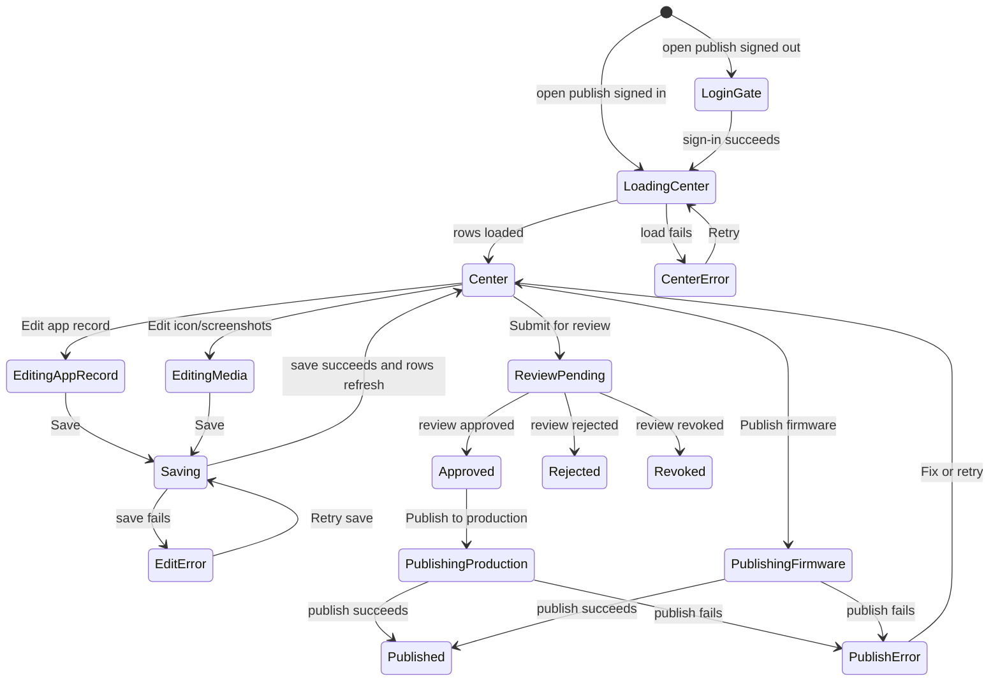

# Agent Authoring Unified Publish Center

Source rows: `AUTH-05`
Inventory source: `electron-user-journeys-hierarchy-v2/user-journey-inventory.md`, Journey 09
Entry path: Code mode -> active workspace -> `Edit Agent` -> `Publish`
Status: Draft, journey-aligned

## User Journey

### Overview

| Attribute | Value |
| --------- | ----- |
| Priority | High |
| User type | Signed-in or signing-in agent author preparing catalog, package, and firmware release state |
| Frequency | Occasional but high-stakes |
| Success metric | User can see every publish prerequisite, review status, production action, and firmware action in one place without losing authoring context |

### User Goal

> "I want to know whether my app record, media, agent package, and firmware are ready, then submit review or publish the approved parts from the same place."

### Preconditions

- User is in the Agent Authoring tab for a workspace.
- The workspace resolves to an agent/app package source.
- Cloud catalog auth may be signed in or signed out.
- App record, icon/screenshots, package review, and firmware can each have independent state.

### Journey Steps

#### Step 1: Open Publish from Agent Authoring

**User action:** The user clicks `Publish` from the Agent Authoring header or re-enters from a publish status row.
**System response:** The app opens the publish center as a modal over the still-visible Agent Authoring tab.
**Visible state:** The background editor remains in place; the modal title includes the agent display name or id.

#### Step 2: Resolve login gate

**User action:** If signed out, the user starts sign-in and returns to the app.
**System response:** Publishing does not submit while signed out. After auth succeeds, the publish center continues in place.
**Visible state:** The signed-out card is replaced by the publish center rows.

#### Step 3: Review publish center rows

**User action:** The user scans the four publish rows.
**System response:** Each row carries its own status and action.

| Row | Visible purpose | Common states and actions |
| --- | --------------- | ------------------------- |
| App record | Catalog identity and metadata for the app/agent listing. | Draft, submitted, approved, rejected, revoked; `Edit`; submit/review state. |
| Icon & screenshots | Optional listing media. | Optional, missing, ready, uploaded; `Edit` / add any time. |
| Agent package | Versioned package built from the current manifest/workspace. | Draft, approved, rejected, versioned; `Publish to production` after approval. |
| Firmware | Firmware artifact built from device/runtime output. | Draft, missing build, ready, uploading, published, failed; `Publish firmware` when ready. |

#### Step 4: Edit app info or media

**User action:** The user clicks `Edit` on App record or Icon & screenshots.
**System response:** The modal switches to an edit form for display name, description, icon, and screenshots, or opens the relevant edit surface.
**Visible state:** Unsaved edits keep Save enabled; saving disables the action and returns to the center after success. Failure preserves the draft and shows retryable error copy.

#### Step 5: Submit and review

**User action:** The user submits App record or Agent package for review, then later returns after review.
**System response:** The row moves from draft/ready to pending/in review, then to approved, rejected, or revoked when the review result is known.
**Visible state:** After approval, the Agent Authoring header can show an `Approved` badge, and the publish center row shows `Approved` with production actions where applicable.

#### Step 6: Publish production package or firmware

**User action:** The user clicks `Publish to production` for an approved agent package, or `Publish firmware` for a ready firmware build.
**System response:** The row enters uploading/publishing, then success or failure.
**Visible state:** Success refreshes latest/available state and last-published information; failure stays on the row with retry.

### Error Scenarios

| Scenario | Trigger | User sees | Recovery path |
| -------- | ------- | --------- | ------------- |
| Signed out | Publish center opens without account session. | Login gate instead of submit controls. | Sign in and return to the publish center. |
| App record rejected or revoked | Catalog review returns a negative state. | Rejected/revoked badge and disabled production path. | Edit app info, resubmit, or follow review guidance. |
| Missing media | Icon/screenshots are absent. | Optional or missing media row depending on requirement. | Add media or continue if optional. |
| Package not approved | Package row is draft/pending/rejected. | Production publish action unavailable. | Submit/review, wait, or rebuild and resubmit. |
| Firmware not ready | No build output, incomplete metadata, or invalid version/channel. | Draft/missing state and disabled publish. | Build firmware or complete metadata, then retry. |
| Upload/publish failure | Network, auth, validation, or backend failure. | Error state on the affected row. | Retry without leaving the publish center after fixing the cause. |

### E2E Test Reference

Future L3 scenario: `AUTH-05 opens unified publish center, edits app info, observes approved package state, and publishes package or firmware when available`.

## UI Surface

The current publish center is a compact modal over the Agent Authoring tab.

```text
----------------------------------------------------------+
| Publish · xiao-zhi · agt_tozatmarubfxs2iu           [x] |
+----------------------------------------------------------+
| 1  App record                 [Approved]        [Edit]   |
|    agt_tozatmarubfxs2iu                              |
+----------------------------------------------------------+
| 2  Icon & screenshots         [Optional]        [Edit]   |
|    add any time                                      |
+----------------------------------------------------------+
| 3  Agent package              [Approved]  [Publish to production] |
|    v0.9.0 · from manifest                         |
+----------------------------------------------------------+
| 4  Firmware                   [Draft]     [Publish firmware]       |
|    from build                                       |
+----------------------------------------------------------+
```

Primary visible elements:

- Modal title: `Publish · <agent-name> · <agent-id>`.
- Numbered rows for App record, Icon & screenshots, Agent package, Firmware.
- Row badges: `Draft`, `Optional`, `Approved`, plus pending/rejected/revoked/failed states where returned by review or publish APIs.
- Row actions: `Edit`, submit/review actions, `Publish to production`, `Publish firmware`.
- Header-level authoring state after review: an `Approved` badge can appear near the Agent Authoring save controls.
- The right file tree, bottom terminal/log area, and Agent Authoring editor remain visible behind the modal.

### Review-Approved State

After review approval, the user can see the approved status in two places:

- The Agent Authoring header shows an `Approved` badge while the user remains in the agent tab.
- Opening Publish shows App record and Agent package rows marked `Approved`; Firmware can still remain `Draft`.

This matters because review approval is not the same as every publish artifact being complete. The contract should keep package approval, production publish, media, and firmware readiness visually separate.

### Export Component Boundary

The standalone export package component remains a lower-level package boundary. It can validate/build a package and show blockers, warnings, digest, success, and show-in-folder states. It is not the primary Journey 09 surface unless a separate UI path exposes standalone `.tar.gz` export again.

## Publish Center State Machine



State responsibilities:

| State | Meaning | User-facing responsibility |
| ----- | ------- | -------------------------- |
| `LoginGate` | Account session is required before publish rows can submit. | Show sign-in path and preserve the publish entry context. |
| `LoadingCenter` | Publish center is loading row data and review state. | Avoid stale row status; keep modal context visible. |
| `Center` | Row status is loaded and the user can choose the next action. | Show each row with independent badge, subcopy, and action. |
| `EditingAppRecord` / `EditingMedia` | User is changing listing content. | Preserve draft edits and make save/cancel state clear. |
| `ReviewPending` | Review submission was accepted and is waiting. | Disable incompatible production actions until review resolves. |
| `Approved` | A row has passed review. | Enable the next action only for the approved artifact. |
| `Rejected` / `Revoked` | Review returned a negative state. | Explain why production publish is blocked and route to edit/resubmit. |
| `PublishingProduction` / `PublishingFirmware` | A production or firmware publish request is in flight. | Prevent duplicate submit and show progress on the affected row. |
| `Published` | Publish completed. | Refresh row status and last-published information. |
| `CenterError` / `EditError` / `PublishError` | Loading, saving, or publishing failed. | Keep the user in context with a retry path. |

## Interaction Contract

| User action | UI precondition | UI result | Backend/API path | Evidence | Test coverage |
| ----------- | --------------- | --------- | ---------------- | -------- | ------------- |
| Click `Publish` | Agent Authoring tab is mounted. | Publish center opens over the editor. | Local renderer state and catalog auth boundary. | `electron-user-journeys-hierarchy-v2/09-catalog-review/catalog-review-publish.pm.md`; latest review screenshots. Legacy entry anchors: `AgentAuthoringTab.tsx`, `PublishCatalogDialog.tsx`. | L3 planned; existing docs had no direct parent-click L2 coverage. |
| Resolve auth | Publish center opens while signed out or signed in. | Signed-out gate appears, or rows load when authenticated. | NoraClaw auth flow and cloud catalog session. | Journey 03 and Journey 09 inventory sections. | L3 planned for login-gated publish. |
| Edit App record | App record row visible. | App info edit state opens; unsaved/saving/error states are local to the edit surface. | Catalog app record save/update boundary. | User-provided app-info/publish flow video and Journey 09. | No focused test. |
| Edit Icon & screenshots | Media row visible. | Media edit/upload state opens; row refreshes after save. | Catalog media upload/update boundary. | Journey 09. | No focused test. |
| Submit review | App record or Agent package is ready/draft. | Row changes to pending/in-review, later approved/rejected/revoked. | Catalog review submission boundary. | Latest review-approved screenshot: App record and Agent package are `Approved`. | No focused test. |
| Publish production package | Agent package row is approved. | Row enters publish progress; success refreshes status, failure stays retryable. | Catalog production publish boundary. | Journey 09. | No focused test. |
| Publish firmware | Firmware row has valid build/metadata. | Row enters firmware publishing progress; success/failure updates only Firmware row. | Firmware publish boundary. | Journey 09; Firmware Publish is merged into this row. | No focused test. |

## Data And Events

- Row model: `App record`, `Icon & screenshots`, `Agent package`, `Firmware`.
- Row statuses: draft/ready/missing/pending/in review/approved/rejected/revoked/optional/publishing/published/failed, as returned by catalog or firmware boundaries.
- Production action availability depends on row-specific readiness; one approved row does not imply every row is publishable.
- Account state comes from the shared login/auth flow documented in `main-window/main-window-runtime.md`.

## Gaps

- The current checkout contains docs and screenshots, not the Electron source tree, so updated source line anchors for the latest publish center components cannot be verified here.
- Screenshot assets now include the current unified publish center, app-info edit state, review-pending state, and firmware publish form. Add focused result-state screenshots for the approved header, successful firmware publish, and row-level failure recovery when those captures are available.
- Add L3 coverage for login-gated publish, app info/media editing, approved package row, production publish, and firmware row readiness.
