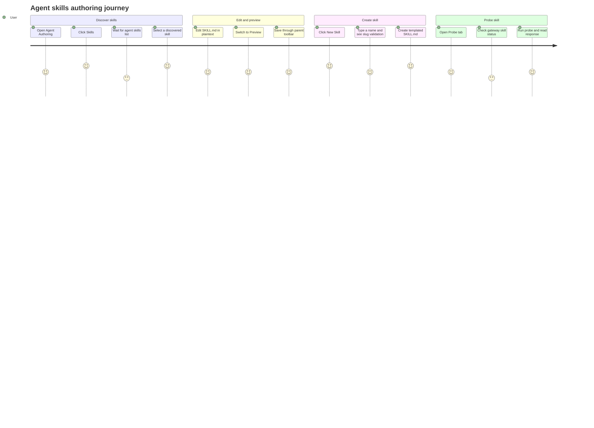

# Agent Authoring Skills

Source rows: `AUTH-03`
Entry path: Code mode -> active workspace -> `Edit Agent` -> `Skills`
Status: Draft, evidence-only

## User Journey

### Overview

| Attribute      | Value                                                                                                |
| -------------- | ---------------------------------------------------------------------------------------------------- |
| Priority       | High                                                                                                 |
| User type      | Agent developer authoring or validating skills                                                       |
| Frequency      | Frequent while extending an agent                                                                    |
| Success metric | User can discover, create, edit, preview, and probe skills without losing the selected skill context |

### User Goal

> "I want to manage my agent skills from the IDE, check their source, and verify the running gateway can see and use them."

### Preconditions

- User is in the Agent Authoring tab for a workspace.
- Workspace file tree IPC can list `agent/skills`.
- Workspace file read/write IPC can read and create `SKILL.md`.
- Probe usage requires a deployed project gateway; unavailable gateway states are part of the journey.

### Journey Map



### Journey Steps

#### Step 1: Discover skills

**User action:** The user clicks `Skills`.
**System response:** The section lists directories under `agent/skills`, reads candidate `SKILL.md` files, and selects the first readable skill.
**Success criteria:**

- [ ] Missing skills directory becomes an empty state, not a hard error.
- [ ] Skill titles and slugs are visible.
- [ ] Directories without `SKILL.md` are marked clearly.

**Potential friction:**

- A missing `SKILL.md` entry is visible but has no direct create/fix button for that directory.

#### Step 2: Edit or preview a skill

**User action:** The user selects a skill, edits the `Edit` tab, or switches to `Preview`.
**System response:** `MarkdownFileEditor` loads the selected `SKILL.md` in plaintext mode; preview renders Markdown with leading frontmatter hidden.
**Success criteria:**

- [ ] The selected skill path is lifted to the parent tab so Save/Revert target the right file.
- [ ] Switching skills updates the editor target.
- [ ] Preview does not mutate source content.

**Potential friction:**

- Parent Save/Revert controls are outside the Skills detail pane, so users must connect the status bar/header controls to skill editing.

#### Step 3: Create a skill

**User action:** The user clicks `New Skill`, enters a name, optionally enters a description, then clicks `Create`.
**System response:** The dialog normalizes and validates the slug, previews the target path, writes a templated `SKILL.md`, closes, reloads the list, and selects the new skill.
**Success criteria:**

- [ ] Invalid and duplicate slugs disable Create.
- [ ] The target path is visible before creation.
- [ ] Write failures stay in the dialog with the user's inputs intact.

**Potential friction:**

- Escape closes the dialog only when not submitting; no direct test asserts that keyboard recovery.

#### Step 4: Probe the skill

**User action:** The user opens `Probe`, enters a probe prompt, and runs it.
**System response:** The probe panel reports deployed-gateway state, selected-skill visibility, assistant response, tool calls, or probe errors.
**Success criteria:**

- [ ] Not-deployed state gives a clear deployment hint.
- [ ] Missing selected skill is visible.
- [ ] Probe errors do not obscure the panel.

**Potential friction:**

- Probe depends on a running project gateway, so the same skill can feel broken when the workspace deployment state is stale.

### Error Scenarios

#### E1: Skills directory missing

**Trigger:** `agent/skills` cannot be listed because it does not exist.
**User sees:** Empty state instead of an exception.
**Recovery path:** Click `New Skill` to create the first skill.
**Test:** `apps/electron/src/renderer/test/skills-section.test.tsx`.

#### E2: Duplicate or invalid skill slug

**Trigger:** User enters a reserved, malformed, too-short, too-long, or duplicate slug.
**User sees:** Inline validation and disabled `Create`.
**Recovery path:** Edit the name until validation clears.
**Test:** `apps/electron/src/renderer/test/new-skill-dialog.test.tsx` and `apps/electron/src/renderer/test/skill-template.test.ts`.

#### E3: Gateway unavailable for probe

**Trigger:** Probe tab cannot reach the deployed project gateway.
**User sees:** Deployment hint or probe error.
**Recovery path:** Deploy the project gateway, then return to the Probe tab and retry.
**Test:** `apps/electron/src/renderer/test/skill-test-panel.test.tsx`.

### Metrics To Track

- Time to load skill list.
- New Skill validation failure rate.
- Skill create success/failure rate.
- Probe success, missing-skill, and gateway-unavailable rates.

### E2E Test Reference

Future L3 scenario: `AUTH-03 creates a new skill, edits SKILL.md, previews it, and opens Probe`.

## UI Surface

### Wireframe

```text
+--------------------------------------------------------------------------------+
| <N> skills / No skills                                      [New Skill] [Refresh] |
+----------------------+---------------------------------------------------------+
| Skill list            | [Edit] [Preview] [Probe]            agent/skills/x/SKILL.md |
| + alpha               +---------------------------------------------------------+
| |  Alpha title        |                                                         |
| |  alpha              |  Edit: plaintext SKILL.md editor                         |
| + beta                |                                                         |
| |  missing SKILL.md   |  Preview: rendered Markdown                              |
|                       |                                                         |
|                       |  Probe: gateway status, prompt, Run Probe, response      |
+----------------------+---------------------------------------------------------+
| New Skill dialog overlays this surface: Name, Description, target path, Create |
+--------------------------------------------------------------------------------+
```

- Section header: `No skills` or `<N> skill(s)`.
- Header actions: `New Skill` and `Refresh`.
- Empty/loading state: `Loading skills...` or `No skills yet. Click New Skill to create one.`
- Skill list with title, slug, and `missing SKILL.md` marker.
- Detail empty states: `Select a skill to view its SKILL.md` and `<slug>/SKILL.md is missing.`
- Detail tabs: `Edit`, `Preview`, `Probe`.
- New Skill dialog: name input, slug preview, optional description, target file preview, validation errors, `Cancel`, `Create`, and submit error.
- Probe panel: gateway deployment hints, skill load status, prompt, Run Probe, assistant response, tool calls, and errors.

## Interaction Contract

| User action                      | UI precondition                                                | UI result                                                                                                         | Backend/API path                                                                                                    | Evidence                                                                                                                                                                                                                                                                                                                                                                                                                                                                                                                                                                                                              | Test coverage                                                                                                                                                                                                                                                                                                                                     |
| -------------------------------- | -------------------------------------------------------------- | ----------------------------------------------------------------------------------------------------------------- | ------------------------------------------------------------------------------------------------------------------- | --------------------------------------------------------------------------------------------------------------------------------------------------------------------------------------------------------------------------------------------------------------------------------------------------------------------------------------------------------------------------------------------------------------------------------------------------------------------------------------------------------------------------------------------------------------------------------------------------------------------- | ------------------------------------------------------------------------------------------------------------------------------------------------------------------------------------------------------------------------------------------------------------------------------------------------------------------------------------------------- |
| Open Skills section              | Agent Authoring tab is mounted and user clicks `Skills`        | Skills section loads `agent/skills` and selects the first skill with a `SKILL.md` when available                  | `listWorkspaceTree(workspacePath, 'agent/skills')`; per directory `readWorkspaceFile` against `SKILL.md` candidates | [AgentAuthoringTab.tsx:313](../../../../apps/electron/src/renderer/src/components/agent-authoring/AgentAuthoringTab.tsx#L313), [SkillsSection.tsx:40](../../../../apps/electron/src/renderer/src/components/agent-authoring/SkillsSection.tsx#L40), [SkillsSection.tsx:47](../../../../apps/electron/src/renderer/src/components/agent-authoring/SkillsSection.tsx#L47), [SkillsSection.tsx:81](../../../../apps/electron/src/renderer/src/components/agent-authoring/SkillsSection.tsx#L81)                                                                                                                          | L2 covered: [skills-section.test.tsx:36](../../../../apps/electron/src/renderer/test/skills-section.test.tsx#L36), [skills-section.test.tsx:47](../../../../apps/electron/src/renderer/test/skills-section.test.tsx#L47), [skills-section.test.tsx:95](../../../../apps/electron/src/renderer/test/skills-section.test.tsx#L95)                   |
| Select another skill             | Skill list contains more than one entry                        | Detail pane switches to that skill and parent tab receives the selected relative path                             | Local state plus `onActiveSkillChange(selectedRelativePath)`                                                        | [SkillsSection.tsx:95](../../../../apps/electron/src/renderer/src/components/agent-authoring/SkillsSection.tsx#L95), [SkillsSection.tsx:160](../../../../apps/electron/src/renderer/src/components/agent-authoring/SkillsSection.tsx#L160)                                                                                                                                                                                                                                                                                                                                                                            | L2 covered: [skills-section.test.tsx:69](../../../../apps/electron/src/renderer/test/skills-section.test.tsx#L69), [skills-section.test.tsx:128](../../../../apps/electron/src/renderer/test/skills-section.test.tsx#L128)                                                                                                                        |
| Edit selected skill              | Selected skill has a `SKILL.md` path and `Edit` tab is active  | Plaintext Markdown editor renders the skill source and parent Save/Revert controls target the selected skill path | `MarkdownFileEditor` uses `readWorkspaceFile`/`writeWorkspaceFile` with `mode="plaintext"`                          | [SkillsSection.tsx:220](../../../../apps/electron/src/renderer/src/components/agent-authoring/SkillsSection.tsx#L220), [MarkdownFileEditor.tsx:28](../../../../apps/electron/src/renderer/src/components/agent-authoring/MarkdownFileEditor.tsx#L28), [MarkdownFileEditor.tsx:121](../../../../apps/electron/src/renderer/src/components/agent-authoring/MarkdownFileEditor.tsx#L121)                                                                                                                                                                                                                                 | L2 partial: [skills-section.test.tsx:47](../../../../apps/electron/src/renderer/test/skills-section.test.tsx#L47)                                                                                                                                                                                                                                 |
| Preview selected skill           | Selected skill has a `SKILL.md` path and user clicks `Preview` | Plaintext editor is hidden and Streamdown renders Markdown after stripping leading frontmatter                    | Local render only                                                                                                   | [SkillsSection.tsx:205](../../../../apps/electron/src/renderer/src/components/agent-authoring/SkillsSection.tsx#L205), [MarkdownFileEditor.tsx:146](../../../../apps/electron/src/renderer/src/components/agent-authoring/MarkdownFileEditor.tsx#L146), [MarkdownFileEditor.tsx:176](../../../../apps/electron/src/renderer/src/components/agent-authoring/MarkdownFileEditor.tsx#L176)                                                                                                                                                                                                                               | L2 no direct Skills preview assertion                                                                                                                                                                                                                                                                                                             |
| Open New Skill dialog            | User clicks `New Skill`                                        | Modal opens with name, description, slug preview, target path, Cancel and Create                                  | Local renderer state                                                                                                | [SkillsSection.tsx:123](../../../../apps/electron/src/renderer/src/components/agent-authoring/SkillsSection.tsx#L123), [SkillsSection.tsx:235](../../../../apps/electron/src/renderer/src/components/agent-authoring/SkillsSection.tsx#L235), [NewSkillDialog.tsx:75](../../../../apps/electron/src/renderer/src/components/agent-authoring/NewSkillDialog.tsx#L75)                                                                                                                                                                                                                                                   | L2 covered: [skills-section.test.tsx:148](../../../../apps/electron/src/renderer/test/skills-section.test.tsx#L148), [new-skill-dialog.test.tsx:31](../../../../apps/electron/src/renderer/test/new-skill-dialog.test.tsx#L31)                                                                                                                    |
| Type a skill name                | New Skill dialog is open                                       | Dialog normalizes slug, validates it, previews target path, and disables Create until valid                       | `normalizeSlug`, `validateSkillSlug`, `describeSlugError`                                                           | [NewSkillDialog.tsx:35](../../../../apps/electron/src/renderer/src/components/agent-authoring/NewSkillDialog.tsx#L35), [NewSkillDialog.tsx:36](../../../../apps/electron/src/renderer/src/components/agent-authoring/NewSkillDialog.tsx#L36), [NewSkillDialog.tsx:83](../../../../apps/electron/src/renderer/src/components/agent-authoring/NewSkillDialog.tsx#L83), [NewSkillDialog.tsx:111](../../../../apps/electron/src/renderer/src/components/agent-authoring/NewSkillDialog.tsx#L111), [NewSkillDialog.tsx:140](../../../../apps/electron/src/renderer/src/components/agent-authoring/NewSkillDialog.tsx#L140) | L1 covered: [skill-template.test.ts:29](../../../../apps/electron/src/renderer/test/skill-template.test.ts#L29); L2 covered: [new-skill-dialog.test.tsx:37](../../../../apps/electron/src/renderer/test/new-skill-dialog.test.tsx#L37), [new-skill-dialog.test.tsx:45](../../../../apps/electron/src/renderer/test/new-skill-dialog.test.tsx#L45) |
| Create a new skill               | Slug is valid                                                  | Writes `agent/skills/<slug>/SKILL.md`, closes dialog, reloads list, selects new skill                             | `writeWorkspaceFile(workspacePath, relativePath, renderSkillTemplate(...))`                                         | [NewSkillDialog.tsx:53](../../../../apps/electron/src/renderer/src/components/agent-authoring/NewSkillDialog.tsx#L53), [NewSkillDialog.tsx:61](../../../../apps/electron/src/renderer/src/components/agent-authoring/NewSkillDialog.tsx#L61), [SkillsSection.tsx:101](../../../../apps/electron/src/renderer/src/components/agent-authoring/SkillsSection.tsx#L101)                                                                                                                                                                                                                                                   | L2 covered: [new-skill-dialog.test.tsx:61](../../../../apps/electron/src/renderer/test/new-skill-dialog.test.tsx#L61), [skills-section.test.tsx:148](../../../../apps/electron/src/renderer/test/skills-section.test.tsx#L148)                                                                                                                    |
| Press Escape in New Skill dialog | Dialog is open and not submitting                              | Dialog closes                                                                                                     | Window keydown listener                                                                                             | [NewSkillDialog.tsx:45](../../../../apps/electron/src/renderer/src/components/agent-authoring/NewSkillDialog.tsx#L45)                                                                                                                                                                                                                                                                                                                                                                                                                                                                                                 | L2 no direct assertion                                                                                                                                                                                                                                                                                                                            |
| Open Probe tab                   | Selected skill has a `SKILL.md` path and user clicks `Probe`   | SkillTestPanel renders for selected slug                                                                          | Project gateway skill status/probe helpers                                                                          | [SkillsSection.tsx:213](../../../../apps/electron/src/renderer/src/components/agent-authoring/SkillsSection.tsx#L213), [SkillTestPanel.tsx:173](../../../../apps/electron/src/renderer/src/components/agent-authoring/SkillTestPanel.tsx#L173)                                                                                                                                                                                                                                                                                                                                                                        | L2 covered: [skill-test-panel.test.tsx:16](../../../../apps/electron/src/renderer/test/skill-test-panel.test.tsx#L16)                                                                                                                                                                                                                             |

## Data And Events

| Data/event               | Shape or source                        | Evidence                                                                                                                                                                                                                                     |
| ------------------------ | -------------------------------------- | -------------------------------------------------------------------------------------------------------------------------------------------------------------------------------------------------------------------------------------------- |
| Skills root              | `agent/skills`                         | [SkillsSection.tsx:21](../../../../apps/electron/src/renderer/src/components/agent-authoring/SkillsSection.tsx#L21)                                                                                                                          |
| Candidate SKILL.md names | `buildSkillMdCandidates(dir.name)`     | [SkillsSection.tsx:43](../../../../apps/electron/src/renderer/src/components/agent-authoring/SkillsSection.tsx#L43), [skill-model.test.ts:7](../../../../apps/electron/src/renderer/test/skill-model.test.ts#L7)                             |
| Skill summary            | Parsed title/description from Markdown | [SkillsSection.tsx:48](../../../../apps/electron/src/renderer/src/components/agent-authoring/SkillsSection.tsx#L48), [skill-model.test.ts:16](../../../../apps/electron/src/renderer/test/skill-model.test.ts#L16)                           |
| New skill file path      | `agent/skills/${slug}/SKILL.md`        | [NewSkillDialog.tsx:49](../../../../apps/electron/src/renderer/src/components/agent-authoring/NewSkillDialog.tsx#L49), [NewSkillDialog.tsx:58](../../../../apps/electron/src/renderer/src/components/agent-authoring/NewSkillDialog.tsx#L58) |

## Gaps

- No direct L3 Electron scenario covers `AUTH-03`.
- Skills section coverage is mostly L2 component-level; no test drives the full `AgentAuthoringTab` parent Save/Revert loop for a selected skill.
- Probe behavior is covered in `SkillTestPanel`, but the tab-switch path from `SkillsSection` into the probe panel has limited direct assertions.
