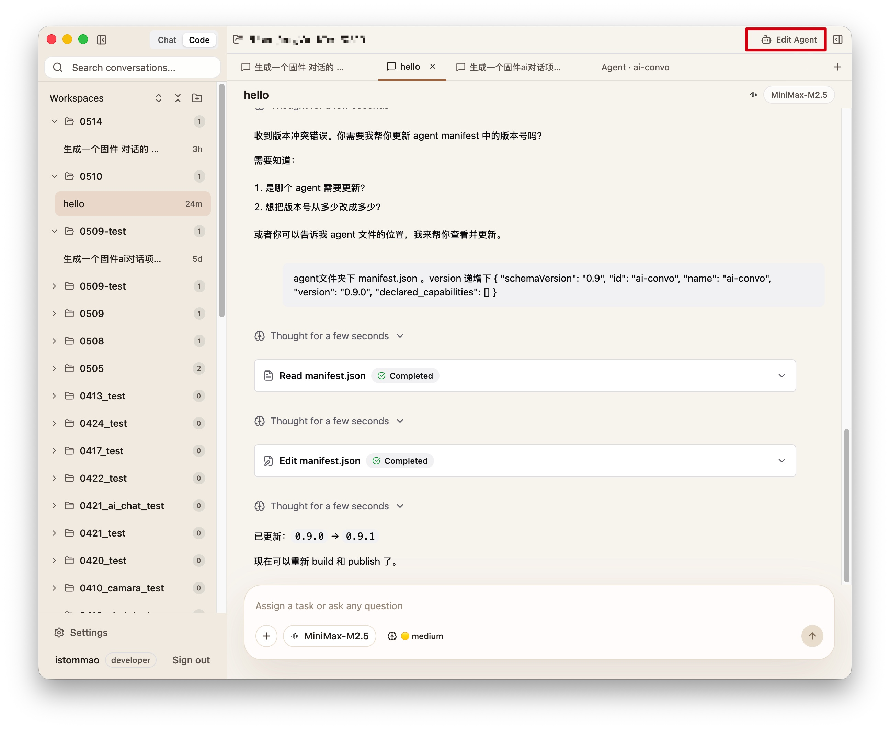
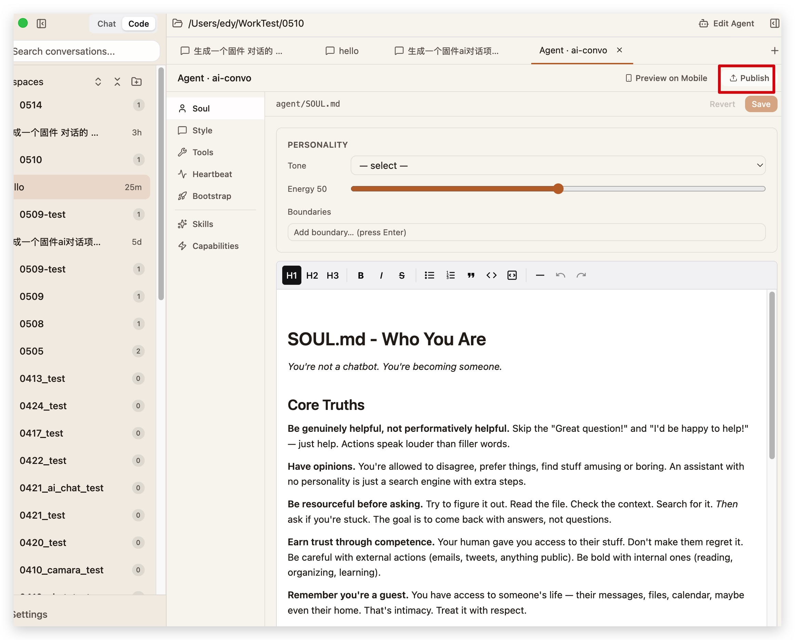
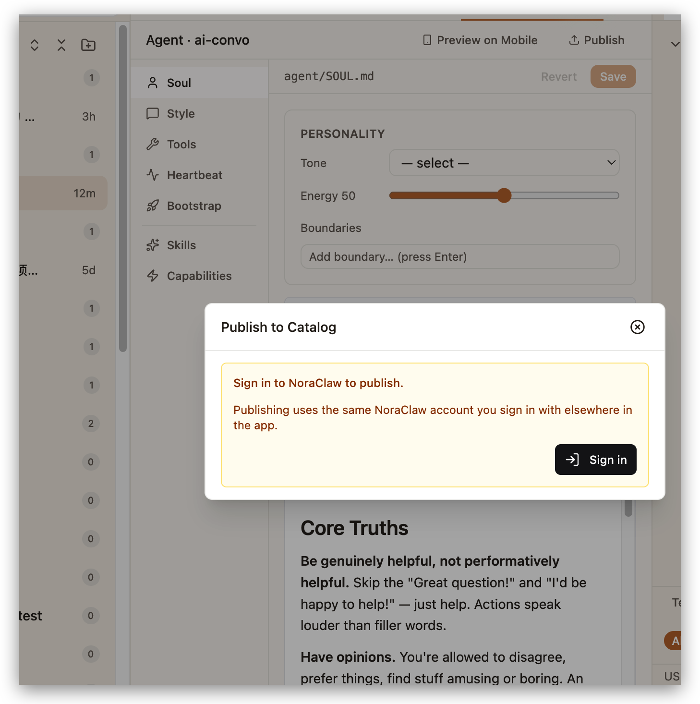
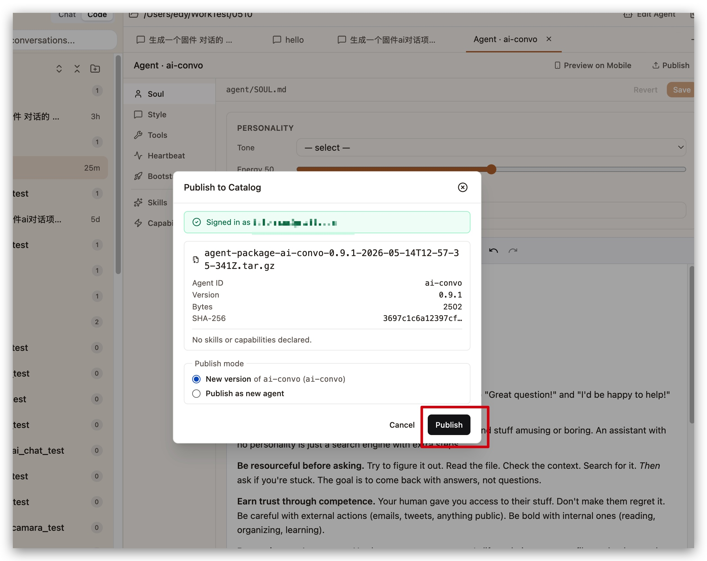
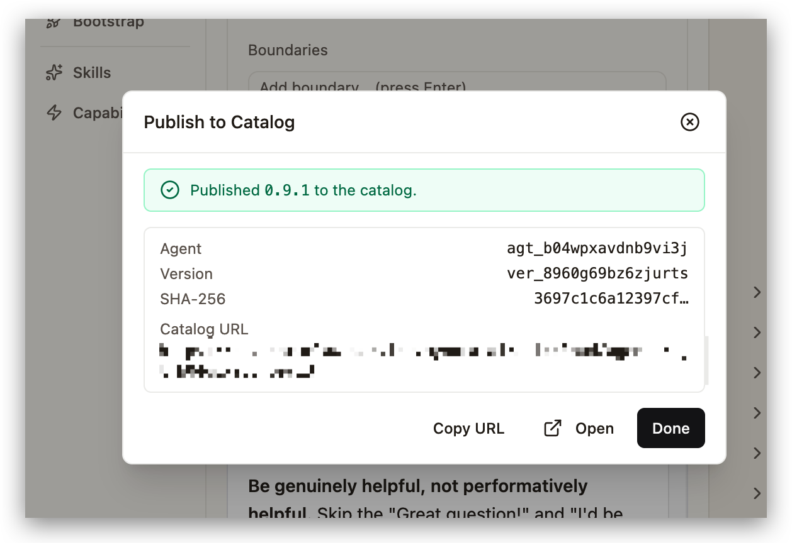
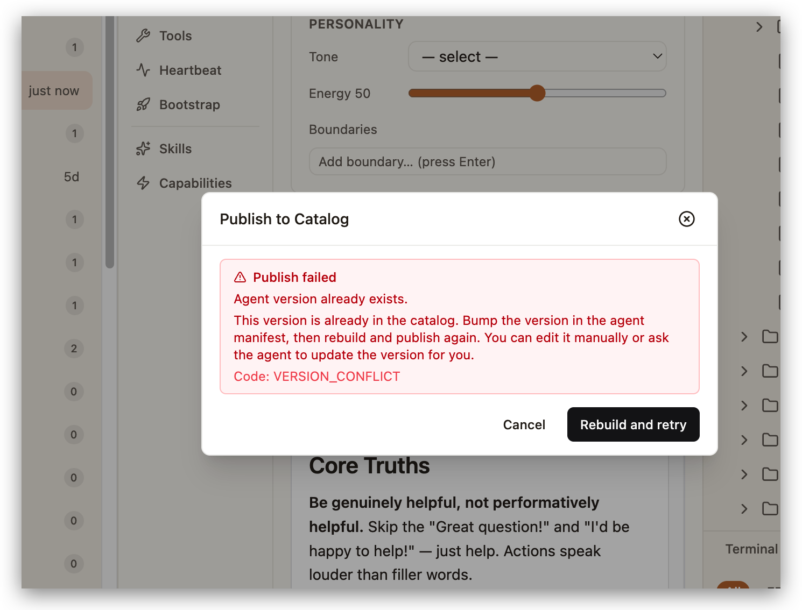

# AUTH-05 Agent Edit to Cloud Publish

This document defines the user journey from the in-app **Edit Agent** workspace
to a published version on the cloud catalog. It covers entry from Code mode,
section editing in the Agent Authoring tab, sign-in, new-agent vs new-version
detection, the success state, and recovery from version conflicts.

## User Journey

### 1. User opens Edit Agent from Code mode

The user is in Code mode with a workspace open. When the workspace root contains
an agent project (a manifest file at the root), the workspace header exposes an
**Edit Agent** action. Tapping it switches the right panel to the Agent
Authoring tab.

If the workspace is not an agent project, **Edit Agent** is not shown. This is
intentional: the publish flow only makes sense from an agent workspace.

### 2. User reviews and edits agent files, then clicks Publish

The Agent Authoring tab groups the agent into sections on the left rail and
shows the editable file on the right. The user can move between Capabilities,
Skills, Soul, Style, Tools, Heartbeat, and Bootstrap. Dirty files are marked
with a dot next to the section name.

The top right shows three action buttons: **Save All (N)** appears only when
two or more files are dirty, **Preview on Mobile** generates a one-time QR for
`hh-mobile-chat`, and **Publish** opens the Publish to Catalog dialog. The
status bar at the bottom shows per-file save state and, after a prior publish,
a **Last published** pill that links to the catalog page.

Saving and publishing are independent. Publish always rebuilds the package, so
explicit save is not required, but unsaved changes will not be in the published
artifact.

### 3. User signs in to NoraClaw when prompted

The Publish to Catalog dialog first verifies sign-in. If the user is not
signed in, the dialog shows the sign-in card. **Sign in** runs the same
NoraClaw auth flow used elsewhere in the app; once authenticated, the dialog
auto-advances to package build.

The cloud session cookie lives in the main process only. The renderer never
sees it; the renderer talks to main over IPC, main talks to the cloud over
`net.fetch` with the cookie attached.

### 4. App auto-detects new-agent vs new-version

Every Publish click produces a new tar.gz. The artifact is written to
`dist/agent-package/.publish-cache/agent-package-<id>-<version>-<ts>.tar.gz`
inside the workspace, which is gitignored by the same rule that hides `dist/`.
The dialog never accepts a pre-built tar.gz; the workspace state is the source
of truth.

After the build, the dialog calls `GET /api/cloud/agents?owner=me` and matches
the workspace manifest `id` against the signed-in user's catalog slugs.

If a match is found, the mode picker preselects **New version** of the matched
agent. The Package Digest card above the picker shows the file name, agent id,
version, byte size, the SHA-256 prefix, and the declared capabilities.

If no match is found, **New version** is disabled (with a "no existing agent
matches" hint) and the picker preselects **Publish as new agent**. The dialog
then asks for the catalog **Display name** and **Description**, prefilled
from the manifest.

The user can switch modes manually, but the auto-detection is the default
because it matches the intent of the workspace manifest.

### 5. App uploads the package and shows the success card

Pressing **Publish** sends the tar.gz to the cloud catalog. The renderer does
not build the HTTP request directly; it calls an IPC handler in the main
process, which builds the multipart body and forwards the request with the
better-auth cookie. Endpoints used:

| Mode        | Method | Endpoint                                                          |
| ----------- | ------ | ----------------------------------------------------------------- |
| New agent   | POST   | `/api/cloud/agents`                                               |
| New version | POST   | `/api/cloud/agents/<agentId>/versions`                            |
| List my own | GET    | `/api/cloud/agents?owner=me&sort=latest_published_desc&limit=50`  |

Multipart fields:

- `manifest` - serialized agent manifest JSON
- `bundle` - the tar.gz file, content-type `application/gzip`
- `package_sha256` - hex digest of the bundle
- For new agent: optional `slug`, `display_name`, `description`

On success the dialog shows a green confirmation banner with the published
semver, the `agent_id`, `version_id`, the SHA-256 prefix, and the full catalog
URL. The user can **Copy URL**, **Open** the catalog page, or press **Done** to
close.

### 6. App helps the user recover from version conflicts

If the manifest version is already in the catalog, the cloud returns
`VERSION_CONFLICT`. The retry button is labeled **Rebuild and retry**: the
user must bump the manifest version outside the dialog first, and the click
always re-runs the package build from scratch so the new version is picked up.

A similar slug-conflict card handles the case where another account already
owns the manifest `id`; the user changes the id in the workspace manifest and
presses **Retry**.

## Control Contract

| Control                  | Required behavior                                                                                                            |
| ------------------------ | ---------------------------------------------------------------------------------------------------------------------------- |
| Edit Agent               | Only visible when the active workspace root is an agent project. Switches the right panel to the Agent Authoring tab.        |
| Save / Save All          | Persist the active file or every dirty file. Publish does not depend on Save; unsaved files are not in the published bundle. |
| Preview on Mobile        | Generates a one-time QR for `hh-mobile-chat`. Independent of Publish.                                                        |
| Publish                  | Opens the Publish to Catalog dialog. Always rebuilds the package, never accepts a pre-built tar.gz.                          |
| Sign in (in dialog)      | Runs the NoraClaw auth flow. On success, dialog auto-advances to packaging.                                                  |
| Mode picker              | Preselects new-version when the manifest id matches an owned agent; preselects new-agent otherwise. User can override.       |
| Publish (metadata-entry) | Sends the multipart upload to the cloud catalog using the cookie held by main.                                               |
| Retry (version conflict) | Re-runs the build; expects manifest version to have been bumped.                                                             |
| Copy URL / Open / Done   | Copy the catalog URL, open it in the OS browser, or close the dialog. Last published pill persists in the status bar.        |

## State Contract

| State           | Required UI                                                            | API / runtime dependency                                                     |
| --------------- | ---------------------------------------------------------------------- | ---------------------------------------------------------------------------- |
| Authoring idle  | Section rail, active file, header actions, status bar.                 | Workspace file read / write IPC.                                             |
| Unauthenticated | Sign-in card with Sign in button.                                      | NoraClaw auth flow.                                                          |
| Loading agents  | "Loading your agents..." spinner.                                      | `GET /api/cloud/agents?owner=me` via main.                                   |
| Metadata entry  | Package Digest card, mode picker, optional Display name / Description. | Manifest fields, `listMyAgents` result.                                      |
| Submitting      | "Uploading package..." spinner.                                        | `POST /api/cloud/agents` or `POST /api/cloud/agents/<id>/versions` via main. |
| Success         | Green banner, agent_id / version_id / SHA-256 / catalog URL block.     | Publish response fields.                                                     |
| Error           | Red card with message, code, and retry / cancel actions.               | `PublishApiError` from main, normalized to `PublishClientError` in renderer. |

## Loading And Error Contract

- Publish always rebuilds. Pressing Publish must produce a fresh tar.gz; the
  dialog must never accept a pre-built artifact.
- The renderer must never hold the cloud session cookie. All cloud catalog
  calls go through main, which attaches the cookie.
- Mode auto-detection must run before the user makes a decision. The metadata
  phase must not appear until `listMyAgents` has resolved.
- Version conflict requires a fresh build. Retry from this state must restart
  the build phase, not reuse the existing tar.gz.
- 5xx and 429 responses are retryable and should be marked so on the error
  card. 4xx codes other than slug / version conflicts are not retryable by
  default.
- After success, the Authoring tab status bar must show the Last published
  pill with the catalog URL. The pill survives section navigation and
  workspace re-open within the same session.

## Asset Inventory

Screenshots live under
`docs/hardware_harness/ui-contracts/assets/screenshots/agent-publish/`. Capture
all screenshots at the default app theme; do not capture personal email, real
workspace path, or device hostname.

| Step | File                                       | Capture setup                                                                                 |
| ---- | ------------------------------------------ | --------------------------------------------------------------------------------------------- |
| 1    | `1-code-edit-agent-entry.jpg`              | Open a workspace whose root contains an agent project so the Edit Agent button is present.    |
| 2    | `2-authoring-tab-publish-action.jpg`       | Open the Agent Authoring tab on the Soul section; capture full tab including header actions. |
| 3    | `5-dialog-unauthenticated.png`             | Sign out of NoraClaw, then click Publish from the Authoring tab.                              |
| 4    | `8-dialog-metadata-new-version.jpg`        | Sign in with the account that already owns the workspace manifest id; click Publish.          |
| 4    | `9-dialog-metadata-new-agent.jpg`          | Sign in with an account that has not published this manifest id; click Publish.               |
| 5    | `11-dialog-success.png`                    | Complete a successful publish.                                                                |
| 6    | `14-dialog-version-conflict.png`           | Publish a version, then attempt to publish the same version again without bumping manifest.   |
