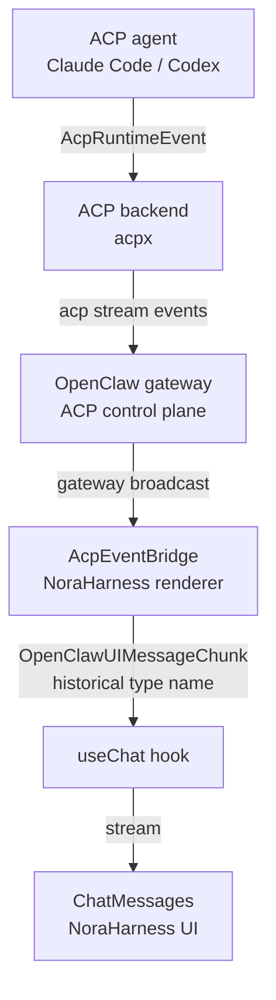
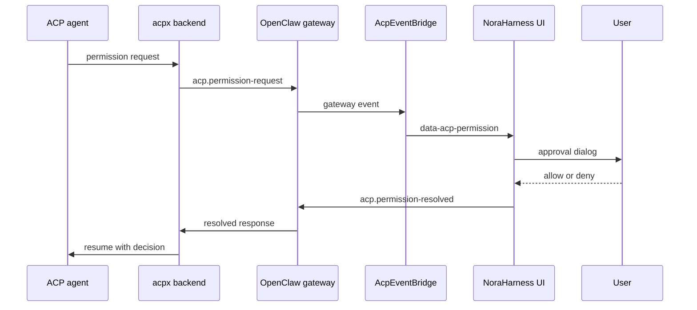

# NoraHarness Agent UI Contracts via ACP

NoraHarness is the desktop product in `apps/electron`. OpenClaw is the gateway and agent runtime substrate that NoraHarness uses. This doc describes the NoraHarness renderer contract for ACP-backed agent sessions and should be read from the product UI inward, not from the OpenClaw public-docs surface outward.

The implementation currently uses type names such as `OpenClawUIMessageChunk` and `OpenClawUIDataParts` in `apps/electron/src/renderer/src/lib/types.ts`. Treat those as historical renderer contract names. The product surface that consumes them is the NoraHarness Electron UI.

## Architecture Overview

This diagram explains the rendering path for ACP-backed agents. It starts with an ACP harness event and ends with the same Chat message surface used by normal chat turns.



Read the diagram left to right:

| Step | Layer            | Purpose                                                                  | Contract result                                                 |
| ---- | ---------------- | ------------------------------------------------------------------------ | --------------------------------------------------------------- |
| 1    | ACP agent        | Emits runtime events from Claude Code, Codex, or another ACP harness.    | Product UI does not consume harness output directly.            |
| 2    | ACP backend      | Bridges the harness process into the OpenClaw ACP control plane.         | ACP events become gateway-level stream events.                  |
| 3    | OpenClaw gateway | Broadcasts ACP stream and permission events to clients.                  | Renderer receives events through the normal gateway event path. |
| 4    | `AcpEventBridge` | Converts ACP events into renderer message chunks.                        | ACP output can enter `useChat`.                                 |
| 5    | `useChat`        | Reduces chunks into UI message state.                                    | Chat message list state updates consistently with other runs.   |
| 6    | `ChatMessages`   | Renders text, reasoning, tools, permissions, status, and modified files. | User sees ACP-backed work in the NoraHarness Chat UI.           |

**Layers:**

1. **ACP runtime**: external harness, such as Claude Code or Codex, emits `AcpRuntimeEvent`.
2. **ACP backend**: `acpx` bridges the harness to the OpenClaw gateway ACP control plane.
3. **Gateway broadcast**: the gateway forwards stream and permission events to connected clients.
4. **NoraHarness renderer bridge**: `AcpEventBridge` translates ACP events to `OpenClawUIMessageChunk`.
5. **NoraHarness rendering**: `ChatMessages` renders ACP-backed turns through the same message stream as chat turns.

## ACP Runtime Events

The renderer mirrors the ACP event shape from the gateway runtime:

```typescript
// apps/electron/src/renderer/src/lib/types.ts
export type AcpRuntimeEvent =
  | { type: "text_delta"; text: string; stream?: "output" | "thought"; tag?: string }
  | { type: "status"; text: string; tag?: string; used?: number; size?: number }
  | {
      type: "tool_call";
      text: string;
      tag?: string;
      toolCallId?: string;
      status?: string;
      title?: string;
      kind?: string;
      locations?: Array<{ path: string; line?: number }>;
    }
  | {
      type: "available_commands_update";
      commands: Array<{ name: string; description?: string; argHint?: string }>;
      tag?: string;
    }
  | { type: "done"; stopReason?: string }
  | { type: "error"; message: string; code?: string; retryable?: boolean };
```

## NoraHarness UI Data Parts

ACP events are mapped to the renderer data-part contract. The current exported type is named `OpenClawUIDataParts`, but these parts are consumed by the NoraHarness Electron UI.

```typescript
// apps/electron/src/renderer/src/lib/types.ts
export type OpenClawUIDataParts = {
  "history-refresh": unknown[];
  "tool-update": {
    toolCallId: string;
    toolName?: string;
    partialResult?: unknown;
  };
  "tool-error": {
    toolCallId: string;
    toolName: string;
    error: unknown;
  };
  "command-result": {
    command: string;
    text: string;
    isError?: boolean;
  };
  "acp-tool": {
    toolCallId: string;
    title?: string;
    status?: string;
    text?: string;
    tag?: string;
  };
  "acp-status": {
    text: string;
    tag?: string;
    used?: number;
    size?: number;
  };
  "acp-permission": {
    request: AcpPermissionRequestEvent;
    response?: AcpPermissionResolvedEvent["response"];
    reason?: AcpPermissionResolvedEvent["reason"];
  };
  "acp-modified-files": {
    workspacePath?: string;
    files: Array<{ path: string; line?: number }>;
  };
};
```

The first four keys are non-ACP chat/runtime parts that share the same renderer message contract. The ACP bridge only emits the `acp-*` keys in this type.

## Event Bridge Mapping

`AcpEventBridge` lives in `apps/electron/src/renderer/src/lib/acp-bridge.ts`. One bridge instance handles one ACP turn, identified by `sessionKey` and `requestId`.

### `text_delta`

Output stream deltas become assistant text chunks. Thought stream deltas become reasoning chunks.

```typescript
if (event.stream === "thought") {
  writer.write({ type: "reasoning-start", id: "assistant-reasoning" });
  writer.write({ type: "reasoning-delta", id: "assistant-reasoning", delta: event.text });
} else {
  writer.write({ type: "text-start", id: "assistant-text" });
  writer.write({ type: "text-delta", id: "assistant-text", delta: event.text });
}
```

The bridge emits each `*-start` chunk once per open stream and closes open streams with `text-end` or `reasoning-end` on completion, error, abort, or cleanup.

### `tool_call`

ACP tool calls may arrive repeatedly as status transitions. The bridge merges them by `toolCallId` and emits a keyed `data-acp-tool` chunk so NoraHarness can update the same rendered block in place.

```typescript
writer.write({
  type: "data-acp-tool",
  id: `acp-tool-${id}`,
  data: next,
});
```

Completed mutation tool kinds (`edit`, `write`, `delete`, `move`, `create`) also drive file version bumps in `useAcpFsCoordinatorStore` when the location can be resolved inside the workspace.

The visible ACP tool block data is intentionally smaller than the native chat tool-card data:

| Field        | Meaning                                                                                                     | Renderer behavior                                                                                        |
| ------------ | ----------------------------------------------------------------------------------------------------------- | -------------------------------------------------------------------------------------------------------- |
| `toolCallId` | Stable key for this ACP tool call. If the event omits it, the bridge creates `acp-tool-<index>`.            | `useChat` replaces the existing `data-acp-tool` part with the same key instead of appending a new block. |
| `title`      | Human-readable tool title from the ACP harness.                                                             | `AcpToolBlock` shows it as the block title; if absent, it falls back to `tag` and then `tool`.           |
| `status`     | Raw harness status, such as `pending`, `running`, `completed`, `failed`, `cancelled`, `done`, or `success`. | `AcpToolBlock` normalizes it into Pending, Running, Completed, Failed, Cancelled, or Unknown.            |
| `text`       | Tool detail text from the harness.                                                                          | Rendered inside the collapsible body when present.                                                       |
| `tag`        | Optional harness tag.                                                                                       | Used as a fallback title and as part of the visible context.                                             |
| `kind`       | Mutation hint such as `edit`, `write`, `delete`, `move`, or `create`.                                       | Not rendered directly; used to decide whether file buffers and modified-file summaries update.           |
| `locations`  | Optional changed-file locations.                                                                            | Used for file reload/version bumps and end-of-turn modified-file summary.                                |

Native chat tools use `tool-<name>` parts with `input`, `output`, `errorText`, and `progress` fields. ACP tool blocks do not expose those fields to the renderer today; they show the harness text/status block instead. See `chat/chat-runtime.md` and `provider-gateway-boundaries/gateway-chat.md` for the native tool-card contract.

### `status`

Tagged status events become structured `data-acp-status` chunks. Untagged status text is rendered as assistant text, matching the implementation in `handleRuntimeEvent`.

```typescript
writer.write({
  type: "data-acp-status",
  data: { text: event.text, tag: event.tag, used: event.used, size: event.size },
});
```

### `available_commands_update`

Available commands do not produce chat chunks. They update `useAcpCommandsStore` for the active `sessionKey`.

```typescript
useAcpCommandsStore.getState().setCommands(this.sessionKey, event.commands);
```

### `done`

On completion, the bridge closes any open text or reasoning streams, emits an `acp-modified-files` summary when mutation tools changed workspace files, then emits `finish`.

```typescript
writer.write({
  type: "data-acp-modified-files",
  id: `acp-modified-files-${this.requestId}`,
  data: { workspacePath: this.workspaceCwd, files },
});
writer.write({ type: "finish", finishReason });
```

### `error`

Errors close any open text or reasoning streams and emit an AI SDK `error` chunk with `errorText`.

## Permission Request Flow

ACP agents can request permission for reads, writes, or shell execution. NoraHarness displays those requests through `data-acp-permission` chunks and sends the user's response back through the gateway.



Read the sequence in this order:

| Step | Actor                                               | Purpose                                                        | User-visible outcome                                   |
| ---- | --------------------------------------------------- | -------------------------------------------------------------- | ------------------------------------------------------ |
| 1    | `ACP agent`                                         | Requests permission before doing protected work.               | The run pauses for user decision.                      |
| 2    | `acpx backend` -> `OpenClaw gateway`                | Forwards the permission request through the ACP control plane. | Gateway can broadcast the request to the renderer.     |
| 3    | `AcpEventBridge`                                    | Converts the gateway event into `data-acp-permission`.         | The permission request becomes a keyed Chat data part. |
| 4    | `NoraHarness UI`                                    | Shows an approval dialog or inline approval surface.           | User can allow or deny the operation.                  |
| 5    | `NoraHarness UI` -> `OpenClaw gateway`              | Sends `acp.permission-resolved`.                               | User decision leaves the renderer.                     |
| 6    | `OpenClaw gateway` -> `acpx backend` -> `ACP agent` | Forwards the resolved response.                                | Agent resumes with the decision.                       |

The resolved event updates the same keyed permission data part with `response` and `reason`.

## Sequence Gap Recovery

When the gateway client reports a `seq-gap`, the bridge:

1. Marks open tool blocks as `cancelled`.
2. Emits a `data-acp-status` chunk with tag `acp-interrupted`.
3. Replays buffered events from `getRecentEventsForRun(requestId)` when available.

Replayed ACP events are applied idempotently. Duplicate tool calls merge into existing keyed state, and completed mutation events still drive the normal file reload and modified-files summary behavior.

## Contract Tests

The focused contract tests live in `apps/electron/src/renderer/src/lib/acp-bridge.test.ts`.

| Test surface             | Coverage                                                                                     |
| ------------------------ | -------------------------------------------------------------------------------------------- |
| F1 buffer reload         | Completed mutation tool calls bump file versions and emit modified-files summary chunks.     |
| F2 available commands    | `available_commands_update` writes commands into `useAcpCommandsStore` per session.          |
| F3 sequence gap recovery | Open tool blocks are cancelled, interruption status is surfaced, and buffered events replay. |

Run the focused gate with:

```bash
pnpm test -- apps/electron/src/renderer/src/lib/acp-bridge.test.ts
```

## Key Files

| Purpose                        | Path                                                                |
| ------------------------------ | ------------------------------------------------------------------- |
| ACP event bridge               | `apps/electron/src/renderer/src/lib/acp-bridge.ts`                  |
| Renderer message and ACP types | `apps/electron/src/renderer/src/lib/types.ts`                       |
| Bridge contract tests          | `apps/electron/src/renderer/src/lib/acp-bridge.test.ts`             |
| ACP command store              | `apps/electron/src/renderer/src/stores/acp-commands-store.ts`       |
| ACP file reload coordinator    | `apps/electron/src/renderer/src/stores/acp-fs-coordinator-store.ts` |

## Related

- [Runtime flows](./provider-gateway-boundaries/runtime-flows.md) shows the surrounding ACP session lifecycle, gateway WebSocket, chat-vs-ACP routing, multi-agent routing, tool event, and compaction diagrams.
