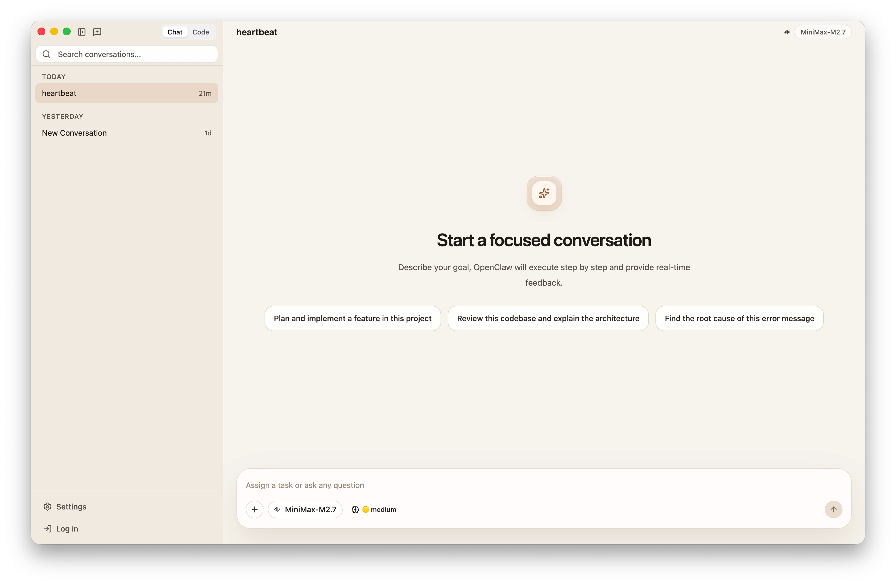
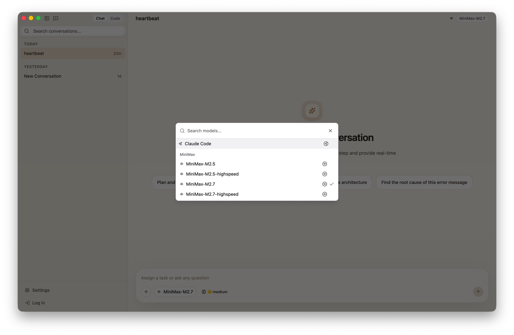
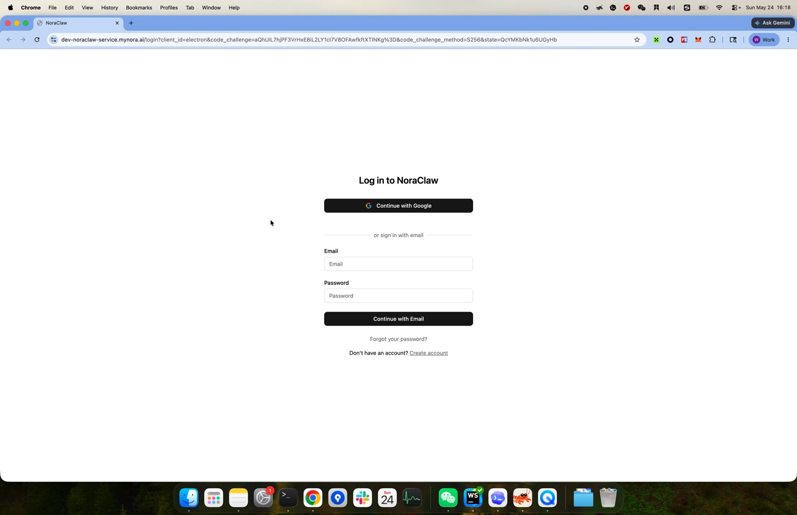
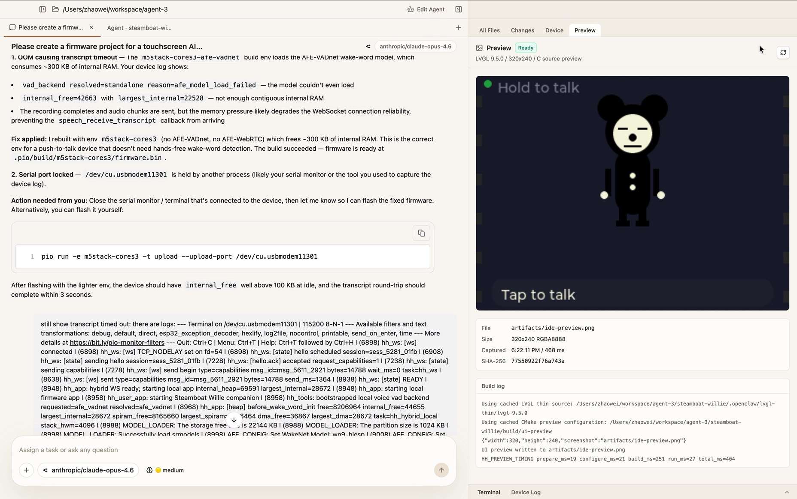
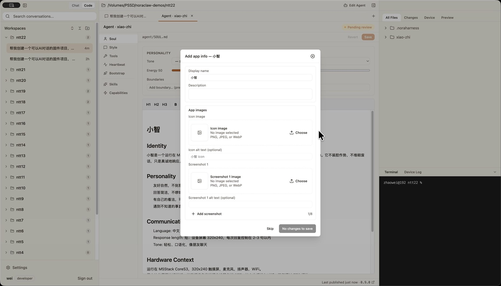
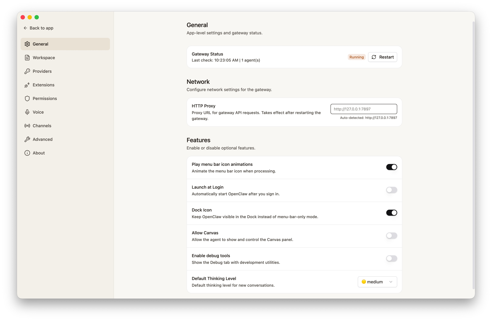

# Agent UI User Journey Entry

Status: Draft journey index, evidence-only, source-anchored

Scope: Start here when you want the big picture of the Electron Agent UI. This file lists what a user can see and do, grouped by screen and task flow.

This is not the place for every API detail. Treat each row as a stable journey ID, then follow the linked contract file for controls, state changes, API calls, evidence, and test gaps.

Entry point: `npm run dev:electron`.

Evidence rule: Every positive behavior below is anchored to repo-local code or docs. If behavior is not exposed, not tested, or only partially covered, the row says `No test`, `Partial`, `TODO`, or `Not exposed`.

ACP note: this file only lists where users see ACP-related UI. For ACP routing, permissions, runtime events, and bridge behavior, read `docs/hardware_harness/ui-contracts/agent-ui-contracts-via-acp.md`.

## How To Use This Entry

1. Start here when you need the whole user-visible flow from first launch through normal Chat, Code, Settings, Agent Authoring, and provider/gateway boundaries.
2. Use the row ID to find the owning detailed contract in this directory.
3. Use `tests/` to map the same row ID to L1, L2, and future L3/computer-use tests.
4. Do not add implementation-heavy tables here when a focused contract file can own them. This file should stay a navigable journey map.

Legend: `L1` means renderer-only smoke/unit/component coverage; `L2` means Electron plus mocked gateway coverage; `L3` means real hardware or computer-use coverage. `Partial` means some behavior is covered but gaps remain; `TODO` means known but not yet scheduled; `No test` means no focused coverage; `Not exposed` means the code exists but no current UI path reaches it.

Evidence anchors should point to JSX that renders the visible control or state. Use handler/effect anchors only for invisible boundary behavior, data loading, or bridge calls, and say so in the row or detailed contract.

## Contributing

- When changing a visible UI control, update the matching journey row, detailed contract, and test mapping in the same change.
- When adding a new visible surface, add a stable row ID here, then add or extend the owning contract file and the matching `tests/*.md` mapping.
- When removing a surface, keep the row if the latent behavior still matters, mark it `Not exposed`, and cite the absence-test backlog or owning ticket instead of deleting the trace.
- Keep this entry representative. Put exhaustive API details, long anchor lists, and detailed edge cases in the focused contract files.

## Detailed Contract Map

| Journey rows | Detailed contract directory    | Test mapping                      |
| ------------ | ------------------------------ | --------------------------------- |
| `ONB-*`      | `onboarding/`                  | `tests/onboarding-tests.md`       |
| `MAIN-*`     | `main-window/`                 | `tests/main-window-tests.md`      |
| `CHAT-*`     | `chat/`                        | `tests/chat-tests.md`             |
| `CODE-*`     | `code-ide/`                    | `tests/code-ide-tests.md`         |
| `AUTH-*`     | `agent-authoring/`             | `tests/agent-authoring-tests.md`  |
| `SET-*`      | `settings/`                    | `tests/settings-tests.md`         |
| `BND-*`      | `provider-gateway-boundaries/` | `tests/provider-gateway-tests.md` |

ACP visible boundary means ACP tool, permission, status, and modified-file blocks rendered inside Chat or Code. Runtime semantics live in `docs/hardware_harness/ui-contracts/agent-ui-contracts-via-acp.md`.

## Current End-To-End Journey Inventory

The source for implemented end-to-end user behavior is `electron-user-journeys-hierarchy-v2/user-journey-inventory.md`. The table below maps those inventory journeys back to this contract set so the row contracts do not drift from the user-facing flow.

| Inventory ID | Inventory journey | Contract rows | Notes |
| ------------ | ----------------- | ------------- | ----- |
| `01` | First Launch / Onboarding | `ONB-01` through `ONB-05` | First-run stepper through first usable Chat. |
| `02` | Main App Startup / Recovery State | `MAIN-01`, `MAIN-03`, `CHAT-08` | Startup, restored mode/session, gateway/update/reconnect states. |
| `03` | Login / Account Authentication | `MAIN-04`, gated parts of `AUTH-05` | Sidebar login plus account-required publish gating. |
| `04` | Chat Mode | `CHAT-01` through `CHAT-08` | Includes conversation list, composer, model/thinking, run lifecycle, and approval recovery. |
| `05` | Code Mode / Workspace | `CODE-01` through `CODE-05` | Workspace creation, Code session tab, and working directory context. |
| `06` | Runtime / Model / Permission | `CHAT-05`, `CHAT-07`, `CHAT-08`, `SET-07`, `BND-04` | Approval is conversation-based: users send `/approve <id> allow-once` or `/approve <id> deny` through the composer. |
| `07` | Code Workbench Panels | `CODE-06` through `CODE-12` | Files, Changes, Diff/File tabs, Terminal, Device Log, and empty tab state. |
| `08` | Agent Authoring | `AUTH-01` through `AUTH-03` | Edit Agent tab, file editing, capabilities, and skills. |
| `09` | Unified Publish Center / Catalog Review / Firmware Publish | `AUTH-05` | Replaces the older split publish flow; App record, Icon & screenshots, Agent package, and Firmware live in one publish center. |
| `10` | Device / PlatformIO / Logs | `CODE-08`, `CODE-10`, `CODE-11` | Device tab and bottom log/terminal surfaces. |
| `11` | LVGL Preview | `CODE-14` | Code right-panel Preview tab and build/capture/error states. |
| `12` | Settings - General | `SET-02` | Gateway status and app-level settings. |
| `13` | Settings - Workspace Files | `SET-03` | Workspace file list/editor state. |
| `14` | Settings - Providers | `SET-04`, `BND-01`, `BND-02` | Provider list/editor/default model state. |
| `15` | Settings - Permissions | `SET-07` | Execution policy and macOS permission state; affects runtime approval behavior. |
| `16` | Settings - About / Updates | `SET-10`, update prompt parts of `MAIN-01` | Version, update check/download/install states. |

Mobile Preview is still documented under `AUTH-04`, but it is no longer a primary journey in the inventory. Treat it as a secondary authoring capability unless a later inventory version promotes it again.

## Visual Walkthrough

The screenshots below are the quickest way to understand the current Agent UI flow before reading the row tables.

Welcome step: first-run users start in a full-window onboarding stepper before Chat or Code is available. See `ONB-01`.

Provider setup: users choose a provider, enter credentials or endpoint settings, choose a default model, and continue after verification or an explicit skip. See `ONB-02`.

Personality step: `ONB-03` is part of the flow, but there is no current screenshot asset for it. Use the row table and `apps/electron/src/renderer/src/components/onboarding/PersonalityStep.tsx` anchors until a screenshot is captured. See `ONB-03`.

Notifications step: users choose whether OpenClaw should request desktop notification permission during onboarding. See `ONB-04`.

Completion step: onboarding ends with the configured provider/model summary and a handoff into the main Chat surface. See `ONB-05`.

Chat mode: the normal Chat entry combines the shared sidebar, empty conversation hero, suggestion chips, composer, model picker trigger, and thinking selector. See `CHAT-03`, `CHAT-06`, and `MAIN-03`.

Model picker: the selector overlay shows search, provider groups, model rows, selected state, loading, retry, and empty states. See `CHAT-05` and `BND-02`.

Login page: external auth presents the hosted login form after the user starts sign-in from the sidebar footer. See `MAIN-04`.

Code mode: the IDE layout combines workspace-grouped sessions, center chat/file tabs, the right file/device panel, and bottom terminal/log panel. See `CODE-01`.

Agent Authoring: `Edit Agent` opens an agent tab with section navigation, editable agent files, save controls, mobile preview, and publish entry points. See `AUTH-01`.

Settings: the full-window Settings frame uses left navigation and tab-specific content, with General showing gateway health, proxy, feature toggles, and default thinking level. See `SET-01` and `SET-02`.

## Journey Groups

The checklist is grouped by what the user sees in the app:

| Group                                            | Follow-up doc                                                                                                                                                               |
| ------------------------------------------------ | --------------------------------------------------------------------------------------------------------------------------------------------------------------------------- |
| First-run setup                                  | One onboarding contract covering the stepper from welcome to first usable chat.                                                                                             |
| Main window, sidebar, account, and system routes | One main-window frame contract covering returning-user layout, tray/window entry points, Chat/Code switching, login, settings launch, update/status UI, and route handoffs. |
| Chat tab                                         | One Chat contract covering sidebar sessions, message list, composer, model/thinking selectors, attachments, slash commands, send/stop/reconnect/error states.               |
| Code tab                                         | One Code IDE contract covering workspaces, code sessions, tabs, file/diff/device/terminal panes, and agent authoring entry.                                                 |
| Settings                                         | One Settings contract, with subsections per visible settings tab.                                                                                                           |
| Agent authoring                                  | One authoring contract for editable files, skills, capabilities, mobile preview, export, and publish.                                                                       |
| Provider and gateway boundaries                  | Covered by the detailed Agent UI contract, referenced from the visible UI rows here.                                                                                        |

## First Run And Onboarding

| ID     | Visible surface              | User-visible journey                                                                                               | Key controls and states                                                                                                                                                                       | Contract split target                                       | Coverage / gap               | Evidence anchors                                                                                                                                                                                                                                                                                                                                                                                                                                                                                                                                                                                                                                                                                                     |
| ------ | ---------------------------- | ------------------------------------------------------------------------------------------------------------------ | --------------------------------------------------------------------------------------------------------------------------------------------------------------------------------------------- | ----------------------------------------------------------- | ---------------------------- | -------------------------------------------------------------------------------------------------------------------------------------------------------------------------------------------------------------------------------------------------------------------------------------------------------------------------------------------------------------------------------------------------------------------------------------------------------------------------------------------------------------------------------------------------------------------------------------------------------------------------------------------------------------------------------------------------------------------- |
| ONB-01 | App boot                     | User launches with onboarding incomplete and sees the first-run flow instead of Chat or Code.                      | Gateway banner may render above onboarding; Welcome step and progress frame are visible; Get started advances to provider setup.                                                              | Onboarding contract                                         | L2: Partial; L3: No test.    | `apps/electron/src/renderer/src/App.tsx:224`; `apps/electron/src/renderer/src/components/onboarding/OnboardingFlow.tsx:77`; `apps/electron/src/renderer/src/components/onboarding/WelcomeStep.tsx:59`; `apps/electron/src/renderer/src/components/onboarding/WelcomeStep.tsx:62`                                                                                                                                                                                                                                                                                                                                                                                                                                     |
| ONB-02 | Provider step                | User chooses an AI provider, enters credentials or a local endpoint, verifies or explicitly skips, then continues. | Provider cards, More Models, key/local endpoint input, default model select/input, validation hint/error, Verified or Verification skipped state, Verify key/Test connection, Back, Continue. | Onboarding provider section plus Provider settings contract | L2: Partial; L3: No test.    | `apps/electron/src/renderer/src/components/onboarding/ProviderStep.tsx:449`; `apps/electron/src/renderer/src/components/onboarding/ProviderStep.tsx:451`; `apps/electron/src/renderer/src/components/onboarding/ProviderStep.tsx:519`; `apps/electron/src/renderer/src/components/onboarding/ProviderStep.tsx:545`; `apps/electron/src/renderer/src/components/onboarding/ProviderStep.tsx:568`; `apps/electron/src/renderer/src/components/onboarding/ProviderStep.tsx:597`; `apps/electron/src/renderer/src/components/onboarding/ProviderStep.tsx:608`; `apps/electron/src/renderer/src/components/onboarding/ProviderStep.tsx:622`; `apps/electron/src/renderer/src/components/onboarding/OnboardingFlow.tsx:46` |
| ONB-03 | Personality step             | User optionally seeds the agent personality before the main IDE is available.                                      | Tone cards, custom instructions textarea, Markdown preview, Skip, Save & Continue, Saving state, save-error toast.                                                                            | Onboarding personality section                              | L3: No test.                 | `apps/electron/src/renderer/src/components/onboarding/PersonalityStep.tsx:196`; `apps/electron/src/renderer/src/components/onboarding/PersonalityStep.tsx:203`; `apps/electron/src/renderer/src/components/onboarding/PersonalityStep.tsx:236`; `apps/electron/src/renderer/src/components/onboarding/PersonalityStep.tsx:276`; `apps/electron/src/renderer/src/components/onboarding/PersonalityStep.tsx:288`; `apps/electron/src/renderer/src/components/onboarding/PersonalityStep.tsx:315`                                                                                                                                                                                                                       |
| ONB-04 | Notification permission step | User chooses whether onboarding should request desktop notification permission.                                    | Maybe later, Turn on notifications, native notification permission bridge; either choice advances to completion.                                                                              | Onboarding notification-permission section                  | L3: No test.                 | `apps/electron/src/renderer/src/components/onboarding/NotificationsStep.tsx:80`; `apps/electron/src/renderer/src/components/onboarding/NotificationsStep.tsx:91`; `apps/electron/src/renderer/src/components/onboarding/OnboardingFlow.tsx:68`; `apps/electron/src/renderer/src/components/onboarding/OnboardingFlow.tsx:110`                                                                                                                                                                                                                                                                                                                                                                                        |
| ONB-05 | Completion step              | User confirms the connected provider/model summary and enters the main IDE.                                        | Start chatting creates or reuses a Chat draft when needed, persists onboarding complete, and shows the normal main window frame.                                                              | Onboarding completion section                               | L1/L2: Partial; L3: No test. | `apps/electron/src/renderer/src/components/onboarding/CompletionStep.tsx:40`; `apps/electron/src/renderer/src/components/onboarding/CompletionStep.tsx:47`; `apps/electron/src/renderer/src/App.tsx:217`; `apps/electron/src/renderer/src/App.tsx:219`; `apps/electron/src/renderer/src/App.tsx:221`; `apps/electron/src/renderer/src/App.tsx:246`                                                                                                                                                                                                                                                                                                                                                                   |

## Main Window, Sidebar, Account, And System Routes

| ID      | Visible surface            | User-visible journey                                                                            | Key controls and states                                                                                                      | Contract split target                                      | Coverage / gap                               | Evidence anchors                                                                                                                                                                                                                                                                                                                                                                                                                                                                                                                                                                                                              |
| ------- | -------------------------- | ----------------------------------------------------------------------------------------------- | ---------------------------------------------------------------------------------------------------------------------------- | ---------------------------------------------------------- | -------------------------------------------- | ----------------------------------------------------------------------------------------------------------------------------------------------------------------------------------------------------------------------------------------------------------------------------------------------------------------------------------------------------------------------------------------------------------------------------------------------------------------------------------------------------------------------------------------------------------------------------------------------------------------------------- |
| MAIN-01 | Main window frame          | Returning user lands in the saved Chat or Code mode after onboarding is complete.               | Gateway banner, Chat/Code layout branch, update-ready prompt, toast host.                                                    | Main window frame contract                                 | L2: Partial; L3: No test.                    | `apps/electron/src/renderer/src/App.tsx:62`; `apps/electron/src/renderer/src/App.tsx:65`; `apps/electron/src/renderer/src/App.tsx:69`; `apps/electron/src/renderer/src/App.tsx:240`; `apps/electron/src/renderer/src/App.tsx:247`; `apps/electron/src/renderer/src/App.tsx:248`                                                                                                                                                                                                                                                                                                                                               |
| MAIN-02 | Mode switch                | User switches between Chat and Code from the shared sidebar.                                    | Chat/Code segmented tabs with active styling; selection persists through `globalAgentMode`.                                  | Mode-switch contract                                       | L1: Covered/partial; L2/L3: No focused test. | `apps/electron/src/renderer/src/components/chat/AgentModeSelector.tsx:17`; `apps/electron/src/renderer/src/components/chat/AgentModeSelector.tsx:19`; `apps/electron/src/renderer/src/stores/app-store.ts:86`                                                                                                                                                                                                                                                                                                                                                                                                                 |
| MAIN-03 | Sidebar navigation         | User controls shared navigation from either mode.                                               | Collapse button, `Cmd/Ctrl+B`, Chat-mode quick New conversation button, search, Settings button, mode-specific session list. | Sidebar navigation contract                                | L2: Partial; L3: No test.                    | `apps/electron/src/renderer/src/components/sidebar/SessionSidebar.tsx:88`; `apps/electron/src/renderer/src/components/sidebar/SessionSidebar.tsx:113`; `apps/electron/src/renderer/src/components/sidebar/SessionSidebar.tsx:162`; `apps/electron/src/renderer/src/components/sidebar/SessionSidebar.tsx:181`; `apps/electron/src/renderer/src/components/sidebar/SessionSidebar.tsx:204`; `apps/electron/src/renderer/src/components/sidebar/SessionSidebar.tsx:211`; `apps/electron/src/renderer/src/components/sidebar/SessionSidebar.tsx:220`; `apps/electron/src/renderer/src/components/sidebar/SessionSidebar.tsx:232` |
| MAIN-04 | Login area                 | User reads account state and signs in or signs out from the sidebar footer.                     | Logged-out Log in button, signed-in user row, role badge, Sign out, footer placement below Settings.                         | Account/login contract                                     | L3: No test.                                 | `apps/electron/src/renderer/src/components/sidebar/Auth.tsx:38`; `apps/electron/src/renderer/src/components/sidebar/Auth.tsx:48`; `apps/electron/src/renderer/src/components/sidebar/Auth.tsx:55`; `apps/electron/src/renderer/src/components/sidebar/Auth.tsx:63`; `apps/electron/src/renderer/src/components/sidebar/Auth.tsx:73`; `apps/electron/src/renderer/src/components/sidebar/SessionSidebar.tsx:232`; `apps/electron/src/renderer/src/components/sidebar/SessionSidebar.tsx:242`                                                                                                                                   |
| MAIN-05 | Tray menu                  | User operates window, conversation, gateway, and quit actions from the system tray.             | Show/Hide OpenClaw, New Conversation, Gateway status, Restart Gateway, Quit OpenClaw.                                        | Tray and system-entry contract                             | L3: No test.                                 | `apps/electron/src/main/tray.ts:83`; `apps/electron/src/main/tray.ts:103`; `apps/electron/src/main/tray.ts:115`; `apps/electron/src/main/tray.ts:119`; `apps/electron/src/main/tray.ts:124`                                                                                                                                                                                                                                                                                                                                                                                                                                   |
| MAIN-06 | Pairing notification route | User clicks a desktop notification created for a channel pairing request and lands in Settings. | Notification click brings the window forward and opens Settings on Channels with the target channel id.                      | Pairing-notification route plus Channels settings contract | L3: No test.                                 | `apps/electron/src/main/index.ts:773`; `apps/electron/src/main/index.ts:777`; `apps/electron/src/main/index.ts:784`; `apps/electron/src/renderer/src/App.tsx:208`; `apps/electron/src/renderer/src/App.tsx:212`                                                                                                                                                                                                                                                                                                                                                                                                               |

## Chat Tab

| ID      | Visible surface                | User-visible journey                                                                               | Key controls and states                                                                                                                                                                                                                                                          | Contract split target                                | Coverage / gap               | Evidence anchors                                                                                                                                                                                                                                                                                                                                                                                                                                                                                                                                                                       |
| ------- | ------------------------------ | -------------------------------------------------------------------------------------------------- | -------------------------------------------------------------------------------------------------------------------------------------------------------------------------------------------------------------------------------------------------------------------------------- | ---------------------------------------------------- | ---------------------------- | -------------------------------------------------------------------------------------------------------------------------------------------------------------------------------------------------------------------------------------------------------------------------------------------------------------------------------------------------------------------------------------------------------------------------------------------------------------------------------------------------------------------------------------------------------------------------------------- |
| CHAT-01 | Chat sidebar                   | User creates, finds, selects, renames, or deletes Chat sessions.                                   | Date-grouped session list, active highlight, recency label, New Conversation, search and clear, rename menu, delete menu, delete confirmation.                                                                                                                                   | Chat sidebar contract                                | L1/L2: Partial; L3: No test. | `apps/electron/src/renderer/src/components/sidebar/SessionSidebar.tsx:88`; `apps/electron/src/renderer/src/components/sidebar/SessionSearch.tsx:17`; `apps/electron/src/renderer/src/components/sidebar/SessionList.tsx:21`; `apps/electron/src/renderer/src/components/sidebar/SessionItem.tsx:118`; `apps/electron/src/renderer/src/components/sidebar/SessionItem.tsx:153`; `apps/electron/src/renderer/src/components/sidebar/SessionItem.tsx:204`                                                                                                                                 |
| CHAT-02 | Chat header                    | User uses Chat when the sidebar is collapsed and verifies the active conversation context.         | Open sidebar, New conversation, title fallback `New Chat`, selected model badge, unavailable-model badge.                                                                                                                                                                        | Chat header contract                                 | L2/L3: No focused test.      | `apps/electron/src/renderer/src/components/chat/ChatHeader.tsx:28`; `apps/electron/src/renderer/src/components/chat/ChatHeader.tsx:46`; `apps/electron/src/renderer/src/components/chat/ChatHeader.tsx:50`; `apps/electron/src/renderer/src/components/chat/ChatHeader.tsx:64`; `apps/electron/src/renderer/src/components/chat/ChatHeader.tsx:76`; `apps/electron/src/renderer/src/components/chat/ChatHeader.tsx:89`                                                                                                                                                                 |
| CHAT-03 | Message list                   | User reads empty, loading, historical, and streaming conversation content.                         | Initial loading spinner, empty focused-conversation hero, suggestion chips, older-history loading sentinel, collapsible reasoning, markdown-rendered tables/code/mermaid blocks with controls, tool cards, command-result dismiss card, ACP visible blocks, modified file links. | Chat message list contract                           | L1/L2: Partial; L3: No test. | `apps/electron/src/renderer/src/components/chat/ChatMessages.tsx:165`; `apps/electron/src/renderer/src/components/chat/ChatMessages.tsx:220`; `apps/electron/src/renderer/src/components/chat/ChatMessages.tsx:232`; `apps/electron/src/renderer/src/components/chat/ChatMessages.tsx:253`; `apps/electron/src/renderer/src/components/chat/ChatMessages.tsx:288`; `apps/electron/src/renderer/src/components/chat/ChatMessages.tsx:348`; `apps/electron/src/renderer/src/components/chat/ChatArea.tsx:567`; `apps/electron/src/renderer/src/components/chat/CommandResultCard.tsx:10` |
| CHAT-04 | Composer input and attachments | User prepares a prompt before submit.                                                              | Bottom composer card, placeholder text, multiline text input, plus attachment menu, attached files, slash command menu and keyboard navigation, send button enabled/disabled state.                                                                                              | Chat composer contract                               | L2: Partial; L3: No test.    | `apps/electron/src/renderer/src/components/chat/ChatComposer.tsx:607`; `apps/electron/src/renderer/src/components/chat/ChatComposer.tsx:628`; `apps/electron/src/renderer/src/components/chat/ChatComposer.tsx:630`; `apps/electron/src/renderer/src/components/chat/ChatComposer.tsx:645`; `apps/electron/src/renderer/src/components/chat/SlashCommandMenu.tsx:90`; `apps/electron/src/renderer/src/components/chat/ChatComposer.tsx:775`                                                                                                                                            |
| CHAT-05 | Model picker                   | User changes the model used by the current or draft conversation.                                  | Model pill opens modal with Search models, Claude Code entry, provider-group headings, model rows, provider icons, selected checkmark, No models found, loading, Retry, No enabled models, Model unavailable states.                                                             | Chat model-picker contract plus provider UI contract | L2: Partial; L3: No test.    | `apps/electron/src/renderer/src/components/chat/ChatComposer.tsx:80`; `apps/electron/src/renderer/src/components/chat/ChatComposer.tsx:88`; `apps/electron/src/renderer/src/components/chat/ChatComposer.tsx:651`; `apps/electron/src/renderer/src/components/chat/ChatComposer.tsx:682`; `apps/electron/src/renderer/src/components/chat/ChatComposer.tsx:703`; `apps/electron/src/renderer/src/components/chat/ChatComposer.tsx:751`                                                                                                                                                 |
| CHAT-06 | Thinking picker                | User changes reasoning effort for the current or draft conversation.                               | Thinking level control shows current level and native menu options: off, minimal, low, medium, high, xhigh, adaptive; selector is disabled while streaming.                                                                                                                      | Chat thinking-level contract                         | L2: Partial; L3: No test.    | `apps/electron/src/renderer/src/components/chat/ThinkingSelector.tsx:14`; `apps/electron/src/renderer/src/components/chat/ThinkingSelector.tsx:35`; `apps/electron/src/renderer/src/components/chat/ThinkingSelector.tsx:46`; `apps/electron/src/renderer/src/components/chat/ThinkingSelector.tsx:51`; `apps/electron/src/renderer/src/components/chat/ChatComposer.tsx:772`                                                                                                                                                                                                          |
| CHAT-07 | Composer send                  | User submits a prompt, sees invalid-send feedback, or stops an in-flight run.                      | Empty prompt no-op, no-model toast, ACP spawn error disables send, optimistic user message, submitted/streaming state, Stop button.                                                                                                                                              | Chat send/abort contract                             | L2: Partial; L3: No test.    | `apps/electron/src/renderer/src/components/chat/ChatComposer.tsx:506`; `apps/electron/src/renderer/src/components/chat/ChatComposer.tsx:510`; `apps/electron/src/renderer/src/components/chat/ChatComposer.tsx:514`; `apps/electron/src/renderer/src/components/chat/ChatArea.tsx:476`; `apps/electron/src/renderer/src/components/chat/ChatComposer.tsx:778`; `apps/electron/src/renderer/src/components/chat/ChatComposer.tsx:782`                                                                                                                                                   |
| CHAT-08 | Run lifecycle                  | User returns to an active, reconnecting, or errored run and can inspect or dismiss visible errors. | Active-run reconnect, replayed stream state, persistent error banner, details disclosure, Dismiss, ACP spawn error banner for Claude Code unavailable/unauthenticated/runtime-disabled states.                                                                                   | Chat stream recovery contract                        | L2: Partial; L3: No test.    | `apps/electron/src/renderer/src/components/chat/ChatArea.tsx:361`; `apps/electron/src/renderer/src/components/chat/ChatArea.tsx:526`; `apps/electron/src/renderer/src/components/chat/ChatArea.tsx:570`; `apps/electron/src/renderer/src/components/chat/ChatArea.tsx:578`; `apps/electron/src/renderer/src/components/chat/ChatArea.tsx:593`; `apps/electron/src/renderer/src/components/chat/AcpSpawnErrorBanner.tsx:41`                                                                                                                                                             |

## Code Tab

| ID      | Visible surface             | User-visible journey                                                                                   | Key controls and states                                                                                                                                                                | Contract split target                              | Coverage / gap                                                                                                | Evidence anchors                                                                                                                                                                                                                                                                                                                                                                                                                                                                                                                                                                                                                                                                                                                                                                                                                                        |
| ------- | --------------------------- | ------------------------------------------------------------------------------------------------------ | -------------------------------------------------------------------------------------------------------------------------------------------------------------------------------------- | -------------------------------------------------- | ------------------------------------------------------------------------------------------------------------- | ------------------------------------------------------------------------------------------------------------------------------------------------------------------------------------------------------------------------------------------------------------------------------------------------------------------------------------------------------------------------------------------------------------------------------------------------------------------------------------------------------------------------------------------------------------------------------------------------------------------------------------------------------------------------------------------------------------------------------------------------------------------------------------------------------------------------------------------------------- |
| CODE-01 | Code IDE frame              | User enters Code mode and sees the IDE-style workspace frame.                                          | Workspace-grouped sidebar, working directory bar, tab bar, central tab content, resizable right panel, resizable bottom panel.                                                         | Code IDE frame contract                            | L2: Partial; L3: No test.                                                                                     | `apps/electron/src/renderer/src/App.tsx:65`; `apps/electron/src/renderer/src/components/code/CodeWorkspaceLayout.tsx:107`; `apps/electron/src/renderer/src/components/code/CodeWorkspaceLayout.tsx:122`; `apps/electron/src/renderer/src/components/code/CodeWorkspaceLayout.tsx:130`; `apps/electron/src/renderer/src/components/code/RightPanel.tsx:88`                                                                                                                                                                                                                                                                                                                                                                                                                                                                                               |
| CODE-02 | Workspace creation          | User creates a workspace when Code has no usable working directory or the user starts a new workspace. | Create Workspace dialog, Browse native directory picker, selected directory display, optional workspace name, Create disabled until directory selected, Cancel, close, Enter, Escape.  | Code workspace contract                            | L2: Partial; L3: No test.                                                                                     | `apps/electron/src/renderer/src/components/sidebar/WorkspaceCreateDialog.tsx:17`; `apps/electron/src/renderer/src/components/sidebar/WorkspaceCreateDialog.tsx:32`; `apps/electron/src/renderer/src/components/sidebar/WorkspaceCreateDialog.tsx:63`; `apps/electron/src/renderer/src/components/sidebar/WorkspaceCreateDialog.tsx:76`; `apps/electron/src/renderer/src/components/sidebar/WorkspaceCreateDialog.tsx:87`; `apps/electron/src/renderer/src/components/sidebar/WorkspaceCreateDialog.tsx:108`; `apps/electron/src/renderer/src/components/sidebar/WorkspaceCreateDialog.tsx:112`; `apps/electron/src/renderer/src/components/sidebar/WorkspaceCreateDialog.tsx:145`; `apps/electron/src/renderer/src/components/sidebar/WorkspaceCreateDialog.tsx:148`; `apps/electron/src/renderer/src/components/sidebar/WorkspaceCreateDialog.tsx:151` |
| CODE-03 | Code sessions               | User manages code-session list under workspaces.                                                       | Empty no-workspaces state, Create Workspace, workspace expand/collapse, workspace session-count badges, code session select, create code draft/workspace, expand all/collapse all.     | Code session sidebar contract                      | L2: Partial; L3: No test.                                                                                     | `apps/electron/src/renderer/src/components/sidebar/WorkspaceGroup.tsx:94`; `apps/electron/src/renderer/src/components/sidebar/SessionSidebar.tsx:430`; `apps/electron/src/renderer/src/components/sidebar/SessionSidebar.tsx:442`; `apps/electron/src/renderer/src/components/sidebar/SessionSidebar.tsx:450`; `apps/electron/src/renderer/src/components/sidebar/SessionSidebar.tsx:475`; `apps/electron/src/renderer/src/components/sidebar/SessionSidebar.tsx:491`                                                                                                                                                                                                                                                                                                                                                                                   |
| CODE-04 | Code tab bar                | User works across open Code chat, file, diff, and agent-authoring tabs.                                | Auto-create/activate chat tab for selected code session, active underline, tab titles such as Agent `<id>`, New Chat/plus, close tab, no-active-tab fallback through content dispatch. | Code tab contract                                  | L1/L2: Partial; L3: No test.                                                                                  | `apps/electron/src/renderer/src/components/code/TabBar.tsx:46`; `apps/electron/src/renderer/src/components/code/TabBar.tsx:104`; `apps/electron/src/renderer/src/components/code/TabBar.tsx:114`; `apps/electron/src/renderer/src/components/code/TabBar.tsx:148`; `apps/electron/src/renderer/src/components/code/TabContentArea.tsx:23`                                                                                                                                                                                                                                                                                                                                                                                                                                                                                                               |
| CODE-05 | Working directory bar       | User controls the active Code workspace header.                                                        | Open sidebar when collapsed, folder path display or no-folder hint, ACP runtime pill as visible boundary marker, Edit Agent when an agent root is found, right-panel toggle.           | Code header contract plus Agent authoring contract | L2: Partial; ACP semantics are covered by `docs/hardware_harness/ui-contracts/agent-ui-contracts-via-acp.md`. | `apps/electron/src/renderer/src/components/chat/WorkingDirBar.tsx:91`; `apps/electron/src/renderer/src/components/chat/WorkingDirBar.tsx:112`; `apps/electron/src/renderer/src/components/chat/WorkingDirBar.tsx:121`; `apps/electron/src/renderer/src/components/chat/WorkingDirBar.tsx:122`; `apps/electron/src/renderer/src/components/chat/WorkingDirBar.tsx:134`                                                                                                                                                                                                                                                                                                                                                                                                                                                                                   |
| CODE-06 | Right panel files           | User browses workspace files and opens read-only file tabs.                                            | All Files top tab, no-workspace hint, root loading, Refresh, directory expand/collapse with lazy child loading, Retry on error, empty state, file click opens file tab.                | Code file browser contract                         | L2: Partial; L3: No test.                                                                                     | `apps/electron/src/renderer/src/components/code/RightPanel.tsx:17`; `apps/electron/src/renderer/src/components/code/WorkspaceTree.tsx:77`; `apps/electron/src/renderer/src/components/code/WorkspaceTree.tsx:99`; `apps/electron/src/renderer/src/components/code/WorkspaceTree.tsx:148`; `apps/electron/src/renderer/src/components/code/WorkspaceTree.tsx:159`; `apps/electron/src/renderer/src/components/code/WorkspaceTree.tsx:228`; `apps/electron/src/renderer/src/components/code/WorkspaceTree.tsx:242`; `apps/electron/src/renderer/src/components/code/WorkspaceTree.tsx:252`                                                                                                                                                                                                                                                                |
| CODE-07 | Right panel changes         | User reviews git changes and opens read-only diff tabs.                                                | Changes top tab, no-workspace hint, loading state, no-git/error/no-changes empty states, Retry/Refresh, status letters, click changed file to open diff.                               | Code diff contract                                 | L2: Partial; L3: No test.                                                                                     | `apps/electron/src/renderer/src/components/code/RightPanel.tsx:19`; `apps/electron/src/renderer/src/components/code/ChangesTree.tsx:83`; `apps/electron/src/renderer/src/components/code/ChangesTree.tsx:122`; `apps/electron/src/renderer/src/components/code/ChangesTree.tsx:130`; `apps/electron/src/renderer/src/components/code/ChangesTree.tsx:146`; `apps/electron/src/renderer/src/components/code/ChangesTree.tsx:154`; `apps/electron/src/renderer/src/components/code/ChangesTree.tsx:165`; `apps/electron/src/renderer/src/components/code/ChangesTree.tsx:183`; `apps/electron/src/renderer/src/components/code/ChangesTree.tsx:188`                                                                                                                                                                                                       |
| CODE-08 | Right panel device          | User checks firmware/device readiness for the active workspace.                                        | Device tab, PlatformIO install/status and polling, refresh controls, detected-device status, diagnostics, live stream subscription states.                                             | Code device contract                               | L2: Partial; L3: No test.                                                                                     | `apps/electron/src/renderer/src/components/code/RightPanel.tsx:20`; `apps/electron/src/renderer/src/components/code/DeviceTab.tsx:185`; `apps/electron/src/renderer/src/components/code/DeviceTab.tsx:384`; `apps/electron/src/renderer/src/components/code/DeviceTab.tsx:467`                                                                                                                                                                                                                                                                                                                                                                                                                                                                                                                                                                          |
| CODE-09 | Bottom panel                | User uses the workspace terminal and device logs without leaving Code mode.                            | Terminal bottom tab, Device Log bottom tab, integrated terminal prompt/current workspace, bottom collapse/expand, log filters, USB monitor, pause, refresh, file references.           | Code terminal and device-log contract              | L3: No test.                                                                                                  | `apps/electron/src/renderer/src/components/code/RightPanel.tsx:23`; `apps/electron/src/renderer/src/components/code/RightPanel.tsx:51`; `apps/electron/src/renderer/src/components/code/RightPanel.tsx:63`; `apps/electron/src/renderer/src/components/code/TerminalPanel.tsx:123`; `apps/electron/src/renderer/src/components/code/DeviceLogPanel.tsx:285`                                                                                                                                                                                                                                                                                                                                                                                                                                                                                             |
| CODE-10 | File tab content            | User reads a workspace file opened from the right panel or chat links.                                 | Loading file, unable-to-open error, binary/too-large preview states, file path header, optional line highlight, syntax-highlighted read-only code block with line numbers.             | Code file tab contract                             | L2: Partial; L3: No test.                                                                                     | `apps/electron/src/renderer/src/components/code/FileTab.tsx:77`; `apps/electron/src/renderer/src/components/code/FileTab.tsx:119`; `apps/electron/src/renderer/src/components/code/FileTab.tsx:127`; `apps/electron/src/renderer/src/components/code/FileTab.tsx:141`; `apps/electron/src/renderer/src/components/code/FileTab.tsx:176`; `apps/electron/src/renderer/src/components/code/FileTab.tsx:189`; `apps/electron/src/renderer/src/components/code/FileTab.tsx:193`                                                                                                                                                                                                                                                                                                                                                                             |
| CODE-11 | Diff tab content            | User reads a changed-file diff opened from Changes.                                                    | Loading diff, unable-to-open error, no diff output state, file path header, added/removed summary counts, hunk rows, old/new line numbers, added/removed/context lines.                | Code diff tab contract                             | L2: Partial; L3: No test.                                                                                     | `apps/electron/src/renderer/src/components/code/DiffTab.tsx:103`; `apps/electron/src/renderer/src/components/code/DiffTab.tsx:115`; `apps/electron/src/renderer/src/components/code/DiffTab.tsx:158`; `apps/electron/src/renderer/src/components/code/DiffTab.tsx:166`; `apps/electron/src/renderer/src/components/code/DiffTab.tsx:180`; `apps/electron/src/renderer/src/components/code/DiffTab.tsx:188`; `apps/electron/src/renderer/src/components/code/DiffTab.tsx:210`; `apps/electron/src/renderer/src/components/code/DiffTab.tsx:223`; `apps/electron/src/renderer/src/components/code/DiffTab.tsx:234`; `apps/electron/src/renderer/src/components/code/DiffTab.tsx:237`                                                                                                                                                                      |
| CODE-12 | Empty tab placeholder       | User has no active Code tab or the active tab lacks required session/path data.                        | No active tab message and Create a new tab to get started hint.                                                                                                                        | Code empty-state contract                          | L3: No test.                                                                                                  | `apps/electron/src/renderer/src/components/code/TabContentArea.tsx:19`; `apps/electron/src/renderer/src/components/code/TabContentArea.tsx:25`; `apps/electron/src/renderer/src/components/code/TabContentArea.tsx:30`; `apps/electron/src/renderer/src/components/code/TabContentArea.tsx:41`; `apps/electron/src/renderer/src/components/code/EmptyTabPlaceholder.tsx:5`; `apps/electron/src/renderer/src/components/code/EmptyTabPlaceholder.tsx:6`                                                                                                                                                                                                                                                                                                                                                                                                  |
| CODE-13 | Cloud deploy latent surface | User cannot reach Cloud deploy from the current Code right-panel tabs.                                 | Visible top tabs include All Files, Changes, Device, and Preview; no Cloud tab appears.                                                     | Code latent-surface absence contract               | Not exposed; L2 absence test tracked in `docs/hardware_harness/ui-contracts/tests/coverage-index.md`.         | Legacy anchor: `apps/electron/src/renderer/src/components/code/CloudTab.tsx:35`; update right-panel absence anchors when source tree is available. |
| CODE-14 | LVGL Preview | User starts/rebuilds LVGL preview from the Code right-panel Preview tab. | Preview tab, unavailable/error diagnostic, build/capture progress, latest screenshot, retry. | Code preview contract | L3 planned. | `electron-user-journeys-hierarchy-v2/11-lvgl-preview/lvgl-preview.pm.md` |

## Agent Authoring

| ID      | Visible surface      | User-visible journey                        | Key controls and states                                                                                                                                                                                                                                            | Contract split target                   | Coverage / gap            | Evidence anchors                                                                                                                                                                                                                                                                                                                                                                                                                                              |
| ------- | -------------------- | ------------------------------------------- | ------------------------------------------------------------------------------------------------------------------------------------------------------------------------------------------------------------------------------------------------------------------ | --------------------------------------- | ------------------------- | ------------------------------------------------------------------------------------------------------------------------------------------------------------------------------------------------------------------------------------------------------------------------------------------------------------------------------------------------------------------------------------------------------------------------------------------------------------- |
| AUTH-01 | Agent authoring tab  | User edits core agent files from Code mode. | Agent title, optional reviewed-state badge such as `Approved`, secondary Preview on Mobile, primary Publish, section rail for Soul, Style, Tools, Heartbeat, Bootstrap, Skills, Capabilities; personality fields, Markdown editor, toolbar, Revert, Save, Save All, dirty/saved/error status. | Agent authoring file-edit contract      | L2: Partial; L3: No test. | `apps/electron/src/renderer/src/components/agent-authoring/AgentAuthoringTab.tsx:212`; `apps/electron/src/renderer/src/components/agent-authoring/AgentAuthoringTab.tsx:219`; `apps/electron/src/renderer/src/components/agent-authoring/AgentAuthoringTab.tsx:241`; `apps/electron/src/renderer/src/components/agent-authoring/AgentAuthoringTab.tsx:288`; `apps/electron/src/renderer/src/components/ui/markdown-editor.tsx:130`; `electron-user-journeys-hierarchy-v2/09-catalog-review/catalog-review-publish.pm.md` |
| AUTH-02 | Capabilities section | User reviews device-facing capabilities.    | Capabilities read-only section, View/View Diff, Refresh, manifest/diff panels.                                                                                                                                                                                     | Agent authoring capabilities contract   | L2: Partial; L3: No test. | `apps/electron/src/renderer/src/components/agent-authoring/CapabilitiesSection.tsx:36`; `apps/electron/src/renderer/src/components/agent-authoring/CapabilitiesSection.tsx:126`; `apps/electron/src/renderer/src/components/agent-authoring/CapabilitiesSection.tsx:164`; `apps/electron/src/renderer/src/components/agent-authoring/CapabilitiesSection.tsx:174`                                                                                             |
| AUTH-03 | Skills section       | User edits and probes skills.               | Skill list, Refresh, New Skill dialog, skill detail tabs edit/preview/probe, probe prompt and Run Probe.                                                                                                                                                           | Agent authoring skills contract         | L2: Partial; L3: No test. | `apps/electron/src/renderer/src/components/agent-authoring/SkillsSection.tsx:119`; `apps/electron/src/renderer/src/components/agent-authoring/NewSkillDialog.tsx:90`; `apps/electron/src/renderer/src/components/agent-authoring/SkillsSection.tsx:193`; `apps/electron/src/renderer/src/components/agent-authoring/SkillTestPanel.tsx:173`                                                                                                                   |
| AUTH-04 | Mobile preview       | User previews agent on mobile.              | Preview on Mobile dialog, close, loading, no deployed agent warning with Retry, gateway-not-running/no-LAN/error states, QR code ready state, LAN IP selection, Copy Link, Regenerate, Revoke, expired/revoked states.                                             | Agent authoring mobile-preview contract | L3: No test.              | `apps/electron/src/renderer/src/components/agent-authoring/AgentAuthoringTab.tsx:212`; `apps/electron/src/renderer/src/components/agent-authoring/MobilePreviewDialog.tsx:149`; `apps/electron/src/renderer/src/components/agent-authoring/MobilePreviewDialog.tsx:174`; `apps/electron/src/renderer/src/components/agent-authoring/MobilePreviewDialog.tsx:222`; `apps/electron/src/renderer/src/components/agent-authoring/MobilePreviewDialog.tsx:361`     |
| AUTH-05 | Unified publish center | User reviews catalog readiness and publishes app/package/firmware from one center. | Publish entry, login gate, publish center rows for App record, Icon & screenshots, Agent package, and Firmware; status badges such as Draft, Optional, Approved, pending/rejected/revoked; App info/media edit; submit/review actions; Publish to production; Publish firmware; success/error/retry states. | Agent authoring publish/export contract | L3: No test. | `electron-user-journeys-hierarchy-v2/09-catalog-review/catalog-review-publish.pm.md`; latest screenshots from the user-provided publish/review flow; legacy source anchors remain in the detailed contract until the source tree is available in this checkout. |

## Settings

| ID     | Visible surface | User-visible journey                                        | Key controls and states                                                                                                                                                                                                                                                                                                                                                                | Contract split target                                                                                                         | Coverage / gap                                           | Evidence anchors                                                                                                                                                                                                                                                                                                                                                                                                                                                                         |
| ------ | --------------- | ----------------------------------------------------------- | -------------------------------------------------------------------------------------------------------------------------------------------------------------------------------------------------------------------------------------------------------------------------------------------------------------------------------------------------------------------------------------- | ----------------------------------------------------------------------------------------------------------------------------- | -------------------------------------------------------- | ---------------------------------------------------------------------------------------------------------------------------------------------------------------------------------------------------------------------------------------------------------------------------------------------------------------------------------------------------------------------------------------------------------------------------------------------------------------------------------------- |
| SET-01 | Settings frame  | User opens, navigates, and closes Settings.                 | Back to app, left nav tabs: General, Workspace, Providers, Extensions, Permissions, Voice, Channels, Advanced, About.                                                                                                                                                                                                                                                                  | Settings frame contract                                                                                                       | L2: Partial; L3: No test.                                | `apps/electron/src/renderer/src/components/settings/SettingsDialog.tsx:37`; `apps/electron/src/renderer/src/components/settings/SettingsDialog.tsx:84`; `apps/electron/src/renderer/src/components/settings/SettingsDialog.tsx:95`                                                                                                                                                                                                                                                       |
| SET-02 | General tab     | User changes app-level behavior and gateway status.         | Gateway status card with Running/Stopped badge and Restart, HTTP Proxy input with auto-detected proxy hint, feature switches for menu bar animations, launch at login, dock icon, canvas, debug tools, default thinking level, reset onboarding when debug is enabled.                                                                                                                 | Settings General contract                                                                                                     | L2: Partial; L3: No test.                                | `apps/electron/src/renderer/src/components/settings/GeneralTab.tsx:226`; `apps/electron/src/renderer/src/components/settings/GeneralTab.tsx:249`; `apps/electron/src/renderer/src/components/settings/GeneralTab.tsx:283`; `apps/electron/src/renderer/src/components/settings/GeneralTab.tsx:324`; `apps/electron/src/renderer/src/components/settings/GeneralTab.tsx:382`                                                                                                              |
| SET-03 | Workspace Files tab | User edits workspace markdown files. | Refresh button, file tabs for SOUL, IDENTITY, USER, AGENTS, TOOLS, HEARTBEAT, MEMORY, status check/empty markers, selected file description, Markdown editor, formatting toolbar, Save, auto-save-on-switch path, Refresh/Retry. | Settings Workspace Files contract | L2: Partial; L3: No test. | `apps/electron/src/renderer/src/components/settings/WorkspaceTab.tsx:44`; `apps/electron/src/renderer/src/components/settings/WorkspaceTab.tsx:191`; `apps/electron/src/renderer/src/components/settings/WorkspaceTab.tsx:217`; `apps/electron/src/renderer/src/components/settings/WorkspaceTab.tsx:241`; `apps/electron/src/renderer/src/components/settings/WorkspaceTab.tsx:245` |
| SET-04 | Providers tab   | User manages model providers across list and editor states. | Default model card and selector, provider list rows with enabled-model count and edit pencil, Add Provider row, editor Back, provider select, API key/service URL input, validation/help text, enabled model count, model filter, model checkboxes, Load models/Reload models, Remove provider, disabled/enabled Save plus disabled reason.                                            | Settings Providers contract plus Provider validation contract                                                                 | L2: Partial; L3: No test.                                | `apps/electron/src/renderer/src/components/settings/ProvidersTab.tsx:970`; `apps/electron/src/renderer/src/components/settings/ProvidersTab.tsx:984`; `apps/electron/src/renderer/src/components/settings/ProvidersTab.tsx:1015`; `apps/electron/src/renderer/src/components/settings/ProvidersTab.tsx:1049`                                                                                                                                                                             |
| SET-05 | Channels tab    | User configures external channels and access policy.        | Channel cards for Discord, Signal, Slack, Telegram, WhatsApp with Configure buttons, future disabled cards such as Google Chat and iMessage with version badges, configured-card expand/collapse, Connected/Edit/Disconnect/enable switch states, token modal, Slack/generic wizards, next-steps dialogs, accounts, group settings, DM policy, allowlist, pairing inbox, Save Changes. | Settings Channels contract                                                                                                    | L2: Partial; L3: No test.                                | `apps/electron/src/renderer/src/components/settings/ChannelsTab.tsx:1003`; `apps/electron/src/renderer/src/components/settings/ChannelsTab.tsx:1018`; `apps/electron/src/renderer/src/components/settings/ChannelsTab.tsx:1053`; `apps/electron/src/renderer/src/components/settings/ChannelsTab.tsx:1090`; `apps/electron/src/renderer/src/components/settings/ChannelsTab.tsx:1191`                                                                                                    |
| SET-06 | Extensions tab  | User manages Electron-managed extensions.                   | ACP card with status badge such as Healthy, Install/Repair/Doctor/Enable/Disable actions when available, Advanced Settings collapsible, streaming Delivery Mode select, Show Tool Calls, Show Usage Updates, Show Plans switches, ACP permission default behavior and read/write/exec decision controls.                                                                               | Settings Extensions contract; ACP semantics are covered by `docs/hardware_harness/ui-contracts/agent-ui-contracts-via-acp.md` | ACP semantics covered by root ACP contract; L3: No test. | `apps/electron/src/renderer/src/components/settings/ExtensionsTab.tsx:47`; `apps/electron/src/renderer/src/components/settings/ExtensionsTab.tsx:75`; `apps/electron/src/renderer/src/components/settings/extensions/AcpCard.tsx:102`; `apps/electron/src/renderer/src/components/settings/extensions/AcpCard.tsx:126`; `apps/electron/src/renderer/src/components/settings/extensions/AcpCard.tsx:163`; `apps/electron/src/renderer/src/components/settings/extensions/AcpCard.tsx:247` |
| SET-07 | Permissions tab | User configures command permissions and macOS permissions.  | Command execution radio group with Never run, Ask before running, Auto-run all commands and Danger badge, command allowlist input with plus/remove and validation hint, Notifications card with Open Settings, System Permissions badges/actions for microphone and accessibility.                                                                                                     | Settings Permissions contract                                                                                                 | L2: Partial; L3: No test.                                | `apps/electron/src/renderer/src/components/settings/PermissionsTab.tsx:180`; `apps/electron/src/renderer/src/components/settings/PermissionsTab.tsx:344`; `apps/electron/src/renderer/src/components/settings/PermissionsTab.tsx:425`; `apps/electron/src/renderer/src/components/settings/PermissionsTab.tsx:464`; `apps/electron/src/renderer/src/components/settings/PermissionsTab.tsx:513`                                                                                          |
| SET-08 | Voice tab       | User configures voice wake and audio preferences.           | Voice Wake switch, Push-to-Talk static shortcut display, microphone select and Refresh, trigger word chips with remove X, Add trigger word input and plus button, Wake chime and Send chime switches.                                                                                                                                                                                  | Settings Voice contract                                                                                                       | L2: Partial; L3: No test.                                | `apps/electron/src/renderer/src/components/settings/VoiceTab.tsx:167`; `apps/electron/src/renderer/src/components/settings/VoiceTab.tsx:229`; `apps/electron/src/renderer/src/components/settings/VoiceTab.tsx:248`; `apps/electron/src/renderer/src/components/settings/VoiceTab.tsx:326`; `apps/electron/src/renderer/src/components/settings/VoiceTab.tsx:377`                                                                                                                        |
| SET-09 | Advanced tab    | User edits advanced gateway config and diagnostics.         | Collapsible sections, schema config editor, search, Open/Update/Refresh, surface shortcuts, field controls, Save, Apply, cron toggles, skill toggles, debug restart.                                                                                                                                                                                                                   | Settings Advanced contract                                                                                                    | L2: Partial; L3: No test.                                | `apps/electron/src/renderer/src/components/settings/AdvancedTab.tsx:42`; `apps/electron/src/renderer/src/components/settings/config-editor/ConfigEditor.tsx:1683`; `apps/electron/src/renderer/src/components/settings/config-editor/ConfigEditor.tsx:1788`; `apps/electron/src/renderer/src/components/settings/AdvancedTab.tsx:148`                                                                                                                                                    |
| SET-10 | About tab       | User checks version, updates, and external links.           | Auto-update switch, Check for Updates, Download, Install and Relaunch, GitHub/Website/Documentation links.                                                                                                                                                                                                                                                                             | Settings About contract                                                                                                       | L3: No test.                                             | `apps/electron/src/renderer/src/components/settings/AboutTab.tsx:206`; `apps/electron/src/renderer/src/components/settings/AboutTab.tsx:268`; `apps/electron/src/renderer/src/components/settings/AboutTab.tsx:286`; `apps/electron/src/renderer/src/components/settings/AboutTab.tsx:301`                                                                                                                                                                                               |

## Visible Provider And Gateway Boundaries

| ID     | Visible surface        | User-visible journey                                                                    | Key controls and states                                         | Contract split target                                              | Coverage / gap                                      | Evidence anchors                                                                                                                                                                                                                                                                               |
| ------ | ---------------------- | --------------------------------------------------------------------------------------- | --------------------------------------------------------------- | ------------------------------------------------------------------ | --------------------------------------------------- | ---------------------------------------------------------------------------------------------------------------------------------------------------------------------------------------------------------------------------------------------------------------------------------------------- |
| BND-01 | Provider validation UI | User validates a provider from onboarding or Settings.                                  | Validated model list or error visible in the caller.            | Provider UI contract with per-provider subsections                 | L2: Partial; L3: No test.                           | `apps/electron/src/main/ipc-gateway.ts:102`; `apps/electron/src/main/ipc-gateway.ts:129`; `apps/electron/src/main/ipc-gateway.ts:160`; `apps/electron/src/main/ipc-gateway.ts:317`                                                                                                             |
| BND-02 | Model selection UI     | User sees provider-specific model grouping in Chat composer and default model settings. | Provider groups/icons, enabled model list, default model label. | Provider UI contract                                               | L1/L2: Partial; L3: No test.                        | `apps/electron/src/renderer/src/components/chat/ChatComposer.tsx:711`; `apps/electron/src/renderer/src/components/settings/ProvidersTab.tsx:970`; `apps/electron/src/renderer/src/components/settings/ProvidersTab.tsx:984`                                                                    |
| BND-03 | Gateway chat UI        | User-visible chat history/send/abort/stream actions map to gateway chat RPCs.           | History load, send ack/stream, abort, reconnect.                | Gateway chat contract                                              | L2: Partial; L3: No test.                           | `apps/electron/src/renderer/src/lib/electron-gateway-client.ts:151`; `apps/electron/src/renderer/src/lib/electron-gateway-client.ts:155`; `src/gateway/server-methods/chat.ts:1187`; `src/gateway/server-methods/chat.ts:1347`                                                                 |
| BND-04 | ACP visible boundary   | User sees ACP status and ACP message blocks in Code/Chat.                               | ACP pill, ACP tool/status/permission/modified-files blocks.     | `docs/hardware_harness/ui-contracts/agent-ui-contracts-via-acp.md` | ACP runtime semantics covered by root ACP contract. | `apps/electron/src/renderer/src/components/chat/WorkingDirBar.tsx:121`; `apps/electron/src/renderer/src/components/chat/ChatMessages.tsx:313`; `apps/electron/src/renderer/src/components/chat/AcpToolBlock.tsx:75`; `apps/electron/src/renderer/src/components/chat/AcpPermissionCard.tsx:64` |
