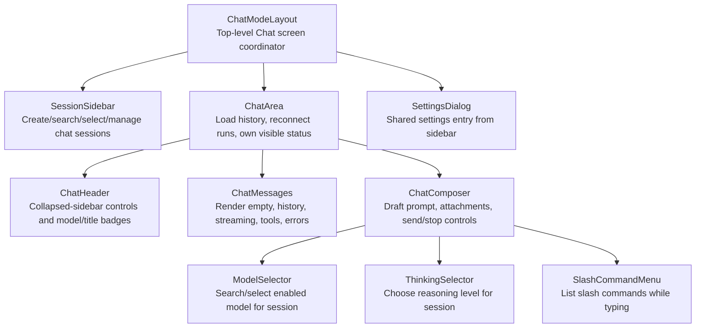
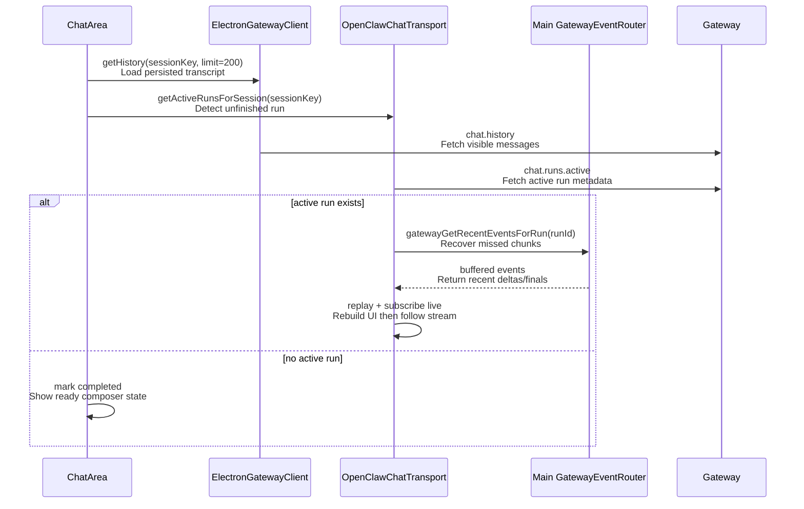
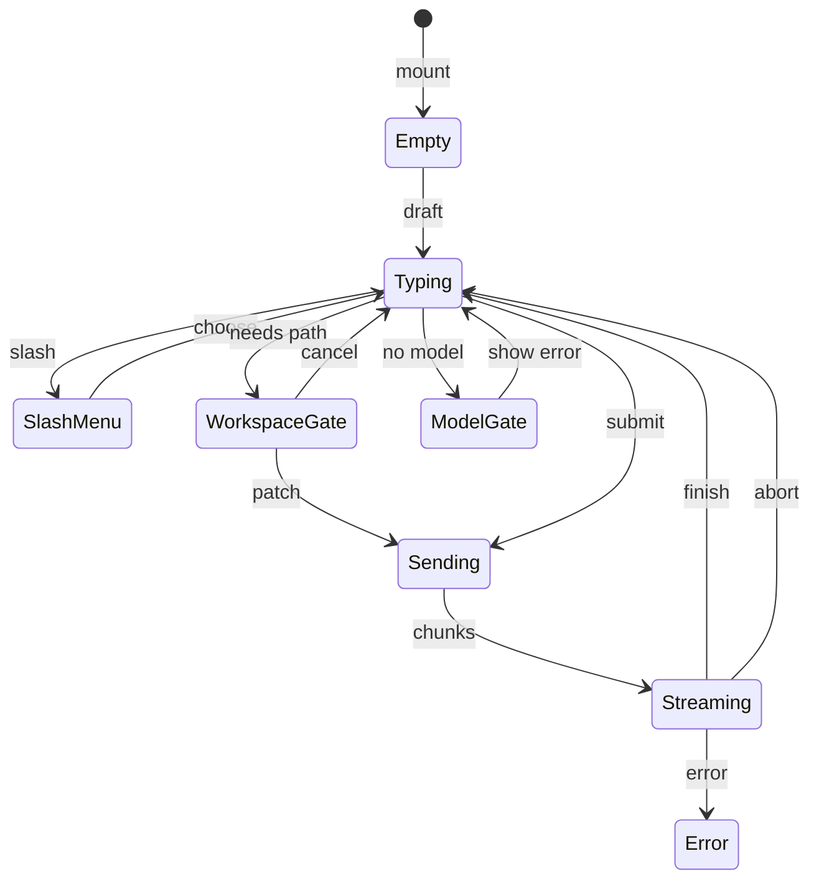
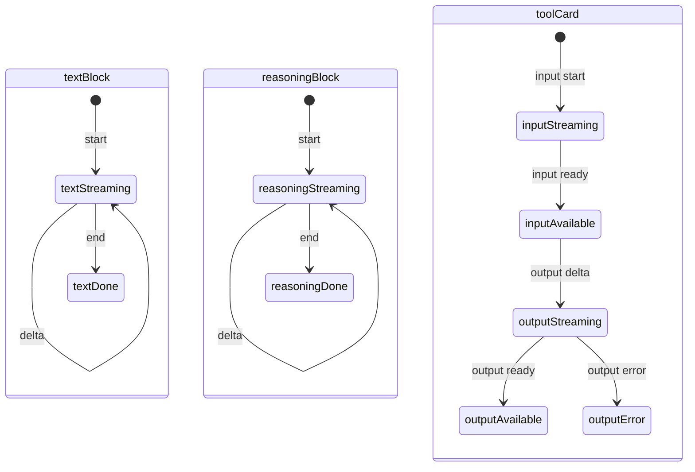

# Chat Runtime Contract

Source rows: `CHAT-01` through `CHAT-08`

Entry path: main window frame -> Chat mode

Status: Draft, source-anchored

## Purpose

This file explains the Chat tab from the user's point of view. Read it when you are changing sessions, the message list, the composer, model/thinking controls, send/stop behavior, reconnect, or visible errors. It stops at the visible Chat workflow; lower-level stream and provider details live in the linked transport contracts.

## Core Responsibilities

| Owner                     | What it does                                                                                                                          | What it does not cover                                                                    |
| ------------------------- | ------------------------------------------------------------------------------------------------------------------------------------- | ----------------------------------------------------------------------------------------- |
| `ChatModeLayout`          | Assembles the Chat screen: shared sidebar, chat area, and settings dialog.                                                            | It does not own stream/event normalization.                                               |
| `SessionSidebar`          | Lets the user create, search, select, rename, and delete chat sessions.                                                               | Code-specific workspace grouping belongs to `code-ide/`.                                  |
| `ChatArea`                | Loads history, reconnects active runs, tracks visible run/error state, and wires header/messages/composer.                            | It delegates message-part reduction to `useChat` and transport helpers.                   |
| `ChatHeader`              | Shows collapsed-sidebar controls, session title, and model status.                                                                    | It does not change provider configuration.                                                |
| `ChatMessages`            | Renders empty hero, suggestions, older-history loading, reasoning, markdown, tools, command results, and visible ACP boundary blocks. | It renders already-normalized UI message parts.                                           |
| `ChatComposer`            | Owns prompt draft, attachments, slash menu entry, model picker trigger, thinking picker, send, and stop controls.                     | Provider validation and model inventory are documented under provider/gateway boundaries. |
| `client-state-machine.md` | Explains how gateway chunks become visible UI message parts.                                                                          | This file stays focused on user-visible controls and states.                              |

## Step-by-Step Reader Guide

1. Enter Chat mode from the main window frame. `ChatModeLayout` renders sidebar plus `ChatArea`.
2. The sidebar creates/selects the active session and `ChatArea` loads history for that session.
3. If a run is still active, the renderer reconnects to buffered and live events before showing the message list as ready.
4. The message list renders either the empty focused-conversation hero or historical/streaming message parts.
5. The composer lets the user type, attach files, choose a model, choose a thinking level, or open slash commands.
6. Send validates the draft, turns a draft session into a saved session if needed, sends through the chat transport, and shows an optimistic user message.
7. Streaming chunks update text, reasoning, tool, and command-result UI parts until finish, abort, or error.
8. Errors and ACP spawn problems stay visible in Chat until dismissed or resolved by user action.

## UI Surface Map

This map is intentionally written from the user's screen inward. Each visible region has one owning component, and each interactive control is traceable to either local renderer state, Electron preload IPC, or a gateway command.


The empty Chat state shows the session sidebar, focused-conversation hero, suggestion chips, composer, model picker trigger, thinking selector, Settings entry, and account footer.


The model picker opens from the composer model trigger, dims the current conversation, and groups selectable models by provider/runtime.

```text
Chat mode
├─ Left sidebar: SessionSidebar
│  ├─ mode switcher, sidebar collapse, new conversation
│  ├─ search conversations input
│  ├─ date-grouped conversation rows
│  ├─ row menu: rename / delete / confirm delete
│  └─ footer: Settings, account badge, Sign out
└─ Main chat surface: ChatArea
   ├─ ChatHeader: sidebar-open button, title, selected-model state, new conversation
   ├─ ChatMessages
   │  ├─ empty focused-conversation hero and suggestion chips
   │  ├─ history, streaming text, reasoning disclosure, tool cards
   │  ├─ slash command result card
   │  └─ visible ACP boundary blocks and error banners
   └─ ChatComposer
      ├─ prompt textarea and attachment chips
      ├─ attachment menu
      ├─ model picker trigger, retry, search, provider groups, selection
      ├─ thinking picker
      └─ send / stop button
```

## Control To API Matrix

| Visible control or state              | User action                                          | Renderer owner and purpose                                                                                                                                                                                       | Backend/API boundary                                                                                       | Visible result                                                                              | Evidence                                                                                                                                                                                                                                                                                                                                                          |
| ------------------------------------- | ---------------------------------------------------- | ---------------------------------------------------------------------------------------------------------------------------------------------------------------------------------------------------------------- | ---------------------------------------------------------------------------------------------------------- | ------------------------------------------------------------------------------------------- | ----------------------------------------------------------------------------------------------------------------------------------------------------------------------------------------------------------------------------------------------------------------------------------------------------------------------------------------------------------------- |
| New conversation                      | Click sidebar or header new action                   | `SessionSidebar` and `ChatHeader` ask the session store for a Chat draft so the user can type before a gateway session exists.                                                                                   | Local `SessionStore`; first send later turns the draft into a saved session.                               | A new or reused draft conversation becomes active.                                          | `apps/electron/src/renderer/src/components/sidebar/SessionSidebar.tsx:88`; `apps/electron/src/renderer/src/components/chat/ChatHeader.tsx:50`; `apps/electron/src/renderer/src/stores/session-store.ts:572`                                                                                                                                                       |
| Search conversations                  | Type in the search box or clear it                   | `SessionSearch` keeps the input value and `SessionSidebar` filters visible session rows.                                                                                                                         | Local renderer state only.                                                                                 | The sidebar list narrows to matching rows.                                                  | `apps/electron/src/renderer/src/components/sidebar/SessionSearch.tsx:17`; `apps/electron/src/renderer/src/components/sidebar/SessionSearch.tsx:23`; `apps/electron/src/renderer/src/components/sidebar/SessionSidebar.tsx:204`                                                                                                                                    |
| Conversation row                      | Click a row                                          | `SessionItem` selects the session; `ChatArea` then bootstraps visible history and active-run recovery for that session.                                                                                          | `chat.history` via `ElectronGatewayClient.getHistory`; `chat.runs.active` via `getActiveRunsForSession`.   | Message list shows the selected conversation or reconnects its active run.                  | `apps/electron/src/renderer/src/components/sidebar/SessionItem.tsx:118`; `apps/electron/src/renderer/src/components/chat/ChatArea.tsx:323`; `apps/electron/src/renderer/src/lib/electron-gateway-client.ts:83`; `apps/electron/src/renderer/src/lib/electron-gateway-client.ts:151`                                                                               |
| Rename conversation                   | Open row menu, submit new title                      | `SessionItem` validates the menu action and the session store patches the title.                                                                                                                                 | `sessions.patch` from the renderer session store.                                                          | Row title updates optimistically.                                                           | `apps/electron/src/renderer/src/components/sidebar/SessionItem.tsx:69`; `apps/electron/src/renderer/src/stores/session-store.ts:668`                                                                                                                                                                                                                              |
| Delete conversation                   | Open row menu, confirm delete                        | `SessionItem` shows confirmation and the session store deletes the session record.                                                                                                                               | `sessions.delete` from the renderer session store.                                                         | The row disappears; active selection moves according to store behavior.                     | `apps/electron/src/renderer/src/components/sidebar/SessionItem.tsx:97`; `apps/electron/src/renderer/src/components/sidebar/SessionItem.tsx:153`; `apps/electron/src/renderer/src/stores/session-store.ts:710`                                                                                                                                                     |
| Empty hero suggestion chip            | Click a suggested prompt                             | `ChatMessages` forwards the chip text as a prompt to the composer send path.                                                                                                                                     | Same as Send: draft materialization if needed, then `chat.send`.                                           | The suggestion becomes a user prompt and streaming begins if accepted.                      | `apps/electron/src/renderer/src/components/chat/ChatMessages.tsx:232`; `apps/electron/src/renderer/src/components/chat/ChatMessages.tsx:253`; `apps/electron/src/renderer/src/components/chat/ChatArea.tsx:470`                                                                                                                                                   |
| Older-history sentinel                | Scroll to top when more history exists               | `ChatMessages` exposes the sentinel and `ChatArea` fetches more persisted messages.                                                                                                                              | `chat.history` through the gateway client.                                                                 | Older messages prepend into the message list while loading state is visible.                | `apps/electron/src/renderer/src/components/chat/ChatMessages.tsx:165`; `apps/electron/src/renderer/src/components/chat/ChatArea.tsx:456`; `apps/electron/src/renderer/src/lib/electron-gateway-client.ts:151`                                                                                                                                                     |
| Reasoning disclosure                  | Expand or collapse reasoning                         | `ChatMessages` renders a collapsible reasoning part after `useChat` has reduced reasoning chunks.                                                                                                                | Local UI state; incoming content comes from the chat event stream.                                         | Reasoning text opens or collapses without a backend call.                                   | `apps/electron/src/renderer/src/components/chat/ChatMessages.tsx:288`; `apps/electron/src/renderer/src/hooks/use-chat.ts:492`                                                                                                                                                                                                                                     |
| Prompt textarea                       | Type, paste, press Enter                             | `ChatComposer` keeps the draft text, validates empty input, and routes slash-command keyboard handling.                                                                                                          | Local until submit.                                                                                        | Draft text changes; Enter can submit when valid.                                            | `apps/electron/src/renderer/src/components/chat/ChatComposer.tsx:506`; `apps/electron/src/renderer/src/components/chat/ChatComposer.tsx:510`; `apps/electron/src/renderer/src/components/chat/ChatComposer.tsx:630`; `apps/electron/src/renderer/src/components/chat/ChatComposer.tsx:633`                                                                        |
| Attachment menu and chips             | Attach files, remove chips, submit with attachments  | `ChatComposer` tracks attachments; `OpenClawChatTransport` extracts submitted attachments from UI message parts.                                                                                                 | Attachment metadata is included in the eventual `chat.send` request.                                       | Attachment chips show in the composer and are sent with the prompt.                         | `apps/electron/src/renderer/src/components/chat/ChatComposer.tsx:645`; `apps/electron/src/renderer/src/lib/protocol-bridge.ts:104`                                                                                                                                                                                                                                |
| Slash command menu                    | Type slash query, select command, submit             | `SlashCommandMenu` renders listbox options; transport parses slash text and flags configured ephemeral commands.                                                                                                 | `parseSlashCommand`; ephemeral final text can become `data-command-result`.                                | Command text inserts or a command-result card appears after execution.                      | `apps/electron/src/renderer/src/components/chat/SlashCommandMenu.tsx:63`; `apps/electron/src/renderer/src/components/chat/CommandResultCard.tsx:10`; `apps/electron/src/renderer/src/lib/protocol-bridge.ts:40`; `apps/electron/src/renderer/src/lib/protocol-bridge.ts:48`; `apps/electron/src/renderer/src/lib/dual-stream-handler.ts:333`                      |
| Model picker trigger and Retry        | Click current model, unavailable, no-model, or Retry | `ChatComposer` opens the picker or retries model inventory loading. The trigger labels loading, failed, unavailable, selected, and empty-list states.                                                            | `models.list` through `ElectronGatewayClient.listModels`; selected persisted sessions can patch the model. | Picker opens, reloads, or shows the selected/unavailable/no-model state.                    | `apps/electron/src/renderer/src/components/chat/ChatComposer.tsx:651`; `apps/electron/src/renderer/src/components/chat/ChatComposer.tsx:663`; `apps/electron/src/renderer/src/components/chat/ChatComposer.tsx:675`; `apps/electron/src/renderer/src/lib/electron-gateway-client.ts:134`                                                                          |
| Model picker search and row selection | Search and select Claude Code or provider model      | `ChatComposer` filters and groups enabled model rows; selection updates draft session state or patches the saved session.                                                                                        | `sessions.patch` when the session already exists.                                                          | Picker closes and the composer/header show the selected model.                              | `apps/electron/src/renderer/src/components/chat/ChatComposer.tsx:682`; `apps/electron/src/renderer/src/components/chat/ChatComposer.tsx:703`; `apps/electron/src/renderer/src/components/chat/ChatComposer.tsx:751`; `apps/electron/src/renderer/src/components/chat/ChatComposer.tsx:531`                                                                        |
| Thinking picker                       | Choose off/minimal/low/medium/high/xhigh/adaptive    | `ThinkingSelector` renders native options; `ChatComposer` disables it while streaming and persists changes for saved sessions.                                                                                   | `sessions.patch` for saved sessions; local draft state before the session is saved.                        | The selected reasoning level updates or stays disabled during a run.                        | `apps/electron/src/renderer/src/components/chat/ThinkingSelector.tsx:14`; `apps/electron/src/renderer/src/components/chat/ThinkingSelector.tsx:51`; `apps/electron/src/renderer/src/components/chat/ChatComposer.tsx:434`; `apps/electron/src/renderer/src/components/chat/ChatComposer.tsx:772`                                                                  |
| Send                                  | Click arrow or submit form                           | `ChatComposer` validates input/model, turns a draft into a saved session if needed, optionally opens the Code workspace picker, and calls `ChatArea.onSend`.                                                     | `OpenClawChatTransport.sendMessages` then `ElectronGatewayClient.sendMessage` -> `chat.send`.              | User message appears optimistically and the assistant run enters submitted/streaming state. | `apps/electron/src/renderer/src/components/chat/ChatComposer.tsx:506`; `apps/electron/src/renderer/src/components/chat/ChatComposer.tsx:514`; `apps/electron/src/renderer/src/components/chat/ChatComposer.tsx:575`; `apps/electron/src/renderer/src/lib/protocol-bridge.ts:86`; `apps/electron/src/renderer/src/lib/electron-gateway-client.ts:155`              |
| Stop                                  | Click stop while streaming                           | `ChatComposer` renders stop state through `PromptInputSubmit`; transport aborts the active run.                                                                                                                  | `ElectronGatewayClient.abortMessage` -> `chat.abort`.                                                      | Streaming stops and finish reason is normalized.                                            | `apps/electron/src/renderer/src/components/chat/ChatComposer.tsx:781`; `apps/electron/src/renderer/src/components/chat/ChatComposer.tsx:782`; `apps/electron/src/renderer/src/lib/electron-gateway-client.ts:159`; `apps/electron/src/renderer/src/lib/dual-stream-handler.ts:544`                                                                                |
| Active-run recovery                   | Open an active conversation                          | `ChatArea` checks active runs and `OpenClawChatTransport` replays recent events before subscribing live.                                                                                                         | `chat.runs.active`; `gatewayGetRecentEventsForRun`; gateway `chat` event subscription.                     | Missed chunks are replayed and the visible message continues streaming.                     | `apps/electron/src/renderer/src/components/chat/ChatArea.tsx:361`; `apps/electron/src/renderer/src/lib/protocol-bridge.ts:523`; `apps/electron/src/renderer/src/lib/protocol-bridge.ts:539`; `apps/electron/src/renderer/src/lib/electron-gateway-client.ts:163`                                                                                                  |
| Error and ACP spawn banners           | Read details, dismiss, or open settings              | `ChatArea` and `AcpSpawnErrorBanner` render visible recovery affordances for run errors and ACP spawn problems. ACP semantics are covered by `docs/hardware_harness/ui-contracts/agent-ui-contracts-via-acp.md`. | Local session streaming/error store; settings route for recovery.                                          | Details expand/dismiss locally or the user is routed to settings.                           | `apps/electron/src/renderer/src/components/chat/ChatArea.tsx:526`; `apps/electron/src/renderer/src/components/chat/ChatArea.tsx:570`; `apps/electron/src/renderer/src/components/chat/ChatArea.tsx:578`; `apps/electron/src/renderer/src/components/chat/AcpSpawnErrorBanner.tsx:41`; `apps/electron/src/renderer/src/components/chat/AcpSpawnErrorBanner.tsx:82` |

## UI State Matrix

| State                         | Entry condition                                                                              | User-visible surface                                                              | Exit condition                                                                                                  | Evidence                                                                                                                                                                                                |
| ----------------------------- | -------------------------------------------------------------------------------------------- | --------------------------------------------------------------------------------- | --------------------------------------------------------------------------------------------------------------- | ------------------------------------------------------------------------------------------------------------------------------------------------------------------------------------------------------- |
| Empty focused conversation    | Selected session has no visible messages.                                                    | Hero, three suggestion chips, ready composer.                                     | User sends text or clicks a suggestion.                                                                         | `apps/electron/src/renderer/src/components/chat/ChatMessages.tsx:232`; `apps/electron/src/renderer/src/components/chat/ChatMessages.tsx:253`                                                            |
| Ready with history            | `chat.history` has loaded and no active stream is running.                                   | Message list messages, enabled composer, model/thinking controls.                 | User sends, changes session, or reloads older history.                                                          | `apps/electron/src/renderer/src/components/chat/ChatArea.tsx:323`; `apps/electron/src/renderer/src/hooks/use-chat.ts:582`                                                                               |
| Submitted                     | User clicked Send and `useChat` registered pending user intent before first assistant chunk. | Optimistic user message and stop-capable composer state.                          | First text/reasoning/tool chunk arrives, or error/abort occurs.                                                 | `apps/electron/src/renderer/src/hooks/use-chat.ts:291`; `apps/electron/src/renderer/src/components/chat/ChatArea.tsx:470`                                                                               |
| Streaming                     | Gateway chunks are being reduced into UI message parts.                                      | Assistant text/reasoning/tool parts grow in place; thinking picker is disabled.   | Terminal finish, abort, or error chunk.                                                                         | `apps/electron/src/renderer/src/hooks/use-chat.ts:480`; `apps/electron/src/renderer/src/components/chat/ThinkingSelector.tsx:51`                                                                        |
| Missing model                 | Submit occurs without an enabled selected model.                                             | Toast/error path and no gateway send.                                             | User selects a model or model inventory recovers.                                                               | `apps/electron/src/renderer/src/components/chat/ChatComposer.tsx:514`; `apps/electron/src/renderer/src/components/chat/ChatComposer.tsx:651`                                                            |
| Model inventory unavailable   | Model list load failed or selected model is no longer enabled.                               | Retry/unavailable model trigger states.                                           | Retry succeeds or user configures providers.                                                                    | `apps/electron/src/renderer/src/components/chat/ChatComposer.tsx:663`; `apps/electron/src/renderer/src/components/chat/ChatComposer.tsx:675`                                                            |
| Reconnecting active run       | A selected session has an active gateway run.                                                | History appears first, then buffered/live chunks replay into the current message. | Buffered events replay and live subscription reaches ready/streaming terminal state.                            | `apps/electron/src/renderer/src/components/chat/ChatArea.tsx:361`; `apps/electron/src/renderer/src/lib/protocol-bridge.ts:523`                                                                          |
| Visible run error             | Transport or reducer exposes an error.                                                       | Error card with details and dismiss affordance.                                   | User dismisses, changes session, or retries with a new send.                                                    | `apps/electron/src/renderer/src/components/chat/ChatArea.tsx:526`; `apps/electron/src/renderer/src/components/chat/ChatArea.tsx:570`; `apps/electron/src/renderer/src/components/chat/ChatArea.tsx:593` |
| Code workspace gate from Chat | A Code-mode chat send has no `codeWorkspacePath`.                                            | Native directory picker opens before the gateway run starts.                      | User cancels and no run starts, or selects a folder and `sessions.patch` persists the workspace before sending. | `apps/electron/src/renderer/src/components/chat/ChatComposer.tsx:544`; `apps/electron/src/renderer/src/components/chat/ChatComposer.tsx:560`                                                            |
| ACP spawn problem             | Session state contains an ACP spawn error.                                                   | ACP spawn banner and disabled send path when relevant.                            | User resolves settings/runtime issue or dismisses according to banner path.                                     | `apps/electron/src/renderer/src/components/chat/AcpSpawnErrorBanner.tsx:41`; `apps/electron/src/renderer/src/components/chat/ChatComposer.tsx:775`                                                      |

## Component Tree

This diagram shows which component handles each visible Chat region, from the mode-level layout down to the composer. It is a static layout map: use it to find the responsible component before reading the interaction rows.



Read the tree by visible region:

| Region          | Owner            | Purpose                                                                    |
| --------------- | ---------------- | -------------------------------------------------------------------------- |
| Whole Chat mode | `ChatModeLayout` | Assembles sidebar, chat area, and settings entry.                          |
| Left side       | `SessionSidebar` | Owns new/search/select/rename/delete session controls.                     |
| Main surface    | `ChatArea`       | Loads history, reconnects active runs, and tracks visible run/error state. |
| Header          | `ChatHeader`     | Shows session title, sidebar controls, and model state.                    |
| Message list    | `ChatMessages`   | Renders empty hero, history, streaming message parts, tools, and errors.   |
| Composer        | `ChatComposer`   | Owns draft input, attachments, model/thinking controls, send, and stop.    |

## Visible Controls

| Row       | Surface             | Control/state                                                            | User action                            | UI result                                                                                                                      | Backend/API path                                   | Evidence                                                                                                                                                                                                                                                                                                                                                                | Coverage        |
| --------- | ------------------- | ------------------------------------------------------------------------ | -------------------------------------- | ------------------------------------------------------------------------------------------------------------------------------ | -------------------------------------------------- | ----------------------------------------------------------------------------------------------------------------------------------------------------------------------------------------------------------------------------------------------------------------------------------------------------------------------------------------------------------------------- | --------------- |
| `CHAT-01` | Chat sidebar        | New conversation quick action                                            | Click new conversation                 | Creates or reuses a Chat draft.                                                                                                | Local session store                                | `apps/electron/src/renderer/src/components/sidebar/SessionSidebar.tsx:88`                                                                                                                                                                                                                                                                                               | L1/L2 partial   |
| `CHAT-01` | Chat sidebar        | Search input and clear button                                            | Type query or clear                    | Updates query and filters visible session rows.                                                                                | Local session store                                | `apps/electron/src/renderer/src/components/sidebar/SessionSearch.tsx:17`; `apps/electron/src/renderer/src/components/sidebar/SessionSearch.tsx:23`; `apps/electron/src/renderer/src/components/sidebar/SessionSidebar.tsx:204`                                                                                                                                          | L2 partial      |
| `CHAT-01` | Chat sidebar        | Date-grouped session list, active row, recency label                     | Click session                          | Active session changes and ChatArea bootstraps history.                                                                        | `chat.history`, `chat.runs.active`                 | `apps/electron/src/renderer/src/components/sidebar/SessionList.tsx:21`; `apps/electron/src/renderer/src/components/sidebar/SessionItem.tsx:118`; `apps/electron/src/renderer/src/components/sidebar/SessionItem.tsx:124`; `apps/electron/src/renderer/src/components/sidebar/SessionItem.tsx:204`                                                                       | L1/L2 partial   |
| `CHAT-01` | Chat sidebar        | Rename menu, delete menu, delete confirmation                            | Submit rename or confirm delete        | Optimistic session store update.                                                                                               | `sessions.patch`, `sessions.delete`                | `apps/electron/src/renderer/src/components/sidebar/SessionItem.tsx:69`; `apps/electron/src/renderer/src/components/sidebar/SessionItem.tsx:97`; `apps/electron/src/renderer/src/components/sidebar/SessionItem.tsx:153`; `apps/electron/src/renderer/src/stores/session-store.ts:668`; `apps/electron/src/renderer/src/stores/session-store.ts:710`                     | L2 partial      |
| `CHAT-02` | Header              | Open sidebar and New conversation controls                               | Click controls                         | Sidebar opens or new draft session is created.                                                                                 | Local state                                        | `apps/electron/src/renderer/src/components/chat/ChatHeader.tsx:46`; `apps/electron/src/renderer/src/components/chat/ChatHeader.tsx:50`; `apps/electron/src/renderer/src/components/chat/ChatHeader.tsx:64`                                                                                                                                                              | No L3 test      |
| `CHAT-02` | Header              | Title, model badge, unavailable-model badge                              | Read header state                      | Shows session title and selected model state.                                                                                  | Local model store                                  | `apps/electron/src/renderer/src/components/chat/ChatHeader.tsx:28`; `apps/electron/src/renderer/src/components/chat/ChatHeader.tsx:76`; `apps/electron/src/renderer/src/components/chat/ChatHeader.tsx:78`; `apps/electron/src/renderer/src/components/chat/ChatHeader.tsx:89`                                                                                          | No L3 test      |
| `CHAT-03` | Message list        | Empty focused-conversation hero and suggestion chips                     | Click suggestion                       | Sends suggestion as prompt.                                                                                                    | `chat.send`                                        | `apps/electron/src/renderer/src/components/chat/ChatMessages.tsx:232`; `apps/electron/src/renderer/src/components/chat/ChatMessages.tsx:253`; `apps/electron/src/renderer/src/components/chat/ChatMessages.tsx:260`                                                                                                                                                     | L2 partial      |
| `CHAT-03` | Message list        | Older-history sentinel and loading text                                  | Scroll to top when more history exists | Loads older messages and shows loading state.                                                                                  | `chat.history`                                     | `apps/electron/src/renderer/src/components/chat/ChatMessages.tsx:165`; `apps/electron/src/renderer/src/components/chat/ChatMessages.tsx:168`; `apps/electron/src/renderer/src/components/chat/ChatArea.tsx:456`                                                                                                                                                         | No focused test |
| `CHAT-03` | Message list        | Reasoning disclosure                                                     | Click reasoning trigger                | Collapses or expands reasoning content.                                                                                        | Local UI state                                     | `apps/electron/src/renderer/src/components/chat/ChatMessages.tsx:288`                                                                                                                                                                                                                                                                                                   | L2 partial      |
| `CHAT-03` | Message list        | Markdown/code/table/mermaid controls, tool cards, command-result card    | Inspect, copy, dismiss                 | Renders normalized UIMessage parts and local dismiss actions.                                                                  | Stream/history normalization                       | `apps/electron/src/renderer/src/components/ai-elements/message.tsx:273`; `apps/electron/src/renderer/src/components/chat/ChatMessages.tsx:362`; `apps/electron/src/renderer/src/components/chat/ChatArea.tsx:567`; `apps/electron/src/renderer/src/components/chat/CommandResultCard.tsx:10`; `apps/electron/src/renderer/src/components/chat/CommandResultCard.tsx:21` | L1/L2 partial   |
| `CHAT-03` | Message list        | ACP visible tool, permission, status, and modified-files blocks          | Inspect visible ACP blocks             | Renders ACP boundary markers; ACP semantics are covered by `docs/hardware_harness/ui-contracts/agent-ui-contracts-via-acp.md`. | Stream/history normalization                       | `apps/electron/src/renderer/src/components/chat/ChatMessages.tsx:313`; `apps/electron/src/renderer/src/components/chat/ChatMessages.tsx:326`; `apps/electron/src/renderer/src/components/chat/ChatMessages.tsx:340`; `apps/electron/src/renderer/src/components/chat/ChatMessages.tsx:348`                                                                              | L2 partial      |
| `CHAT-04` | Composer            | Composer card, textarea, attached files display, attachment menu         | Type or attach file                    | Message draft and attachment chips update.                                                                                     | Local until submit                                 | `apps/electron/src/renderer/src/components/chat/ChatComposer.tsx:607`; `apps/electron/src/renderer/src/components/chat/ChatComposer.tsx:628`; `apps/electron/src/renderer/src/components/chat/ChatComposer.tsx:630`; `apps/electron/src/renderer/src/components/chat/ChatComposer.tsx:645`                                                                              | L2 partial      |
| `CHAT-04` | Composer            | Slash command listbox/options                                            | Type slash query or select command     | Slash menu can insert command text.                                                                                            | Local until submit                                 | `apps/electron/src/renderer/src/components/chat/SlashCommandMenu.tsx:63`; `apps/electron/src/renderer/src/components/chat/SlashCommandMenu.tsx:90`; `apps/electron/src/renderer/src/components/chat/SlashCommandMenu.tsx:102`                                                                                                                                           | No focused test |
| `CHAT-05` | Model picker        | Trigger label: loading, Retry, selected model, unavailable, no models    | Click trigger or retry                 | Opens model picker or reloads model list on error.                                                                             | Provider/model list via renderer model store       | `apps/electron/src/renderer/src/components/chat/ChatComposer.tsx:651`; `apps/electron/src/renderer/src/components/chat/ChatComposer.tsx:663`; `apps/electron/src/renderer/src/components/chat/ChatComposer.tsx:675`; `apps/electron/src/renderer/src/components/chat/ChatComposer.tsx:678`                                                                              | L2 partial      |
| `CHAT-05` | Model picker        | Search models, Claude Code entry, provider groups, icons, selected check | Select model                           | Updates current/draft session model and closes picker.                                                                         | `sessions.patch` for saved sessions                | `apps/electron/src/renderer/src/components/chat/ChatComposer.tsx:80`; `apps/electron/src/renderer/src/components/chat/ChatComposer.tsx:88`; `apps/electron/src/renderer/src/components/chat/ChatComposer.tsx:682`; `apps/electron/src/renderer/src/components/chat/ChatComposer.tsx:703`; `apps/electron/src/renderer/src/components/chat/ChatComposer.tsx:751`         | L2 partial      |
| `CHAT-06` | Thinking picker     | Native select options and current level                                  | Select level                           | Updates current/draft thinking level.                                                                                          | `sessions.patch` for saved sessions                | `apps/electron/src/renderer/src/components/chat/ThinkingSelector.tsx:14`; `apps/electron/src/renderer/src/components/chat/ThinkingSelector.tsx:35`; `apps/electron/src/renderer/src/components/chat/ThinkingSelector.tsx:46`; `apps/electron/src/renderer/src/components/chat/ChatComposer.tsx:434`                                                                     | L2 partial      |
| `CHAT-06` | Thinking picker     | Streaming-disabled state                                                 | Stream is running                      | Native select is disabled.                                                                                                     | Local status                                       | `apps/electron/src/renderer/src/components/chat/ThinkingSelector.tsx:51`; `apps/electron/src/renderer/src/components/chat/ChatComposer.tsx:772`                                                                                                                                                                                                                         | No L3 test      |
| `CHAT-07` | Composer send       | Empty prompt no-op and no-model toast                                    | Click send while invalid               | Empty message returns; missing model shows toast.                                                                              | Local validation                                   | `apps/electron/src/renderer/src/components/chat/ChatComposer.tsx:506`; `apps/electron/src/renderer/src/components/chat/ChatComposer.tsx:510`; `apps/electron/src/renderer/src/components/chat/ChatComposer.tsx:514`                                                                                                                                                     | L2 partial      |
| `CHAT-07` | Composer send       | ACP spawn error disables send                                            | ACP error is present                   | Submit button is disabled.                                                                                                     | Local session state                                | `apps/electron/src/renderer/src/components/chat/ChatComposer.tsx:775`; `apps/electron/src/renderer/src/components/chat/ChatComposer.tsx:778`                                                                                                                                                                                                                            | No L3 test      |
| `CHAT-07` | Composer send       | Optimistic user message and Stop button                                  | Click send or Stop                     | Sends, streams, or aborts run.                                                                                                 | `chat.send`, `chat.abort`                          | `apps/electron/src/renderer/src/components/chat/ChatArea.tsx:470`; `apps/electron/src/renderer/src/components/chat/ChatArea.tsx:476`; `apps/electron/src/renderer/src/components/chat/ChatComposer.tsx:781`; `apps/electron/src/renderer/src/components/chat/ChatComposer.tsx:782`                                                                                      | L2 partial      |
| `CHAT-08` | Run recovery/errors | Active-run reconnect                                                     | Return to active run                   | Replays buffered events.                                                                                                       | `chat.runs.active`, `gatewayGetRecentEventsForRun` | `apps/electron/src/renderer/src/components/chat/ChatArea.tsx:361`; `apps/electron/src/renderer/src/components/chat/ChatArea.tsx:381`                                                                                                                                                                                                                                    | L2 partial      |
| `CHAT-08` | Run recovery/errors | Error details disclosure and Dismiss                                     | Expand details or dismiss error        | Shows technical detail or clears visible error.                                                                                | Local session streaming store                      | `apps/electron/src/renderer/src/components/chat/ChatArea.tsx:526`; `apps/electron/src/renderer/src/components/chat/ChatArea.tsx:570`; `apps/electron/src/renderer/src/components/chat/ChatArea.tsx:578`; `apps/electron/src/renderer/src/components/chat/ChatArea.tsx:593`                                                                                              | L2 partial      |
| `CHAT-08` | Run recovery/errors | ACP spawn error banner states                                            | Read banner or open settings           | Shows Claude Code unavailable/auth/runtime-disabled copy.                                                                      | Local session state/settings route                 | `apps/electron/src/renderer/src/components/chat/AcpSpawnErrorBanner.tsx:41`; `apps/electron/src/renderer/src/components/chat/AcpSpawnErrorBanner.tsx:82`                                                                                                                                                                                                                | No L3 test      |

## Bootstrap And Reconnect

This diagram explains what happens when a user opens an existing Chat session. "Bootstrap" means loading the visible transcript and composer state for the selected session. "Reconnect" means detecting that the session already has an unfinished gateway run and rebuilding the live UI from buffered events before following the live stream.



Read the sequence in this order:

| Step | Actor                   | Purpose                                                                      | User-visible outcome                                                            |
| ---- | ----------------------- | ---------------------------------------------------------------------------- | ------------------------------------------------------------------------------- |
| 1    | `ChatArea`              | Starts session bootstrap when the active session changes.                    | The selected conversation begins loading.                                       |
| 2    | `ElectronGatewayClient` | Requests persisted chat history for the selected session key.                | Existing messages can be rendered in the message list.                          |
| 3    | `OpenClawChatTransport` | Checks whether the same session has an unfinished run.                       | The UI can decide between ready state and stream recovery.                      |
| 4    | `Gateway`               | Returns history and active-run metadata through the renderer-facing clients. | `ChatArea` has enough data to render history and run status.                    |
| 5    | `GatewayEventRouter`    | When a run is active, returns recent buffered events for that run.           | Missed chunks are replayed so the message list does not skip tool/text updates. |
| 6    | `OpenClawChatTransport` | Replays buffered events and subscribes to live events.                       | The active run continues streaming in place.                                    |
| 7    | `ChatArea`              | If no run is active, marks bootstrap complete.                               | The composer is ready for the next prompt.                                      |

Evidence:

- ChatArea bootstrap: `apps/electron/src/renderer/src/components/chat/ChatArea.tsx:323`
- Reconnect transport: `apps/electron/src/renderer/src/lib/protocol-bridge.ts:523`
- Event buffer fetch: `apps/electron/src/renderer/src/lib/electron-gateway-client.ts:83`

## Composer State Machine

This diagram explains the visible lifecycle of the composer, not the model run itself. It answers: when can the user type, when is submit blocked by a gate, when does the UI enter sending/streaming, and what brings the composer back to a usable state.



State responsibilities:

| State           | Meaning                                                                | User-facing responsibility                                                        |
| --------------- | ---------------------------------------------------------------------- | --------------------------------------------------------------------------------- |
| `Empty`         | Composer exists but has no draft text or attachment.                   | Keep send unavailable and wait for user input.                                    |
| `Typing`        | User has a draft or attachment and can continue editing.               | Let the user add content, open slash commands, choose model/thinking, or submit.  |
| `SlashMenu`     | Draft starts a slash query.                                            | Show command options without sending the prompt yet.                              |
| `WorkspaceGate` | Code-mode submit needs a workspace path before tools can run.          | Open the directory picker and either cancel back to editing or patch the session. |
| `ModelGate`     | Submit lacks an enabled model.                                         | Show a visible no-model error and keep the draft editable.                        |
| `Sending`       | Local validation passed and the gateway request is being started.      | Show pending send state and prevent duplicate submit.                             |
| `Streaming`     | Gateway has accepted the run and chunks are updating the message list. | Show stop affordance and disable controls that cannot change mid-run.             |
| `Error`         | The stream produced a visible error.                                   | Keep the failure visible in ChatArea for recovery or inspection.                  |

| Transition label           | Full meaning                                         |
| -------------------------- | ---------------------------------------------------- |
| `mount`                    | Composer is mounted with no draft.                   |
| `draft`                    | User enters text or adds an attachment.              |
| `slash`                    | Slash query opens the command list.                  |
| `choose`                   | Command is selected or the menu is dismissed.        |
| `needs path`               | Code-mode Chat submit lacks a workspace path.        |
| `patch`                    | Directory was selected and patched onto the session. |
| `no model`                 | Submit happened without an enabled model.            |
| `submit`                   | Draft is valid and send starts.                      |
| `chunks`                   | Gateway run starts returning stream chunks.          |
| `finish`, `abort`, `error` | Run reaches a terminal visible composer state.       |

Key evidence:

- Send handler: `apps/electron/src/renderer/src/components/chat/ChatComposer.tsx:506`
- Workspace gate: `apps/electron/src/renderer/src/components/chat/ChatComposer.tsx:544`
- Model availability gate: `apps/electron/src/renderer/src/components/chat/ChatComposer.tsx:279`
- Submit button state: `apps/electron/src/renderer/src/components/chat/ChatComposer.tsx:775`

## Message Part Reducer

This diagram explains how normalized stream events become visible message parts. It is a reducer-level diagram: each nested block is one UI part family, and the arrows show how incoming events mutate that part until it is final or failed.



Part responsibilities:

| Part family      | Purpose                                                             | Visible result                                                          |
| ---------------- | ------------------------------------------------------------------- | ----------------------------------------------------------------------- |
| `textBlock`      | Accumulates assistant text deltas.                                  | A normal assistant text part appears and grows until finalized.         |
| `reasoningBlock` | Accumulates reasoning deltas separately from final answer text.     | A collapsible reasoning disclosure appears and updates.                 |
| `toolCard`       | Tracks tool input, streaming output, final output, and tool errors. | A tool card moves from placeholder to available output or failed state. |

| Reducer label                  | Incoming event meaning                                           |
| ------------------------------ | ---------------------------------------------------------------- |
| `start`, `delta`, `end`        | Text or reasoning block starts, appends content, then finalizes. |
| `input start`, `input ready`   | Tool card placeholder appears and its arguments finalize.        |
| `output delta`, `output ready` | Tool output streams, then final output is available.             |
| `output error`                 | Tool card records a failed output state.                         |

## Message Content Blocks

The Chat message list does not render raw gateway events. `OpenClawChatTransport` and `useChat` first reduce events into `OpenClawUIMessage.parts`, then `ChatMessages` chooses the visible block for each part. When changing message-list UI, match the part shape first, then change the renderer.

| Part shape                            | Where it comes from                                                                                              | What the user sees                                                                                                                                                        | Evidence                                                                                                                                                                                                                                                         |
| ------------------------------------- | ---------------------------------------------------------------------------------------------------------------- | ------------------------------------------------------------------------------------------------------------------------------------------------------------------------- | ---------------------------------------------------------------------------------------------------------------------------------------------------------------------------------------------------------------------------------------------------------------- |
| `{ type: "text", text, state? }`      | Streaming `text-delta`, persisted text content, untagged ACP status text                                         | Assistant markdown content. Markdown tables, code blocks, and mermaid blocks are rendered by the message response stack.                                                  | `apps/electron/src/renderer/src/hooks/use-chat.ts:480`; `apps/electron/src/renderer/src/lib/format-converters.ts:104`; `apps/electron/src/renderer/src/components/chat/ChatMessages.tsx:288`                                                                     |
| `{ type: "reasoning", text }`         | Streaming `reasoning-*`, persisted `thinking` blocks, or text blocks whose `textSignature.phase` is `commentary` | Collapsible reasoning block above the final answer text.                                                                                                                  | `apps/electron/src/renderer/src/hooks/use-chat.ts:492`; `apps/electron/src/renderer/src/lib/format-converters.ts:145`; `apps/electron/src/renderer/src/components/chat/ChatMessages.tsx:288`                                                                     |
| `{ type: "file", mediaType, url }`    | Composer file attachments and persisted image/file content converted to data URLs                                | Inline attachment chip or preview inside the message.                                                                                                                     | `apps/electron/src/renderer/src/components/chat/ChatArea.tsx:38`; `apps/electron/src/renderer/src/lib/format-converters.ts:237`; `apps/electron/src/renderer/src/components/chat/ChatMessages.tsx:302`                                                           |
| `{ type: "tool-<name>", ... }`        | Native chat `agent.tool` lifecycle events or persisted `toolCall` / `toolResult` content                         | Native tool card. `read`, `write`, `edit`, `bash`, and `exec` use specialized renderers; other tools use the generic Parameters/Result card.                              | `apps/electron/src/renderer/src/hooks/use-chat.ts:358`; `apps/electron/src/renderer/src/lib/format-converters.ts:174`; `apps/electron/src/renderer/src/components/chat/ChatMessages.tsx:362`; `apps/electron/src/renderer/src/components/ai-elements/tool.tsx:1` |
| `{ type: "data-acp-tool", data }`     | ACP `tool_call` runtime events                                                                                   | ACP tool block with title/status/text. This is not the same card as native `tool-<name>` parts.                                                                           | `apps/electron/src/renderer/src/lib/acp-bridge.ts:228`; `apps/electron/src/renderer/src/hooks/use-chat.ts:715`; `apps/electron/src/renderer/src/components/chat/AcpToolBlock.tsx:20`; `apps/electron/src/renderer/src/components/chat/ChatMessages.tsx:313`      |
| `{ type: "data-acp-permission" }`     | ACP permission request and resolution events                                                                     | Permission card with allow/deny choices and resolved state.                                                                                                               | `apps/electron/src/renderer/src/lib/acp-bridge.ts:330`; `apps/electron/src/renderer/src/hooks/use-chat.ts:715`; `apps/electron/src/renderer/src/components/chat/ChatMessages.tsx:326`                                                                            |
| `{ type: "data-acp-status" }`         | Tagged ACP status events or seq-gap recovery status                                                              | Compact ACP status block. Untagged status text renders as normal assistant text instead.                                                                                  | `apps/electron/src/renderer/src/lib/acp-bridge.ts:246`; `apps/electron/src/renderer/src/lib/acp-bridge.ts:128`; `apps/electron/src/renderer/src/components/chat/ChatMessages.tsx:340`                                                                            |
| `{ type: "data-acp-modified-files" }` | End-of-turn ACP mutation summary                                                                                 | Modified files block with links back into the Code workspace.                                                                                                             | `apps/electron/src/renderer/src/lib/acp-bridge.ts:267`; `apps/electron/src/renderer/src/components/chat/ChatMessages.tsx:348`                                                                                                                                    |
| `data-command-result` chunk           | Final output from ephemeral slash commands: `/status`, `/usage`, `/queue`, `/export`, `/import`                  | Dismissible command result card below the message list. It says `Command result · not saved`, because it lives in `ChatArea` state instead of the persisted message list. | `apps/electron/src/renderer/src/lib/protocol-bridge.ts:40`; `apps/electron/src/renderer/src/lib/dual-stream-handler.ts:333`; `apps/electron/src/renderer/src/hooks/use-chat.ts:699`; `apps/electron/src/renderer/src/components/chat/CommandResultCard.tsx:10`   |

### Native Tool Card Shape

Native tool cards use AI SDK-style dynamic tool parts in the message itself:

```typescript
type NativeToolPart = {
  type: `tool-${string}`;
  toolCallId: string;
  state:
    | "input-streaming"
    | "input-available"
    | "output-streaming"
    | "approval-requested"
    | "approval-responded"
    | "output-available"
    | "output-error"
    | "output-denied";
  input?: unknown;
  output?: unknown;
  errorText?: string;
  progress?: {
    stage?: string;
    current?: number;
    total?: number | null;
    percent?: number | null;
    message?: string;
  };
};
```

Native tool rendering rules:

| Rule                                    | Behavior                                                                                                                                                                    | Evidence                                                                                                                                                                                                          |
| --------------------------------------- | --------------------------------------------------------------------------------------------------------------------------------------------------------------------------- | ----------------------------------------------------------------------------------------------------------------------------------------------------------------------------------------------------------------- |
| Keyed update                            | `useChat` finds an existing `tool-` part by `toolCallId`; if it exists, the part is replaced in place. If it does not exist, the part is appended to the assistant message. | `apps/electron/src/renderer/src/hooks/use-chat.ts:358`                                                                                                                                                            |
| Tool name preservation                  | `tool-input-start` and `tool-input-available` remember `toolName` for the call id, so final output can update the same `tool-<name>` part.                                  | `apps/electron/src/renderer/src/hooks/use-chat.ts:526`; `apps/electron/src/renderer/src/hooks/use-chat.ts:639`                                                                                                    |
| Streaming progress                      | `data-tool-update` sets `state="output-streaming"` and extracts progress from `partialResult.details.progress` or the first text content block.                             | `apps/electron/src/renderer/src/hooks/use-chat.ts:172`; `apps/electron/src/renderer/src/hooks/use-chat.ts:662`                                                                                                    |
| Final output                            | `tool-output-available` sets `state="output-available"` and stores raw `output`.                                                                                            | `apps/electron/src/renderer/src/hooks/use-chat.ts:649`                                                                                                                                                            |
| Error output                            | `data-tool-error` sets `state="output-error"` and stringifies `error` into `errorText`.                                                                                     | `apps/electron/src/renderer/src/hooks/use-chat.ts:213`; `apps/electron/src/renderer/src/hooks/use-chat.ts:682`                                                                                                    |
| Consecutive tools                       | Consecutive `tool-` parts in one message are grouped into one collapsible `ToolGroup`; a single tool renders as its own card.                                               | `apps/electron/src/renderer/src/components/chat/ChatMessages.tsx:177`; `apps/electron/src/renderer/src/components/chat/ChatMessages.tsx:362`; `apps/electron/src/renderer/src/components/ai-elements/tool.tsx:79` |
| Specialized renderers                   | `read`, `write`, `edit`, `bash`, and `exec` bypass the generic JSON card and render file content, diffs, or terminal output.                                                | `apps/electron/src/renderer/src/components/chat/ChatMessages.tsx:398`; `apps/electron/src/renderer/src/components/ai-elements/tool-renderers.tsx:1`                                                               |
| Unknown or orphaned history tool result | History conversion falls back to `tool-unknown` when a `toolResult` has no matching `toolCall`.                                                                             | `apps/electron/src/renderer/src/lib/format-converters.ts:211`                                                                                                                                                     |

### Persisted History Conversion

History loaded from `chat.history` is normalized before it reaches the message list:

| Gateway content shape                        | UI part result                                                                                                             | Evidence                                                                                                                     |
| -------------------------------------------- | -------------------------------------------------------------------------------------------------------------------------- | ---------------------------------------------------------------------------------------------------------------------------- |
| `role: "system"`                             | Filtered out.                                                                                                              | `apps/electron/src/renderer/src/lib/format-converters.ts:314`                                                                |
| String content or `{ type: "text", text }`   | `text` part. If `textSignature.phase` is `commentary`, it becomes `reasoning` instead.                                     | `apps/electron/src/renderer/src/lib/format-converters.ts:104`; `apps/electron/src/renderer/src/lib/format-converters.ts:145` |
| `{ type: "thinking", thinking }`             | `reasoning` part.                                                                                                          | `apps/electron/src/renderer/src/lib/format-converters.ts:161`                                                                |
| `{ type: "toolCall", id, name, arguments }`  | `tool-<name>` part with `state="input-available"` and `input=arguments`.                                                   | `apps/electron/src/renderer/src/lib/format-converters.ts:167`                                                                |
| `{ type: "toolResult", toolCallId, result }` | Updates the matching tool part to `output-available` or `output-error`; falls back to `tool-unknown` when no call matches. | `apps/electron/src/renderer/src/lib/format-converters.ts:184`; `apps/electron/src/renderer/src/lib/format-converters.ts:211` |
| Standalone `role: "toolResult"` message      | Converted into a tool card and merged into the previous assistant message when possible.                                   | `apps/electron/src/renderer/src/lib/format-converters.ts:126`; `apps/electron/src/renderer/src/lib/format-converters.ts:257` |
| `{ type: "image" }` or `{ type: "file" }`    | `file` part with `data:<mime>;base64,<content>` URL.                                                                       | `apps/electron/src/renderer/src/lib/format-converters.ts:230`                                                                |

Evidence:

- Hook reducer: `apps/electron/src/renderer/src/hooks/use-chat.ts:480`
- Dual stream handler: `apps/electron/src/renderer/src/lib/dual-stream-handler.ts:137`
- Snapshot reconciliation: `apps/electron/src/renderer/src/lib/dual-stream-handler.ts:365`
- Slash-command ephemeral result path: `apps/electron/src/renderer/src/lib/protocol-bridge.ts:40`; `apps/electron/src/renderer/src/lib/dual-stream-handler.ts:333`
- Stop reason normalization: `apps/electron/src/renderer/src/lib/dual-stream-handler.ts:544`

## Gaps

- `CHAT-05` model picker has no focused component test for chefSlug grouping.
- `CHAT-06` thinking picker has no e2e coverage.
- `CHAT-01` sidebar rename/delete/search and `CHAT-02` collapsed-header controls have no L3 coverage.
- `CHAT-03` message list rendering has no complete visual/e2e matrix for markdown, tool, command-result, and ACP visible boundary blocks.
- `CHAT-08` reconnect is covered at transport level but not full Electron e2e.
