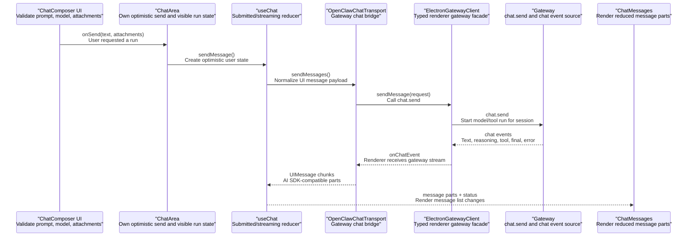
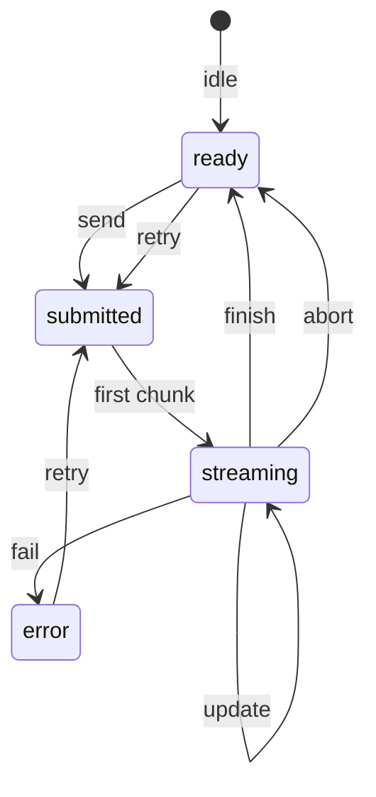
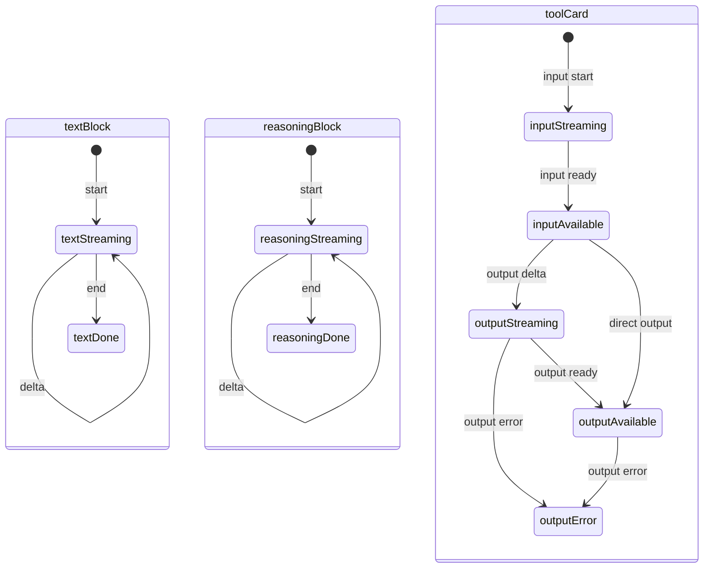
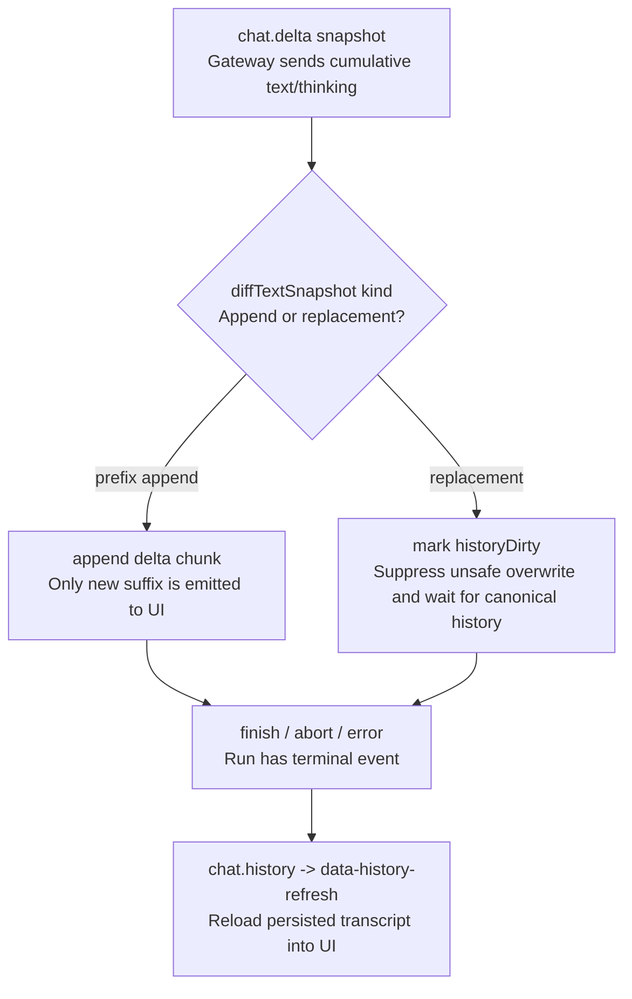
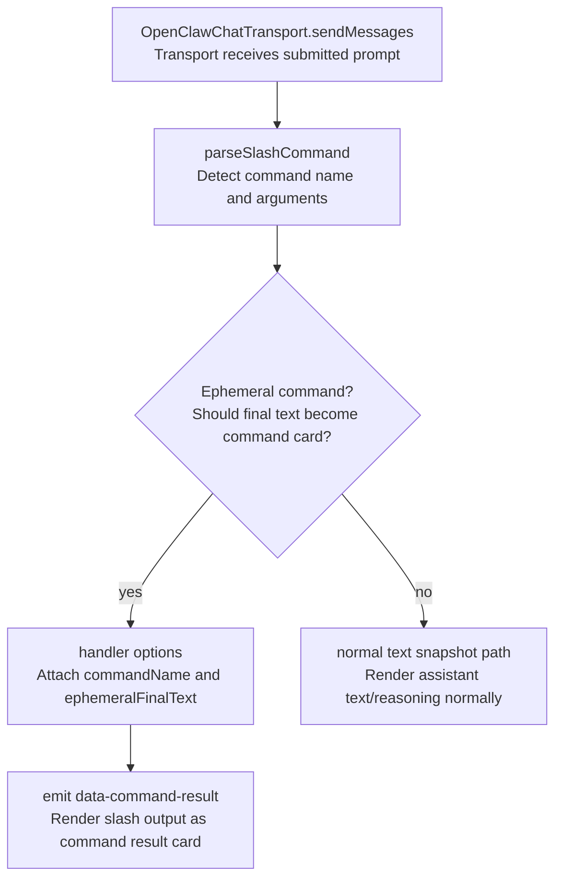
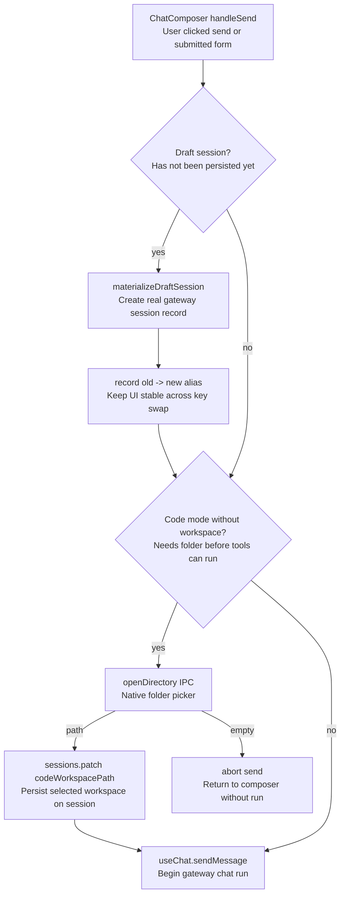
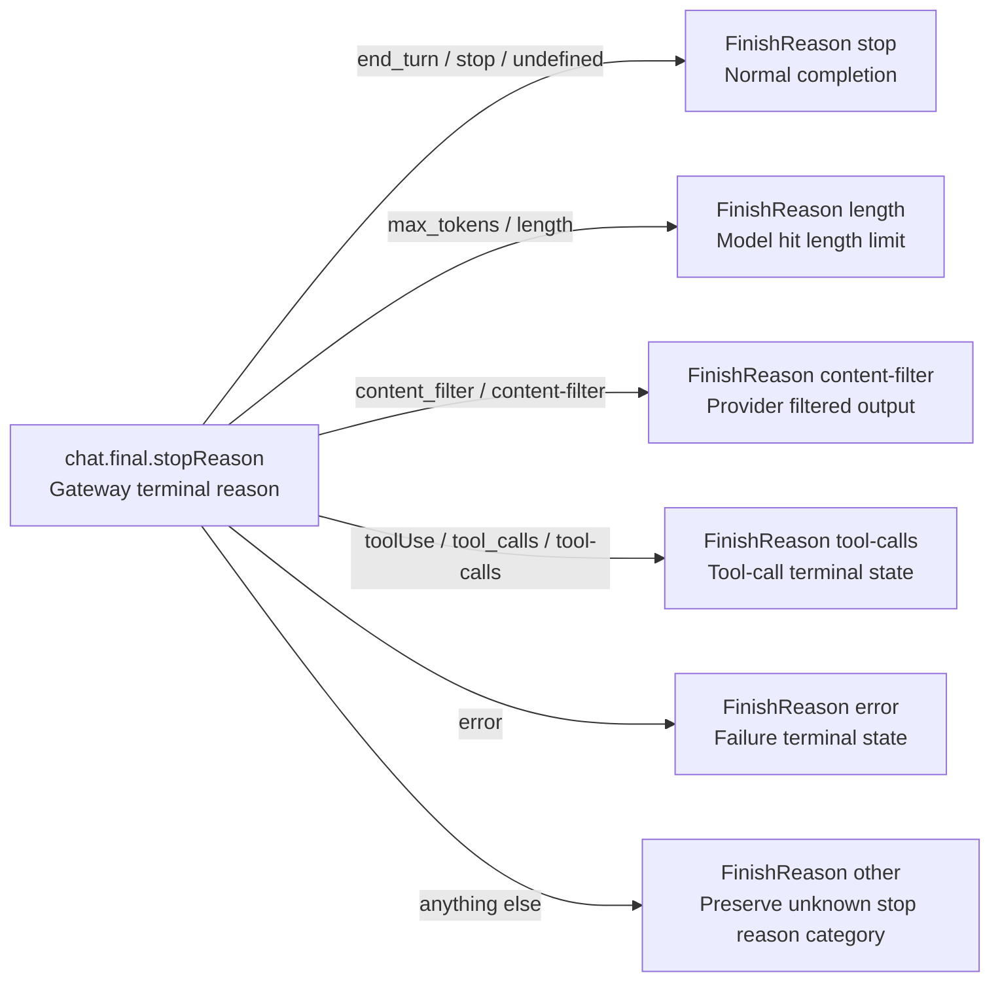

# Chat Client State Machine Contract

Source rows: `CHAT-04`, `CHAT-07`, `CHAT-08`, `BND-03`

Entry path: main window frame -> Chat mode or Code chat tab -> ChatArea -> ChatComposer

Status: Draft, source-anchored

This file explains the renderer state changes that turn gateway chat events into visible message parts. Keep transport method names in `provider-gateway-boundaries/transport-and-events.md`; keep visible buttons, menus, and panels in `chat-runtime.md`.

## Purpose

This file sits between the visible Chat UI and the streaming transport. Use it after `chat-runtime.md` when you need to know why a message changes on screen over time: a prompt is submitted, stream chunks arrive, message parts update, replacement snapshots trigger history refresh, and a draft session becomes a saved session.

## Core Responsibilities

| Owner                         | Responsibility                                                                                                    | Boundary                                                                            |
| ----------------------------- | ----------------------------------------------------------------------------------------------------------------- | ----------------------------------------------------------------------------------- |
| `useChat`                     | Maintains UI status and message-part reducer state for submitted, streaming, ready, and error phases.             | It consumes normalized chunks; provider-specific raw event shape belongs elsewhere. |
| `OpenClawChatTransport`       | Sends Chat prompts, checks active runs, replays buffered events, and subscribes to live events.                   | It does not render UI controls.                                                     |
| `DualStreamHandler`           | Converts gateway snapshots/chunks into AI SDK-compatible text, reasoning, tool, command-result, and final events. | It only covers repo-local consumer behavior.                                        |
| `SessionStore`                | Materializes draft sessions before first send and preserves aliases during session-key changes.                   | Sidebar listing and row behavior are documented in `chat-runtime.md`.               |
| `ChatComposer` workspace gate | Handles the Code-mode special case where a send requires a workspace path.                                        | General Code tab behavior belongs to `code-ide/`.                                   |

## Step-by-Step Reader Guide

1. `ChatComposer` calls `sendMessage()` after local validation passes.
2. If the session is still a draft, the store turns it into a saved session and records the old/new key relationship.
3. If this is a Code-mode chat without a workspace path, the native directory picker must supply one before submit continues.
4. `OpenClawChatTransport` sends the message to the gateway and exposes status back to `useChat`.
5. `DualStreamHandler` converts incoming text, reasoning, tool, slash-command, and final events into reducer chunks.
6. `useChat` updates message parts and visible status; `ChatMessages` renders the result.
7. If snapshots are replacements instead of appends, the transport marks history dirty and refreshes canonical history at the terminal event.
8. Stop reasons are normalized into UI finish reasons before the run is considered complete.

## UI To Transport Call Chain

The Chat UI has two separate contracts: user controls are documented in `chat-runtime.md`, while this file documents the state transition after a valid send or reconnect enters transport code. The sequence below names both the UI responsibility and the interface responsibility so a reader does not have to infer what an API call does from the method name alone.



Read the sequence in this order:

| Step | Handoff                                            | Purpose                                                                                  |
| ---- | -------------------------------------------------- | ---------------------------------------------------------------------------------------- |
| 1    | `ChatComposer` -> `ChatArea`                       | A user action becomes a validated send request with text and attachments.                |
| 2    | `ChatArea` -> `useChat`                            | The message list records the user's prompt optimistically before gateway output returns. |
| 3    | `useChat` -> `OpenClawChatTransport`               | UI messages are converted into the transport payload shape.                              |
| 4    | `OpenClawChatTransport` -> `ElectronGatewayClient` | Transport calls the typed renderer facade instead of speaking raw IPC itself.            |
| 5    | `ElectronGatewayClient` -> `Gateway`               | The gateway starts the `chat.send` run for the session.                                  |
| 6    | `Gateway` -> `ElectronGatewayClient`               | Streaming events return as text, reasoning, tool, final, abort, or error events.         |
| 7    | `ElectronGatewayClient` -> `OpenClawChatTransport` | Renderer-side subscription code filters and forwards the chat events.                    |
| 8    | `OpenClawChatTransport` -> `useChat`               | Events become AI SDK-compatible chunks that the reducer can consume.                     |
| 9    | `useChat` -> `ChatMessages`                        | Reduced message parts and status become visible message-list UI.                         |

| Stage                          | Responsibility                                                                                  | Evidence                                                                                                                                                                                                            |
| ------------------------------ | ----------------------------------------------------------------------------------------------- | ------------------------------------------------------------------------------------------------------------------------------------------------------------------------------------------------------------------- |
| Composer validation            | Stops empty prompts, missing-model submits, and Code-mode missing-workspace sends before run.   | `apps/electron/src/renderer/src/components/chat/ChatComposer.tsx:506`; `apps/electron/src/renderer/src/components/chat/ChatComposer.tsx:514`; `apps/electron/src/renderer/src/components/chat/ChatComposer.tsx:544` |
| Optimistic send                | Lets the visible message list reflect the user message immediately while transport starts.      | `apps/electron/src/renderer/src/components/chat/ChatArea.tsx:470`; `apps/electron/src/renderer/src/hooks/use-chat.ts:291`                                                                                           |
| Gateway send                   | Converts UI messages into the gateway `chat.send` request.                                      | `apps/electron/src/renderer/src/lib/protocol-bridge.ts:86`; `apps/electron/src/renderer/src/lib/electron-gateway-client.ts:155`                                                                                     |
| Gateway event subscription     | Filters gateway events to the `chat` topic and feeds live chunks back to the transport.         | `apps/electron/src/renderer/src/lib/electron-gateway-client.ts:163`; `apps/electron/src/renderer/src/lib/protocol-bridge.ts:523`                                                                                    |
| Reducer-to-renderer projection | Turns chunks into text, reasoning, tool, command-result, finish, abort, or error visible parts. | `apps/electron/src/renderer/src/hooks/use-chat.ts:480`; `apps/electron/src/renderer/src/components/chat/ChatMessages.tsx:362`                                                                                       |

## useChat Status

This diagram explains the coarse run status exposed by `useChat`. It intentionally ignores the shape of individual message parts; those are covered in the next reducer diagram.



State responsibilities:

| State       | Meaning                                                               | Why it matters                                                                      |
| ----------- | --------------------------------------------------------------------- | ----------------------------------------------------------------------------------- |
| `ready`     | No active send is blocking the composer.                              | The user can edit and submit a prompt.                                              |
| `submitted` | The UI accepted the prompt and is waiting for the first stream chunk. | The message list can show optimistic user state before assistant output exists.     |
| `streaming` | At least one stream chunk has arrived.                                | Message parts can grow, tool cards can update, and stop controls should be visible. |
| `error`     | A terminal failure was exposed to the hook.                           | The UI can show recovery affordances and avoid pretending the run succeeded.        |

| Transition                  | Renderer effect                                                                   | Evidence                                                   | Coverage |
| --------------------------- | --------------------------------------------------------------------------------- | ---------------------------------------------------------- | -------- |
| `sendMessage()`             | Starts a submitted run and registers pending user state.                          | `apps/electron/src/renderer/src/hooks/use-chat.ts:291`     | Covered  |
| `text-*` / `reasoning-*`    | Moves status to streaming and appends/updates text or reasoning parts.            | `apps/electron/src/renderer/src/hooks/use-chat.ts:480`     | Covered  |
| `data-tool-*` / tool chunks | Creates or updates tool cards keyed by `toolCallId`.                              | `apps/electron/src/renderer/src/hooks/use-chat.ts:526`     | Covered  |
| `data-history-refresh`      | Replaces in-memory messages with canonical history after terminal reconciliation. | `apps/electron/src/renderer/src/hooks/use-chat.ts:557`     | Covered  |
| `finish`, `abort`, `error`  | Transitions status and updates `useSessionStreamingStore`.                        | `apps/electron/src/renderer/src/hooks/use-chat.ts:582`     | Covered  |
| `regenerate`                | Throws because the gateway transport does not implement regenerate.               | `apps/electron/src/renderer/src/lib/protocol-bridge.ts:96` | Partial  |

## Message Part Reducer

This diagram explains the fine-grained parts inside one assistant response. It is separate from `useChat Status` because a run can stay `streaming` while text, reasoning, and tool cards each advance through their own local lifecycle.



Part responsibilities:

| Part family      | Purpose                                              | End condition                                  |
| ---------------- | ---------------------------------------------------- | ---------------------------------------------- |
| `textBlock`      | Renders assistant answer text from text chunks.      | `text-end` closes the current text part.       |
| `reasoningBlock` | Renders model reasoning separately from answer text. | `reasoning-end` closes the reasoning part.     |
| `toolCard`       | Renders tool-call input, output, and error state.    | Final output or error makes the card terminal. |

| Incoming chunk                                        | Visible UI part result                                             | Evidence                                               | Coverage        |
| ----------------------------------------------------- | ------------------------------------------------------------------ | ------------------------------------------------------ | --------------- |
| `text-start`, `text-delta`, `text-end`                | One text part is created, appended to, and closed.                 | `apps/electron/src/renderer/src/hooks/use-chat.ts:480` | Covered         |
| `reasoning-start`, `reasoning-delta`, `reasoning-end` | One reasoning part is created, appended to, and closed.            | `apps/electron/src/renderer/src/hooks/use-chat.ts:492` | Covered         |
| `tool-input-start`                                    | Tool card placeholder appears with input streaming.                | `apps/electron/src/renderer/src/hooks/use-chat.ts:526` | Covered         |
| `tool-input-available`                                | Tool input is finalized on the same `toolCallId`.                  | `apps/electron/src/renderer/src/hooks/use-chat.ts:526` | Covered         |
| `data-tool-update`                                    | Partial output is added to the tool card.                          | `apps/electron/src/renderer/src/hooks/use-chat.ts:526` | Covered         |
| `tool-output-available`                               | Final tool output is added to the tool card.                       | `apps/electron/src/renderer/src/hooks/use-chat.ts:526` | Covered         |
| `data-tool-error`                                     | Tool card records an error output state.                           | `apps/electron/src/renderer/src/hooks/use-chat.ts:526` | Covered         |
| `data-command-result`                                 | Command result slot is updated for ephemeral slash-command output. | `apps/electron/src/renderer/src/hooks/use-chat.ts:571` | No focused test |

## Tool Card Event Contract

Native tool calls are not rendered from the provider's raw `tool_call` text. The gateway emits `agent` events whose `data` matches `ToolEventData`, `DualStreamHandler` turns those into UI chunks, and `useChat` reduces the chunks into one keyed `tool-<name>` part.

```typescript
type ToolEventData = {
  phase: "start" | "update" | "result";
  name: string;
  toolCallId: string;
  args?: Record<string, unknown>;
  partialResult?: unknown;
  result?: unknown;
  isError?: boolean;
  meta?: unknown;
};
```

| Tool event phase | Required fields                            | UI chunks emitted                                                                                                       | Reducer result                                                                                 | Evidence                                                                                                                                                                        |
| ---------------- | ------------------------------------------ | ----------------------------------------------------------------------------------------------------------------------- | ---------------------------------------------------------------------------------------------- | ------------------------------------------------------------------------------------------------------------------------------------------------------------------------------- |
| `start`          | `name`, `toolCallId`, optional `args`      | `tool-input-start`, then `tool-input-available` with `input=args`                                                       | Tool card appears and shows parameters.                                                        | `apps/electron/src/renderer/src/lib/dual-stream-handler.ts:385`; `apps/electron/src/renderer/src/hooks/use-chat.ts:627`                                                         |
| `update`         | `name`, `toolCallId`, `partialResult`      | `data-tool-update` with `{ toolCallId, toolName, partialResult }`                                                       | Existing card moves to `output-streaming`; progress can show message, percent, current, total. | `apps/electron/src/renderer/src/lib/dual-stream-handler.ts:415`; `apps/electron/src/renderer/src/hooks/use-chat.ts:662`                                                         |
| `result`         | `name`, `toolCallId`, `result`, `isError?` | `tool-output-available` with raw output; if `isError` is true, an additional `data-tool-error` side-channel is emitted. | Existing card stores final output; error side-channel changes the card to `output-error`.      | `apps/electron/src/renderer/src/lib/dual-stream-handler.ts:426`; `apps/electron/src/renderer/src/hooks/use-chat.ts:649`; `apps/electron/src/renderer/src/hooks/use-chat.ts:682` |

The reducer preserves previously known fields on each keyed tool card. A progress update does not erase input; a final output does not erase input; an error adds `errorText` instead of replacing the whole part with plain text.

| UI field     | How it is filled                                                                                                       | Renderer behavior                                                                 |
| ------------ | ---------------------------------------------------------------------------------------------------------------------- | --------------------------------------------------------------------------------- |
| `type`       | Existing part type, or `tool-${toolName}`, or `tool-unknown` if no name is known.                                      | `ChatMessages` derives the visible tool name from this field.                     |
| `toolCallId` | Stable id from gateway/tool runtime.                                                                                   | Used to update the same card in place.                                            |
| `state`      | `input-streaming`, `input-available`, `output-streaming`, `output-available`, or `output-error` in current live paths. | Passed to `ToolHeader` badge and specialized renderers.                           |
| `input`      | `ToolEventData.args`, persisted `toolCall.arguments`, or `{}` when merging a standalone historical result.             | Generic card shows JSON parameters; specialized renderers inspect path/command.   |
| `output`     | `ToolEventData.result`, persisted `toolResult.result`, or merged standalone tool result content.                       | Generic card renders JSON/string result; specialized renderers format by tool.    |
| `errorText`  | `data-tool-error.error`, `details.error`, or an error/status field inferred from persisted output.                     | Tool output panel switches to error styling.                                      |
| `progress`   | `partialResult.details.progress` plus first text content fallback.                                                     | Generic card can show progress message, percent bar, and byte count while active. |

## Message Content Block Data Contract

`OpenClawUIMessage.parts` is the renderer boundary consumed by `ChatMessages`. These are the current part families that can appear in Chat:

| Part family                | Data shape                                                                                            | User-visible block                                                                              | Source path                                                                                                                       |
| -------------------------- | ----------------------------------------------------------------------------------------------------- | ----------------------------------------------------------------------------------------------- | --------------------------------------------------------------------------------------------------------------------------------- |
| Text                       | `{ type: "text", text, state? }`                                                                      | Markdown answer text.                                                                           | `apps/electron/src/renderer/src/hooks/use-chat.ts:480`; `apps/electron/src/renderer/src/lib/format-converters.ts:104`             |
| Reasoning                  | `{ type: "reasoning", text, state? }`                                                                 | Collapsible reasoning disclosure.                                                               | `apps/electron/src/renderer/src/hooks/use-chat.ts:513`; `apps/electron/src/renderer/src/lib/format-converters.ts:145`             |
| File                       | `{ type: "file", mediaType, url, filename? }`                                                         | Inline attachment preview/chip.                                                                 | `apps/electron/src/renderer/src/components/chat/ChatArea.tsx:38`; `apps/electron/src/renderer/src/lib/format-converters.ts:230`   |
| Native tool                | `NativeToolPart` with `type: "tool-<name>"`, `toolCallId`, `state`, optional `input/output/errorText` | Tool card or grouped tool card.                                                                 | `apps/electron/src/renderer/src/hooks/use-chat.ts:358`; `apps/electron/src/renderer/src/components/chat/ChatMessages.tsx:362`     |
| Command result             | Chunk `data-command-result`, stored as `CommandResult` state instead of a message part                | Dismissible slash-command card below the message list; not saved to history.                    | `apps/electron/src/renderer/src/hooks/use-chat.ts:699`; `apps/electron/src/renderer/src/components/chat/CommandResultCard.tsx:10` |
| ACP tool/status/permission | `data-acp-tool`, `data-acp-status`, `data-acp-permission`, `data-acp-modified-files`                  | ACP-specific blocks inside the same message list.                                               | `apps/electron/src/renderer/src/hooks/use-chat.ts:715`; `apps/electron/src/renderer/src/components/chat/ChatMessages.tsx:313`     |
| History refresh            | Chunk `data-history-refresh` with canonical `OpenClawUIMessage[]`                                     | In-memory messages are replaced or merged with canonical history after terminal reconciliation. | `apps/electron/src/renderer/src/hooks/use-chat.ts:723`; `apps/electron/src/renderer/src/lib/protocol-bridge.ts:490`               |

## Snapshot Diff And History Reconciliation

Gateway `chat.delta` text and thinking payloads are cumulative snapshots. The renderer compares each incoming snapshot with the previous snapshot for that run.



Read the flow in this order:

| Step | Node                                   | Purpose                                                                                  |
| ---- | -------------------------------------- | ---------------------------------------------------------------------------------------- |
| 1    | `chat.delta snapshot`                  | Gateway sends the latest cumulative text/thinking value.                                 |
| 2    | `diffTextSnapshot kind`                | Renderer decides whether the new snapshot is a prefix append or a replacement.           |
| 3    | `append delta chunk`                   | Prefix appends are converted into only the new suffix so the UI does not duplicate text. |
| 4    | `mark historyDirty`                    | Replacement snapshots are not blindly rendered over the current stream.                  |
| 5    | `finish / abort / error`               | Terminal event gives the renderer a safe reconciliation point.                           |
| 6    | `chat.history -> data-history-refresh` | Canonical persisted history reloads the final transcript.                                |

| Contract point               | Behavior                                                                                           | Evidence                                                        | Coverage |
| ---------------------------- | -------------------------------------------------------------------------------------------------- | --------------------------------------------------------------- | -------- |
| Prefix snapshot              | Emits only the appended text as a delta chunk.                                                     | `apps/electron/src/renderer/src/lib/dual-stream-handler.ts:365` | Covered  |
| Replacement snapshot         | Suppresses the chunk and marks `historyDirty=true`.                                                | `apps/electron/src/renderer/src/lib/dual-stream-handler.ts:365` | Covered  |
| Terminal after dirty history | Refreshes persisted history and emits `data-history-refresh`.                                      | `apps/electron/src/renderer/src/lib/protocol-bridge.ts:490`     | Covered  |
| OpenAI reasoning wrapper     | Strips `Reasoning:\n_..._` shape before emitting reasoning deltas.                                 | `apps/electron/src/renderer/src/lib/dual-stream-handler.ts:137` | Covered  |
| Multi-block reasoning        | A non-prefix reasoning transition starts a new reasoning block instead of overwriting old content. | `apps/electron/src/renderer/src/lib/dual-stream-handler.ts:137` | Covered  |

## Slash Command Routing



Read the flow in this order:

| Step | Node                                 | Purpose                                                                                     |
| ---- | ------------------------------------ | ------------------------------------------------------------------------------------------- |
| 1    | `OpenClawChatTransport.sendMessages` | Receives the prompt after visible Chat validation has already passed.                       |
| 2    | `parseSlashCommand`                  | Detects whether the submitted prompt is a slash command.                                    |
| 3    | `Ephemeral command?`                 | Splits commands whose final text should become a command-result card from normal chat text. |
| 4    | `handler options`                    | Carries command metadata into the stream handler.                                           |
| 5    | `emit data-command-result`           | Converts command output into the visible command-result card.                               |
| 6    | `normal text snapshot path`          | Keeps non-ephemeral output on the normal assistant text/reasoning path.                     |

| Contract point        | Behavior                                                                  | Evidence                                                                 | Coverage             |
| --------------------- | ------------------------------------------------------------------------- | ------------------------------------------------------------------------ | -------------------- |
| Slash parse boundary  | Transport inspects the submitted text for slash commands.                 | `apps/electron/src/renderer/src/lib/protocol-bridge.ts:40`               | Partial              |
| Ephemeral command set | `status`, `usage`, `queue`, `export`, and `import` use command-result UI. | `apps/electron/src/renderer/src/lib/protocol-bridge.ts:40`               | Partial              |
| Result conversion     | Final text is converted into `data-command-result`.                       | `apps/electron/src/renderer/src/lib/dual-stream-handler.ts:333`          | Partial              |
| Slash menu UI         | Listbox/options are rendered by `SlashCommandMenu`.                       | `apps/electron/src/renderer/src/components/chat/SlashCommandMenu.tsx:62` | No focused unit test |

ACP command merging is covered by `docs/hardware_harness/ui-contracts/agent-ui-contracts-via-acp.md`. The visible menu surface is still listed in Chat rows when it appears.

## Draft Session Materialization



Read the flow in this order:

| Step | Node                               | Purpose                                                               |
| ---- | ---------------------------------- | --------------------------------------------------------------------- |
| 1    | `ChatComposer handleSend`          | Starts after local composer validation accepts the submit action.     |
| 2    | `Draft session?`                   | Checks whether the UI is still using a local draft session key.       |
| 3    | `materializeDraftSession`          | Creates the persisted gateway session before the first real send.     |
| 4    | `record old -> new alias`          | Keeps the UI stable while the session key changes.                    |
| 5    | `Code mode without workspace?`     | Applies the Code-mode-only guard that tools need a workspace path.    |
| 6    | `openDirectory IPC`                | Lets the user choose the workspace folder when required.              |
| 7    | `sessions.patch codeWorkspacePath` | Persists the selected workspace before the run starts.                |
| 8    | `useChat.sendMessage`              | Begins the gateway chat run.                                          |
| 9    | `abort send`                       | Cancels the run startup when the user dismisses the directory picker. |

| Contract point             | Behavior                                                                  | Evidence                                                              | Coverage                    |
| -------------------------- | ------------------------------------------------------------------------- | --------------------------------------------------------------------- | --------------------------- |
| Draft materialization      | Draft sessions are persisted before the first real send.                  | `apps/electron/src/renderer/src/stores/session-store.ts:572`          | Covered                     |
| Alias preservation         | ChatArea keeps old/new session aliases stable during the send transition. | `apps/electron/src/renderer/src/components/chat/ChatArea.tsx:470`     | Covered                     |
| Code workspace picker gate | Code-mode send without workspace opens native directory picker.           | `apps/electron/src/renderer/src/components/chat/ChatComposer.tsx:544` | No focused integration test |
| Code workspace patch       | Selected workspace is patched onto the session before send.               | `apps/electron/src/renderer/src/components/chat/ChatComposer.tsx:560` | No focused integration test |

## Stop Reason Normalization



Read the flow as a normalization table: the gateway may emit provider-shaped stop reasons, but the UI reducer consumes a smaller set of finish categories. Unknown stop reasons intentionally become `other` instead of being dropped.

Evidence: `apps/electron/src/renderer/src/lib/dual-stream-handler.ts:544`

Coverage: `apps/electron/src/renderer/test/dual-stream-handler.test.ts`

## Gaps

- `data-command-result` hook reducer behavior has no focused unit assertion.
- Slash parser and keyboard navigation need focused unit tests.
- Code-mode workspace gate needs renderer integration coverage.
- The producer of the OpenAI-style reasoning wrapper is not proven by this UI contract; this contract only covers repo-local consumer behavior.
