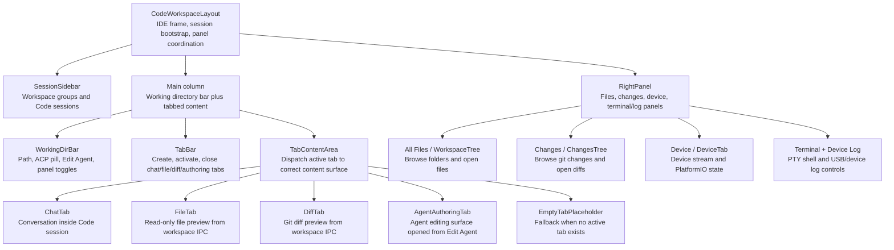
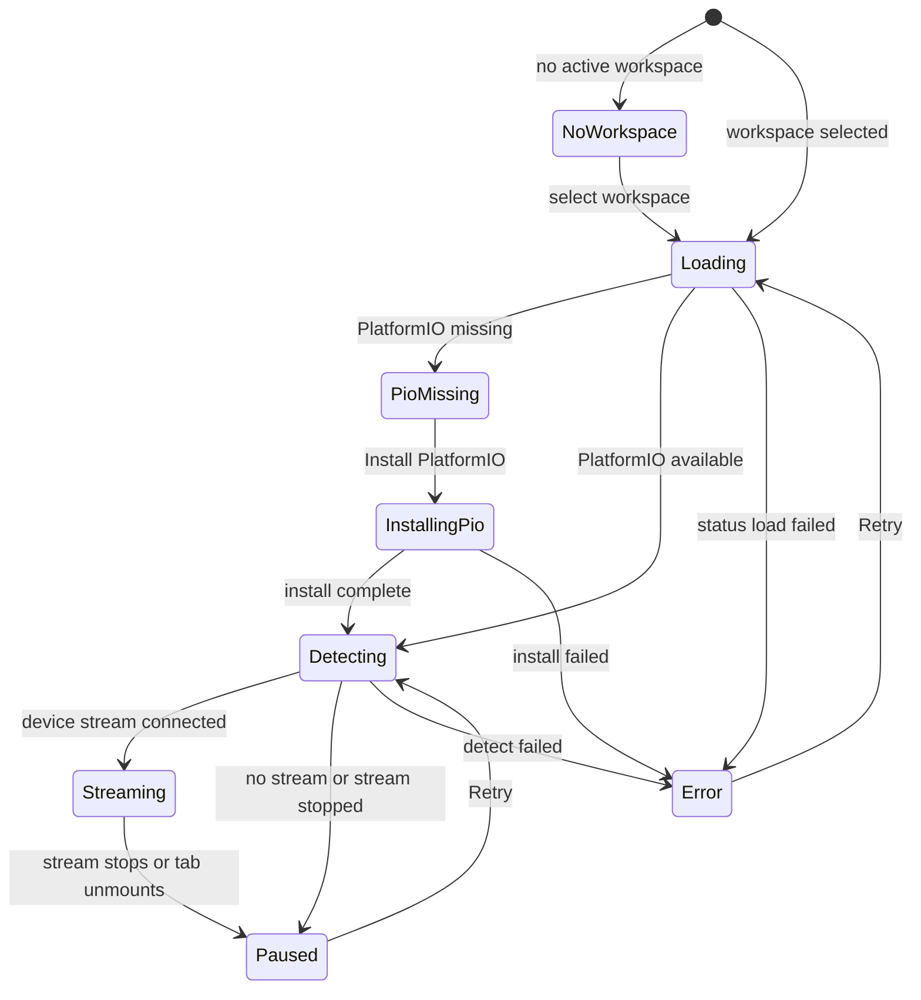
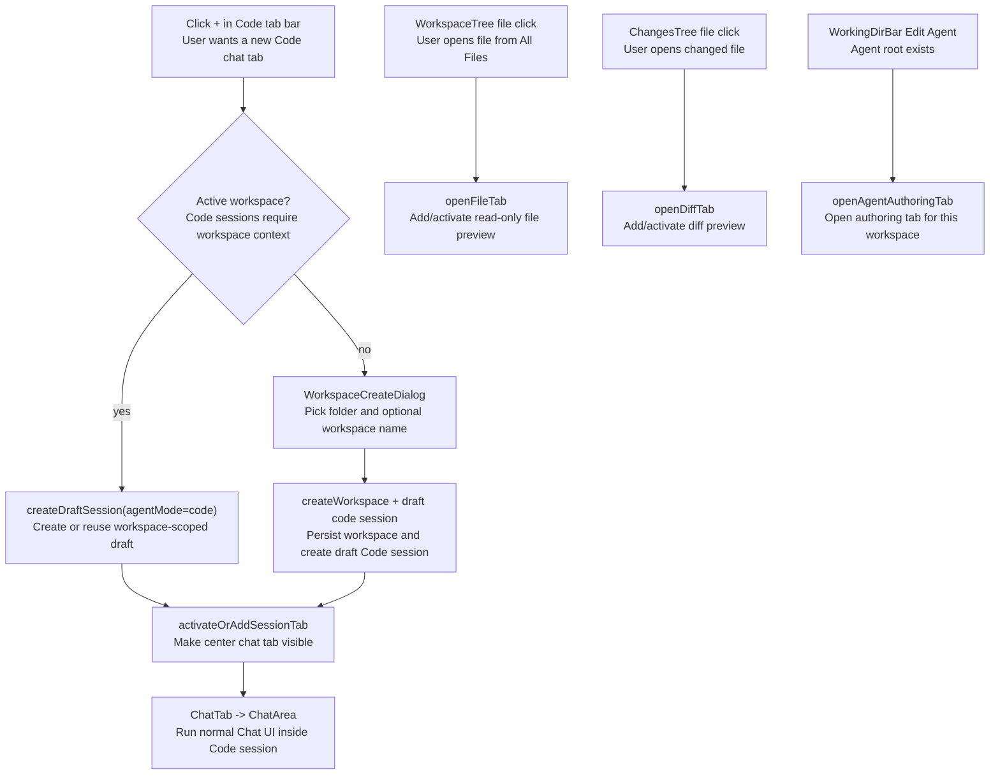
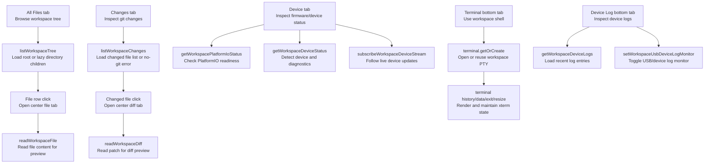

# Code Mode Runtime Contract

Source rows: `CODE-01` through `CODE-13`

Entry path: main window frame -> Code mode

Status: Draft, source-anchored

## Purpose

This file explains the Code tab as the IDE-like workspace in the Electron app. Read it when you are changing workspace selection, Code chat tabs, file or diff previews, device status, terminal/log panels, or the `Edit Agent` entry point. If code exists but users cannot reach it from the current UI, this file calls that out instead of pretending it is shipped.

## Core Responsibilities

| Owner                                                | What it does                                                                                                                        | What it does not cover                                             |
| ---------------------------------------------------- | ----------------------------------------------------------------------------------------------------------------------------------- | ------------------------------------------------------------------ |
| `CodeWorkspaceLayout`                                | Assembles the Code IDE frame, loads Code sessions, ensures an active Code session, and coordinates left/right panel collapse state. | It does not render file contents, diffs, or device details itself. |
| `SessionSidebar` and `WorkspaceGroup`                | Show workspace-grouped Code sessions, workspace expand/collapse controls, create workspace, and create/select Code sessions.        | Chat-only session behavior remains in `chat/`.                     |
| `WorkingDirBar`                                      | Shows workspace path, ACP runtime pill, left/right panel toggles, and `Edit Agent`.                                                 | Agent authoring content belongs to `agent-authoring/`.             |
| `TabBar` and `TabContentArea`                        | Own chat/file/diff/agent-authoring tab creation, activation, close behavior, and fallback empty placeholder.                        | Individual tab content is delegated to specific tab components.    |
| `RightPanel`                                         | Owns top tabs (`All Files`, `Changes`, `Device`) and bottom tabs (`Terminal`, `Device Log`).                                        | Cloud deploy is not visible because `TOP_TABS` omits `cloud`.      |
| `WorkspaceTree`, `ChangesTree`, `FileTab`, `DiffTab` | Bridge the visible file/diff UI to workspace IPC calls.                                                                             | Editing files is not part of current FileTab behavior.             |
| `DeviceTab`, `TerminalPanel`, `DeviceLogPanel`       | Expose device status, PlatformIO setup, terminal PTY, and USB/device logs.                                                          | Firmware/tool semantics are outside this UI contract.              |

## Step-by-Step Reader Guide

1. The user switches to Code mode from the main window frame; `CodeWorkspaceLayout` renders the IDE frame.
2. The sidebar shows workspaces and Code sessions. If none exist, the user creates a workspace through the dialog and native directory picker.
3. Selecting or creating a Code session opens or activates a chat tab in the center tab bar.
4. The working directory bar shows the active workspace path and can open Agent Authoring when an agent root exists.
5. The right panel's `All Files` tab lists workspace files; clicking a file opens a File tab.
6. The `Changes` tab lists git changes; clicking a changed file opens a Diff tab.
7. The `Device` tab shows PlatformIO/device stream state; the bottom panel exposes Terminal and Device Log.
8. If no active tab exists, the center area shows a placeholder. Cloud deploy code exists but is not reachable from the visible top tabs.

## UI Surface Map

The Code tab is an IDE-like frame with five user-visible regions. The map below mirrors the current screenshots and `CodeWorkspaceLayout` composition: left navigation, working directory bar, center tabs, right inspector, and bottom tool panel.


Code mode combines workspace-grouped sessions, a working-directory bar, center chat/file/agent tabs, the right file/device panel, and bottom terminal/device-log tabs.


When `Edit Agent` is available, Code mode opens Agent Authoring as another center tab while keeping the workspace sidebar and right panel in place.

```text
Code mode
├─ Left sidebar: SessionSidebar
│  ├─ mode switcher, search, workspace controls
│  ├─ workspace groups: expand/collapse, counts, new Code session
│  └─ Code conversation rows
├─ Center frame: CodeWorkspaceLayout
│  ├─ WorkingDirBar: workspace path, ACP runtime pill, Edit Agent, panel toggles
│  ├─ TabBar: chat/file/diff/agent tabs, close buttons, plus button
│  └─ TabContentArea
│     ├─ ChatTab: normal ChatArea inside a Code session
│     ├─ FileTab: read-only workspace file preview
│     ├─ DiffTab: read-only git diff preview
│     ├─ AgentAuthoringTab: agent files and authoring controls
│     └─ EmptyTabPlaceholder: no active tab fallback
└─ Right panel: RightPanel
   ├─ top tabs: All Files, Changes, Device
   │  ├─ WorkspaceTree -> FileTab
   │  ├─ ChangesTree -> DiffTab
   │  └─ DeviceTab -> PlatformIO/device status and stream controls
   └─ bottom tabs: Terminal, Device Log
      ├─ TerminalPanel -> workspace PTY
      └─ DeviceLogPanel -> device/USB logs and filters
```

## Control To API Matrix

| Visible control or state            | User action                                                | Renderer owner and purpose                                                                                                      | IPC/API boundary                                                                                                   | Visible result                                                                                       | Evidence                                                                                                                                                                                                                                                                                                                                                                                                                                                                                                                                                                                                                                                                                                                                                             |
| ----------------------------------- | ---------------------------------------------------------- | ------------------------------------------------------------------------------------------------------------------------------- | ------------------------------------------------------------------------------------------------------------------ | ---------------------------------------------------------------------------------------------------- | -------------------------------------------------------------------------------------------------------------------------------------------------------------------------------------------------------------------------------------------------------------------------------------------------------------------------------------------------------------------------------------------------------------------------------------------------------------------------------------------------------------------------------------------------------------------------------------------------------------------------------------------------------------------------------------------------------------------------------------------------------------------- |
| Chat/Code mode selector             | Click Code                                                 | `App` switches app mode and renders `CodeWorkspaceLayout`.                                                                      | Local `useAppStore` mode branch.                                                                                   | IDE-style Code frame replaces Chat main content.                                                     | `apps/electron/src/renderer/src/App.tsx:65`; `apps/electron/src/renderer/src/components/code/CodeWorkspaceLayout.tsx:107`                                                                                                                                                                                                                                                                                                                                                                                                                                                                                                                                                                                                                                            |
| Code frame bootstrap                | Enter Code mode                                            | `CodeWorkspaceLayout` loads sessions, chooses an active Code session, and binds panel state.                                    | Local stores: `useSessionStore`, `usePanelStore`.                                                                  | Sidebar, center tabs, right panel, and bottom panel become available.                                | `apps/electron/src/renderer/src/components/code/CodeWorkspaceLayout.tsx:107`; `apps/electron/src/renderer/src/components/code/CodeWorkspaceLayout.tsx:122`; `apps/electron/src/renderer/src/components/code/CodeWorkspaceLayout.tsx:130`; `apps/electron/src/renderer/src/components/code/CodeWorkspaceLayout.tsx:159`                                                                                                                                                                                                                                                                                                                                                                                                                                               |
| Create workspace dialog             | Click add workspace, Browse, Create, Cancel, close, Esc    | `WorkspaceCreateDialog` gathers a directory path and optional workspace name before the caller creates workspace/session state. | `window.electronAPI.openDirectory`; then `useWorkspaceStore.createWorkspace` from callers.                         | Directory picker fills the form; Create is blocked until a path exists; workspace appears on submit. | `apps/electron/src/renderer/src/components/sidebar/WorkspaceCreateDialog.tsx:17`; `apps/electron/src/renderer/src/components/sidebar/WorkspaceCreateDialog.tsx:32`; `apps/electron/src/renderer/src/components/sidebar/WorkspaceCreateDialog.tsx:53`; `apps/electron/src/renderer/src/components/sidebar/WorkspaceCreateDialog.tsx:76`; `apps/electron/src/renderer/src/components/sidebar/WorkspaceCreateDialog.tsx:87`; `apps/electron/src/renderer/src/components/sidebar/WorkspaceCreateDialog.tsx:108`; `apps/electron/src/renderer/src/components/sidebar/WorkspaceCreateDialog.tsx:145`; `apps/electron/src/renderer/src/components/sidebar/WorkspaceCreateDialog.tsx:148`; `apps/electron/src/renderer/src/components/sidebar/WorkspaceCreateDialog.tsx:151` |
| Workspace group header              | Expand/collapse or select workspace                        | `WorkspaceGroup` toggles visible sessions and can set the active workspace.                                                     | Local `useWorkspaceStore.setActiveWorkspace`.                                                                      | Workspace rows expand/collapse; active workspace context changes.                                    | `apps/electron/src/renderer/src/components/sidebar/WorkspaceGroup.tsx:94`; `apps/electron/src/renderer/src/components/sidebar/WorkspaceGroup.tsx:131`                                                                                                                                                                                                                                                                                                                                                                                                                                                                                                                                                                                                                |
| Workspace plus / new Code session   | Click plus in a workspace group or tab bar                 | `SessionSidebar` and `TabBar` create a workspace-scoped draft Code session and activate a chat tab.                             | `useSessionStore.createDraftSession`; `useTabStore.activateOrAddSessionTab`.                                       | New Code chat tab appears for the workspace.                                                         | `apps/electron/src/renderer/src/components/sidebar/SessionSidebar.tsx:430`; `apps/electron/src/renderer/src/components/sidebar/SessionSidebar.tsx:491`; `apps/electron/src/renderer/src/components/code/TabBar.tsx:114`; `apps/electron/src/renderer/src/components/code/TabBar.tsx:133`                                                                                                                                                                                                                                                                                                                                                                                                                                                                             |
| Code session row                    | Click a Code conversation row                              | Sidebar activates the session and center tab, then the embedded `ChatArea` follows normal Chat bootstrap.                       | Local session/tab stores; chat tab later calls `chat.history` and `chat.runs.active`.                              | Existing Code chat conversation opens in the center.                                                 | `apps/electron/src/renderer/src/components/sidebar/SessionItem.tsx:118`; `apps/electron/src/renderer/src/components/code/TabBar.tsx:104`; `apps/electron/src/renderer/src/components/chat/ChatArea.tsx:323`                                                                                                                                                                                                                                                                                                                                                                                                                                                                                                                                                          |
| Tab click                           | Click chat/file/diff/agent tab                             | `TabBar` sets active tab and, for chat tabs, keeps the matching session active.                                                 | Local `useTabStore.setActiveTab`; session store for chat sessions.                                                 | Center content switches to the selected tab.                                                         | `apps/electron/src/renderer/src/components/code/TabBar.tsx:46`; `apps/electron/src/renderer/src/components/code/TabBar.tsx:104`; `apps/electron/src/renderer/src/components/code/TabContentArea.tsx:25`                                                                                                                                                                                                                                                                                                                                                                                                                                                                                                                                                              |
| Tab close                           | Click tab close button                                     | `TabBar` removes the tab and discards draft sessions when required.                                                             | `useTabStore.removeTab` / `forceRemoveTab`; `useSessionStore.discardDraftSession`.                                 | Tab closes; the store selects the next active tab according to tab-store behavior.                   | `apps/electron/src/renderer/src/components/code/TabBar.tsx:148`; `apps/electron/src/renderer/src/components/code/TabBar.tsx:180`; `apps/electron/src/renderer/src/components/code/TabBar.tsx:217`                                                                                                                                                                                                                                                                                                                                                                                                                                                                                                                                                                    |
| Working directory bar panel toggles | Click left/right panel buttons                             | `WorkingDirBar` expands the left panel when collapsed and toggles right-panel visibility.                                       | Local panel store.                                                                                                 | Sidebar or right panel opens/closes without gateway calls.                                           | `apps/electron/src/renderer/src/components/chat/WorkingDirBar.tsx:91`; `apps/electron/src/renderer/src/components/chat/WorkingDirBar.tsx:140`; `apps/electron/src/renderer/src/stores/panel-store.ts:20`                                                                                                                                                                                                                                                                                                                                                                                                                                                                                                                                                             |
| Edit Agent                          | Click `Edit Agent`                                         | `WorkingDirBar` resolves an agent root and opens an agent-authoring tab.                                                        | `resolveAgentRoot`; `useTabStore.openAgentAuthoringTab`.                                                           | `Agent · <id>` tab opens when an agent root is available.                                            | `apps/electron/src/renderer/src/components/chat/WorkingDirBar.tsx:112`; `apps/electron/src/renderer/src/components/chat/WorkingDirBar.tsx:122`; `apps/electron/src/renderer/src/components/chat/WorkingDirBar.tsx:127`; `apps/electron/src/renderer/src/components/code/TabContentArea.tsx:40`                                                                                                                                                                                                                                                                                                                                                                                                                                                                       |
| All Files tab                       | Click top tab, expand folders, click file, Retry           | `RightPanel` selects the file-tree tab; `WorkspaceTree` lazy-loads directories and opens files in center tabs.                  | `listWorkspaceTree`; `openFileTab`; File tab later calls `readWorkspaceFile`.                                      | File tree loads; clicked files open read-only `FileTab`s.                                            | `apps/electron/src/renderer/src/components/code/RightPanel.tsx:17`; `apps/electron/src/renderer/src/components/code/RightPanel.tsx:152`; `apps/electron/src/renderer/src/components/code/WorkspaceTree.tsx:99`; `apps/electron/src/renderer/src/components/code/WorkspaceTree.tsx:159`; `apps/electron/src/renderer/src/components/code/WorkspaceTree.tsx:252`; `apps/electron/src/renderer/src/lib/workspace-client.ts:152`                                                                                                                                                                                                                                                                                                                                         |
| File tab                            | Open file from All Files                                   | `FileTab` reads file content and renders loading, error, binary, too-large, and code preview states.                            | `readWorkspaceFile({ workspacePath, path })`.                                                                      | Read-only code preview opens; optional line target scrolls into view.                                | `apps/electron/src/renderer/src/components/code/FileTab.tsx:54`; `apps/electron/src/renderer/src/components/code/FileTab.tsx:77`; `apps/electron/src/renderer/src/components/code/FileTab.tsx:101`; `apps/electron/src/renderer/src/components/code/FileTab.tsx:176`; `apps/electron/src/renderer/src/lib/workspace-client.ts:159`                                                                                                                                                                                                                                                                                                                                                                                                                                   |
| Changes tab                         | Click top tab, Refresh/Retry, click changed file           | `RightPanel` selects changes; `ChangesTree` loads git changes and opens diffs for selected files.                               | `listWorkspaceChanges`; `openDiffTab`; Diff tab later calls `readWorkspaceDiff`.                                   | Git changes list or no-git/error state appears; selected file opens `DiffTab`.                       | `apps/electron/src/renderer/src/components/code/RightPanel.tsx:19`; `apps/electron/src/renderer/src/components/code/RightPanel.tsx:162`; `apps/electron/src/renderer/src/components/code/ChangesTree.tsx:83`; `apps/electron/src/renderer/src/components/code/ChangesTree.tsx:136`; `apps/electron/src/renderer/src/components/code/ChangesTree.tsx:183`; `apps/electron/src/renderer/src/components/code/ChangesTree.tsx:188`; `apps/electron/src/renderer/src/lib/workspace-client.ts:166`                                                                                                                                                                                                                                                                         |
| Diff tab                            | Open changed file from Changes                             | `DiffTab` reads and parses diff content into file header, summary counts, hunks, and line rows.                                 | `readWorkspaceDiff({ workspacePath, path })`; local diff parser.                                                   | Read-only diff preview opens, or no-diff/error state appears.                                        | `apps/electron/src/renderer/src/components/code/DiffTab.tsx:103`; `apps/electron/src/renderer/src/components/code/DiffTab.tsx:115`; `apps/electron/src/renderer/src/components/code/DiffTab.tsx:139`; `apps/electron/src/renderer/src/components/code/DiffTab.tsx:180`; `apps/electron/src/renderer/src/components/code/DiffTab.tsx:223`; `apps/electron/src/renderer/src/components/code/DiffTab.tsx:234`; `apps/electron/src/renderer/src/components/code/DiffTab.tsx:237`; `apps/electron/src/renderer/src/lib/workspace-client.ts:172`                                                                                                                                                                                                                           |
| Device tab                          | Click top tab, install/retry/poll PlatformIO/device        | `DeviceTab` loads PlatformIO readiness, device status, and a live device stream subscription.                                   | `getWorkspacePlatformIoStatus`; install/poll IPC; `getWorkspaceDeviceStatus`; device stream subscribe/unsubscribe. | PlatformIO card, device status, diagnostics, and streaming state update in the right panel.          | `apps/electron/src/renderer/src/components/code/RightPanel.tsx:20`; `apps/electron/src/renderer/src/components/code/DeviceTab.tsx:198`; `apps/electron/src/renderer/src/components/code/DeviceTab.tsx:221`; `apps/electron/src/renderer/src/components/code/DeviceTab.tsx:331`; `apps/electron/src/renderer/src/lib/workspace-client.ts:179`                                                                                                                                                                                                                                                                                                                                                                                                                         |
| Terminal tab                        | Click bottom `Terminal`, type, resize, collapse            | `TerminalPanel` opens/reuses an xterm-backed PTY for the workspace and follows panel sizing.                                    | `window.electronAPI.terminal.getOrCreate`, history/data/exit/resize methods.                                       | Workspace terminal appears in the bottom panel.                                                      | `apps/electron/src/renderer/src/components/code/RightPanel.tsx:23`; `apps/electron/src/renderer/src/components/code/RightPanel.tsx:47`; `apps/electron/src/renderer/src/components/code/TerminalPanel.tsx:123`; `apps/electron/src/renderer/src/components/code/TerminalPanel.tsx:132`                                                                                                                                                                                                                                                                                                                                                                                                                                                                               |
| Device Log tab                      | Click bottom `Device Log`, filter, pause, refresh, monitor | `DeviceLogPanel` fetches device logs and controls USB/device log monitor state while filtering locally.                         | `getWorkspaceDeviceLogs`; `setWorkspaceUsbDeviceLogMonitor`; workspace device events.                              | Logs, filters, paused state, and monitor state update in the bottom panel.                           | `apps/electron/src/renderer/src/components/code/RightPanel.tsx:63`; `apps/electron/src/renderer/src/components/code/DeviceLogPanel.tsx:284`; `apps/electron/src/renderer/src/components/code/DeviceLogPanel.tsx:301`; `apps/electron/src/renderer/src/lib/workspace-client.ts:221`; `apps/electron/src/renderer/src/lib/workspace-client.ts:235`                                                                                                                                                                                                                                                                                                                                                                                                                     |
| No active tab placeholder           | Close all center tabs or active tab lacks required data    | `TabContentArea` falls back to `EmptyTabPlaceholder`.                                                                           | Local tab store only.                                                                                              | Center area shows `No active tab` and a hint to create a tab.                                        | `apps/electron/src/renderer/src/components/code/TabContentArea.tsx:19`; `apps/electron/src/renderer/src/components/code/EmptyTabPlaceholder.tsx:1`                                                                                                                                                                                                                                                                                                                                                                                                                                                                                                                                                                                                                   |
| Cloud deploy latent branch          | No visible user action                                     | `RightPanel` has a latent `cloud` branch, but current `TOP_TABS` exposes only filetree, changes, and device.                    | Cloud APIs exist in `CloudTab`, but no visible top-tab selector routes to them.                                    | No Cloud tab is available in the current UI.                                                         | `apps/electron/src/renderer/src/components/code/RightPanel.tsx:17`; `apps/electron/src/renderer/src/components/code/RightPanel.tsx:134`; `apps/electron/src/renderer/src/components/code/RightPanel.tsx:159`; `apps/electron/src/renderer/src/components/code/CloudTab.tsx:35`                                                                                                                                                                                                                                                                                                                                                                                                                                                                                       |

## Component Tree

This diagram shows which renderer component handles each visible Code-mode region. It is a layout map, not a user journey: follow the arrows from `CodeWorkspaceLayout` to find the component responsible for each screen region.



Read the tree by region:

| Region           | Owner                 | Purpose                                                                                                 |
| ---------------- | --------------------- | ------------------------------------------------------------------------------------------------------- |
| Whole Code frame | `CodeWorkspaceLayout` | Boots Code sessions and coordinates side panels.                                                        |
| Left side        | `SessionSidebar`      | Shows workspace groups and Code sessions.                                                               |
| Center top       | `WorkingDirBar`       | Shows path, ACP status, Edit Agent, and panel toggles.                                                  |
| Center tabs      | `TabBar`              | Creates, activates, and closes chat/file/diff/authoring tabs.                                           |
| Center body      | `TabContentArea`      | Dispatches the active tab to Chat, file preview, diff preview, Agent Authoring, or placeholder content. |
| Right side       | `RightPanel`          | Hosts file tree, changes, device, terminal, and device log surfaces.                                    |

## Interaction Contract

| Row       | Surface               | User-visible controls and states                                                                                       | Action contract                                                                                                                                                 | Data/API path                                                                                                                                                                                | Evidence                                                                                                                                                                                                                                                                                                                                                                                                                                                                                                                                                                                                                                                                                                                                                                                                                                               | Coverage                                               |
| --------- | --------------------- | ---------------------------------------------------------------------------------------------------------------------- | --------------------------------------------------------------------------------------------------------------------------------------------------------------- | -------------------------------------------------------------------------------------------------------------------------------------------------------------------------------------------- | ------------------------------------------------------------------------------------------------------------------------------------------------------------------------------------------------------------------------------------------------------------------------------------------------------------------------------------------------------------------------------------------------------------------------------------------------------------------------------------------------------------------------------------------------------------------------------------------------------------------------------------------------------------------------------------------------------------------------------------------------------------------------------------------------------------------------------------------------------ | ------------------------------------------------------ |
| `CODE-01` | Code IDE frame        | Workspace sidebar, working directory bar, tab bar, tab content area, right panel, bottom panel, resizable side panels. | Switching to Code renders `CodeWorkspaceLayout`, loads sessions, ensures a Code active session, and syncs right-panel collapsed state with `usePanelStore`.     | Local `useAppStore` mode branch, `useSessionStore.loadSessions`, `ensureActiveSessionForMode("code")`, `usePanelStore.rightPanelOpen`.                                                       | `apps/electron/src/renderer/src/App.tsx:65`; `apps/electron/src/renderer/src/components/code/CodeWorkspaceLayout.tsx:101`; `apps/electron/src/renderer/src/components/code/CodeWorkspaceLayout.tsx:107`; `apps/electron/src/renderer/src/components/code/CodeWorkspaceLayout.tsx:122`; `apps/electron/src/renderer/src/components/code/CodeWorkspaceLayout.tsx:130`; `apps/electron/src/renderer/src/components/code/CodeWorkspaceLayout.tsx:159`                                                                                                                                                                                                                                                                                                                                                                                                      | L2 partial; L3 scenario planned                        |
| `CODE-02` | Workspace creation    | `Create New Workspace` dialog, Directory display, `Browse`, optional name input, `Cancel`, `Create`, close, Escape.    | Browse calls the native directory picker; selecting a directory fills the path and default name; Create calls `onCreate(path, name)` only after a path exists.  | `window.electronAPI.openDirectory`; `useWorkspaceStore.createWorkspace`; draft Code session creation from callers.                                                                           | `apps/electron/src/renderer/src/components/sidebar/WorkspaceCreateDialog.tsx:17`; `apps/electron/src/renderer/src/components/sidebar/WorkspaceCreateDialog.tsx:32`; `apps/electron/src/renderer/src/components/sidebar/WorkspaceCreateDialog.tsx:39`; `apps/electron/src/renderer/src/components/sidebar/WorkspaceCreateDialog.tsx:53`; `apps/electron/src/renderer/src/components/sidebar/WorkspaceCreateDialog.tsx:76`; `apps/electron/src/renderer/src/components/sidebar/WorkspaceCreateDialog.tsx:87`; `apps/electron/src/renderer/src/components/sidebar/WorkspaceCreateDialog.tsx:108`; `apps/electron/src/renderer/src/components/sidebar/WorkspaceCreateDialog.tsx:145`; `apps/electron/src/renderer/src/components/sidebar/WorkspaceCreateDialog.tsx:148`; `apps/electron/src/renderer/src/components/sidebar/WorkspaceCreateDialog.tsx:151` | L2 gap; L3 scenario planned                            |
| `CODE-03` | Code sessions         | Workspace group headers, expand/collapse, session rows, badges, add-workspace, expand-all, collapse-all, new-session.  | Workspace header toggles expansion; workspace plus creates/selects a draft Code session; selecting a Code session activates or adds a session tab.              | `useWorkspaceStore.setActiveWorkspace`; `useSessionStore.createDraftSession`; `useTabStore.activateOrAddSessionTab`.                                                                         | `apps/electron/src/renderer/src/components/sidebar/WorkspaceGroup.tsx:94`; `apps/electron/src/renderer/src/components/sidebar/WorkspaceGroup.tsx:131`; `apps/electron/src/renderer/src/components/sidebar/SessionSidebar.tsx:401`; `apps/electron/src/renderer/src/components/sidebar/SessionSidebar.tsx:430`; `apps/electron/src/renderer/src/components/sidebar/SessionSidebar.tsx:475`; `apps/electron/src/renderer/src/components/sidebar/SessionSidebar.tsx:491`                                                                                                                                                                                                                                                                                                                                                                                  | L2 partial; L3 scenario planned                        |
| `CODE-04` | Code tab bar          | Empty-bar `New Chat`, chat/file/diff/agent-authoring tabs, active underline, keyboard activation, close button, plus.  | Tab click activates the tab and session; plus creates a draft Code session or opens workspace dialog; closing a draft discards it before removing the tab.      | `useTabStore.setActiveTab`, `activateOrAddSessionTab`, `removeTab`, `forceRemoveTab`; `useSessionStore.discardDraftSession`.                                                                 | `apps/electron/src/renderer/src/components/code/TabBar.tsx:46`; `apps/electron/src/renderer/src/components/code/TabBar.tsx:104`; `apps/electron/src/renderer/src/components/code/TabBar.tsx:114`; `apps/electron/src/renderer/src/components/code/TabBar.tsx:133`; `apps/electron/src/renderer/src/components/code/TabBar.tsx:148`; `apps/electron/src/renderer/src/components/code/TabBar.tsx:180`; `apps/electron/src/renderer/src/components/code/TabBar.tsx:217`                                                                                                                                                                                                                                                                                                                                                                                   | L1/L2 partial; L3 scenario planned                     |
| `CODE-05` | Working directory bar | Open-sidebar button when collapsed, folder path, ACP runtime pill, `Edit Agent`, open/close right-panel button.        | Open-sidebar expands the left panel; Edit Agent opens an agent-authoring tab only when an agent root is resolved; panel button toggles the right panel.         | `resolveAgentRoot`, `useTabStore.openAgentAuthoringTab`, `usePanelStore.setRightPanelOpen`; ACP semantics are covered by `docs/hardware_harness/ui-contracts/agent-ui-contracts-via-acp.md`. | `apps/electron/src/renderer/src/components/chat/WorkingDirBar.tsx:91`; `apps/electron/src/renderer/src/components/chat/WorkingDirBar.tsx:112`; `apps/electron/src/renderer/src/components/chat/WorkingDirBar.tsx:121`; `apps/electron/src/renderer/src/components/chat/WorkingDirBar.tsx:122`; `apps/electron/src/renderer/src/components/chat/WorkingDirBar.tsx:127`; `apps/electron/src/renderer/src/components/chat/WorkingDirBar.tsx:140`                                                                                                                                                                                                                                                                                                                                                                                                          | L2 partial; ACP semantics covered by root ACP contract |
| `CODE-06` | Right panel All Files | `All Files` tab, loading, no-workspace message, error with Retry, empty message, directory rows, file rows.            | Selecting All Files renders `WorkspaceTree`; directories expand and lazy-load children; file rows open a File tab for the active session.                       | `window.electronAPI.listWorkspaceTree({ workspacePath, root })`; `useTabStore.openFileTab`; File tab later calls `readWorkspaceFile`.                                                        | `apps/electron/src/renderer/src/components/code/RightPanel.tsx:17`; `apps/electron/src/renderer/src/components/code/RightPanel.tsx:152`; `apps/electron/src/renderer/src/components/code/WorkspaceTree.tsx:77`; `apps/electron/src/renderer/src/components/code/WorkspaceTree.tsx:99`; `apps/electron/src/renderer/src/components/code/WorkspaceTree.tsx:148`; `apps/electron/src/renderer/src/components/code/WorkspaceTree.tsx:159`; `apps/electron/src/renderer/src/components/code/WorkspaceTree.tsx:252`; `apps/electron/src/renderer/src/lib/workspace-client.ts:152`                                                                                                                                                                                                                                                                            | L2 gap; L3 scenario planned                            |
| `CODE-07` | Right panel Changes   | `Changes` tab, loading, no-workspace message, no-git error, Retry, Refresh, no-changes empty state, changed-file rows. | Selecting Changes renders `ChangesTree`; Retry/Refresh reloads changes; clicking a changed file opens a Diff tab for the active session.                        | `window.electronAPI.listWorkspaceChanges({ workspacePath })`; `useTabStore.openDiffTab`; Diff tab later calls `readWorkspaceDiff`.                                                           | `apps/electron/src/renderer/src/components/code/RightPanel.tsx:19`; `apps/electron/src/renderer/src/components/code/RightPanel.tsx:162`; `apps/electron/src/renderer/src/components/code/ChangesTree.tsx:20`; `apps/electron/src/renderer/src/components/code/ChangesTree.tsx:83`; `apps/electron/src/renderer/src/components/code/ChangesTree.tsx:109`; `apps/electron/src/renderer/src/components/code/ChangesTree.tsx:136`; `apps/electron/src/renderer/src/components/code/ChangesTree.tsx:183`; `apps/electron/src/renderer/src/components/code/ChangesTree.tsx:188`; `apps/electron/src/renderer/src/lib/workspace-client.ts:166`                                                                                                                                                                                                                | L2 gap; L3 scenario planned                            |
| `CODE-08` | Right panel Device    | `Device` tab, PlatformIO card, Install PlatformIO, Retry detection, Device Stream badge, diagnostics, Retry, loading.  | Selecting Device starts PlatformIO status, device status, and stream subscription; install starts/polls PlatformIO setup; Retry reloads device status.          | `getWorkspacePlatformIoStatus`, `startWorkspacePlatformIoInstall`, `pollWorkspacePlatformIoInstall`, `getWorkspaceDeviceStatus`, device stream subscribe/unsubscribe.                        | `apps/electron/src/renderer/src/components/code/RightPanel.tsx:20`; `apps/electron/src/renderer/src/components/code/RightPanel.tsx:157`; `apps/electron/src/renderer/src/components/code/DeviceTab.tsx:198`; `apps/electron/src/renderer/src/components/code/DeviceTab.tsx:221`; `apps/electron/src/renderer/src/components/code/DeviceTab.tsx:253`; `apps/electron/src/renderer/src/components/code/DeviceTab.tsx:331`; `apps/electron/src/renderer/src/lib/workspace-client.ts:179`                                                                                                                                                                                                                                                                                                                                                                  | L2 partial; L3 scenario planned                        |
| `CODE-09` | Bottom panel          | `Terminal`, `Device Log`, collapse/expand, terminal xterm surface, log severity filters, USB monitor, pause, refresh.  | Bottom tab buttons switch panels; collapse hides the panel body; Terminal opens/reuses a PTY for the workspace; Device Log controls fetch and stream logs.      | `window.electronAPI.terminal.*`; `getWorkspaceDeviceLogs`; `setWorkspaceUsbDeviceLogMonitor`; workspace device events.                                                                       | `apps/electron/src/renderer/src/components/code/RightPanel.tsx:23`; `apps/electron/src/renderer/src/components/code/RightPanel.tsx:47`; `apps/electron/src/renderer/src/components/code/RightPanel.tsx:63`; `apps/electron/src/renderer/src/components/code/TerminalPanel.tsx:123`; `apps/electron/src/renderer/src/components/code/DeviceLogPanel.tsx:284`; `apps/electron/src/renderer/src/components/code/DeviceLogPanel.tsx:301`; `apps/electron/src/renderer/src/lib/workspace-client.ts:221`                                                                                                                                                                                                                                                                                                                                                     | L2 gap; L3 scenario planned                            |
| `CODE-10` | File tab              | Loading, unable-open card, path header, optional `Line N`, rendered code block, line numbers, binary/too-large cards.  | Opening a file tab reads workspace file content; line-number tabs scroll to the target line; binary and too-large files render non-editable explanatory states. | `window.electronAPI.readWorkspaceFile({ workspacePath, path })`; ACP file version store can trigger a silent reload.                                                                         | `apps/electron/src/renderer/src/components/code/TabContentArea.tsx:29`; `apps/electron/src/renderer/src/components/code/FileTab.tsx:54`; `apps/electron/src/renderer/src/components/code/FileTab.tsx:77`; `apps/electron/src/renderer/src/components/code/FileTab.tsx:101`; `apps/electron/src/renderer/src/components/code/FileTab.tsx:119`; `apps/electron/src/renderer/src/components/code/FileTab.tsx:141`; `apps/electron/src/renderer/src/components/code/FileTab.tsx:176`; `apps/electron/src/renderer/src/components/code/FileTab.tsx:193`; `apps/electron/src/renderer/src/lib/workspace-client.ts:159`                                                                                                                                                                                                                                       | L2 gap; L3 scenario planned                            |
| `CODE-11` | Diff tab              | Loading, unable-open card, no-diff empty state, file path header, added/removed counts, hunk rows, old/new line nums.  | Opening a diff tab reads workspace diff content; parsed rows determine hunk/add/remove/context rendering and summary counts.                                    | `window.electronAPI.readWorkspaceDiff({ workspacePath, path })`; local diff parser in `DiffTab`.                                                                                             | `apps/electron/src/renderer/src/components/code/TabContentArea.tsx:40`; `apps/electron/src/renderer/src/components/code/DiffTab.tsx:103`; `apps/electron/src/renderer/src/components/code/DiffTab.tsx:115`; `apps/electron/src/renderer/src/components/code/DiffTab.tsx:139`; `apps/electron/src/renderer/src/components/code/DiffTab.tsx:158`; `apps/electron/src/renderer/src/components/code/DiffTab.tsx:166`; `apps/electron/src/renderer/src/components/code/DiffTab.tsx:180`; `apps/electron/src/renderer/src/components/code/DiffTab.tsx:223`; `apps/electron/src/renderer/src/components/code/DiffTab.tsx:234`; `apps/electron/src/renderer/src/components/code/DiffTab.tsx:237`; `apps/electron/src/renderer/src/lib/workspace-client.ts:172`                                                                                                 | L2 gap; L3 scenario planned                            |
| `CODE-12` | Empty tab placeholder | Centered `No active tab` card and `Create a new tab to get started.` hint.                                             | `TabContentArea` renders the placeholder when there is no active tab or the active tab lacks required path/session data.                                        | Local `useTabStore.tabs` and `activeTabId`.                                                                                                                                                  | `apps/electron/src/renderer/src/components/code/TabContentArea.tsx:19`; `apps/electron/src/renderer/src/components/code/TabContentArea.tsx:25`; `apps/electron/src/renderer/src/components/code/TabContentArea.tsx:30`; `apps/electron/src/renderer/src/components/code/TabContentArea.tsx:41`; `apps/electron/src/renderer/src/components/code/EmptyTabPlaceholder.tsx:1`; `apps/electron/src/renderer/src/components/code/EmptyTabPlaceholder.tsx:5`                                                                                                                                                                                                                                                                                                                                                                                                 | No focused test; L3 scenario planned                   |
| `CODE-13` | Cloud deploy latent   | No visible `Cloud` top tab. `CloudTab` exists in code but is not reachable from current `TOP_TABS`.                    | No user action exposes Cloud deploy from the current Code right-panel tabs; the `topActiveTab === "cloud"` branch is latent.                                    | Not exposed. Cloud project APIs exist behind `CloudTab`, but the visible tab set omits `cloud`.                                                                                              | `apps/electron/src/renderer/src/components/code/RightPanel.tsx:17`; `apps/electron/src/renderer/src/components/code/RightPanel.tsx:134`; `apps/electron/src/renderer/src/components/code/RightPanel.tsx:159`; `apps/electron/src/renderer/src/components/code/CloudTab.tsx:35`; `apps/electron/src/renderer/src/lib/workspace-client.ts:191`                                                                                                                                                                                                                                                                                                                                                                                                                                                                                                           | Not exposed; absence test planned                      |

## UI State Matrix

| State                      | Entry condition                                                               | User-visible surface                                                                  | Exit condition                                                                 | Evidence                                                                                                                                                                                                                                                                       |
| -------------------------- | ----------------------------------------------------------------------------- | ------------------------------------------------------------------------------------- | ------------------------------------------------------------------------------ | ------------------------------------------------------------------------------------------------------------------------------------------------------------------------------------------------------------------------------------------------------------------------------ |
| Code frame loading         | User switches into Code mode and sessions/workspace state are being prepared. | IDE frame appears while stores resolve active session/workspace.                      | `CodeWorkspaceLayout` finishes loading sessions and active session selection.  | `apps/electron/src/renderer/src/components/code/CodeWorkspaceLayout.tsx:107`; `apps/electron/src/renderer/src/components/code/CodeWorkspaceLayout.tsx:122`                                                                                                                     |
| No workspace yet           | User is in Code mode without an active workspace path.                        | Workspace creation entry points and no-workspace states in right-panel tabs.          | User creates/selects a workspace.                                              | `apps/electron/src/renderer/src/components/sidebar/WorkspaceCreateDialog.tsx:17`; `apps/electron/src/renderer/src/components/code/WorkspaceTree.tsx:77`; `apps/electron/src/renderer/src/components/code/ChangesTree.tsx:20`                                                   |
| Workspace selected         | Active workspace exists.                                                      | WorkingDirBar path, workspace-grouped sessions, right-panel data loaders.             | User selects a different workspace or closes sessions/tabs.                    | `apps/electron/src/renderer/src/components/chat/WorkingDirBar.tsx:112`; `apps/electron/src/renderer/src/components/sidebar/WorkspaceGroup.tsx:94`                                                                                                                              |
| Center chat tab            | Active tab kind is a Code chat/session tab.                                   | `ChatTab` embeds the same ChatArea contract inside the Code frame.                    | User switches tab, closes tab, or opens file/diff/agent tab.                   | `apps/electron/src/renderer/src/components/code/TabContentArea.tsx:25`; `apps/electron/src/renderer/src/components/chat/ChatArea.tsx:323`                                                                                                                                      |
| File loading/loaded/error  | Active tab kind is file.                                                      | Loading card, error card, binary/too-large card, or read-only code with line numbers. | File content resolves, fails, or user switches/closes tab.                     | `apps/electron/src/renderer/src/components/code/FileTab.tsx:54`; `apps/electron/src/renderer/src/components/code/FileTab.tsx:77`; `apps/electron/src/renderer/src/components/code/FileTab.tsx:101`; `apps/electron/src/renderer/src/components/code/FileTab.tsx:141`           |
| Diff loading/loaded/error  | Active tab kind is diff.                                                      | Loading card, error card, no-diff state, or read-only hunk rows.                      | Diff content resolves, fails, or user switches/closes tab.                     | `apps/electron/src/renderer/src/components/code/DiffTab.tsx:103`; `apps/electron/src/renderer/src/components/code/DiffTab.tsx:115`; `apps/electron/src/renderer/src/components/code/DiffTab.tsx:139`; `apps/electron/src/renderer/src/components/code/DiffTab.tsx:166`         |
| Agent authoring tab        | `Edit Agent` opens a resolved agent root.                                     | Agent authoring sidebar and editor controls appear in a center tab.                   | User switches/closes tab or returns through authoring controls.                | `apps/electron/src/renderer/src/components/chat/WorkingDirBar.tsx:122`; `apps/electron/src/renderer/src/components/code/TabContentArea.tsx:40`                                                                                                                                 |
| Right panel file tree      | Top tab is `All Files`.                                                       | File tree loading/error/empty/list states; directory rows expand lazily.              | User selects another top tab or collapses right panel.                         | `apps/electron/src/renderer/src/components/code/RightPanel.tsx:152`; `apps/electron/src/renderer/src/components/code/WorkspaceTree.tsx:77`; `apps/electron/src/renderer/src/components/code/WorkspaceTree.tsx:99`                                                              |
| Right panel changes        | Top tab is `Changes`.                                                         | Git changes loading/no-git/error/empty/list states and Retry/Refresh controls.        | User selects another top tab or opens a diff.                                  | `apps/electron/src/renderer/src/components/code/RightPanel.tsx:162`; `apps/electron/src/renderer/src/components/code/ChangesTree.tsx:83`; `apps/electron/src/renderer/src/components/code/ChangesTree.tsx:109`                                                                 |
| Right panel device         | Top tab is `Device`.                                                          | PlatformIO install/status card, device status, diagnostics, stream badge.             | User selects another top tab or component unmount unsubscribes the stream.     | `apps/electron/src/renderer/src/components/code/RightPanel.tsx:157`; `apps/electron/src/renderer/src/components/code/DeviceTab.tsx:198`; `apps/electron/src/renderer/src/components/code/DeviceTab.tsx:331`                                                                    |
| Bottom terminal            | Bottom tab is `Terminal` and panel body is expanded.                          | xterm surface with workspace shell history and live data.                             | User switches bottom tab, collapses bottom panel, or terminal exits.           | `apps/electron/src/renderer/src/components/code/RightPanel.tsx:47`; `apps/electron/src/renderer/src/components/code/TerminalPanel.tsx:123`; `apps/electron/src/renderer/src/components/code/TerminalPanel.tsx:132`                                                             |
| Bottom device log          | Bottom tab is `Device Log` and panel body is expanded.                        | Log list, severity filters, USB monitor controls, pause/refresh actions.              | User switches bottom tab, pauses/resumes, refreshes, or collapses panel.       | `apps/electron/src/renderer/src/components/code/RightPanel.tsx:63`; `apps/electron/src/renderer/src/components/code/DeviceLogPanel.tsx:284`; `apps/electron/src/renderer/src/components/code/DeviceLogPanel.tsx:301`                                                           |
| Empty center placeholder   | No active tab or active tab lacks required file/diff/session data.            | `No active tab` placeholder and hint.                                                 | User creates/selects a Code session or opens file/diff/agent tab.              | `apps/electron/src/renderer/src/components/code/TabContentArea.tsx:19`; `apps/electron/src/renderer/src/components/code/EmptyTabPlaceholder.tsx:1`                                                                                                                             |
| Cloud deploy not reachable | Current `TOP_TABS` omits a `cloud` item even though a latent branch exists.   | No Cloud tab appears in the right panel.                                              | Code changes add `cloud` to `TOP_TABS`; current contract marks it not exposed. | `apps/electron/src/renderer/src/components/code/RightPanel.tsx:17`; `apps/electron/src/renderer/src/components/code/RightPanel.tsx:134`; `apps/electron/src/renderer/src/components/code/RightPanel.tsx:159`; `apps/electron/src/renderer/src/components/code/CloudTab.tsx:35` |

## Device Tab State Machine

This diagram focuses on the right-panel `Device` tab. Terminal and Device Log have separate bottom-panel states.



State responsibilities:

| State           | Meaning                                                               | User-facing responsibility                                   |
| --------------- | --------------------------------------------------------------------- | ------------------------------------------------------------ |
| `NoWorkspace`   | Code mode has no active workspace path for device APIs.               | Show a no-workspace message instead of probing device state. |
| `Loading`       | Device tab is loading PlatformIO and device status.                   | Show loading and avoid stale diagnostics.                    |
| `PioMissing`    | PlatformIO is not available for the workspace.                        | Show install action and setup status.                        |
| `InstallingPio` | PlatformIO install/poll flow is active.                               | Show progress and block duplicate installs.                  |
| `Detecting`     | PlatformIO is available and device status is being probed or retried. | Show detection progress, diagnostics, and retry affordances. |
| `Streaming`     | Device status stream is connected.                                    | Show live stream badge/status and keep diagnostics current.  |
| `Paused`        | Stream is unavailable, stopped, or not currently connected.           | Keep last known status visible and allow retry.              |
| `Error`         | PlatformIO install, status, or detection failed.                      | Surface the error and keep retry available.                  |

Transition labels:

| Label                          | Trigger                                                | Expected result                         |
| ------------------------------ | ------------------------------------------------------ | --------------------------------------- |
| `workspace selected`           | User selects or creates a workspace.                   | Device APIs can start loading.          |
| `Install PlatformIO`           | User clicks install action.                            | Installer/polling state begins.         |
| `device stream connected`      | Stream subscription reports live status.               | Device tab enters live streaming state. |
| `stream stops or tab unmounts` | Subscription ends or user leaves the tab.              | UI leaves streaming state cleanly.      |
| `Retry`                        | User retries status or setup after error/paused state. | Device status loading restarts.         |

## Code Session Tab Lifecycle

This diagram explains what happens when the user creates or opens work inside the Code center tab strip. It combines the normal new-Code-chat path with file, diff, and Agent Authoring tab entry points.



Read the flow in this order:

| Step | Node                                   | Purpose                                                                | User-visible outcome                                                                             |
| ---- | -------------------------------------- | ---------------------------------------------------------------------- | ------------------------------------------------------------------------------------------------ |
| 1    | `Click + in Code tab bar`              | User asks for a new Code chat tab.                                     | The tab bar starts Code session creation.                                                        |
| 2    | `Active workspace?`                    | Code sessions require workspace context.                               | Missing workspace opens the workspace dialog; existing workspace can create a draft immediately. |
| 3    | `WorkspaceCreateDialog`                | Collects folder and optional workspace name.                           | User can create a workspace-backed Code session.                                                 |
| 4    | `createWorkspace + draft code session` | Persists the workspace and creates a draft session.                    | A center Code chat tab can become active.                                                        |
| 5    | `createDraftSession(agentMode=code)`   | Creates or reuses a workspace-scoped Code draft when workspace exists. | New Code chat tab appears without opening the dialog.                                            |
| 6    | `activateOrAddSessionTab`              | Makes the session visible in the center tab area.                      | The user sees `ChatTab` in Code mode.                                                            |
| 7    | `WorkspaceTree file click`             | Opens a file from the right All Files tab.                             | A read-only file preview tab opens.                                                              |
| 8    | `ChangesTree file click`               | Opens a changed file from the right Changes tab.                       | A diff preview tab opens.                                                                        |
| 9    | `WorkingDirBar Edit Agent`             | Opens authoring when an agent root is resolved.                        | An Agent Authoring tab opens for the workspace.                                                  |

Evidence:

- Plus tab behavior: `apps/electron/src/renderer/src/components/code/TabBar.tsx:114`
- Workspace dialog submit path: `apps/electron/src/renderer/src/components/code/TabBar.tsx:133`
- File tab open path: `apps/electron/src/renderer/src/components/code/WorkspaceTree.tsx:159`
- Diff tab open path: `apps/electron/src/renderer/src/components/code/ChangesTree.tsx:72`
- Agent authoring entry: `apps/electron/src/renderer/src/components/chat/WorkingDirBar.tsx:122`

## Right And Bottom Panel Request Flow

The right panel is the main Code surface where visible tabs become Electron IPC calls. The diagram names both the UI tab and what the request does, so tests can assert the user-facing state and the contract boundary together.



Read the flow by right-panel tab:

| Surface    | Steps                                                                                  | Contract result                                                   |
| ---------- | -------------------------------------------------------------------------------------- | ----------------------------------------------------------------- |
| All Files  | `All Files tab` -> `listWorkspaceTree` -> `File row click` -> `readWorkspaceFile`      | Browse workspace files and open a read-only center file tab.      |
| Changes    | `Changes tab` -> `listWorkspaceChanges` -> `Changed file click` -> `readWorkspaceDiff` | Browse git changes and open a center diff tab.                    |
| Device     | `Device tab` -> PlatformIO status, device status, and device stream requests           | Show device readiness, diagnostics, and live stream state.        |
| Terminal   | `Terminal bottom tab` -> `terminal.getOrCreate` -> terminal events                     | Open or reuse a workspace PTY and render xterm history/live data. |
| Device Log | `Device Log bottom tab` -> log fetch and monitor toggle                                | Show recent device logs and control USB/device log monitoring.    |

Evidence:

- Top tab dispatch: `apps/electron/src/renderer/src/components/code/RightPanel.tsx:134`
- File tree request: `apps/electron/src/renderer/src/lib/workspace-client.ts:152`
- File read request: `apps/electron/src/renderer/src/lib/workspace-client.ts:159`
- Changes request: `apps/electron/src/renderer/src/lib/workspace-client.ts:166`
- Diff request: `apps/electron/src/renderer/src/lib/workspace-client.ts:172`
- Device requests: `apps/electron/src/renderer/src/lib/workspace-client.ts:179`; `apps/electron/src/renderer/src/lib/workspace-client.ts:185`; `apps/electron/src/renderer/src/lib/workspace-client.ts:255`
- Terminal owner: `apps/electron/src/renderer/src/components/code/TerminalPanel.tsx:123`
- Device log requests: `apps/electron/src/renderer/src/lib/workspace-client.ts:221`; `apps/electron/src/renderer/src/lib/workspace-client.ts:235`

## Data And Events

| Surface               | Request or state shape                                                                 | Source anchor                                                                                                                                  | Notes                                      |
| --------------------- | -------------------------------------------------------------------------------------- | ---------------------------------------------------------------------------------------------------------------------------------------------- | ------------------------------------------ |
| Workspace tree        | `{ workspacePath, root } -> WorkspaceTreeNode[]`                                       | `apps/electron/src/renderer/src/lib/workspace-client.ts:152`                                                                                   | `root` is optional for lazy child loading. |
| File read             | `{ workspacePath, path } -> LocalWorkspaceFileContent`                                 | `apps/electron/src/renderer/src/lib/workspace-client.ts:159`                                                                                   | File tab is read-only in current UI.       |
| Changes list          | `{ workspacePath } -> LocalWorkspaceChangeItem[]`                                      | `apps/electron/src/renderer/src/lib/workspace-client.ts:166`                                                                                   | No-git is rendered as an error state.      |
| Diff read             | `{ workspacePath, path } -> LocalWorkspaceDiffContent`                                 | `apps/electron/src/renderer/src/lib/workspace-client.ts:172`                                                                                   | Diff rows are parsed locally in `DiffTab`. |
| Device status         | `{ workspacePath } -> WorkspaceDeviceStatusResult`                                     | `apps/electron/src/renderer/src/lib/workspace-client.ts:179`                                                                                   | Merged with live device stream updates.    |
| PlatformIO status     | `{ workspacePath } -> WorkspacePlatformIoStatusResult`                                 | `apps/electron/src/renderer/src/lib/workspace-client.ts:185`                                                                                   | Install flow is only shown when not ready. |
| PlatformIO install    | `{ workspacePath } -> WorkspacePlatformIoInstallResult`                                | `apps/electron/src/renderer/src/lib/workspace-client.ts:209`; `apps/electron/src/renderer/src/lib/workspace-client.ts:215`                     | Polling runs while status is active.       |
| Device logs           | `{ workspacePath, deviceId?, limit? } -> WorkspaceDeviceLogsResult`                    | `apps/electron/src/renderer/src/lib/workspace-client.ts:221`                                                                                   | Device Log panel filters locally.          |
| USB log monitor       | `{ workspacePath, enabled, deviceId? } -> WorkspaceUsbDeviceLogMonitorResult`          | `apps/electron/src/renderer/src/lib/workspace-client.ts:235`                                                                                   | Button label reflects stream state.        |
| Device stream         | `subscribeWorkspaceDeviceStream(workspacePath) -> subscriptionId`; event listener path | `apps/electron/src/renderer/src/lib/workspace-client.ts:255`; `apps/electron/src/renderer/src/lib/workspace-client.ts:272`                     | Unsubscribed on tab unmount.               |
| Terminal              | `terminal.getOrCreate(workspacePath, cols, rows)`, history, data, exit, resize         | `apps/electron/src/renderer/src/components/code/TerminalPanel.tsx:123`; `apps/electron/src/renderer/src/components/code/TerminalPanel.tsx:132` | Renderer owns xterm lifecycle.             |
| Right-panel selection | `topActiveTab`, `bottomActiveTab`, `rightPanelOpen`                                    | `apps/electron/src/renderer/src/stores/panel-store.ts:6`; `apps/electron/src/renderer/src/stores/panel-store.ts:20`                            | Default top tab is `filetree`.             |

## Gaps

- `CODE-01` right-panel resize/collapse behavior has no focused test.
- `CODE-02` `WorkspaceCreateDialog` has no focused renderer test for Browse, Create disabled state, Enter, Escape, and Cancel.
- `CODE-04` has store coverage, but tab click, close, draft discard, auto-create, and has-workspace plus branches need focused renderer tests.
- `CODE-06` through `CODE-09` need focused renderer tests for right-panel tab switching, tree/diff/file open, device stream states, terminal, and device logs.
- `CODE-10` and `CODE-11` need focused FileTab and DiffTab renderer tests for loading, error, binary/too-large, no-diff, hunk, and line-number states.
- `CODE-12` needs a focused placeholder assertion.
- Cloud deploy is explicitly not exposed in current top tabs.
