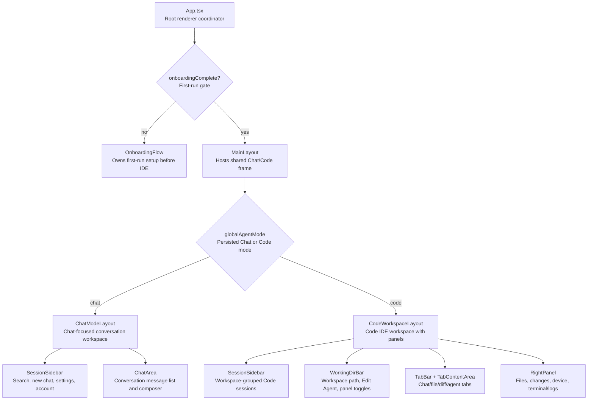
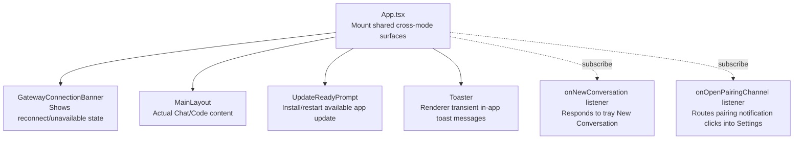
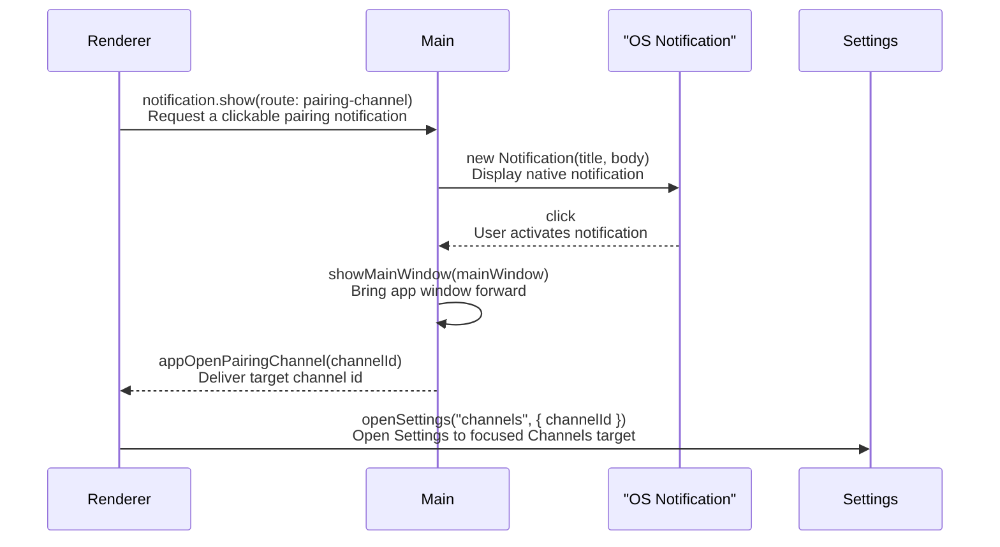

# Main Window, Sidebar, Account, And System Routes Runtime Contract

Source rows: `MAIN-01` through `MAIN-06`

Entry path: app boot after onboarding is complete

Status: Draft, source-anchored

## Purpose

This contract explains the shared main-window frame that exists around Chat and Code. A first-time reader should use it to understand how the Electron renderer chooses the top-level surface, how shared sidebar/account controls work, and how non-renderer entry points such as tray menu items and pairing-notification clicks route back into the app.

This is a documentation group for cross-screen UI surfaces and OS entry points that are visible before or outside a specific Chat, Code, or Settings workflow.

## Core Responsibilities

| Owner                                 | Responsibility                                                                                                       | Boundary                                                                                                        |
| ------------------------------------- | -------------------------------------------------------------------------------------------------------------------- | --------------------------------------------------------------------------------------------------------------- |
| `App.tsx`                             | Chooses onboarding vs main app, mounts shared banners/toasts, subscribes to main-process app events.                 | It does not own detailed Chat, Code, Settings, or authoring behavior.                                           |
| `AgentModeSelector` and `useAppStore` | Show and persist the Chat/Code mode choice.                                                                          | Mode-specific internals belong to `chat/` and `code-ide/`.                                                      |
| `SessionSidebar`                      | Provides shared sidebar controls: collapse, search, quick new session, Settings entry, and account footer placement. | Detailed session row behavior is documented in Chat/Code rows where it differs.                                 |
| `Auth` footer                         | Shows login, signed-in identity, role badge, and sign-out action.                                                    | Auth provider implementation is outside this main-window frame contract.                                        |
| Main-process tray                     | Exposes OS-level actions: show/hide, new conversation, gateway status, restart, quit.                                | It sends renderer events but does not render Chat content.                                                      |
| Pairing notification route bridge     | Converts clickable pairing desktop notifications into renderer Settings navigation.                                  | Notification permission belongs to onboarding/settings; channel setup details belong to Settings/Channels docs. |

## Step-by-Step Reader Guide

1. After onboarding is complete, `App.tsx` renders the main window frame.
2. The persisted `globalAgentMode` decides whether the main content is Chat or Code.
3. The shared sidebar remains the entry point for search, new sessions, settings, and account status.
4. The gateway banner, update prompt, and toast host mount above the mode-specific content.
5. Tray menu actions originate in the main process and either affect the window/gateway directly or emit a renderer event.
6. Pairing notifications are OS-level clicks created by channel pairing requests; they reopen the app and route Settings to a focused Channels target.

## UI Surface Map

The shared frame wraps Chat and Code. The same left sidebar and account footer are visible in both modes; the center and right areas differ by mode.


Chat mode shows the shared sidebar, account footer, Settings entry, selected session, empty conversation hero, and composer.


Settings replaces the work area with a full-window frame while preserving the app context behind the route.

```text
Main Window Frame
┌───────────────────────────┬────────────────────────────────────────────┐
│ Shared Sidebar            │ Mode-specific main content                 │
│ ┌───────────────────────┐ │ ┌────────────────────────────────────────┐ │
│ │ Chat / Code selector  │ │ │ ChatModeLayout or CodeWorkspaceLayout │ │
│ │ New / search / rows   │ │ │ Gateway banner and update prompt may  │ │
│ │ Settings              │ │ │ overlay or sit above this content     │ │
│ │ Account footer        │ │ └────────────────────────────────────────┘ │
│ └───────────────────────┘ │                                            │
└───────────────────────────┴────────────────────────────────────────────┘

OS-level entries outside the window:
  Tray menu -> Show/Hide, New Conversation, Gateway status, Restart, Quit
  Pairing notification click -> open window -> Settings Channels focus
```

## Control To API Matrix

| Surface                    | Visible control                                | User action                       | Handler or owner                            | API / side effect                                             | UI result                                        | Evidence                                                                                                                                                                                                                |
| -------------------------- | ---------------------------------------------- | --------------------------------- | ------------------------------------------- | ------------------------------------------------------------- | ------------------------------------------------ | ----------------------------------------------------------------------------------------------------------------------------------------------------------------------------------------------------------------------- |
| Mode selector              | `Chat` / `Code` segmented tabs                 | Click mode                        | `AgentModeSelector`                         | `useAppStore.setGlobalAgentMode(mode)`                        | Top-level layout switches to Chat or Code        | `apps/electron/src/renderer/src/components/chat/AgentModeSelector.tsx:17`; `apps/electron/src/renderer/src/components/chat/AgentModeSelector.tsx:19`; `apps/electron/src/renderer/src/stores/app-store.ts:86`           |
| Sidebar                    | Collapse button or `Cmd/Ctrl+B`                | Toggle sidebar                    | `SessionSidebar`                            | Local panel callback from layout                              | Sidebar collapses/expands                        | `apps/electron/src/renderer/src/components/sidebar/SessionSidebar.tsx:113`; `apps/electron/src/renderer/src/components/sidebar/SessionSidebar.tsx:162`                                                                  |
| Sidebar                    | New conversation                               | Click quick new                   | `SessionSidebar`                            | `useSessionStore.createDraftSession` for current mode         | Draft session appears/activates                  | `apps/electron/src/renderer/src/components/sidebar/SessionSidebar.tsx:181`                                                                                                                                              |
| Sidebar                    | Search box                                     | Type query                        | `SessionSidebar` / `SessionSearch`          | Local query state filters loaded sessions                     | Session list narrows                             | `apps/electron/src/renderer/src/components/sidebar/SessionSearch.tsx:17`; `apps/electron/src/renderer/src/components/sidebar/SessionSidebar.tsx:204`                                                                    |
| Sidebar                    | Settings                                       | Click                             | `SessionSidebar`                            | `useAppStore.openSettings` through layout callback            | Settings dialog opens                            | `apps/electron/src/renderer/src/components/sidebar/SessionSidebar.tsx:232`                                                                                                                                              |
| Account footer             | Log in                                         | Click                             | `Auth`                                      | Auth flow entry from `Auth` component                         | Login starts or footer updates after auth        | `apps/electron/src/renderer/src/components/sidebar/Auth.tsx:38`; `apps/electron/src/renderer/src/components/sidebar/Auth.tsx:73`                                                                                        |
| Account footer             | Sign out                                       | Click                             | `Auth`                                      | Sign-out callback passed through sidebar                      | Signed-out footer state returns                  | `apps/electron/src/renderer/src/components/sidebar/Auth.tsx:63`; `apps/electron/src/renderer/src/components/sidebar/SessionSidebar.tsx:232`; `apps/electron/src/renderer/src/components/sidebar/SessionSidebar.tsx:242` |
| Gateway banner             | Banner is visible                              | Gateway disconnected/reconnecting | `GatewayConnectionBanner`                   | Reads `useGateway()` state                                    | Shows `Reconnecting...` or `Gateway unavailable` | `apps/electron/src/renderer/src/components/GatewayConnectionBanner.tsx:18`; `apps/electron/src/renderer/src/App.tsx:227`                                                                                                |
| Update prompt              | Install/restart update                         | Click update controls             | `UpdateReadyPrompt` mounted by `App.tsx`    | `getUpdateState`, `onUpdateState`, `installUpdate` IPC bridge | App update prompt progresses                     | `apps/electron/src/renderer/src/App.tsx:32`; `apps/electron/src/renderer/src/App.tsx:47`; `apps/electron/src/preload/index.ts:136`; `apps/electron/src/preload/index.ts:142`                                            |
| Tray                       | Show/Hide OpenClaw                             | Click tray menu item              | Main-process tray menu                      | Shows or hides main window                                    | Window visibility changes                        | `apps/electron/src/main/tray.ts:83`                                                                                                                                                                                     |
| Tray                       | New Conversation                               | Click tray menu item              | Main-process tray menu -> renderer listener | Sends `appNewConversation`; renderer creates Chat draft       | Main window opens/Chat draft created             | `apps/electron/src/main/tray.ts:103`; `apps/electron/src/renderer/src/App.tsx:199`; `apps/electron/src/preload/index.ts:267`                                                                                            |
| Tray                       | Restart Gateway                                | Click tray menu item              | Main-process tray menu                      | Gateway process restart callback                              | Gateway restarts                                 | `apps/electron/src/main/tray.ts:119`                                                                                                                                                                                    |
| Pairing notification route | Click desktop notification for channel pairing | Click notification                | Main-process pairing notification route     | Sends `appOpenPairingChannel(channelId)` to renderer          | Settings opens on Channels focus                 | `apps/electron/src/main/index.ts:773`; `apps/electron/src/main/index.ts:784`; `apps/electron/src/renderer/src/App.tsx:212`; `apps/electron/src/preload/index.ts:272`                                                    |

## State Matrix

| State                            | User sees                         | Entry condition                                            | User action                                | Next state                   | Evidence                                                                                                                         |
| -------------------------------- | --------------------------------- | ---------------------------------------------------------- | ------------------------------------------ | ---------------------------- | -------------------------------------------------------------------------------------------------------------------------------- |
| Onboarding gate                  | First-run onboarding, no main IDE | `onboardingComplete` false                                 | Complete onboarding                        | Main window frame            | `apps/electron/src/renderer/src/App.tsx:224`                                                                                     |
| Main Chat mode                   | Sidebar plus Chat content         | `onboardingComplete` true and `globalAgentMode === "chat"` | Click Code tab                             | Main Code mode               | `apps/electron/src/renderer/src/App.tsx:69`; `apps/electron/src/renderer/src/components/chat/AgentModeSelector.tsx:17`           |
| Main Code mode                   | Sidebar plus Code IDE content     | `onboardingComplete` true and `globalAgentMode === "code"` | Click Chat tab                             | Main Chat mode               | `apps/electron/src/renderer/src/App.tsx:65`; `apps/electron/src/renderer/src/components/chat/AgentModeSelector.tsx:17`           |
| Gateway reconnecting/unavailable | Banner above main content         | Gateway hook reports non-ready state                       | Wait or restart gateway from Settings/tray | Banner clears when connected | `apps/electron/src/renderer/src/components/GatewayConnectionBanner.tsx:18`; `apps/electron/src/renderer/src/App.tsx:240`         |
| Signed out                       | Login action in footer            | No current account identity                                | Click login                                | Auth flow / signed-in footer | `apps/electron/src/renderer/src/components/sidebar/Auth.tsx:38`                                                                  |
| Signed in                        | User row, role badge, Sign out    | Auth has identity                                          | Click Sign out                             | Signed out                   | `apps/electron/src/renderer/src/components/sidebar/Auth.tsx:48`; `apps/electron/src/renderer/src/components/sidebar/Auth.tsx:63` |

## Layout Decision

This diagram explains the first layout decision after the renderer boots: whether the user sees onboarding, Chat, or Code. It is about top-level ownership only; detailed Chat and Code behavior belongs to their focused contract files.



Read the flow in this order:

| Step | Node                  | Purpose                                                     | Contract result                                                              |
| ---- | --------------------- | ----------------------------------------------------------- | ---------------------------------------------------------------------------- |
| 1    | `App.tsx`             | Owns the top-level renderer decision.                       | Exactly one primary surface is selected.                                     |
| 2    | `onboardingComplete?` | Checks the persisted first-run gate.                        | Incomplete setup goes to onboarding; completed setup enters the app frame.   |
| 3    | `OnboardingFlow`      | Collects first-run provider/personality/notification setup. | Main Chat/Code UI is blocked until onboarding finishes.                      |
| 4    | `MainLayout`          | Hosts shared sidebar and main content after onboarding.     | Chat and Code can share frame-level surfaces.                                |
| 5    | `globalAgentMode`     | Reads the persisted Chat/Code mode.                         | The renderer chooses the Chat layout or Code layout.                         |
| 6    | `ChatModeLayout`      | Owns the normal conversation workspace.                     | Sidebar plus `ChatArea` are mounted.                                         |
| 7    | `CodeWorkspaceLayout` | Owns the IDE-like workspace.                                | Workspace sidebar, tabs, working directory bar, and right panel are mounted. |

Evidence:

- Mode branch: `apps/electron/src/renderer/src/App.tsx:62`
- Code layout render: `apps/electron/src/renderer/src/App.tsx:65`
- Chat layout render: `apps/electron/src/renderer/src/App.tsx:69`
- Main app render after onboarding: `apps/electron/src/renderer/src/App.tsx:240`
- Update toast mount: `apps/electron/src/renderer/src/App.tsx:247`
- Mode selector UI: `apps/electron/src/renderer/src/components/chat/AgentModeSelector.tsx:17`
- Mode selector writes store: `apps/electron/src/renderer/src/components/chat/AgentModeSelector.tsx:19`
- Store writer: `apps/electron/src/renderer/src/stores/app-store.ts:86`

## Shared App Surfaces

This diagram explains shared surfaces that are mounted by `App.tsx` and can affect either Chat or Code. These are not children of a single tab; they are frame-level listeners, banners, and toast/update hosts.



Read the flow in this order:

| Step | Node                            | Purpose                                      | User-visible outcome                                                              |
| ---- | ------------------------------- | -------------------------------------------- | --------------------------------------------------------------------------------- |
| 1    | `App.tsx`                       | Mounts cross-mode surfaces once.             | Chat and Code share the same banner, update, toast, and external event listeners. |
| 2    | `GatewayConnectionBanner`       | Reflects gateway connectivity.               | A reconnecting or unavailable banner can appear above the main content.           |
| 3    | `MainLayout`                    | Hosts whichever Chat/Code content is active. | Normal product work remains inside the frame.                                     |
| 4    | `UpdateReadyPrompt`             | Handles app update availability.             | User can install/restart when an update is ready.                                 |
| 5    | `Toaster`                       | Hosts transient renderer messages.           | Toasts can appear from any mode.                                                  |
| 6    | `onNewConversation listener`    | Responds to tray requests.                   | A Chat draft can be created from outside the renderer UI.                         |
| 7    | `onOpenPairingChannel listener` | Responds to notification click routing.      | Settings can open focused to a channel pairing target.                            |

| Surface                    | User-visible behavior                                                           | Evidence                                                                                                                                                                                                        | API / side effect                                                                                         |
| -------------------------- | ------------------------------------------------------------------------------- | --------------------------------------------------------------------------------------------------------------------------------------------------------------------------------------------------------------- | --------------------------------------------------------------------------------------------------------- |
| Gateway banner             | Shows `Reconnecting...` or `Gateway unavailable` when gateway is not connected. | `apps/electron/src/renderer/src/App.tsx:227`; `apps/electron/src/renderer/src/App.tsx:240`; `apps/electron/src/renderer/src/components/GatewayConnectionBanner.tsx:18`                                          | Reads `useGateway()` state.                                                                               |
| Update toast               | Shows update state and lets user install/restart.                               | `apps/electron/src/renderer/src/App.tsx:32`; `apps/electron/src/renderer/src/App.tsx:47`; `apps/electron/src/renderer/src/App.tsx:55`; `apps/electron/src/renderer/src/App.tsx:247`                             | Uses `window.electronAPI.getUpdateState`, `onUpdateState`, `installUpdate`.                               |
| Toast host                 | Renders transient in-app toast messages.                                        | `apps/electron/src/renderer/src/App.tsx:248`                                                                                                                                                                    | Local renderer.                                                                                           |
| Tray new conversation      | Creates or reuses a Chat draft from a main-process tray event.                  | `apps/electron/src/main/tray.ts:103`; `apps/electron/src/main/tray.ts:110`; `apps/electron/src/renderer/src/App.tsx:199`; `apps/electron/src/renderer/src/App.tsx:203`                                          | Main sends `appNewConversation`; renderer calls `useSessionStore.createDraftSession`.                     |
| Pairing notification route | Opens Settings focused to Channels.                                             | `apps/electron/src/main/index.ts:773`; `apps/electron/src/main/index.ts:777`; `apps/electron/src/main/index.ts:784`; `apps/electron/src/renderer/src/App.tsx:208`; `apps/electron/src/renderer/src/App.tsx:212` | Main sends `appOpenPairingChannel`; renderer calls `useAppStore.openSettings('channels', { channelId })`. |
| Renderer error boundary    | Replaces crashed React tree with fallback panel.                                | `apps/electron/src/renderer/src/main.tsx:8`                                                                                                                                                                     | Local renderer.                                                                                           |

## Sidebar And Account Footer


The login route starts from the sidebar footer and can offer Google or email sign-in depending on the configured auth surface.

| Row       | Control                     | User action                    | UI result                                       | Evidence                                                                                                                                                                                                                | Coverage   |
| --------- | --------------------------- | ------------------------------ | ----------------------------------------------- | ----------------------------------------------------------------------------------------------------------------------------------------------------------------------------------------------------------------------- | ---------- |
| `MAIN-02` | Chat/Code segmented control | Click Chat or Code             | Switches top-level layout.                      | `apps/electron/src/renderer/src/components/chat/AgentModeSelector.tsx:17`; `apps/electron/src/renderer/src/stores/app-store.ts:86`                                                                                      | L1 partial |
| `MAIN-03` | Sidebar collapse            | Click collapse or `Cmd/Ctrl+B` | Sidebar width changes.                          | `apps/electron/src/renderer/src/components/sidebar/SessionSidebar.tsx:113`; `apps/electron/src/renderer/src/components/sidebar/SessionSidebar.tsx:162`                                                                  | L2 partial |
| `MAIN-03` | New conversation            | Click quick new button         | Creates draft session for current mode.         | `apps/electron/src/renderer/src/components/sidebar/SessionSidebar.tsx:181`                                                                                                                                              | L2 partial |
| `MAIN-03` | Search                      | Type in search box             | Filters visible sessions.                       | `apps/electron/src/renderer/src/components/sidebar/SessionSidebar.tsx:204`                                                                                                                                              | L2 partial |
| `MAIN-03` | Mode-specific session list  | Switch Chat or Code mode       | Shows Chat session list or Code workspace list. | `apps/electron/src/renderer/src/components/sidebar/SessionSidebar.tsx:211`; `apps/electron/src/renderer/src/components/sidebar/SessionSidebar.tsx:220`                                                                  | L2 partial |
| `MAIN-03` | Settings                    | Click Settings                 | Opens Settings dialog.                          | `apps/electron/src/renderer/src/components/sidebar/SessionSidebar.tsx:232`                                                                                                                                              | L2 partial |
| `MAIN-04` | Login                       | Click login button             | Starts account auth flow.                       | `apps/electron/src/renderer/src/components/sidebar/Auth.tsx:38`; `apps/electron/src/renderer/src/components/sidebar/Auth.tsx:73`                                                                                        | No L3 test |
| `MAIN-04` | Signed-in identity          | User is authenticated          | Shows user name/email and role badge.           | `apps/electron/src/renderer/src/components/sidebar/Auth.tsx:48`; `apps/electron/src/renderer/src/components/sidebar/Auth.tsx:55`                                                                                        | No L3 test |
| `MAIN-04` | Sign out                    | Click Sign out                 | Signs out current account and updates footer.   | `apps/electron/src/renderer/src/components/sidebar/Auth.tsx:63`; `apps/electron/src/renderer/src/components/sidebar/SessionSidebar.tsx:232`; `apps/electron/src/renderer/src/components/sidebar/SessionSidebar.tsx:242` | No L3 test |

## Tray Menu

| Row       | Tray control       | User-visible result                  | Evidence                             | Coverage   |
| --------- | ------------------ | ------------------------------------ | ------------------------------------ | ---------- |
| `MAIN-05` | Show/Hide OpenClaw | Toggles main window visibility.      | `apps/electron/src/main/tray.ts:83`  | No L3 test |
| `MAIN-05` | New Conversation   | Routes renderer to a new Chat draft. | `apps/electron/src/main/tray.ts:103` | No L3 test |
| `MAIN-05` | Gateway status     | Displays gateway state in menu.      | `apps/electron/src/main/tray.ts:115` | No L3 test |
| `MAIN-05` | Restart Gateway    | Restarts gateway process.            | `apps/electron/src/main/tray.ts:119` | No L3 test |
| `MAIN-05` | Quit OpenClaw      | Quits the app through tray callback. | `apps/electron/src/main/tray.ts:124` | No L3 test |

## Pairing Notification Click Route

This sequence explains how a native notification click becomes a focused Settings view. It starts with renderer code asking main to show a clickable notification and ends with Settings opened to the Channels target.



Read the sequence in this order:

| Step | Actor                    | Purpose                                                     | User-visible outcome                                                 |
| ---- | ------------------------ | ----------------------------------------------------------- | -------------------------------------------------------------------- |
| 1    | `Renderer`               | Requests a pairing notification with a route payload.       | User sees an OS notification.                                        |
| 2    | `Main`                   | Creates the native notification and owns the click handler. | Notification is clickable even when the renderer is not focused.     |
| 3    | `OS Notification`        | Reports the user's click back to main.                      | The app can react to an external click.                              |
| 4    | `Main`                   | Brings the main window forward.                             | OpenClaw becomes visible.                                            |
| 5    | `Main` -> `Renderer`     | Sends the target channel id over the app route event.       | Renderer receives enough context to focus the right Settings target. |
| 6    | `Renderer` -> `Settings` | Opens Settings with the Channels route and channel id.      | Settings opens directly to the pairing target.                       |

| Row       | Entry point                  | User action         | UI result                                    | Evidence                                                                                                                                 | Coverage   |
| --------- | ---------------------------- | ------------------- | -------------------------------------------- | ---------------------------------------------------------------------------------------------------------------------------------------- | ---------- |
| `MAIN-06` | Pairing notification payload | Click notification  | Main window opens.                           | `apps/electron/src/main/index.ts:773`; `apps/electron/src/main/index.ts:777`; `apps/electron/src/main/index.ts:778`                      | No L3 test |
| `MAIN-06` | Pairing channel route        | Click notification  | Renderer receives target channel id.         | `apps/electron/src/main/index.ts:780`; `apps/electron/src/main/index.ts:784`                                                             | No L3 test |
| `MAIN-06` | Settings focus               | Renderer gets route | Settings opens on Channels with `channelId`. | `apps/electron/src/renderer/src/App.tsx:208`; `apps/electron/src/renderer/src/App.tsx:212`; `apps/electron/src/renderer/src/App.tsx:213` | No L3 test |

## Gaps

- `MAIN-04` account login/signout has no complete renderer-to-auth e2e contract.
- `MAIN-05` tray actions are visible outside the renderer and need an Electron-level test harness.
- `MAIN-06` pairing-notification click routing has no Electron or OS-notification e2e coverage.
- Gateway banner can block clicks in L3; L3 tests must assert it is absent or intentionally handle it.
