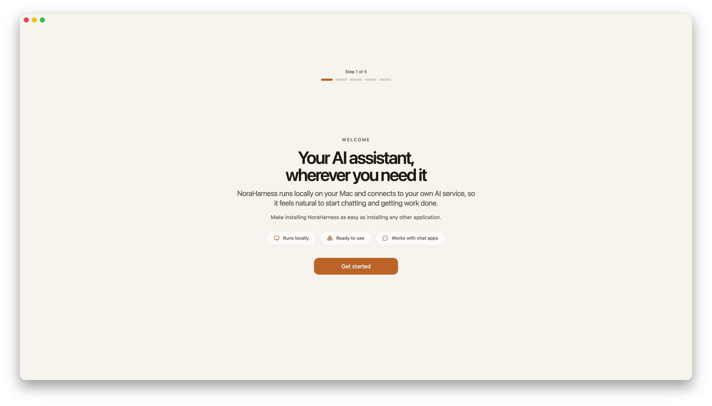
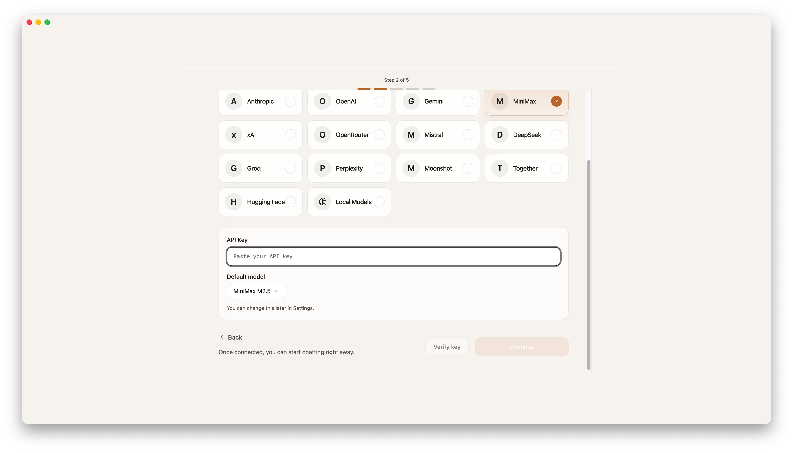
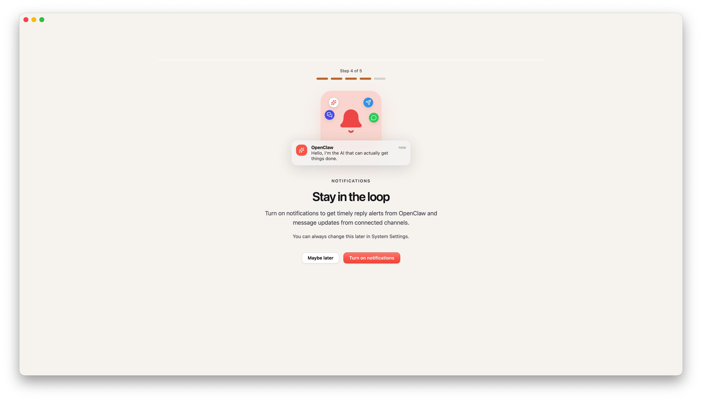
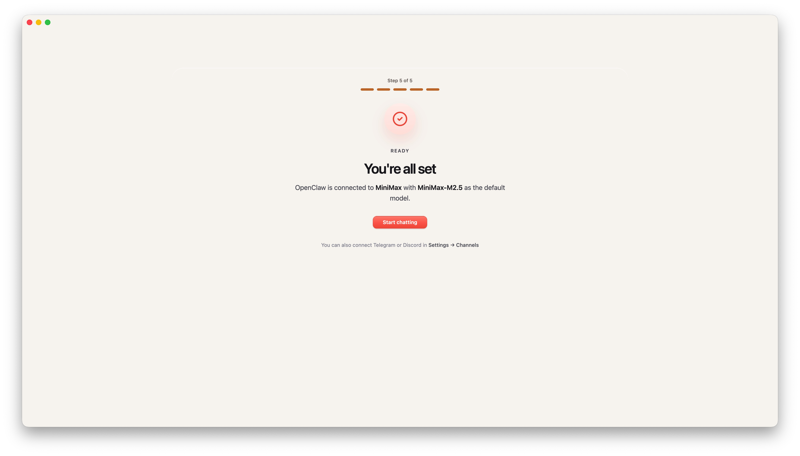
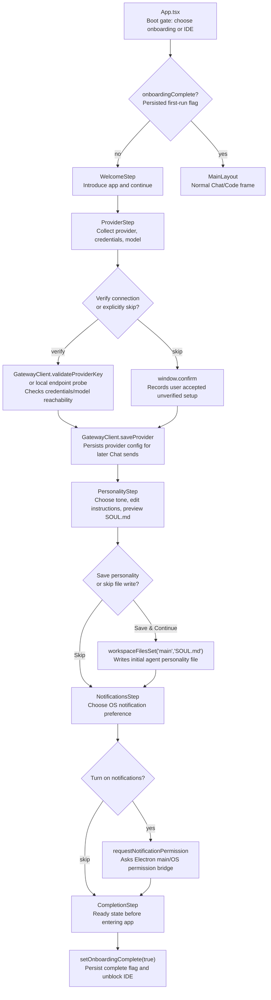

# Onboarding Flow Contract

Source rows: `ONB-01` through `ONB-05`

Entry path: first app launch from `npm run dev:electron` when onboarding is incomplete

Status: Draft, source-anchored

## Purpose

This contract explains the first-run path a new user sees before the normal IDE is available. Its job is to make the onboarding gate, provider setup, optional personality setup, notification-permission choice, and final handoff into Chat understandable without reading the React code first.

## Core Responsibilities

| Owner              | Responsibility                                                                                                           | Boundary                                                                                     |
| ------------------ | ------------------------------------------------------------------------------------------------------------------------ | -------------------------------------------------------------------------------------------- |
| `App.tsx`          | Decides whether to show onboarding or the main IDE based on the persisted onboarding flag.                               | It does not own individual onboarding step UI.                                               |
| `OnboardingFlow`   | Owns the step index, receives completed step data, and moves the user forward or backward.                               | It delegates visible controls to step components.                                            |
| Provider step      | Collects provider credentials, validates or skips validation, chooses enabled/default models, and saves provider config. | Detailed provider-family behavior belongs to provider/gateway docs.                          |
| Personality step   | Lets the user choose tone/instructions and optionally writes `SOUL.md`.                                                  | It does not own the Settings Workspace editor.                                               |
| Notifications step | Lets the user request or skip OS notification permission.                                                                | It only calls the notification permission bridge; it is not the Settings notification route. |
| Completion step    | Persists onboarding complete and returns the user to the first usable Chat surface.                                      | Main Chat behavior belongs to `chat/`.                                                       |

## Step-by-Step Reader Guide

1. App starts from `npm run dev:electron` and `App.tsx` checks whether onboarding is complete.
2. If onboarding is incomplete, the renderer shows `OnboardingFlow` instead of Chat or Code.
3. The user continues from Welcome to provider setup.
4. Provider setup either validates credentials/tests a local endpoint or records that verification was skipped, then saves provider configuration.
5. Personality setup optionally writes generated markdown into `main/SOUL.md`.
6. Notification setup either requests native permission or skips it.
7. Completion marks onboarding as complete; `App.tsx` creates or reuses the first Chat draft and renders the main IDE.

## UI Surface Map

The onboarding UI is a single-screen stepper. Only one step is visible at a time, and the step footer controls decide whether the user can move forward.



Welcome is the first visible state when onboarding is incomplete.



Provider setup combines provider cards, credential input, model selection, verification, Back, and Continue in one step.



The notification step keeps the permission choice explicit and reversible later through system settings.



Completion summarizes the selected provider/model and hands the user into the first usable Chat surface.

```text
First Run Onboarding
┌──────────────────────────────────────────────────────────────┐
│ Step header / progress                                       │
├──────────────────────────────────────────────────────────────┤
│ WelcomeStep                                                  │
│   Get started                                                │
│                                                              │
│ ProviderStep                                                 │
│   Provider cards / More Models                               │
│   API key or local endpoint                                  │
│   Model picker                                               │
│   Verify key or Test connection / Skip verification          │
│   Back / Continue                                            │
│                                                              │
│ PersonalityStep                                              │
│   Tone choices / custom instructions / markdown preview      │
│   Skip / Save and Continue                                   │
│                                                              │
│ NotificationsStep                                            │
│   Maybe later / Turn on notifications                        │
│                                                              │
│ CompletionStep                                               │
│   Start chatting                                             │
└──────────────────────────────────────────────────────────────┘
```

## Control To API Matrix

| Step          | Visible control         | User action                         | Handler or state owner                    | API / persistence effect                                                                      | UI result                                            | Evidence                                                                                                                                                                                                                                                                                                                                                     |
| ------------- | ----------------------- | ----------------------------------- | ----------------------------------------- | --------------------------------------------------------------------------------------------- | ---------------------------------------------------- | ------------------------------------------------------------------------------------------------------------------------------------------------------------------------------------------------------------------------------------------------------------------------------------------------------------------------------------------------------------ |
| Welcome       | `Get started`           | Click                               | `OnboardingFlow` step state               | None                                                                                          | Shows provider setup                                 | `apps/electron/src/renderer/src/components/onboarding/OnboardingFlow.tsx:77`; `apps/electron/src/renderer/src/components/onboarding/WelcomeStep.tsx:59`; `apps/electron/src/renderer/src/components/onboarding/WelcomeStep.tsx:62`                                                                                                                           |
| Provider      | Provider card           | Click provider or More Models       | `ProviderStep.handleSelectProvider`       | Local state only                                                                              | Resets key/model/errors or reveals more providers    | `apps/electron/src/renderer/src/components/onboarding/ProviderStep.tsx:295`; `apps/electron/src/renderer/src/components/onboarding/ProviderStep.tsx:297`; `apps/electron/src/renderer/src/components/onboarding/ProviderStep.tsx:454`; `apps/electron/src/renderer/src/components/onboarding/ProviderStep.tsx:464`                                           |
| Provider      | `Verify key`            | Click with provider/key/model ready | `ProviderStep.handleVerify`               | `GatewayClient.validateProviderKey(providerId, key)` for remote providers                     | Sets model list and verified state, or visible error | `apps/electron/src/renderer/src/components/onboarding/ProviderStep.tsx:340`; `apps/electron/src/renderer/src/components/onboarding/ProviderStep.tsx:367`; `apps/electron/src/renderer/src/components/onboarding/ProviderStep.tsx:568`; `apps/electron/src/renderer/src/components/onboarding/ProviderStep.tsx:597`; `apps/electron/src/preload/index.ts:237` |
| Provider      | `Test connection`       | Click for local provider            | `ProviderStep.handleVerify`               | `probeLocalEndpoint(key)`                                                                     | Marks local endpoint verified or shows error         | `apps/electron/src/renderer/src/components/onboarding/ProviderStep.tsx:355`; `apps/electron/src/renderer/src/components/onboarding/ProviderStep.tsx:356`                                                                                                                                                                                                     |
| Provider      | `Skip verification`     | Click and confirm                   | `ProviderStep.handleSkipVerification`     | Native `window.confirm`; no provider validation call                                          | Allows Continue with skipped-verification state      | `apps/electron/src/renderer/src/components/onboarding/ProviderStep.tsx:381`; `apps/electron/src/renderer/src/components/onboarding/ProviderStep.tsx:383`                                                                                                                                                                                                     |
| Provider      | `Continue`              | Click after verify or skip          | `OnboardingFlow.handleProviderComplete`   | `GatewayClient.saveProvider({ id, name, apiKey/baseUrl, enabledModels, enabled })`            | Shows personality setup                              | `apps/electron/src/renderer/src/components/onboarding/ProviderStep.tsx:392`; `apps/electron/src/renderer/src/components/onboarding/ProviderStep.tsx:608`; `apps/electron/src/renderer/src/components/onboarding/OnboardingFlow.tsx:46`; `apps/electron/src/preload/index.ts:240`                                                                             |
| Personality   | `Save and Continue`     | Click after tone/instructions edits | `PersonalityStep`                         | `workspaceFilesSet("main", "SOUL.md", previewContent)`                                        | Shows notification setup                             | `apps/electron/src/renderer/src/components/onboarding/PersonalityStep.tsx:196`; `apps/electron/src/renderer/src/components/onboarding/PersonalityStep.tsx:199`                                                                                                                                                                                               |
| Personality   | `Skip`                  | Click                               | `OnboardingFlow.handlePersonalitySkip`    | None                                                                                          | Shows notification setup                             | `apps/electron/src/renderer/src/components/onboarding/PersonalityStep.tsx:302`; `apps/electron/src/renderer/src/components/onboarding/OnboardingFlow.tsx:64`                                                                                                                                                                                                 |
| Notifications | `Turn on notifications` | Click                               | `OnboardingFlow.handleNotificationsAllow` | `window.electronAPI.requestNotificationPermission()` -> `notification:request-permission` IPC | Shows completion step                                | `apps/electron/src/renderer/src/components/onboarding/OnboardingFlow.tsx:68`; `apps/electron/src/preload/index.ts:155`                                                                                                                                                                                                                                       |
| Notifications | `Maybe later`           | Click                               | `NotificationsStep` callback              | None                                                                                          | Shows completion step                                | `apps/electron/src/renderer/src/components/onboarding/NotificationsStep.tsx:80`                                                                                                                                                                                                                                                                              |
| Completion    | `Start chatting`        | Click                               | `App.tsx` completion callback             | First Chat draft setup and `useAppStore.setOnboardingComplete(true)`                          | Main IDE renders                                     | `apps/electron/src/renderer/src/components/onboarding/CompletionStep.tsx:40`; `apps/electron/src/renderer/src/components/onboarding/CompletionStep.tsx:47`; `apps/electron/src/renderer/src/App.tsx:217`; `apps/electron/src/renderer/src/App.tsx:219`; `apps/electron/src/renderer/src/App.tsx:221`; `apps/electron/src/renderer/src/App.tsx:246`           |

## State Matrix

| State                        | User sees                                            | Entry condition                                     | Allowed next action                                           | Next state                   | Evidence                                                                                                                                                      |
| ---------------------------- | ---------------------------------------------------- | --------------------------------------------------- | ------------------------------------------------------------- | ---------------------------- | ------------------------------------------------------------------------------------------------------------------------------------------------------------- |
| Welcome                      | Introductory first-run screen                        | `onboardingComplete` is false and step is `welcome` | Get started                                                   | Provider setup               | `apps/electron/src/renderer/src/components/onboarding/OnboardingFlow.tsx:77`                                                                                  |
| Provider idle                | Provider cards, credential input, model selection    | Step is `provider`, no verified/skipped state       | Select provider, edit key/model, verify, skip if inputs ready | Verifying, skipped, or error | `apps/electron/src/renderer/src/components/onboarding/ProviderStep.tsx:280`; `apps/electron/src/renderer/src/components/onboarding/ProviderStep.tsx:290`      |
| Provider verifying           | Verify/Test button label changes to checking/testing | `handleVerify` sets `state` to `verifying`          | Wait for validation result                                    | Verified or error            | `apps/electron/src/renderer/src/components/onboarding/ProviderStep.tsx:330`; `apps/electron/src/renderer/src/components/onboarding/ProviderStep.tsx:351`      |
| Provider verified or skipped | Continue is allowed                                  | `state === "verified"` or `skipVerification`        | Continue                                                      | Personality                  | `apps/electron/src/renderer/src/components/onboarding/ProviderStep.tsx:291`; `apps/electron/src/renderer/src/components/onboarding/ProviderStep.tsx:392`      |
| Personality                  | Tone/instructions/preview                            | Provider was saved                                  | Save and Continue or Skip                                     | Notifications                | `apps/electron/src/renderer/src/components/onboarding/OnboardingFlow.tsx:57`; `apps/electron/src/renderer/src/components/onboarding/PersonalityStep.tsx:196`  |
| Notifications                | Permission choice                                    | Personality step completed or skipped               | Turn on notifications or Maybe later                          | Completion                   | `apps/electron/src/renderer/src/components/onboarding/OnboardingFlow.tsx:60`; `apps/electron/src/renderer/src/components/onboarding/NotificationsStep.tsx:80` |
| Completion                   | Completion summary                                   | Notifications step completed                        | Start chatting                                                | Main IDE                     | `apps/electron/src/renderer/src/components/onboarding/CompletionStep.tsx:40`; `apps/electron/src/renderer/src/App.tsx:217`                                    |

## Flow

This diagram explains the first-run path from app launch to the normal Chat/Code frame. When onboarding is incomplete, `App.tsx` renders `OnboardingFlow` instead of Chat or Code. The first steps stay in the renderer; provider setup saves config only when the user verifies or explicitly skips verification and continues.



Read the flow in this order:

| Step | Node                                               | Purpose                                                      | User-visible outcome                                              |
| ---- | -------------------------------------------------- | ------------------------------------------------------------ | ----------------------------------------------------------------- |
| 1    | `App.tsx`                                          | Checks whether first-run setup is complete.                  | User either enters onboarding or the normal app frame.            |
| 2    | `WelcomeStep`                                      | Introduces the product and starts setup.                     | Get started advances to provider setup.                           |
| 3    | `ProviderStep`                                     | Collects provider, credential, and model choices.            | User can verify credentials or intentionally skip verification.   |
| 4    | `GatewayClient.validateProviderKey` or local probe | Confirms provider/model reachability when the user verifies. | Success allows the provider to be saved; failure remains visible. |
| 5    | `window.confirm`                                   | Records the explicit skip-verification choice.               | User can continue without a successful validation call.           |
| 6    | `GatewayClient.saveProvider`                       | Persists provider config for later Chat sends.               | Flow advances to personality setup.                               |
| 7    | `PersonalityStep`                                  | Lets the user choose tone and edit initial instructions.     | User can save `SOUL.md` or skip file creation.                    |
| 8    | `NotificationsStep`                                | Lets the user opt into OS notifications.                     | User can request native permission or continue without it.        |
| 9    | `CompletionStep`                                   | Presents the ready state after setup choices are complete.   | `Start chatting` persists onboarding completion.                  |
| 10   | `MainLayout`                                       | Normal app shell becomes available.                          | Chat/Code frame is unblocked.                                     |

## Interaction Contract

| Row      | Step / control                | User action                                                                 | UI precondition                     | UI result                                                                                              | Backend/API path                                                     | Evidence                                                                                                                                                                                                                                                                                                                                                                                                                                                                                                                                                  | Coverage      |
| -------- | ----------------------------- | --------------------------------------------------------------------------- | ----------------------------------- | ------------------------------------------------------------------------------------------------------ | -------------------------------------------------------------------- | --------------------------------------------------------------------------------------------------------------------------------------------------------------------------------------------------------------------------------------------------------------------------------------------------------------------------------------------------------------------------------------------------------------------------------------------------------------------------------------------------------------------------------------------------------- | ------------- |
| `ONB-01` | App boot                      | Launch app                                                                  | Onboarding incomplete               | Welcome step is rendered instead of IDE.                                                               | Local app-store gate                                                 | `apps/electron/src/renderer/src/App.tsx:224`; `apps/electron/src/renderer/src/components/onboarding/OnboardingFlow.tsx:77`; `apps/electron/src/renderer/src/components/onboarding/WelcomeStep.tsx:59`; `apps/electron/src/renderer/src/components/onboarding/WelcomeStep.tsx:62`                                                                                                                                                                                                                                                                          | L2 partial    |
| `ONB-02` | Welcome get started           | Click Get started                                                           | Welcome step visible                | Provider step appears.                                                                                 | None                                                                 | `apps/electron/src/renderer/src/components/onboarding/WelcomeStep.tsx:59`; `apps/electron/src/renderer/src/components/onboarding/WelcomeStep.tsx:62`; `apps/electron/src/renderer/src/components/onboarding/OnboardingFlow.tsx:78`                                                                                                                                                                                                                                                                                                                        | No L3 test    |
| `ONB-02` | Provider select               | Choose primary provider or More Models                                      | Provider step visible               | Selected provider changes; key/model state resets; More Models reveals additional providers.           | Local renderer state                                                 | `apps/electron/src/renderer/src/components/onboarding/ProviderStep.tsx:295`; `apps/electron/src/renderer/src/components/onboarding/ProviderStep.tsx:297`; `apps/electron/src/renderer/src/components/onboarding/ProviderStep.tsx:454`; `apps/electron/src/renderer/src/components/onboarding/ProviderStep.tsx:464`                                                                                                                                                                                                                                        | L2 partial    |
| `ONB-02` | Provider validate/test        | Enter API key or local endpoint, choose model, click Verify/Test connection | Provider inputs ready               | Remote model list or local endpoint success marks the step verified; validation errors remain visible. | `GatewayClient.validateProviderKey` or local endpoint probe          | `apps/electron/src/renderer/src/components/onboarding/ProviderStep.tsx:340`; `apps/electron/src/renderer/src/components/onboarding/ProviderStep.tsx:351`; `apps/electron/src/renderer/src/components/onboarding/ProviderStep.tsx:367`; `apps/electron/src/renderer/src/components/onboarding/ProviderStep.tsx:519`; `apps/electron/src/renderer/src/components/onboarding/ProviderStep.tsx:545`; `apps/electron/src/renderer/src/components/onboarding/ProviderStep.tsx:568`; `apps/electron/src/renderer/src/components/onboarding/ProviderStep.tsx:597` | L2 partial    |
| `ONB-02` | Provider skip verification    | Click Skip verification and confirm                                         | Inputs ready; not verified          | Step marks verification skipped and allows Continue.                                                   | Native `window.confirm`; no provider validation call                 | `apps/electron/src/renderer/src/components/onboarding/ProviderStep.tsx:382`; `apps/electron/src/renderer/src/components/onboarding/ProviderStep.tsx:626`                                                                                                                                                                                                                                                                                                                                                                                                  | No L3 test    |
| `ONB-02` | Provider continue             | Click Continue                                                              | Verified or skipped; model selected | Provider is saved; flow advances to personality.                                                       | `GatewayClient.saveProvider`                                         | `apps/electron/src/renderer/src/components/onboarding/ProviderStep.tsx:392`; `apps/electron/src/renderer/src/components/onboarding/OnboardingFlow.tsx:46`                                                                                                                                                                                                                                                                                                                                                                                                 | L2 partial    |
| `ONB-03` | Personality save              | Choose tone, edit instructions, click Save and Continue                     | Personality step visible            | Preview content is saved to `SOUL.md`; flow advances to notifications.                                 | `GatewayClient.workspaceFilesSet("main", "SOUL.md", previewContent)` | `apps/electron/src/renderer/src/components/onboarding/PersonalityStep.tsx:196`; `apps/electron/src/renderer/src/components/onboarding/PersonalityStep.tsx:199`; `apps/electron/src/renderer/src/components/onboarding/PersonalityStep.tsx:203`; `apps/electron/src/renderer/src/components/onboarding/PersonalityStep.tsx:288`; `apps/electron/src/renderer/src/components/onboarding/PersonalityStep.tsx:315`                                                                                                                                            | No L3 test    |
| `ONB-03` | Personality skip              | Click Skip                                                                  | Personality step visible            | Flow advances to notifications without saving `SOUL.md`.                                               | None                                                                 | `apps/electron/src/renderer/src/components/onboarding/PersonalityStep.tsx:302`; `apps/electron/src/renderer/src/components/onboarding/OnboardingFlow.tsx:60`                                                                                                                                                                                                                                                                                                                                                                                              | No L3 test    |
| `ONB-04` | Notification permission skip  | Click Maybe later                                                           | Notifications step visible          | Flow advances without OS permission request.                                                           | None                                                                 | `apps/electron/src/renderer/src/components/onboarding/NotificationsStep.tsx:80`; `apps/electron/src/renderer/src/components/onboarding/OnboardingFlow.tsx:110`                                                                                                                                                                                                                                                                                                                                                                                            | No L3 test    |
| `ONB-04` | Notification permission allow | Click Turn on notifications                                                 | Notifications step visible          | Native notification permission bridge is called, then flow advances.                                   | IPC `notification:request-permission`                                | `apps/electron/src/renderer/src/components/onboarding/NotificationsStep.tsx:91`; `apps/electron/src/renderer/src/components/onboarding/OnboardingFlow.tsx:68`; `apps/electron/src/preload/index.ts:155`                                                                                                                                                                                                                                                                                                                                                   | No L3 test    |
| `ONB-05` | Completion start chatting     | Click Start chatting                                                        | Completion summary visible          | Onboarding is persisted complete and first Chat draft is created or reused.                            | Local persisted app store                                            | `apps/electron/src/renderer/src/components/onboarding/CompletionStep.tsx:40`; `apps/electron/src/renderer/src/components/onboarding/CompletionStep.tsx:47`; `apps/electron/src/renderer/src/App.tsx:217`; `apps/electron/src/renderer/src/App.tsx:219`; `apps/electron/src/renderer/src/App.tsx:221`; `apps/electron/src/renderer/src/App.tsx:246`                                                                                                                                                                                                        | L1/L2 partial |

## Data And Events

| Data                             | Producer                  | Consumer                                                                                     |
| -------------------------------- | ------------------------- | -------------------------------------------------------------------------------------------- |
| Selected provider id             | `ProviderStep`            | `OnboardingFlow.handleProviderComplete`                                                      |
| API key or local base URL        | `ProviderStep`            | `GatewayClient.validateProviderKey`, local endpoint probe, then `GatewayClient.saveProvider` |
| Enabled model list               | `ProviderStep`            | Provider validation result, default model fallback, and provider save payload                |
| Personality markdown             | `PersonalityStep`         | `GatewayClient.workspaceFilesSet("main", "SOUL.md", previewContent)`                         |
| Notification permission decision | `NotificationsStep`       | `window.electronAPI.requestNotificationPermission` or skip path                              |
| Onboarding completion flag       | `CompletionStep` callback | `useAppStore.setOnboardingComplete`                                                          |

## Gaps

- L3 first-run e2e is not wired.
- Provider validation shares provider-family behavior with `provider-gateway-boundaries/per-llm-repo-specifics.md` and IPC surface details with `provider-gateway-boundaries/reference-surfaces.md`.
