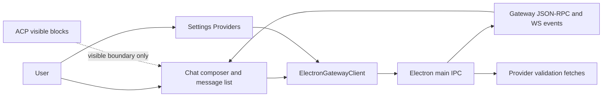

# Provider And Gateway Boundary Contracts

Source rows: `BND-01`, `BND-02`, `BND-03`, `BND-04`
Entry path: Chat mode or Settings -> Providers; Code mode for visible ACP markers
Status: Draft, evidence-only

This folder covers the places where the Electron UI crosses into provider config, gateway chat, gateway events, and visible ACP markers. Runtime reference flows live here when they show ACP, chat, gateway messaging, or session routing crossing that provider/gateway handoff.

ACP routing, permission prompts, runtime events, and bridge behavior are covered by `docs/hardware_harness/ui-contracts/agent-ui-contracts-via-acp.md`. This folder only documents the visible ACP markers that appear in Agent UI screens.

## Owned Rows

| Source row | Contract file                                        | User-visible surface                                                  |
| ---------- | ---------------------------------------------------- | --------------------------------------------------------------------- |
| `BND-01`   | [provider-validation.md](./provider-validation.md)   | Provider validation from Onboarding and Settings Providers            |
| `BND-02`   | [model-selection.md](./model-selection.md)           | Provider-grouped model selection in Chat and default model Settings   |
| `BND-03`   | [gateway-chat.md](./gateway-chat.md)                 | Chat history, send, abort, active-run reconnect, and stream events    |
| `BND-04`   | [acp-visible-boundary.md](./acp-visible-boundary.md) | ACP status, message blocks, and spawn-error markers as visible bounds |

## Reference Flows

- [runtime-flows.md](./runtime-flows.md) shows end-to-end runtime diagrams for ACP session lifecycle, gateway WebSocket messaging, chat-vs-ACP routing, multi-agent routing, tool events, and compaction.

## Shared Boundary Map

This diagram explains which product surfaces cross the provider/gateway boundary. It is intentionally broad: follow the links in `Owned Rows` for the focused contracts.

Read the map left to right:

| Step | Surface or boundary              | Purpose                                                                        |
| ---- | -------------------------------- | ------------------------------------------------------------------------------ |
| 1    | `User`                           | Starts either Chat work or provider configuration.                             |
| 2    | `Chat composer and message list` | Sends prompts, receives history/stream events, and renders ACP-visible blocks. |
| 3    | `Settings Providers`             | Lists, validates, saves, and removes provider configuration.                   |
| 4    | `ElectronGatewayClient`          | Typed renderer client used by Chat and Settings.                               |
| 5    | `Electron main IPC`              | Desktop bridge that handles gateway calls and provider validation fetches.     |
| 6    | `Gateway JSON-RPC and WS events` | Chat/history/send/reconnect boundary.                                          |
| 7    | `Provider validation fetches`    | Main-process provider validation boundary.                                     |
| 8    | `ACP visible blocks`             | Visible markers in Chat; runtime semantics live in the ACP contract.           |

## Shared Entry Contract

| User action               | UI precondition                                              | UI result                                                                                                         | Backend/API path                                                                                                      | Evidence                                                                                                                                                                                                                       | Test coverage                                                                                                                                                                                    |
| ------------------------- | ------------------------------------------------------------ | ----------------------------------------------------------------------------------------------------------------- | --------------------------------------------------------------------------------------------------------------------- | ------------------------------------------------------------------------------------------------------------------------------------------------------------------------------------------------------------------------------ | ------------------------------------------------------------------------------------------------------------------------------------------------------------------------------------------------ |
| Open Settings Providers   | Settings dialog is reachable from the sidebar                | Provider list/editor can load configured providers and default model state                                        | `client.listProviders()` plus `client.configGet()`                                                                    | [ProvidersTab.tsx:357](../../../../apps/electron/src/renderer/src/components/settings/ProvidersTab.tsx#L357), [electron-gateway-client.ts:173](../../../../apps/electron/src/renderer/src/lib/electron-gateway-client.ts#L173) | L2 gaps are tracked in [coverage-index.md](../tests/coverage-index.md).                                                                                                                          |
| Open Chat model picker    | Chat composer has loaded or is loading model data            | User sees loading, retry, selected model, unavailable model, or enabled model choices                             | `models.list`, session-local model state, `sessions.patch` on selection                                               | [ChatComposer.tsx:651](../../../../apps/electron/src/renderer/src/components/chat/ChatComposer.tsx#L651), [electron-gateway-client.ts:134](../../../../apps/electron/src/renderer/src/lib/electron-gateway-client.ts#L134)     | L2 gap is tracked in [coverage-index.md](../tests/coverage-index.md).                                                                                                                            |
| Send or recover chat      | Active session is saved, or a draft can be saved before send | History loads, active run reconnects, send starts streaming, final refresh reconciles history                     | `chat.history`, `chat.runs.active`, `chat.send`, `chat.abort`, gateway events                                         | [ChatArea.tsx:342](../../../../apps/electron/src/renderer/src/components/chat/ChatArea.tsx#L342), [protocol-bridge.ts:281](../../../../apps/electron/src/renderer/src/lib/protocol-bridge.ts#L281)                             | L2 partial: [protocol-bridge.test.ts](../../../../apps/electron/src/renderer/test/protocol-bridge.test.ts), [chat-area.test.tsx](../../../../apps/electron/src/renderer/test/chat-area.test.tsx) |
| Inspect ACP-visible state | Code/Chat surfaces receive ACP state or ACP parts            | UI shows ACP status pill, ACP data blocks, or spawn error banner while the ACP contract defines runtime semantics | Visible renderer blocks; ACP routing is covered by `docs/hardware_harness/ui-contracts/agent-ui-contracts-via-acp.md` | [WorkingDirBar.tsx:121](../../../../apps/electron/src/renderer/src/components/chat/WorkingDirBar.tsx#L121), [ChatMessages.tsx:313](../../../../apps/electron/src/renderer/src/components/chat/ChatMessages.tsx#L313)           | L1/L2 partial for ACP data chunks: [use-chat.test.tsx:317](../../../../apps/electron/src/renderer/test/use-chat.test.tsx#L317)                                                                   |

## Cross-Surface Data

| Boundary                | Used by                                              | Evidence                                                                                                                                                                                                                                                     |
| ----------------------- | ---------------------------------------------------- | ------------------------------------------------------------------------------------------------------------------------------------------------------------------------------------------------------------------------------------------------------------ |
| Provider management IPC | Onboarding provider step and Settings Providers      | [electron-gateway-client.ts:173](../../../../apps/electron/src/renderer/src/lib/electron-gateway-client.ts#L173), [ipc-gateway.ts:420](../../../../apps/electron/src/main/ipc-gateway.ts#L420)                                                               |
| Gateway chat RPC        | Chat history, send, abort, reconnect                 | [electron-gateway-client.ts:151](../../../../apps/electron/src/renderer/src/lib/electron-gateway-client.ts#L151), [chat.ts:1187](../../../../src/gateway/server-methods/chat.ts#L1187), [chat.ts:1347](../../../../src/gateway/server-methods/chat.ts#L1347) |
| Gateway push events     | Live text, reasoning, tool cards, lifecycle, seq-gap | [server-chat.ts:580](../../../../src/gateway/server-chat.ts#L580), [server-chat.ts:760](../../../../src/gateway/server-chat.ts#L760), [server-chat.ts:893](../../../../src/gateway/server-chat.ts#L893)                                                      |
| ACP visible part types  | Chat message list and Code working directory markers | [ChatMessages.tsx:313](../../../../apps/electron/src/renderer/src/components/chat/ChatMessages.tsx#L313), [WorkingDirBar.tsx:121](../../../../apps/electron/src/renderer/src/components/chat/WorkingDirBar.tsx#L121)                                         |

## Gaps

- No L3 Electron harness exists for `BND-*` rows.
- Provider validation IPC has no focused main-process test for each provider endpoint.
- Chat model selection and default-model selection are not covered by direct L2 interaction tests.
- ACP behavior is covered by `docs/hardware_harness/ui-contracts/agent-ui-contracts-via-acp.md`; this folder documents the visible markers.
