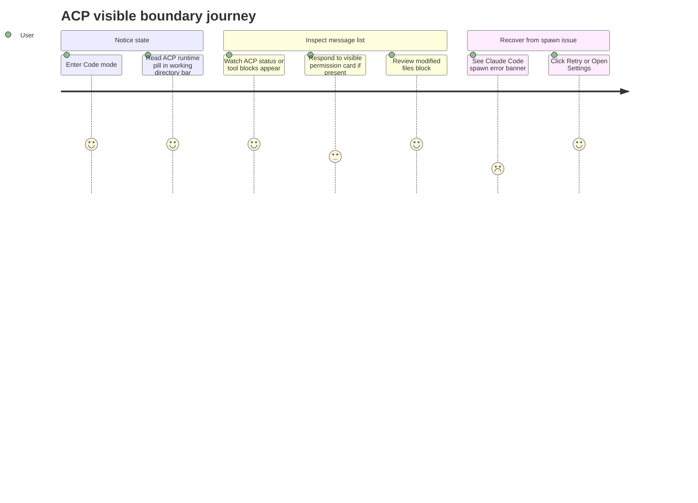

# ACP Visible Boundary

Source rows: `BND-04`
Entry path: Code mode -> working directory bar; Chat/Code message list for ACP parts
Status: Draft, evidence-only; ACP semantics covered by `docs/hardware_harness/ui-contracts/agent-ui-contracts-via-acp.md`

ACP contract source: `docs/hardware_harness/ui-contracts/agent-ui-contracts-via-acp.md`. This file only indexes the visible Agent UI boundary markers from the `BND-04` row.

## User Journey

### Overview

| Attribute      | Value                                                                                                 |
| -------------- | ----------------------------------------------------------------------------------------------------- |
| Priority       | Medium                                                                                                |
| User type      | Code-mode user who can see ACP-backed Claude Code/Codex status or ACP message blocks                  |
| Frequency      | Occasional, only when ACP-backed sessions or ACP-visible data parts are present                       |
| Success metric | User can recognize ACP status/errors and can follow the root ACP contract for routing and permissions |

### User Goal

> "I want visible ACP state to be recognizable in the IDE, while regular Agent UI chat behavior remains understandable."

### Preconditions

- User may be in Code mode with a working directory bar.
- Session messages may contain ACP data parts.
- Session store may contain an ACP spawn error.
- ACP routing, permission behavior, upstream runtime semantics, and bridge tests are specified in `docs/hardware_harness/ui-contracts/agent-ui-contracts-via-acp.md`.

### Journey Map



### Journey Steps

#### Step 1: See ACP runtime marker

**User action:** User enters a Code workspace.
**System response:** Working directory bar renders `AcpRuntimeStatusPill` next to the folder display.
**Success criteria:**

- [ ] ACP marker appears as a status pill, not as hidden state.
- [ ] It does not replace the workspace path or `Edit Agent` controls.
- [ ] Runtime status meanings stay aligned with the root ACP contract.

**Potential friction:**

- The marker is visible but not covered by an L3 code-mode scenario.

#### Step 2: See ACP data blocks in message list

**User action:** User watches or reopens a session containing ACP parts.
**System response:** `AcpEventBridge` maps ACP runtime events to UI data parts, and ChatMessages renders ACP tool, permission, status, and modified-files blocks for matching `part.type` values.
**Success criteria:**

- [ ] Unknown or malformed ACP data parts are skipped instead of crashing message list rendering.
- [ ] ACP blocks coexist with regular text, reasoning, file, and tool parts.
- [ ] History refresh preserves streamed ACP data parts where covered by tests.

**Potential friction:**

- ACP permission response semantics are covered by `docs/hardware_harness/ui-contracts/agent-ui-contracts-via-acp.md` even though the visible permission card is rendered here.

#### Step 3: Recover from ACP spawn error

**User action:** User sees an ACP spawn error banner and clicks `Retry` or `Open Settings`.
**System response:** Retry clears session spawn error; Open Settings opens Extensions settings.
**Success criteria:**

- [ ] Auth, disabled, not-installed, wrong-session, and generic messages have distinct user-facing copy.
- [ ] Retry does not require leaving the chat.
- [ ] Open Settings routes to Extensions.

**Potential friction:**

- The visible banner copy mentions Claude Code specifically; the root ACP contract owns full runtime semantics.

### Error Scenarios

#### E1: ACP runtime disabled

**Trigger:** Spawn error code is `ACP_DISABLED`.
**User sees:** Banner explaining Claude Code is disabled by configuration, with Open Settings.
**Recovery path:** User opens Settings Extensions and enables/repairs ACP; runtime recovery semantics are covered by the root ACP contract.
**Test:** No direct banner component test.

#### E2: ACP not authenticated

**Trigger:** Spawn error message looks like auth/login failure.
**User sees:** Banner with `claude login` hint, Retry, and Open Settings.
**Recovery path:** User authenticates outside the UI, then clicks Retry.
**Test:** No direct banner component test.

#### E3: Malformed ACP data part

**Trigger:** Message list receives ACP part without required payload fields.
**User sees:** No block for that malformed part; message list continues rendering other parts.
**Recovery path:** None visible; producer/debugging concern.
**Test:** Partial hook tests cover ACP data chunk preservation, not malformed rendering for every block.

### Metrics To Track

- ACP spawn error banner impression and retry rate.
- Open Settings clicks from ACP error banner.
- ACP permission card response latency, if tracked by the ACP-specific contract.
- Message list render failures involving ACP data part types.

### E2E Test Reference

Future L3 scenario: `BND-04 displays ACP visible blocks and recovers from a spawn error banner`.

## UI Surface

### Wireframe

```text
Code working directory bar
+------------------------------------------------------------------+
| [sidebar] folder /path/to/workspace        [ACP status] [Edit]   |
+------------------------------------------------------------------+

Message list ACP blocks
+------------------------------------------------------------------+
| Assistant text                                                    |
| [ACP status block]                                                |
| [ACP tool block]                                                  |
| [ACP permission card]                                             |
| [ACP modified files block]                                        |
+------------------------------------------------------------------+

ACP spawn error banner
+------------------------------------------------------------------+
| Could not start Claude Code                                       |
| Spawning the ACP runtime failed.                                  |
| [Retry] [Open Settings]                                           |
+------------------------------------------------------------------+
```

- Working directory marker: `AcpRuntimeStatusPill` beside folder path.
- Message list ACP blocks: `data-acp-tool`, `data-acp-permission`, `data-acp-status`, `data-acp-modified-files`.
- Conversation approval is separate from the ACP permission card: some runtime approvals are resolved when the user sends `/approve <id> allow-once` or `/approve <id> deny` through the normal Chat/Code composer. That path is documented in `../chat/chat-runtime.md`.
- Spawn error banner: title/body, optional login hint, `Retry`, optional `Open Settings`.
- Related ACP surface: routing, permission decision semantics, upstream runtime lifecycle, bridge tests, and ACP settings internals beyond visible navigation are covered by `docs/hardware_harness/ui-contracts/agent-ui-contracts-via-acp.md`.

## Interaction Contract

| User action                     | UI precondition                                                           | UI result                                     | Backend/API path                                                                                                                      | Evidence                                                                                                                                                                                                                                                                                       | Test coverage                                                                                                                                                                                            |
| ------------------------------- | ------------------------------------------------------------------------- | --------------------------------------------- | ------------------------------------------------------------------------------------------------------------------------------------- | ---------------------------------------------------------------------------------------------------------------------------------------------------------------------------------------------------------------------------------------------------------------------------------------------- | -------------------------------------------------------------------------------------------------------------------------------------------------------------------------------------------------------- |
| View ACP runtime pill           | WorkingDirBar renders in Code mode                                        | ACP status pill appears beside workspace path | Renderer props for visible marker; runtime lifecycle is covered by `docs/hardware_harness/ui-contracts/agent-ui-contracts-via-acp.md` | [WorkingDirBar.tsx:121](../../../../apps/electron/src/renderer/src/components/chat/WorkingDirBar.tsx#L121)                                                                                                                                                                                     | L3 no test                                                                                                                                                                                               |
| Render ACP tool block           | Message part type is `data-acp-tool` and data exists                      | Message list renders `AcpToolBlock`           | `AcpEventBridge` produces `data-acp-tool`; this file documents the ChatMessages boundary                                              | [ChatMessages.tsx:313](../../../../apps/electron/src/renderer/src/components/chat/ChatMessages.tsx#L313), [ChatMessages.tsx:319](../../../../apps/electron/src/renderer/src/components/chat/ChatMessages.tsx#L319), [agent-ui-contracts-via-acp.md:119](../agent-ui-contracts-via-acp.md#L119) | L1/L2 partial: [use-chat.test.tsx:317](../../../../apps/electron/src/renderer/test/use-chat.test.tsx#L317); ACP bridge tests: [agent-ui-contracts-via-acp.md:205](../agent-ui-contracts-via-acp.md#L205) |
| Render ACP permission card      | Message part type is `data-acp-permission` and request has `reqId`        | Message list renders `AcpPermissionCard`      | Permission request/response flow is covered by `docs/hardware_harness/ui-contracts/agent-ui-contracts-via-acp.md`                     | [ChatMessages.tsx:326](../../../../apps/electron/src/renderer/src/components/chat/ChatMessages.tsx#L326), [ChatMessages.tsx:331](../../../../apps/electron/src/renderer/src/components/chat/ChatMessages.tsx#L331), [agent-ui-contracts-via-acp.md:169](../agent-ui-contracts-via-acp.md#L169) | L1/L2 partial: [use-chat.test.tsx:377](../../../../apps/electron/src/renderer/test/use-chat.test.tsx#L377)                                                                                               |
| Render ACP status block         | Message part type is `data-acp-status` and data exists                    | Message list renders `AcpStatusBlock`         | UI message part rendering only                                                                                                        | [ChatMessages.tsx:340](../../../../apps/electron/src/renderer/src/components/chat/ChatMessages.tsx#L340), [ChatMessages.tsx:345](../../../../apps/electron/src/renderer/src/components/chat/ChatMessages.tsx#L345)                                                                             | L1/L2 partial: [use-chat.test.tsx:317](../../../../apps/electron/src/renderer/test/use-chat.test.tsx#L317)                                                                                               |
| Render ACP modified-files block | Message part type is `data-acp-modified-files` and file list is non-empty | Message list renders modified files block     | UI message part rendering only                                                                                                        | [ChatMessages.tsx:348](../../../../apps/electron/src/renderer/src/components/chat/ChatMessages.tsx#L348), [ChatMessages.tsx:353](../../../../apps/electron/src/renderer/src/components/chat/ChatMessages.tsx#L353)                                                                             | L2 no direct modified-files assertion                                                                                                                                                                    |
| Retry ACP spawn                 | Spawn error banner is visible                                             | Session ACP spawn error clears                | Local session store                                                                                                                   | [AcpSpawnErrorBanner.tsx:82](../../../../apps/electron/src/renderer/src/components/chat/AcpSpawnErrorBanner.tsx#L82), [AcpSpawnErrorBanner.tsx:87](../../../../apps/electron/src/renderer/src/components/chat/AcpSpawnErrorBanner.tsx#L87)                                                     | No direct banner component test                                                                                                                                                                          |
| Open ACP settings               | Spawn error banner copy allows settings                                   | Settings opens to Extensions                  | `useAppStore.openSettings('extensions')`                                                                                              | [AcpSpawnErrorBanner.tsx:91](../../../../apps/electron/src/renderer/src/components/chat/AcpSpawnErrorBanner.tsx#L91), [AcpSpawnErrorBanner.tsx:112](../../../../apps/electron/src/renderer/src/components/chat/AcpSpawnErrorBanner.tsx#L112)                                                   | No direct banner component test                                                                                                                                                                          |

## Data And Events

| Data/event              | Shape or source                                                                                                                                 | Evidence                                                                                                                                                                                                                                                                                                                                                                                                                               |
| ----------------------- | ----------------------------------------------------------------------------------------------------------------------------------------------- | -------------------------------------------------------------------------------------------------------------------------------------------------------------------------------------------------------------------------------------------------------------------------------------------------------------------------------------------------------------------------------------------------------------------------------------- |
| ACP status marker props | `acpRuntimeStatus`, `acpAgent` passed into `WorkingDirBar`                                                                                      | [WorkingDirBar.tsx:24](../../../../apps/electron/src/renderer/src/components/chat/WorkingDirBar.tsx#L24), [WorkingDirBar.tsx:63](../../../../apps/electron/src/renderer/src/components/chat/WorkingDirBar.tsx#L63)                                                                                                                                                                                                                     |
| ACP UI part types       | `data-acp-tool`, `data-acp-permission`, `data-acp-status`, `data-acp-modified-files`                                                            | [ChatMessages.tsx:313](../../../../apps/electron/src/renderer/src/components/chat/ChatMessages.tsx#L313), [ChatMessages.tsx:326](../../../../apps/electron/src/renderer/src/components/chat/ChatMessages.tsx#L326), [ChatMessages.tsx:340](../../../../apps/electron/src/renderer/src/components/chat/ChatMessages.tsx#L340), [ChatMessages.tsx:348](../../../../apps/electron/src/renderer/src/components/chat/ChatMessages.tsx#L348) |
| ACP spawn error copy    | Disabled, wrong-session, auth, not-installed, generic copy branches                                                                             | [AcpSpawnErrorBanner.tsx:41](../../../../apps/electron/src/renderer/src/components/chat/AcpSpawnErrorBanner.tsx#L41), [AcpSpawnErrorBanner.tsx:58](../../../../apps/electron/src/renderer/src/components/chat/AcpSpawnErrorBanner.tsx#L58), [AcpSpawnErrorBanner.tsx:66](../../../../apps/electron/src/renderer/src/components/chat/AcpSpawnErrorBanner.tsx#L66)                                                                       |
| ACP UI contract         | Runtime events, `AcpEventBridge`, UI data parts, permission flow, sequence-gap recovery, runtime lifecycle, and bridge tests                    | [agent-ui-contracts-via-acp.md:20](../agent-ui-contracts-via-acp.md#L20), [agent-ui-contracts-via-acp.md:99](../agent-ui-contracts-via-acp.md#L99), [agent-ui-contracts-via-acp.md:169](../agent-ui-contracts-via-acp.md#L169)                                                                                                                                                                                                         |
| ACP routing tests       | `resolveAcpRouting` has separate coverage and the runtime flow is covered by `docs/hardware_harness/ui-contracts/agent-ui-contracts-via-acp.md` | [protocol-bridge.test.ts:422](../../../../apps/electron/src/renderer/test/protocol-bridge.test.ts#L422), [agent-ui-contracts-via-acp.md:20](../agent-ui-contracts-via-acp.md#L20)                                                                                                                                                                                                                                                      |

## Gaps

- ACP semantics, permission policy, runtime routing, and bridge tests are covered by `docs/hardware_harness/ui-contracts/agent-ui-contracts-via-acp.md`.
- No L3 scenario covers visible ACP blocks in the Electron message list.
- No direct component test covers `AcpSpawnErrorBanner` copy branches or button actions.
- Stable selectors for ACP blocks and the spawn-error banner are not documented as present.
