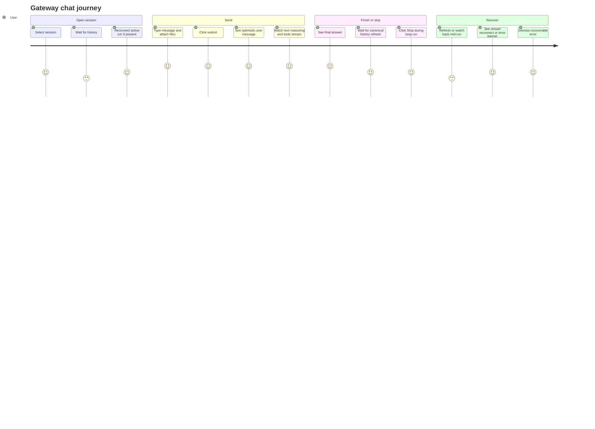

# Gateway Chat Boundary

Source rows: `BND-03`
Entry path: Chat mode -> session -> message list and composer
Status: Draft, evidence-only

## User Journey

### Overview

| Attribute      | Value                                                                                           |
| -------------- | ----------------------------------------------------------------------------------------------- |
| Priority       | Critical                                                                                        |
| User type      | User chatting with an agent in Chat or Code session                                             |
| Frequency      | Daily                                                                                           |
| Success metric | User can load history, send, stop, reconnect, and see final canonical history without data loss |

### User Goal

> "I want my conversation to keep working across streaming, stopping, refreshing, and returning to an active run."

### Preconditions

- User has an active session or a draft session that can be saved before send.
- Renderer has an `ElectronGatewayClient`.
- Electron main has gateway IPC and event routing registered.
- Gateway chat methods are registered in the gateway process.

### Journey Map



### Journey Steps

#### Step 1: Load history and active run state

**User action:** User opens a non-draft session.
**System response:** ChatArea requests recent history and active runs, renders canonical history, and reconnects when an active run exists.
**Success criteria:**

- [ ] Loading state clears after history request completes or errors.
- [ ] Older history pagination state is preserved.
- [ ] Active runs mark the session reconnecting before replayed chunks arrive.

**Potential friction:**

- There are two active-run sources in the broad spec; renderer uses the transport/RPC path, while main event router has a local buffer mirror.

#### Step 2: Send message

**User action:** User submits a message from the composer.
**System response:** Draft sessions materialize first, optimistic user message is stored, transport subscribes before `chat.send`, and stream chunks update the assistant message.
**Success criteria:**

- [ ] Empty/invalid sends do not start a run.
- [ ] Fast gateway events are not lost between send ack and run handler setup.
- [ ] Attachments are included in the `chat.send` payload.

**Potential friction:**

- If draft materialization fails, the user sees `Failed to create conversation` and the message does not send.

#### Step 3: Finish and reconcile history

**User action:** User waits for final output.
**System response:** Handler waits for terminal state, then refreshes canonical `chat.history` and replaces in-memory stream state.
**Success criteria:**

- [ ] Final answer is followed by canonical history refresh.
- [ ] Replacement snapshots mark history dirty instead of duplicating text.
- [ ] Command-result slash commands surface as command result cards instead of normal text.

**Potential friction:**

- The debounced `chat.final` listener in ChatArea has no direct L2 test.

#### Step 4: Stop or reconnect

**User action:** User clicks Stop, refreshes, or switches back to a session with an active run.
**System response:** Stop calls `chat.abort`; reconnect replays buffered events and subscribes to live events until terminal.
**Success criteria:**

- [ ] Stop has a local fallback if terminal abort event does not arrive quickly.
- [ ] Reconnect deduplicates event seq overlap.
- [ ] Seq gaps trigger recovery from recent events.

**Potential friction:**

- L3 does not yet prove a real Electron refresh mid-stream.

### Error Scenarios

#### E1: History load fails

**Trigger:** `chat.history` throws during session bootstrap.
**User sees:** Toast `Failed to load chat history` with `Retry`.
**Recovery path:** User clicks Retry or reopens the session.
**Test:** Partial ChatArea integration coverage; no direct final-refresh debounce test.

#### E2: Send fails

**Trigger:** `chat.send` or the transport pipeline throws.
**User sees:** Hook receives an error chunk; run/session error can render in ChatArea.
**Recovery path:** User fixes provider/gateway state and sends again.
**Test:** Renderer transport and hook tests cover error chunks adjacent to send behavior.

#### E3: Abort terminal event is missing

**Trigger:** User stops a run but gateway terminal event does not arrive within fallback window.
**User sees:** Stream leaves working state via local abort fallback.
**Recovery path:** User continues the session after local abort finishes.
**Test:** Covered in `dual-stream-handler.test.ts`.

### Metrics To Track

- History load latency and failure rate.
- `chat.send` ack latency.
- Stream reconnect success/failure rate.
- Abort requests without terminal event before fallback.
- Canonical history refresh latency after terminal event.

### E2E Test Reference

Future L3 scenarios: `BND-03 sends and receives a streaming reply`, `BND-03 stops an active run`, and `BND-03 refreshes mid-stream and reconnects`.

## UI Surface

### Wireframe

```text
+------------------------------------------------------------------+
| Chat header                           model badge                 |
+------------------------------------------------------------------+
| Loading history... / older-history sentinel                       |
|                                                                  |
| User message                                                      |
| Assistant streaming:                                              |
|   reasoning disclosure                                            |
|   text deltas                                                     |
|   tool cards                                                      |
|                                                                  |
| Command result card / run error banner with Detail and Dismiss    |
+------------------------------------------------------------------+
| [+] message textarea                         [model] [think] [↑] |
|                                              streaming state [■]  |
+------------------------------------------------------------------+
```

- History states: initial loading, older-history load sentinel, pagination with `before`, canonical message list.
- Streaming states: submitted, streaming, ready, error, reconnecting through session streaming store.
- Message parts: text, reasoning, tool cards, files/images, command-result card, ACP visible blocks as separate out-of-scope boundary.
- Controls: composer submit/stop, error `Detail`, error `Dismiss`, older-history auto-load.

## Interaction Contract

| User action                 | UI precondition                                               | UI result                                                                         | Backend/API path                                                                                                                                                         | Evidence                                                                                                                                                                                                                                                                                                                                                      | Test coverage                                                                                                                                                                                             |
| --------------------------- | ------------------------------------------------------------- | --------------------------------------------------------------------------------- | ------------------------------------------------------------------------------------------------------------------------------------------------------------------------ | ------------------------------------------------------------------------------------------------------------------------------------------------------------------------------------------------------------------------------------------------------------------------------------------------------------------------------------------------------------- | --------------------------------------------------------------------------------------------------------------------------------------------------------------------------------------------------------- |
| Load session history        | Non-draft session opens                                       | Message list receives canonical UI messages and pagination state                  | `client.getHistory({ sessionKey, limit })` -> `chat.history`                                                                                                             | [ChatArea.tsx:342](../../../../apps/electron/src/renderer/src/components/chat/ChatArea.tsx#L342), [electron-gateway-client.ts:151](../../../../apps/electron/src/renderer/src/lib/electron-gateway-client.ts#L151), [chat.ts:1187](../../../../src/gateway/server-methods/chat.ts#L1187)                                                                      | L2 partial: [chat-area.test.tsx](../../../../apps/electron/src/renderer/test/chat-area.test.tsx); paging gap tracked in [coverage-index.md](../tests/coverage-index.md)                                   |
| Load older history          | `nextBefore` exists and no refresh is in flight               | Older messages prepend and pagination state updates                               | `chat.history { before, limit }`                                                                                                                                         | [ChatArea.tsx:442](../../../../apps/electron/src/renderer/src/components/chat/ChatArea.tsx#L442), [ChatArea.tsx:449](../../../../apps/electron/src/renderer/src/components/chat/ChatArea.tsx#L449)                                                                                                                                                            | L2 auto-load sentinel gap tracked in [coverage-index.md](../tests/coverage-index.md)                                                                                                                      |
| Reconnect active run        | `chat.runs.active` returns at least one run                   | Session marks reconnecting, buffered events replay, live stream resumes           | `transport.getActiveRunsForSession`, `reconnectToExistingStream`, event buffer                                                                                           | [ChatArea.tsx:342](../../../../apps/electron/src/renderer/src/components/chat/ChatArea.tsx#L342), [ChatArea.tsx:361](../../../../apps/electron/src/renderer/src/components/chat/ChatArea.tsx#L361), [protocol-bridge.ts:523](../../../../apps/electron/src/renderer/src/lib/protocol-bridge.ts#L523)                                                          | L2 covered in [protocol-bridge.test.ts](../../../../apps/electron/src/renderer/test/protocol-bridge.test.ts); no L3                                                                                       |
| Send message                | Chat status is ready/error and draft materialization succeeds | Optimistic user message is stored and `sendMessage` starts transport stream       | Renderer sends the `chat.send` minimum: `{ sessionKey, message, attachments, idempotencyKey }`; the gateway schema also accepts run options and route/provenance fields. | [ChatArea.tsx:470](../../../../apps/electron/src/renderer/src/components/chat/ChatArea.tsx#L470), [protocol-bridge.ts:281](../../../../apps/electron/src/renderer/src/lib/protocol-bridge.ts#L281), [logs-chat.ts:61](../../../../src/gateway/protocol/schema/logs-chat.ts#L61), [chat.ts:1347](../../../../src/gateway/server-methods/chat.ts#L1347)         | L2 covered: [use-chat.test.tsx](../../../../apps/electron/src/renderer/test/use-chat.test.tsx), [protocol-bridge.test.ts](../../../../apps/electron/src/renderer/test/protocol-bridge.test.ts)            |
| Subscribe before send ack   | Send pipeline starts                                          | Chat and agent events arriving before run handler setup are buffered and replayed | `client.onEvent`, pending event arrays, `getRecentEventsForRun`                                                                                                          | [protocol-bridge.ts:277](../../../../apps/electron/src/renderer/src/lib/protocol-bridge.ts#L277), [protocol-bridge.ts:300](../../../../apps/electron/src/renderer/src/lib/protocol-bridge.ts#L300)                                                                                                                                                            | L2 covered in [protocol-bridge.test.ts](../../../../apps/electron/src/renderer/test/protocol-bridge.test.ts)                                                                                              |
| Stream text/reasoning/tools | Gateway broadcasts chat/agent events for run                  | DualStreamHandler emits UI message chunks for hook reducer                        | `server-chat` broadcasts, `DualStreamHandler.handle*`                                                                                                                    | [server-chat.ts:580](../../../../src/gateway/server-chat.ts#L580), [server-chat.ts:760](../../../../src/gateway/server-chat.ts#L760), [dual-stream-handler.ts:137](../../../../apps/electron/src/renderer/src/lib/dual-stream-handler.ts#L137)                                                                                                                | L1/L2 covered: [dual-stream-handler.test.ts](../../../../apps/electron/src/renderer/test/dual-stream-handler.test.ts), [use-chat.test.tsx](../../../../apps/electron/src/renderer/test/use-chat.test.tsx) |
| Stop active run             | Composer status is submitted/streaming                        | Handler requests local abort and gateway receives `chat.abort`                    | Renderer sends `chat.abort { sessionKey, runId }`; the gateway also accepts omitted `runId` to abort all active runs for that session.                                   | [ChatComposer.tsx:775](../../../../apps/electron/src/renderer/src/components/chat/ChatComposer.tsx#L775), [protocol-bridge.ts:253](../../../../apps/electron/src/renderer/src/lib/protocol-bridge.ts#L253), [logs-chat.ts:81](../../../../src/gateway/protocol/schema/logs-chat.ts#L81), [chat.ts:1266](../../../../src/gateway/server-methods/chat.ts#L1266) | L2 covered: [use-chat.test.tsx](../../../../apps/electron/src/renderer/test/use-chat.test.tsx), [chat.abort-persistence.test.ts](../../../../src/gateway/server-methods/chat.abort-persistence.test.ts)   |
| Refresh after terminal      | Stream reaches final/abort/error                              | Transport calls `chat.history` and emits `data-history-refresh`                   | `OpenClawChatTransport.refreshHistory`                                                                                                                                   | [protocol-bridge.ts:326](../../../../apps/electron/src/renderer/src/lib/protocol-bridge.ts#L326), [protocol-bridge.ts:490](../../../../apps/electron/src/renderer/src/lib/protocol-bridge.ts#L490)                                                                                                                                                            | L2 covered in protocol bridge; ChatArea debounce gap tracked in [coverage-index.md](../tests/coverage-index.md)                                                                                           |
| Dismiss run error           | Run error banner is visible                                   | Session streaming error clears                                                    | Local session streaming store                                                                                                                                            | [ChatArea.tsx:570](../../../../apps/electron/src/renderer/src/components/chat/ChatArea.tsx#L570), [ChatArea.tsx:592](../../../../apps/electron/src/renderer/src/components/chat/ChatArea.tsx#L592)                                                                                                                                                            | L2 no direct dismiss-banner test                                                                                                                                                                          |

## Data And Events

| Data/event             | Shape or source                                                                                                                                                                                                                                                                                                                                                                     | Evidence                                                                                                                                                                                                                                                                                                                  |
| ---------------------- | ----------------------------------------------------------------------------------------------------------------------------------------------------------------------------------------------------------------------------------------------------------------------------------------------------------------------------------------------------------------------------------- | ------------------------------------------------------------------------------------------------------------------------------------------------------------------------------------------------------------------------------------------------------------------------------------------------------------------------- |
| `chat.history`         | Params: `{ sessionKey, before?, limit? }`; result includes persisted messages plus `hasMore`, `nextBefore`, `thinkingLevel`, `fastMode`, and `verboseLevel`.                                                                                                                                                                                                                        | [electron-gateway-client.ts:151](../../../../apps/electron/src/renderer/src/lib/electron-gateway-client.ts#L151), [chat.ts:1187](../../../../src/gateway/server-methods/chat.ts#L1187), [chat.ts:1255](../../../../src/gateway/server-methods/chat.ts#L1255)                                                              |
| `chat.send`            | Renderer minimum payload is `{ sessionKey, message, attachments?, idempotencyKey }`; gateway schema also accepts `thinking?`, `fastMode?`, `deliver?`, `originatingChannel?`, `originatingTo?`, `originatingAccountId?`, `originatingThreadId?`, `timeoutMs?`, `systemInputProvenance?`, and `systemProvenanceReceipt?`; ack returns `{ runId, status: "started" \| "in_flight" }`. | [protocol-bridge.ts:281](../../../../apps/electron/src/renderer/src/lib/protocol-bridge.ts#L281), [logs-chat.ts:61](../../../../src/gateway/protocol/schema/logs-chat.ts#L61), [chat.ts:1511](../../../../src/gateway/server-methods/chat.ts#L1511), [chat.ts:1561](../../../../src/gateway/server-methods/chat.ts#L1561) |
| `chat.abort`           | Renderer transport sends `{ sessionKey, runId }`; gateway schema is `{ sessionKey, runId? }`. If `runId` is omitted, gateway aborts all active runs in that session and returns `{ ok, aborted, runIds }`.                                                                                                                                                                          | [protocol-bridge.ts:265](../../../../apps/electron/src/renderer/src/lib/protocol-bridge.ts#L265), [logs-chat.ts:81](../../../../src/gateway/protocol/schema/logs-chat.ts#L81), [chat.ts:1289](../../../../src/gateway/server-methods/chat.ts#L1289)                                                                       |
| Chat stream events     | `delta`, `final`, `aborted`, `error`                                                                                                                                                                                                                                                                                                                                                | [server-chat.ts:580](../../../../src/gateway/server-chat.ts#L580), [server-chat.ts:677](../../../../src/gateway/server-chat.ts#L677)                                                                                                                                                                                      |
| Agent stream events    | `tool`, `assistant`, `thinking`, `lifecycle`, `error`                                                                                                                                                                                                                                                                                                                               | [server-chat.ts:760](../../../../src/gateway/server-chat.ts#L760), [server-chat.ts:891](../../../../src/gateway/server-chat.ts#L891), [server-chat.ts:893](../../../../src/gateway/server-chat.ts#L893)                                                                                                                   |
| UI message chunk types | text, reasoning, tool, history refresh, command result, error/abort/finish                                                                                                                                                                                                                                                                                                          | [dual-stream-handler.ts:137](../../../../apps/electron/src/renderer/src/lib/dual-stream-handler.ts#L137), [use-chat.ts:480](../../../../apps/electron/src/renderer/src/hooks/use-chat.ts#L480)                                                                                                                            |

### Native Tool Call Payloads

The native chat path carries tool execution through `agent` stream events, not through ACP data parts. These events become `tool-*` message parts in the renderer.

```typescript
type ToolEventData = {
  phase: "start" | "update" | "result";
  name: string;
  toolCallId: string;
  args?: Record<string, unknown>;
  partialResult?: unknown;
  result?: unknown;
  isError?: boolean;
  meta?: unknown;
};
```

| Event phase | Gateway payload fields                    | Renderer chunk(s)                                                      | Final visible card state                                                                            |
| ----------- | ----------------------------------------- | ---------------------------------------------------------------------- | --------------------------------------------------------------------------------------------------- |
| `start`     | `name`, `toolCallId`, optional `args`     | `tool-input-start`; `tool-input-available` with `input=args`           | `tool-<name>` card appears with parameters.                                                         |
| `update`    | `name`, `toolCallId`, `partialResult`     | `data-tool-update` with `{ toolCallId, toolName, partialResult }`      | Same card moves to `output-streaming`; progress is extracted from `partialResult.details.progress`. |
| `result`    | `name`, `toolCallId`, `result`, `isError` | `tool-output-available`; plus `data-tool-error` when `isError` is true | Same card becomes `output-available` or `output-error`.                                             |

Native tool card part shape:

```typescript
type NativeToolPart = {
  type: `tool-${string}`;
  toolCallId: string;
  state:
    | "input-streaming"
    | "input-available"
    | "output-streaming"
    | "approval-requested"
    | "approval-responded"
    | "output-available"
    | "output-error"
    | "output-denied";
  input?: unknown;
  output?: unknown;
  errorText?: string;
  progress?: {
    stage?: string;
    current?: number;
    total?: number | null;
    percent?: number | null;
    message?: string;
  };
};
```

Renderer rules:

- `toolCallId` is the stable join key across start, update, result, and error events.
- `read`, `write`, `edit`, `bash`, and `exec` render with specialized file/diff/terminal blocks.
- Unknown tools render as a generic card with Parameters and Result sections.
- Consecutive tool parts in one assistant message collapse into a grouped tool card.
- Persisted `toolResult` history can update a previous `toolCall` part or become `tool-unknown` when the matching call is missing.

Evidence:

- Tool event mapping: [dual-stream-handler.ts:385](../../../../apps/electron/src/renderer/src/lib/dual-stream-handler.ts#L385)
- Reducer merge by `toolCallId`: [use-chat.ts:358](../../../../apps/electron/src/renderer/src/hooks/use-chat.ts#L358)
- History conversion: [format-converters.ts:167](../../../../apps/electron/src/renderer/src/lib/format-converters.ts#L167)
- Message list rendering: [ChatMessages.tsx:362](../../../../apps/electron/src/renderer/src/components/chat/ChatMessages.tsx#L362)

### Message Content Loaded From History

`chat.history` returns gateway messages. Before the user sees them, the renderer converts them into `OpenClawUIMessage` parts.

| Gateway message/content shape                | Renderer result                                                                                           |
| -------------------------------------------- | --------------------------------------------------------------------------------------------------------- | ---------------------------- |
| `role: "system"`                             | Dropped before rendering.                                                                                 |
| String content or `{ type: "text", text }`   | `text` part, except commentary-signature text becomes `reasoning`.                                        |
| `{ type: "thinking", thinking }`             | `reasoning` part.                                                                                         |
| `{ type: "toolCall", id, name, arguments }`  | `tool-<name>` part with `state="input-available"` and `input=arguments`.                                  |
| `{ type: "toolResult", toolCallId, result }` | Matching tool part becomes `output-available` or `output-error`; unmatched result becomes `tool-unknown`. |
| Standalone `role: "toolResult"`              | Converted to a tool card and merged into the previous assistant message when possible.                    |
| `{ type: "image"                             | "file", content, mimeType }`                                                                              | `file` part with a data URL. |

Evidence: [format-converters.ts:104](../../../../apps/electron/src/renderer/src/lib/format-converters.ts#L104), [format-converters.ts:314](../../../../apps/electron/src/renderer/src/lib/format-converters.ts#L314)

### Slash Command Result Payloads

Slash commands have two visible paths:

| Command path                                                           | Payload/result                                                                                                       | User-visible result                                                        |
| ---------------------------------------------------------------------- | -------------------------------------------------------------------------------------------------------------------- | -------------------------------------------------------------------------- |
| Non-ephemeral slash command                                            | Normal chat stream text/reasoning/tool chunks.                                                                       | Output is saved and rendered like a normal assistant response.             |
| Ephemeral commands `/status`, `/usage`, `/queue`, `/export`, `/import` | `data-command-result` chunk with `{ command, text, isError? }`; stored as `CommandResult` state, not a message part. | Dismissible card below the message list with `Command result · not saved`. |

Evidence: [protocol-bridge.ts:40](../../../../apps/electron/src/renderer/src/lib/protocol-bridge.ts#L40), [dual-stream-handler.ts:333](../../../../apps/electron/src/renderer/src/lib/dual-stream-handler.ts#L333), [CommandResultCard.tsx:10](../../../../apps/electron/src/renderer/src/components/chat/CommandResultCard.tsx#L10)

## Gaps

- No L3 Electron scenario covers send, stop, refresh mid-stream, or reconnect.
- `chat.history` paging and `chat.runs.active` shape have no focused gateway method tests.
- ChatArea's 150 ms debounced refresh after `chat.final` is not directly covered.
- Gateway IPC `gatewayCall` allowlist exposure is not guarded by a test.
