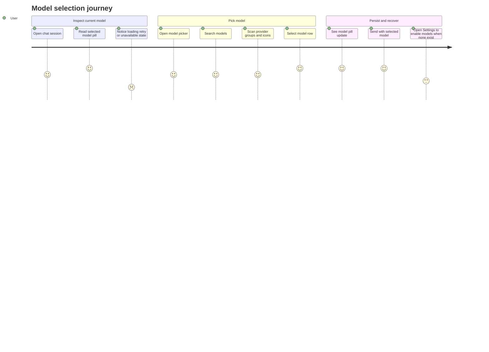

# Model Selection Boundary

Source rows: `BND-02`
Entry path: Chat mode -> composer model picker; Settings -> Providers -> Default model
Status: Draft, evidence-only

## User Journey

### Overview

| Attribute      | Value                                                                                 |
| -------------- | ------------------------------------------------------------------------------------- |
| Priority       | High                                                                                  |
| User type      | Returning user choosing which enabled provider model should answer a session          |
| Frequency      | Frequent for model switching; occasional for default model maintenance                |
| Success metric | User can identify available models, switch model, and recover from unavailable models |

### User Goal

> "I want to pick the right model for this conversation and understand when a model is unavailable."

### Preconditions

- At least one model may be enabled through provider settings, or the model list may be loading/error/empty.
- Chat composer has access to `useModelStore` state loaded from `models.list`.
- Existing sessions may have a stored model that is now unavailable because a provider was removed or disabled.

### Journey Map



### Journey Steps

#### Step 1: Inspect model state

**User action:** User opens an existing or draft conversation.
**System response:** Composer model trigger shows selected model, `Loading...`, `Retry`, `Model unavailable`, `Select model`, or `No enabled models`.
**Success criteria:**

- [ ] Loading and error states are visible in the same control the user will use to recover.
- [ ] Stored session model is restored when it still appears in the model list.
- [ ] Unavailable stored model does not silently send.

**Potential friction:**

- The model trigger currently has no stable `data-testid`, so L3 automation must rely on visible text until selectors are added.

#### Step 2: Choose from provider groups

**User action:** User opens the picker and searches or scans grouped models.
**System response:** Models render under Claude Code, OpenAI, Anthropic, Google, OpenRouter, Mistral, DeepSeek, xAI, Local, or dynamic provider groups.
**Success criteria:**

- [ ] Provider grouping is based on repo-local `chefSlug` mapping.
- [ ] Empty search shows `No models found.`
- [ ] Selecting a row closes the picker.

**Potential friction:**

- Provider group order in Chat is explicitly implemented, while Settings provider lists have their own ordering rules.

#### Step 3: Persist selection

**User action:** User selects a model row.
**System response:** Draft sessions update local session state; saved sessions call `sessions.patch` and then update local state.
**Success criteria:**

- [ ] Draft session selection is preserved until first send turns the draft into a saved session.
- [ ] Persisted session selection survives tab/session switching.
- [ ] Failed `sessions.patch` shows a toast and does not silently claim success.

**Potential friction:**

- Auto-switch to the first available model can patch a session when its stored model is gone; users see the updated pill but not a dedicated explanation.

#### Step 4: Maintain default model

**User action:** User opens Settings Providers and changes `Default model`.
**System response:** Settings patches `agents.defaults.model.primary`, refreshes model store after gateway restart, and shows a success toast.
**Success criteria:**

- [ ] Default model card reflects enabled model names.
- [ ] Removed/default-owned provider clears default state on removal.
- [ ] Default picker is unavailable until at least one model is enabled.

**Potential friction:**

- Chat session model and global default model are related but distinct; the UI does not currently explain the distinction inline.

### Error Scenarios

#### E1: Model list load times out

**Trigger:** Composer remains loading for 10 seconds while not recovering.
**User sees:** Toast `Failed to load models` with `Retry`; model trigger shows `Retry`.
**Recovery path:** User clicks the trigger or toast action to run `loadModels(client)` again.
**Test:** No direct model-picker L2 test.

#### E2: No enabled models

**Trigger:** `models.list` returns no enabled models.
**User sees:** Model trigger reads `No enabled models`; send is disabled while ready/error.
**Recovery path:** User opens Settings Providers and enables/saves at least one model.
**Test:** No L3 journey yet.

#### E3: Stored model is unavailable

**Trigger:** Session has a stored model that is missing from the loaded model set.
**User sees:** `Model unavailable` when no available models exist; otherwise UI auto-selects an available model.
**Recovery path:** User selects a different model or re-enables the missing provider/model in Settings.
**Test:** Partial L1 model matching tests; no UI flow test.

### Metrics To Track

- Model picker open-to-selection time.
- Retry count after model-list load errors.
- Send attempts blocked by no enabled/current model.
- Default model change success/failure rate.

### E2E Test Reference

Future L3 scenarios: `BND-02 selects a grouped chat model` and `BND-02 changes the default model from Settings Providers`.

## UI Surface


The Chat model picker shows the provider-grouped runtime/model list from the composer and marks the selected model.

### Wireframe

```text
Chat composer footer
+------------------------------------------------------------------+
| [+] [ Selected model v ] [ Thinking v ]                    [↑]   |
+------------------------------------------------------------------+

Model picker
+---------------------------------------------+
| Search models...                            |
|                                             |
| Claude Code                                 |
|   Claude Code                               |
| OpenAI                                      |
|   GPT-5.4                              [✓] |
| Anthropic                                   |
|   Claude Sonnet ...                         |
| Google                                      |
|   Gemini ...                                |
| No models found.                            |
+---------------------------------------------+

Settings Providers default model
+---------------------------------------------------+
| Default model                                     |
| GPT-5.4 · OpenAI                         [select] |
+---------------------------------------------------+
```

- Chat trigger states: provider logo, selected model name, `Loading...`, `Retry`, `Model unavailable`, `Select model`, `No enabled models`.
- Model picker controls: search input, empty state, provider group headings, model rows, selected indicator through model selector item.
- Settings default model card: current default label, stale default fallback `no longer enabled`, select trigger, enabled model choices.
- Send button coupling: composer submit is disabled when ACP spawn error exists or current model cannot send while status is ready/error.

## Interaction Contract

| User action                         | UI precondition                                          | UI result                                                              | Backend/API path                                       | Evidence                                                                                                                                                                                                                                                                                                                                 | Test coverage                                                                                                           |
| ----------------------------------- | -------------------------------------------------------- | ---------------------------------------------------------------------- | ------------------------------------------------------ | ---------------------------------------------------------------------------------------------------------------------------------------------------------------------------------------------------------------------------------------------------------------------------------------------------------------------------------------- | ----------------------------------------------------------------------------------------------------------------------- |
| Load available models               | Chat composer mounts with model store                    | Model trigger reflects loading/success/error/empty state               | `client.listModels()` -> gateway `models.list`         | [electron-gateway-client.ts:134](../../../../apps/electron/src/renderer/src/lib/electron-gateway-client.ts#L134), [ChatComposer.tsx:283](../../../../apps/electron/src/renderer/src/components/chat/ChatComposer.tsx#L283)                                                                                                               | L1 model helpers: [model-store.test.ts](../../../../apps/electron/src/renderer/test/model-store.test.ts); L2 picker gap |
| Map provider grouping               | Model list is available                                  | Models receive provider logo/group slug for picker display             | Local `modelsWithChefs` mapping                        | [ChatComposer.tsx:194](../../../../apps/electron/src/renderer/src/components/chat/ChatComposer.tsx#L194), [ChatComposer.tsx:202](../../../../apps/electron/src/renderer/src/components/chat/ChatComposer.tsx#L202), [ChatComposer.tsx:216](../../../../apps/electron/src/renderer/src/components/chat/ChatComposer.tsx#L216)             | L1 gap tracked in [coverage-index.md](../tests/coverage-index.md)                                                       |
| Open picker and search              | Model trigger is visible                                 | Search input and provider-grouped model list appear                    | Renderer model selector state                          | [ChatComposer.tsx:651](../../../../apps/electron/src/renderer/src/components/chat/ChatComposer.tsx#L651), [ChatComposer.tsx:682](../../../../apps/electron/src/renderer/src/components/chat/ChatComposer.tsx#L682), [ChatComposer.tsx:711](../../../../apps/electron/src/renderer/src/components/chat/ChatComposer.tsx#L711)             | L2 gap tracked in [coverage-index.md](../tests/coverage-index.md)                                                       |
| Select chat model for draft         | Session is a draft                                       | Picker closes and draft session model updates locally                  | `useSessionStore.updateSessionModel`                   | [ChatComposer.tsx:391](../../../../apps/electron/src/renderer/src/components/chat/ChatComposer.tsx#L391), [ChatComposer.tsx:401](../../../../apps/electron/src/renderer/src/components/chat/ChatComposer.tsx#L401)                                                                                                                       | L1 session store coverage; no direct picker L2                                                                          |
| Select chat model for saved session | Session is saved and client is available                 | `sessions.patch` persists model ref and local session model updates    | Gateway RPC `sessions.patch { key, model }`            | [ChatComposer.tsx:406](../../../../apps/electron/src/renderer/src/components/chat/ChatComposer.tsx#L406), [ChatComposer.tsx:408](../../../../apps/electron/src/renderer/src/components/chat/ChatComposer.tsx#L408)                                                                                                                       | L2 gap tracked in [coverage-index.md](../tests/coverage-index.md)                                                       |
| Auto-select first available model   | Stored session model is missing and models are available | Local model changes; persisted sessions patch to first available model | `sessions.patch { key, model }` for non-draft sessions | [ChatComposer.tsx:328](../../../../apps/electron/src/renderer/src/components/chat/ChatComposer.tsx#L328), [ChatComposer.tsx:357](../../../../apps/electron/src/renderer/src/components/chat/ChatComposer.tsx#L357), [ChatComposer.tsx:378](../../../../apps/electron/src/renderer/src/components/chat/ChatComposer.tsx#L378)             | No direct UI test                                                                                                       |
| Retry model load                    | Model load has timed out or model store error exists     | Toast action or trigger calls `loadModels(client)`                     | Renderer model store load path                         | [ChatComposer.tsx:283](../../../../apps/electron/src/renderer/src/components/chat/ChatComposer.tsx#L283), [ChatComposer.tsx:651](../../../../apps/electron/src/renderer/src/components/chat/ChatComposer.tsx#L651)                                                                                                                       | No direct UI test                                                                                                       |
| Block send without current model    | Status is ready/error and current model cannot send      | Submit button is disabled                                              | Local composer validation                              | [ChatComposer.tsx:279](../../../../apps/electron/src/renderer/src/components/chat/ChatComposer.tsx#L279), [ChatComposer.tsx:775](../../../../apps/electron/src/renderer/src/components/chat/ChatComposer.tsx#L775)                                                                                                                       | L2 partial through send tests; no model-specific assertion                                                              |
| Set default model                   | Settings Providers has enabled models                    | Default label updates and success toast appears                        | `config.patch` with `agents.defaults.model.primary`    | [ProvidersTab.tsx:372](../../../../apps/electron/src/renderer/src/components/settings/ProvidersTab.tsx#L372), [ProvidersTab.tsx:967](../../../../apps/electron/src/renderer/src/components/settings/ProvidersTab.tsx#L967), [ProvidersTab.tsx:983](../../../../apps/electron/src/renderer/src/components/settings/ProvidersTab.tsx#L983) | L2 no direct default-model test                                                                                         |

## Data And Events

| Data/event                   | Shape or source                                                                  | Evidence                                                                                                                                                                                                                   |
| ---------------------------- | -------------------------------------------------------------------------------- | -------------------------------------------------------------------------------------------------------------------------------------------------------------------------------------------------------------------------- |
| Model info                   | `ModelInfo` from `models.list`, enriched with `chefSlug` and `providers` locally | [electron-gateway-client.ts:134](../../../../apps/electron/src/renderer/src/lib/electron-gateway-client.ts#L134), [ChatComposer.tsx:227](../../../../apps/electron/src/renderer/src/components/chat/ChatComposer.tsx#L227) |
| Session model ref            | Persisted as `${provider}/${modelId}` for `sessions.patch`                       | [ChatComposer.tsx:408](../../../../apps/electron/src/renderer/src/components/chat/ChatComposer.tsx#L408)                                                                                                                   |
| Default model ref            | Persisted as `agents.defaults.model.primary`                                     | [ProvidersTab.tsx:379](../../../../apps/electron/src/renderer/src/components/settings/ProvidersTab.tsx#L379)                                                                                                               |
| Model picker automation gaps | Missing stable selectors for model trigger and badge                             | [l3-computer-use-scenarios.md](../tests/l3-computer-use-scenarios.md)                                                                                                                                                      |

## Gaps

- No L2 test covers model picker selection -> `sessions.patch`.
- No L2 test covers Settings default model selection -> `config.patch`.
- `ChatComposer` provider grouping has no focused unit test.
- L3 automation needs stable selectors for model trigger, model rows, selected badge, and default model picker.
