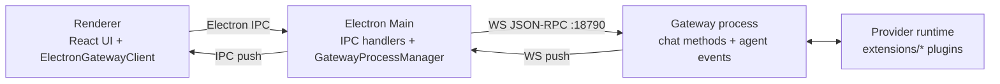
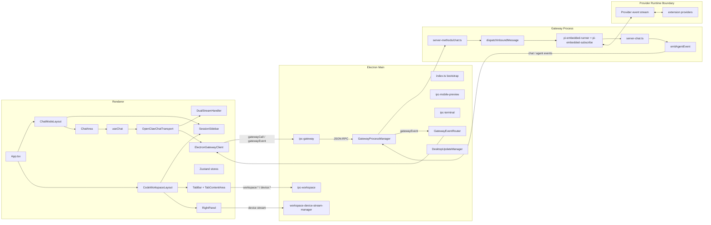
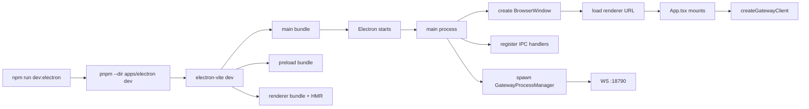

# Process Architecture Contract

Source rows: `MAIN-01`, `MAIN-05`, `BND-03`, `BND-04`

Entry path: `npm run dev:electron`

Status: Draft, source-anchored

## Runtime Shape

The Electron Agent UI runs as a renderer process, an Electron main process, and a spawned OpenClaw gateway process. The renderer speaks to main through Electron IPC. Main speaks to the gateway over JSON-RPC/WebSocket and rebroadcasts gateway events back to renderer windows.

Read the shape left to right:

| Step | Boundary         | Purpose                                                                             |
| ---- | ---------------- | ----------------------------------------------------------------------------------- |
| 1    | Renderer         | React UI renders Chat, Code, Settings, and typed renderer clients.                  |
| 2    | Electron main    | IPC handlers own desktop bridges, gateway process lifecycle, and event rebroadcast. |
| 3    | Gateway process  | Gateway methods, chat runs, and agent events execute outside the renderer.          |
| 4    | Provider runtime | Plugin/provider runtime produces model and tool events consumed by the gateway.     |
| 5    | Push path        | Gateway events flow back through main IPC to update the renderer.                   |

## Detailed Topology

This diagram expands the runtime shape into concrete renderer, main, gateway, and provider modules. It is a topology map: use it to locate ownership before following the more focused Chat/Code flow contracts.

Read the topology by process:

| Process                   | Key owners                                                                                  | Responsibility                                                                              |
| ------------------------- | ------------------------------------------------------------------------------------------- | ------------------------------------------------------------------------------------------- |
| Renderer                  | `App.tsx`, Chat/Code layouts, stores, gateway client, transport, `useChat`                  | Renders UI, manages local state, and converts user actions into typed IPC/gateway requests. |
| Electron Main             | `ipc-gateway`, workspace/device/terminal IPC, `GatewayProcessManager`, `GatewayEventRouter` | Owns desktop IPC, gateway lifecycle, and event routing back to renderer windows.            |
| Gateway Process           | Chat methods, dispatch, pi-embedded runner/subscriber, server-chat event handler            | Starts runs, dispatches provider/runtime work, and broadcasts normalized events.            |
| Provider Runtime Boundary | Provider event stream and plugins                                                           | Produces provider-specific outputs behind the normalized gateway event contract.            |

## Dev Entry

This diagram explains the local development startup path. It starts at the repo command and ends when the renderer has a gateway client connected to the spawned gateway port.

Read the flow in this order:

| Step | Node                           | Purpose                                                      |
| ---- | ------------------------------ | ------------------------------------------------------------ |
| 1    | `npm run dev:electron`         | Root repo entry point for Electron development.              |
| 2    | `pnpm --dir apps/electron dev` | Runs the Electron app workspace dev script.                  |
| 3    | `electron-vite dev`            | Builds main, preload, and renderer dev bundles.              |
| 4    | `Electron starts`              | Launches main process and creates the browser window.        |
| 5    | `GatewayProcessManager`        | Spawns the gateway process.                                  |
| 6    | `register IPC handlers`        | Makes renderer-to-main calls available.                      |
| 7    | `App.tsx mounts`               | Renderer app starts and creates the gateway client.          |
| 8    | `WS :18790`                    | Gateway WebSocket endpoint is available for JSON-RPC/events. |

## Evidence

| Behavior                                                         | Evidence                                                           |
| ---------------------------------------------------------------- | ------------------------------------------------------------------ |
| Root dev entry points to Electron app dev script                 | `package.json:1049`; `apps/electron/package.json:23`               |
| Renderer creates a singleton gateway client                      | `apps/electron/src/renderer/src/App.tsx:30`                        |
| Renderer root mounts React app                                   | `apps/electron/src/renderer/src/main.tsx:51`                       |
| Main process registers IPC after app ready                       | `apps/electron/src/main/index.ts:579`                              |
| Main process spawns gateway manager                              | `apps/electron/src/main/index.ts:850`                              |
| Gateway manager default WS port is `18790`                       | `apps/electron/src/main/gateway-manager.ts:34`                     |
| Gateway manager implementation                                   | `apps/electron/src/main/gateway-manager.ts:67`                     |
| Gateway event router buffers and rebroadcasts events             | `apps/electron/src/main/gateway-event-router.ts:27`                |
| Tool events originate from repo-local pi subscribe handlers      | `src/agents/pi-embedded-subscribe.handlers.tools.ts:374`           |
| Reasoning events originate from repo-local pi subscribe handlers | `src/agents/pi-embedded-subscribe.ts:587`                          |
| Gateway emits chat delta and thinking delta                      | `src/gateway/server-chat.ts:580`; `src/gateway/server-chat.ts:587` |
| Gateway broadcasts tool events                                   | `src/gateway/server-chat.ts:760`                                   |
| Gateway rewrites thinking into chat delta                        | `src/gateway/server-chat.ts:870`                                   |

## Contract

| User-visible effect                                                  | Runtime obligation                                                                                                                                                          | Gap                          |
| -------------------------------------------------------------------- | --------------------------------------------------------------------------------------------------------------------------------------------------------------------------- | ---------------------------- |
| App launches from `npm run dev:electron` and shows onboarding or IDE | Main, preload, and renderer bundles must load; gateway must be spawned or connection banner shown.                                                                          | L3 launch coverage: No test  |
| Chat/Code surfaces can call gateway methods                          | Renderer must route calls through `ElectronGatewayClient` to main `ipc-gateway`, then gateway RPC.                                                                          | L2 partial                   |
| Streaming UI receives text/reasoning/tool/lifecycle updates          | Gateway events must pass through main event router and renderer transport without losing order.                                                                             | L2 partial                   |
| ACP controls may be visible                                          | This boundary directory marks ACP visible controls; ACP routing and permission semantics are covered by `docs/hardware_harness/ui-contracts/agent-ui-contracts-via-acp.md`. | Covered by root ACP contract |
