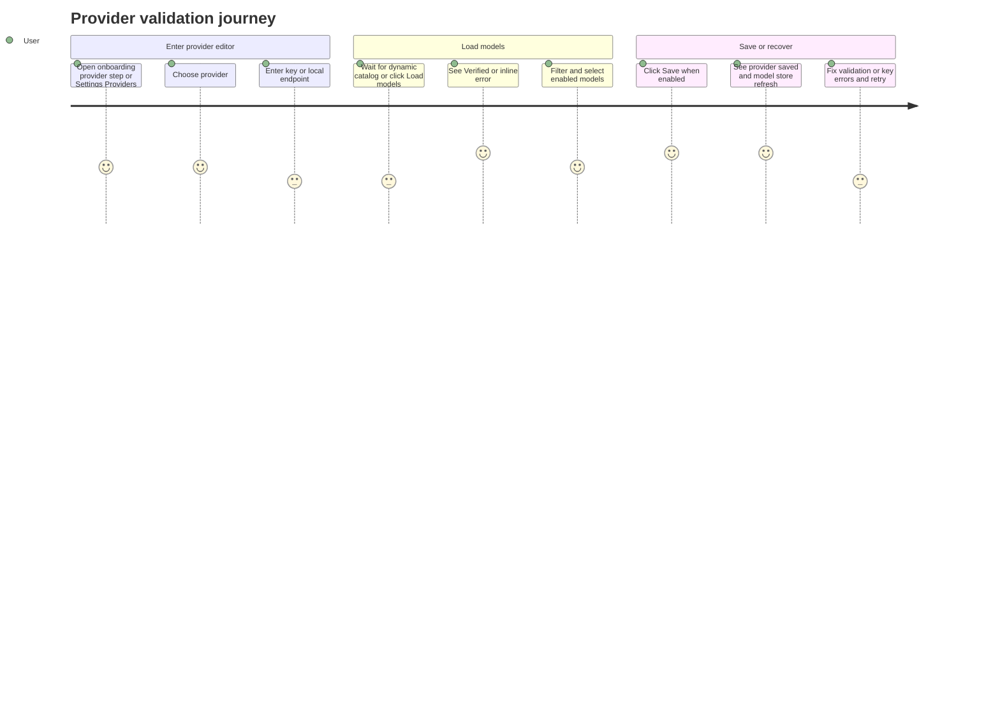

# Provider Validation Boundary

Source rows: `BND-01`
Entry path: Onboarding -> Provider step, or Settings -> Providers -> Add/Edit Provider
Status: Draft, evidence-only

## User Journey

### Overview

| Attribute      | Value                                                                                                    |
| -------------- | -------------------------------------------------------------------------------------------------------- |
| Priority       | High                                                                                                     |
| User type      | New user configuring first model provider; returning user adding or repairing provider credentials       |
| Frequency      | Setup-time and occasional maintenance                                                                    |
| Success metric | User can validate credentials or see a clear error without losing selected models or provider form state |

### User Goal

> "I want to know whether my provider key can load models, then save only the models I intend to use."

### Preconditions

- User can reach the Onboarding provider step or Settings Providers tab.
- Electron main process has registered provider IPC handlers.
- Network access to provider model-list endpoints may succeed, fail, timeout, or return provider-specific errors.

### Journey Map



### Journey Steps

#### Step 1: Choose provider and enter credentials

**User action:** User chooses a provider and types the API key, service URL, or local endpoint.
**System response:** The editor resets verification state when credential fields change.
**Success criteria:**

- [ ] Provider selector is disabled while editing an existing provider.
- [ ] Credential input matches the provider-specific label and placeholder.
- [ ] Validation messages appear inline before Save becomes available.

**Potential friction:**

- Local provider setup uses the same `apiKey` draft field for endpoint input internally, which is invisible to the user but makes copy in tests easy to misread.

#### Step 2: Load or validate models

**User action:** User waits for automatic catalog loading or clicks `Load models` / `Reload models`.
**System response:** The button enters `Loading...`, Electron main validates the provider, and the enabled model list updates or displays an inline error.
**Success criteria:**

- [ ] Dynamic providers do not call validation until required credentials pass local validation.
- [ ] Successful validation shows `Verified`.
- [ ] Failures preserve form values and display a recoverable inline error.

**Potential friction:**

- Provider validation is direct Electron IPC, not gateway RPC; gateway health is not the source of truth for this step.

#### Step 3: Select enabled models and save

**User action:** User filters models, checks model boxes, and clicks `Save`.
**System response:** Provider config is saved through Electron IPC, model store refreshes, and the editor returns to the list.
**Success criteria:**

- [ ] Save is disabled until at least one model is enabled.
- [ ] Stale enabled models remain visible as warnings instead of disappearing silently.
- [ ] Save failure keeps the editor open.

**Potential friction:**

- The save path uses gateway config APIs after Electron IPC reaches main, so validation can succeed while save still fails due to config write issues.

### Error Scenarios

#### E1: Provider endpoint rejects the key

**Trigger:** Provider validation fetch returns 401, 403, or another non-OK status.
**User sees:** Inline provider validation error and disabled Save.
**Recovery path:** User corrects the key or endpoint and reloads models.
**Test:** No focused IPC provider-validator test; tracked as a L2 gap.

#### E2: Model catalog is unavailable

**Trigger:** Endpoint returns no models, network fetch fails, or dynamic refresh fails after cached models were available.
**User sees:** Inline error; when cached models exist, the UI can keep showing cached models with an error note.
**Recovery path:** User can retry `Reload models` or save existing enabled models if validation state permits.
**Test:** No direct L2 contract test for the Settings provider editor.

#### E3: Local provider

**Trigger:** User selects `local`.
**User sees:** Local model id input instead of remote dynamic model list.
**Recovery path:** User enters the local model id manually and saves.
**Test:** No direct provider-validation UI test.

### Metrics To Track

- Validation success/failure rate by provider id.
- Time from entering credentials to model list populated.
- Save disabled reason frequency.
- Drop-off from validation error to successful save.

### E2E Test Reference

Future L3 scenario: `BND-01 validates a provider from Settings, enables a model, saves, and sees it in Chat model picker`.

## UI Surface


Onboarding provider setup is one caller of the shared provider-validation boundary: provider choice, credentials, model selection, verification, and Continue are visible together.

### Wireframe

```text
+------------------------------------------------------------------+
| Settings                                                         |
| General Workspace Providers Extensions Permissions Voice ...     |
+----------------------+-------------------------------------------+
| Providers            | Providers                                 |
|                      |                                           |
|                      | Default model                             |
|                      | [Pick a default model v]                  |
|                      |                                           |
|                      | Provider rows...               [Add]     |
|                      |                                           |
|                      | Add/Edit Provider                         |
|                      | [Back]                                    |
|                      | Provider                                  |
|                      | [Anthropic v]                             |
|                      | API key                                   |
|                      | [********************************]        |
|                      | Verified / inline error                   |
|                      | Enabled models                 2 enabled |
|                      | [Filter models...]                        |
|                      | [x] claude-...                            |
|                      | [ ] claude-...                            |
|                      | [Load models] [Remove provider] [Save]   |
|                      | disabled reason text                      |
+----------------------+-------------------------------------------+
```

- List state: `Providers` heading, empty state `No providers yet`, `Add Provider`, default model card, provider rows.
- Editor state: `Back`, `Add Provider` / `Edit Provider`, provider selector, credential or endpoint input, optional region selector, enabled model count, model filter, checkbox list, stale model warning rows.
- Loading states: page-level `Loading providers...`, model button `Loading...`.
- Success state: inline `Verified`, save success toast.
- Error states: local validation message, inline provider error, disabled Save reason, save/remove toast errors.

## Interaction Contract

| User action                    | UI precondition                                       | UI result                                                                                            | Backend/API path                                                                      | Evidence                                                                                                                                                                                                                                                                                                     | Test coverage                                                     |
| ------------------------------ | ----------------------------------------------------- | ---------------------------------------------------------------------------------------------------- | ------------------------------------------------------------------------------------- | ------------------------------------------------------------------------------------------------------------------------------------------------------------------------------------------------------------------------------------------------------------------------------------------------------------ | ----------------------------------------------------------------- |
| Load configured providers      | Providers tab mounts                                  | Provider list and default model label populate, or load error toast appears                          | `client.listProviders()` and `client.configGet()`                                     | [ProvidersTab.tsx:357](../../../../apps/electron/src/renderer/src/components/settings/ProvidersTab.tsx#L357), [electron-gateway-client.ts:173](../../../../apps/electron/src/renderer/src/lib/electron-gateway-client.ts#L173)                                                                               | L2 no focused provider list test                                  |
| Open create editor             | User clicks `Add Provider`                            | Draft provider resets and editor mode becomes create                                                 | Local renderer state                                                                  | [ProvidersTab.tsx:460](../../../../apps/electron/src/renderer/src/components/settings/ProvidersTab.tsx#L460), [ProvidersTab.tsx:956](../../../../apps/electron/src/renderer/src/components/settings/ProvidersTab.tsx#L956)                                                                                   | L2 no direct test                                                 |
| Change credentials             | Editor is open                                        | Verification state returns to idle and inline errors clear                                           | Local renderer state                                                                  | [ProvidersTab.tsx:501](../../../../apps/electron/src/renderer/src/components/settings/ProvidersTab.tsx#L501), [ProvidersTab.tsx:745](../../../../apps/electron/src/renderer/src/components/settings/ProvidersTab.tsx#L745)                                                                                   | L2 no direct test                                                 |
| Load dynamic models            | Provider is non-local and key passes local validation | Button shows loading, then available models and `Verified`, or inline error                          | `client.validateProviderKey` -> preload provider IPC -> main `handleValidateProvider` | [ProvidersTab.tsx:525](../../../../apps/electron/src/renderer/src/components/settings/ProvidersTab.tsx#L525), [electron-gateway-client.ts:197](../../../../apps/electron/src/renderer/src/lib/electron-gateway-client.ts#L197), [ipc-gateway.ts:311](../../../../apps/electron/src/main/ipc-gateway.ts#L311) | L2 gap tracked in [coverage-index.md](../tests/coverage-index.md) |
| Validate Anthropic key         | Provider id is `anthropic`                            | Returns Anthropic model rows with vision flag for Claude 3/4 ids                                     | Main process `net.fetch('https://api.anthropic.com/v1/models')`                       | [ipc-gateway.ts:102](../../../../apps/electron/src/main/ipc-gateway.ts#L102), [ipc-gateway.ts:114](../../../../apps/electron/src/main/ipc-gateway.ts#L114)                                                                                                                                                   | No focused IPC provider-validator test                            |
| Validate OpenAI-compatible key | Provider id maps to an OpenAI-compatible endpoint     | Returns sorted model ids or provider error                                                           | Main process `net.fetch(`${baseUrl}/models`)` with Bearer auth                        | [ipc-gateway.ts:129](../../../../apps/electron/src/main/ipc-gateway.ts#L129), [ipc-gateway.ts:317](../../../../apps/electron/src/main/ipc-gateway.ts#L317)                                                                                                                                                   | No focused IPC provider-validator test                            |
| Validate Google key            | Provider id is `google`                               | Returns Gemini models that support `generateContent`                                                 | Main process Google model-list fetch                                                  | [ipc-gateway.ts:204](../../../../apps/electron/src/main/ipc-gateway.ts#L204), [ipc-gateway.ts:219](../../../../apps/electron/src/main/ipc-gateway.ts#L219)                                                                                                                                                   | No focused IPC provider-validator test                            |
| Validate MiniMax key           | Provider id is `minimax`                              | Uses remote `/models` when available; falls back to known list for non-auth failures                 | Main process MiniMax validator                                                        | [ipc-gateway.ts:160](../../../../apps/electron/src/main/ipc-gateway.ts#L160), [ipc-gateway.ts:191](../../../../apps/electron/src/main/ipc-gateway.ts#L191)                                                                                                                                                   | No focused IPC provider-validator test                            |
| Validate local provider        | Provider id is `local`                                | Returns without a remote model-list call; user enters the local model id manually                    | Main process local-provider branch                                                    | [ipc-gateway.ts:349](../../../../apps/electron/src/main/ipc-gateway.ts#L349), [ProvidersTab.tsx:818](../../../../apps/electron/src/renderer/src/components/settings/ProvidersTab.tsx#L818)                                                                                                                   | No focused IPC provider-validator test                            |
| Toggle enabled model           | Model list is visible                                 | Enabled count updates and Save disabled reason recalculates                                          | Local renderer state                                                                  | [ProvidersTab.tsx:512](../../../../apps/electron/src/renderer/src/components/settings/ProvidersTab.tsx#L512), [ProvidersTab.tsx:799](../../../../apps/electron/src/renderer/src/components/settings/ProvidersTab.tsx#L799)                                                                                   | L2 no direct test                                                 |
| Save provider                  | Save is enabled                                       | Provider is persisted, model store refresh is requested, editor closes                               | `client.saveProvider` -> IPC `provider:save` -> gateway `config.set`                  | [ProvidersTab.tsx:607](../../../../apps/electron/src/renderer/src/components/settings/ProvidersTab.tsx#L607), [electron-gateway-client.ts:181](../../../../apps/electron/src/renderer/src/lib/electron-gateway-client.ts#L181), [ipc-gateway.ts:285](../../../../apps/electron/src/main/ipc-gateway.ts#L285) | L2 gap tracked in [coverage-index.md](../tests/coverage-index.md) |
| Remove provider                | Editing existing provider and user confirms           | Provider is removed, default model is cleared if owned by provider, model store refresh is requested | `client.removeProvider` -> IPC `provider:remove` -> gateway `config.set`              | [ProvidersTab.tsx:651](../../../../apps/electron/src/renderer/src/components/settings/ProvidersTab.tsx#L651), [electron-gateway-client.ts:189](../../../../apps/electron/src/renderer/src/lib/electron-gateway-client.ts#L189), [ipc-gateway.ts:299](../../../../apps/electron/src/main/ipc-gateway.ts#L299) | L2 gap tracked in [coverage-index.md](../tests/coverage-index.md) |

## Data And Events

| Data/event                 | Shape or source                                                                     | Evidence                                                                                                                                                                                                                                 |
| -------------------------- | ----------------------------------------------------------------------------------- | ---------------------------------------------------------------------------------------------------------------------------------------------------------------------------------------------------------------------------------------- |
| Provider validation result | `{ id, name, provider, supportsVision? }[]`                                         | [ipc-gateway.ts:114](../../../../apps/electron/src/main/ipc-gateway.ts#L114), [ipc-gateway.ts:144](../../../../apps/electron/src/main/ipc-gateway.ts#L144), [ipc-gateway.ts:221](../../../../apps/electron/src/main/ipc-gateway.ts#L221) |
| Provider config            | `ProviderConfig` with `id`, `name`, `apiKey`, `baseUrl`, `enabledModels`, `enabled` | [ProvidersTab.tsx:613](../../../../apps/electron/src/renderer/src/components/settings/ProvidersTab.tsx#L613)                                                                                                                             |
| IPC provider surface       | `providerValidate`, `providerList`, `providerSave`, `providerRemove`                | [ipc-gateway.ts:420](../../../../apps/electron/src/main/ipc-gateway.ts#L420)                                                                                                                                                             |
| Default model config       | `agents.defaults.model.primary` patched via `config.patch`                          | [ProvidersTab.tsx:372](../../../../apps/electron/src/renderer/src/components/settings/ProvidersTab.tsx#L372)                                                                                                                             |

### Provider Validation Matrix

Settings exposes 14 provider ids. The validator branch and default endpoint are:

| Provider id   | Display name | Validator path             | Default endpoint or behavior                                                |
| ------------- | ------------ | -------------------------- | --------------------------------------------------------------------------- |
| `anthropic`   | Anthropic    | `validateAnthropic`        | `https://api.anthropic.com/v1/models`                                       |
| `deepseek`    | DeepSeek     | `validateOpenAICompatible` | `https://api.deepseek.com/v1`                                               |
| `google`      | Google       | `validateGoogle`           | Google Generative Language models endpoint                                  |
| `groq`        | Groq         | `validateOpenAICompatible` | `https://api.groq.com/openai/v1`                                            |
| `huggingface` | Hugging Face | `validateOpenAICompatible` | `https://api-inference.huggingface.co/v1`                                   |
| `local`       | Local Models | Local branch               | No remote validation; local model id is entered manually                    |
| `minimax`     | MiniMax      | `validateMiniMax`          | Region URL from Settings, defaulting to `https://api.minimax.io/v1` in main |
| `mistral`     | Mistral      | `validateOpenAICompatible` | `https://api.mistral.ai/v1`                                                 |
| `moonshot`    | Moonshot     | `validateOpenAICompatible` | `https://api.moonshot.ai/v1`                                                |
| `openai`      | OpenAI       | `validateOpenAICompatible` | `https://api.openai.com/v1`                                                 |
| `openrouter`  | OpenRouter   | `validateOpenAICompatible` | `https://openrouter.ai/api/v1`                                              |
| `perplexity`  | Perplexity   | `validateOpenAICompatible` | `https://api.perplexity.ai`                                                 |
| `together`    | Together     | `validateOpenAICompatible` | `https://api.together.xyz/v1`                                               |
| `xai`         | xAI          | `validateOpenAICompatible` | `https://api.x.ai/v1`                                                       |

Evidence: [ProvidersTab.tsx:65](../../../../apps/electron/src/renderer/src/components/settings/ProvidersTab.tsx#L65), [ipc-gateway.ts:315](../../../../apps/electron/src/main/ipc-gateway.ts#L315).

## Gaps

- No L2 test covers provider editor open/create/edit/save/remove as a user-visible flow.
- No focused main-process test mocks `net.fetch` for each provider validator.
- No L3 scenario verifies provider validation from Onboarding or Settings.
- Stable selectors for Settings provider rows, model checkboxes, Load models, Save, and Remove provider are not documented as present.
