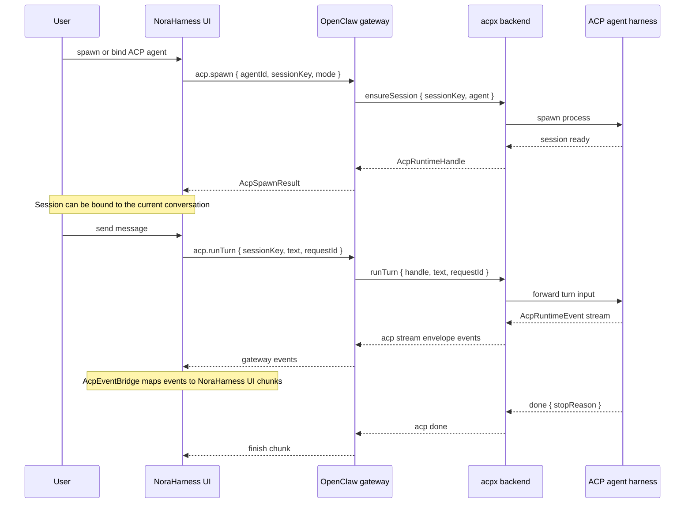
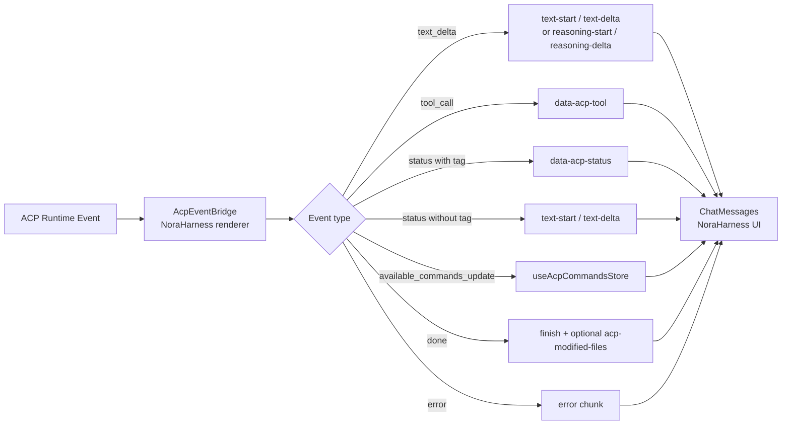
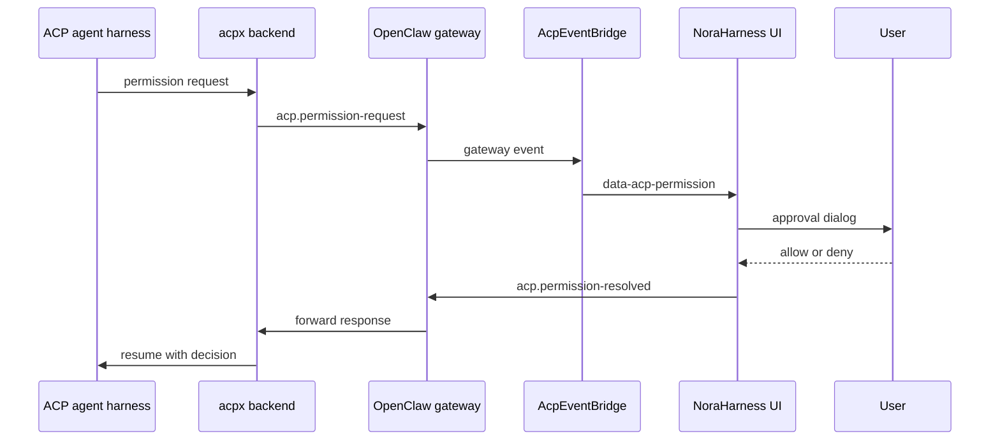
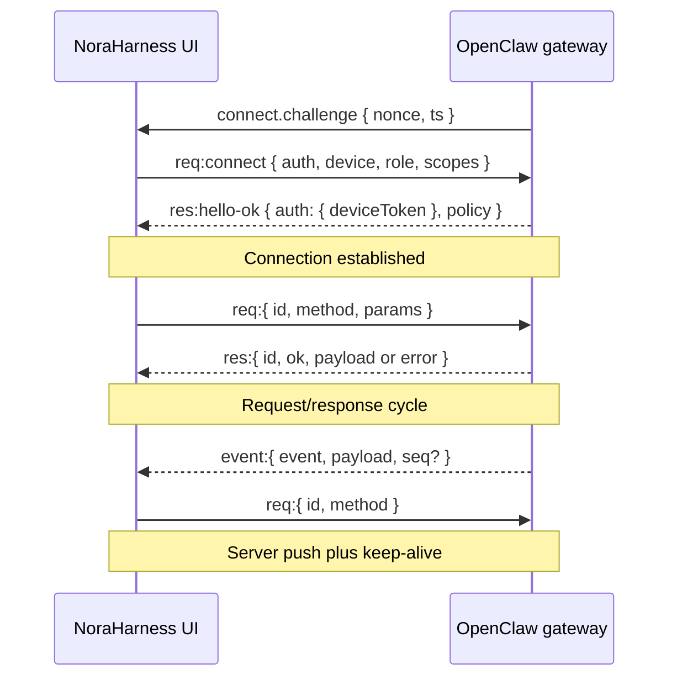
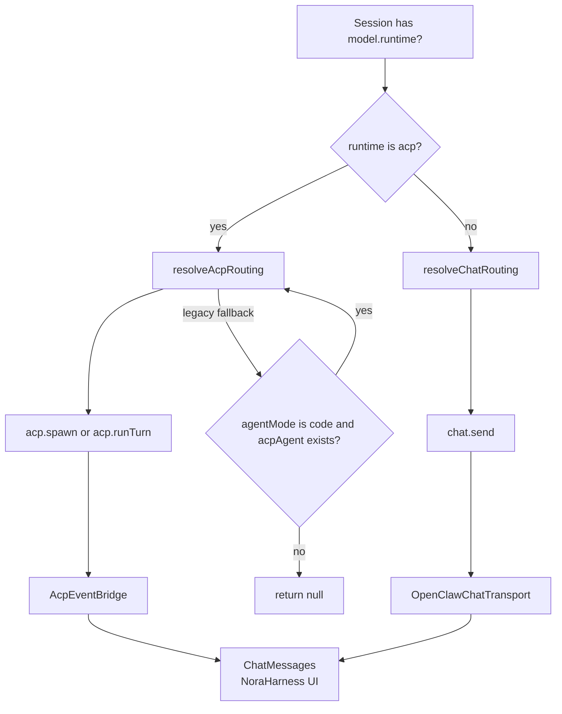
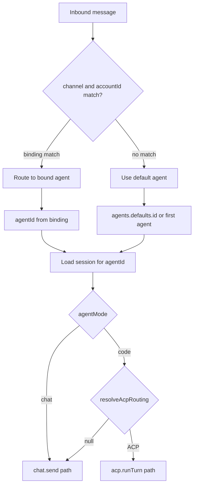
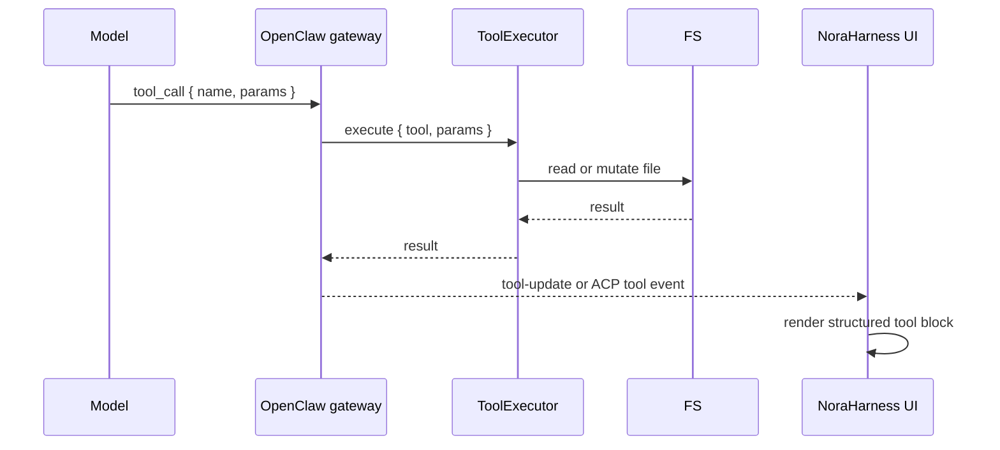
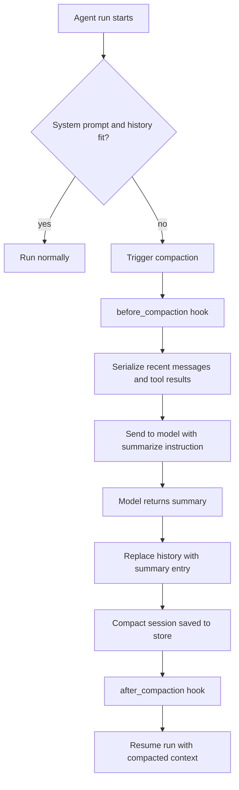

# NoraHarness Agent Runtime Flows

NoraHarness is the Electron desktop product in `apps/electron`. It uses OpenClaw as the gateway, protocol, and runtime substrate. The flows below describe how NoraHarness creates, routes, and renders agent sessions, with OpenClaw shown as the underlying gateway layer rather than the product UI.

## ACP Session Lifecycle

How a NoraHarness ACP agent session is created, bound, and managed end to end.

Read the sequence in this order:

| Step | Actor                                                       | Purpose                                                                           | Contract result                                       |
| ---- | ----------------------------------------------------------- | --------------------------------------------------------------------------------- | ----------------------------------------------------- |
| 1    | `User` -> `NoraHarness UI`                                  | User spawns or binds an ACP agent session.                                        | UI has an agent/session request to send.              |
| 2    | `OpenClaw gateway` -> `acpx backend` -> `ACP agent harness` | Gateway ensures an ACP session exists and starts the harness process when needed. | UI receives an `AcpSpawnResult`.                      |
| 3    | User message path                                           | UI sends `acp.runTurn` for the bound session.                                     | ACP backend forwards the turn input to the harness.   |
| 4    | Runtime event stream                                        | Harness emits `AcpRuntimeEvent` values through `acpx` and the gateway.            | Renderer receives gateway events for the active turn. |
| 5    | `AcpEventBridge`                                            | Maps gateway events to NoraHarness UI chunks.                                     | Chat rendering updates while the ACP turn runs.       |
| 6    | `done`                                                      | Harness completion closes the stream.                                             | Gateway sends a finish chunk to the UI.               |

**Key states:**

- `idle`: before the turn is running.
- `running`: while the ACP turn is active.
- `error`: after a runtime failure.

The renderer also treats `done` as a stream completion event even though `AcpRuntimeState` currently models the runtime state as `idle`, `running`, or `error`.

## Agent UI Event Bridge

How ACP runtime events flow through to NoraHarness rendering.

Read the flow in this order:

| Step | Node                        | Purpose                                                                 | Visible result                                               |
| ---- | --------------------------- | ----------------------------------------------------------------------- | ------------------------------------------------------------ |
| 1    | `ACP Runtime Event`         | ACP backend emits one runtime event.                                    | Renderer bridge receives a typed event.                      |
| 2    | `AcpEventBridge`            | Classifies the event by `type`, stream, and tag.                        | Event is converted to the right UI chunk family.             |
| 3    | `text_delta`                | Output text becomes text chunks; thought text becomes reasoning chunks. | Chat message list text or reasoning grows.                   |
| 4    | `tool_call`                 | Tool status is keyed by tool call id.                                   | Existing ACP tool block updates in place.                    |
| 5    | `status`                    | Tagged status becomes structured status; untagged status becomes text.  | Status is either a block or normal assistant text.           |
| 6    | `available_commands_update` | Updates available ACP commands for the session.                         | Command UI can reflect current ACP capabilities.             |
| 7    | `done` or `error`           | Closes the turn as success or failure.                                  | ChatMessages renders finish, modified files, or error state. |

### Permission Flow

Read the sequence in this order:

| Step | Actor                                                    | Purpose                                          | Contract result                                |
| ---- | -------------------------------------------------------- | ------------------------------------------------ | ---------------------------------------------- |
| 1    | `ACP agent harness`                                      | Requests permission for a protected operation.   | Turn pauses until decision is resolved.        |
| 2    | `acpx backend` -> `OpenClaw gateway`                     | Forwards the permission request.                 | Gateway can broadcast it to the renderer.      |
| 3    | `AcpEventBridge` -> `NoraHarness UI`                     | Converts the request into `data-acp-permission`. | User sees an approval surface.                 |
| 4    | `User` -> `NoraHarness UI`                               | User allows or denies the request.               | UI records the decision.                       |
| 5    | `NoraHarness UI` -> `OpenClaw gateway` -> `acpx backend` | Sends the resolved permission response.          | Backend can resume the harness.                |
| 6    | `acpx backend` -> `ACP agent harness`                    | Delivers the decision.                           | Harness continues or stops the protected work. |

## Gateway WebSocket Protocol

NoraHarness connects to the OpenClaw gateway as an operator client. The gateway owns authentication, request/response dispatch, and server-pushed events.

Read the sequence in three phases:

| Phase            | Messages                                                         | Purpose                                                                        |
| ---------------- | ---------------------------------------------------------------- | ------------------------------------------------------------------------------ |
| Connect          | `connect.challenge`, `req:connect`, `res:hello-ok`               | Authenticates the operator client and establishes policy/device token context. |
| Request/response | `req:{ id, method, params }`, `res:{ id, ok, payload or error }` | Runs typed gateway methods such as Chat, ACP, sessions, and workspace calls.   |
| Server push      | `event:{ event, payload, seq? }`, keep-alive request             | Delivers asynchronous stream events and keeps the client connection healthy.   |

**Roles:**

- `operator`: NoraHarness, CLI, and other operator clients.
- `node`: paired runtime devices, such as mobile, hardware, or headless nodes.

## Session Routing

How NoraHarness decides whether a user turn routes to ACP or native chat.

Read the flow in this order:

| Step | Node                         | Purpose                                                              | Contract result                                                         |
| ---- | ---------------------------- | -------------------------------------------------------------------- | ----------------------------------------------------------------------- |
| 1    | `Session has model.runtime?` | Checks the session's selected model/runtime metadata.                | Runtime-specific routing can be chosen.                                 |
| 2    | `runtime is acp?`            | Splits ACP-backed sessions from native chat sessions.                | ACP sessions use `resolveAcpRouting`; others use `resolveChatRouting`.  |
| 3    | `resolveAcpRouting`          | Decides whether to spawn or reuse an ACP session.                    | Turn becomes `acp.spawn` or `acp.runTurn`.                              |
| 4    | `resolveChatRouting`         | Routes normal chat sessions.                                         | Turn becomes `chat.send`.                                               |
| 5    | Bridge or transport          | ACP uses `AcpEventBridge`; native chat uses `OpenClawChatTransport`. | Both paths converge in `ChatMessages`.                                  |
| 6    | Legacy fallback              | Code-mode sessions with `acpAgent` can still resolve ACP routing.    | Missing ACP routing returns `null` instead of silently falling through. |

## Multi-Agent Routing

How an inbound message routes to the correct agent.

Read the flow in this order:

| Step | Node                           | Purpose                                           | Contract result                                          |
| ---- | ------------------------------ | ------------------------------------------------- | -------------------------------------------------------- |
| 1    | `Inbound message`              | Message arrives from a channel or account.        | Router needs an agent target.                            |
| 2    | `channel and accountId match?` | Checks explicit bindings.                         | Bound messages route to the bound agent.                 |
| 3    | `Use default agent`            | Applies fallback when no binding matches.         | Message still has a deterministic agent target.          |
| 4    | `Load session for agentId`     | Loads the session context for the selected agent. | Routing can inspect `agentMode`.                         |
| 5    | `agentMode`                    | Splits normal Chat from Code/ACP capable routing. | Chat goes to `chat.send`; Code can resolve ACP.          |
| 6    | `resolveAcpRouting`            | Uses ACP when available, otherwise falls back.    | Code-mode messages can use `acp.runTurn` or native chat. |

## Tool Call Lifecycle

Native chat tool calls and ACP tool events use different backends but converge in the NoraHarness message UI as structured chunks. The convergence point is the message list renderer, not a shared payload shape: native tools become `tool-<name>` parts with input/output/progress fields, while ACP tools become `data-acp-tool` parts with title/status/text fields.

Read the sequence in this order:

| Step | Actor              | Purpose                                        | Visible result                                                        |
| ---- | ------------------ | ---------------------------------------------- | --------------------------------------------------------------------- |
| 1    | `Model`            | Requests a tool call with name and parameters. | Gateway receives a structured tool request.                           |
| 2    | `ToolExecutor`     | Runs the requested tool.                       | File system or other side effects happen behind the gateway boundary. |
| 3    | `FS`               | Returns file read/mutation result.             | Tool executor has output or error data.                               |
| 4    | `OpenClaw gateway` | Broadcasts tool-update or ACP tool event.      | Renderer receives structured tool progress.                           |
| 5    | `NoraHarness UI`   | Renders the tool block.                        | User sees tool status/result in the message list.                     |

For ACP turns, mutation tool kinds also feed the renderer file-reload coordinator so edited buffers refresh and end-of-turn modified-file summaries render.

| Path        | Stream event shape                                                                  | UI part shape                                                                                             | Renderer                                                                                   |
| ----------- | ----------------------------------------------------------------------------------- | --------------------------------------------------------------------------------------------------------- | ------------------------------------------------------------------------------------------ |
| Native chat | `ToolEventData { phase, name, toolCallId, args, partialResult, result, isError }`   | `tool-<name> { toolCallId, state, input?, output?, errorText?, progress? }`                               | `ChatMessages` uses specialized renderers for `read`, `write`, `edit`, `bash`, and `exec`. |
| ACP         | `AcpRuntimeEvent { type: "tool_call", toolCallId?, title?, status?, text?, kind? }` | `data-acp-tool { toolCallId, title?, status?, text?, tag? }`; mutation `kind/locations` also update files | `AcpToolBlock` renders status/text; modified files summary appears at end of turn.         |

Native chat cards use `toolCallId` to merge start/update/result events. ACP cards also use `toolCallId`, but only for keyed status replacement; ACP does not currently render separate input and output panels.

## Compaction Flow

How session history is compacted when context fills up.

Read the flow in this order:

| Step | Node                                         | Purpose                                                    | Contract result                                           |
| ---- | -------------------------------------------- | ---------------------------------------------------------- | --------------------------------------------------------- |
| 1    | `Agent run starts`                           | Runtime prepares to build model context.                   | Context fit check begins.                                 |
| 2    | `System prompt and history fit?`             | Determines whether current history fits the model context. | Fitting runs proceed normally.                            |
| 3    | `Trigger compaction`                         | Starts summarization when context is too large.            | Hooks can run before compaction.                          |
| 4    | `Serialize recent messages and tool results` | Builds a compactable representation of the session.        | Summarizer prompt has enough recent context.              |
| 5    | `Model returns summary`                      | Summarization output replaces long history.                | Session history shrinks.                                  |
| 6    | `Compact session saved to store`             | Persists the compacted history.                            | Hooks can run after compaction.                           |
| 7    | `Resume run with compacted context`          | Original run continues with smaller context.               | User turn can proceed instead of failing on context size. |

## Related

- [NoraHarness Agent UI Contracts via ACP](../agent-ui-contracts-via-acp.md)
- `apps/electron/src/renderer/src/lib/acp-bridge.ts`
- `apps/electron/src/renderer/src/lib/protocol-bridge.ts`
- `apps/electron/src/renderer/src/lib/types.ts`
