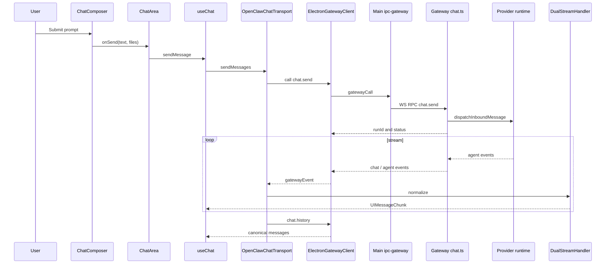
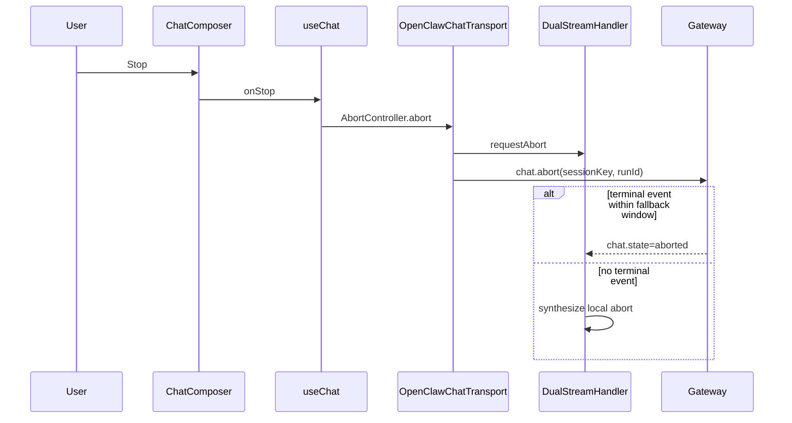
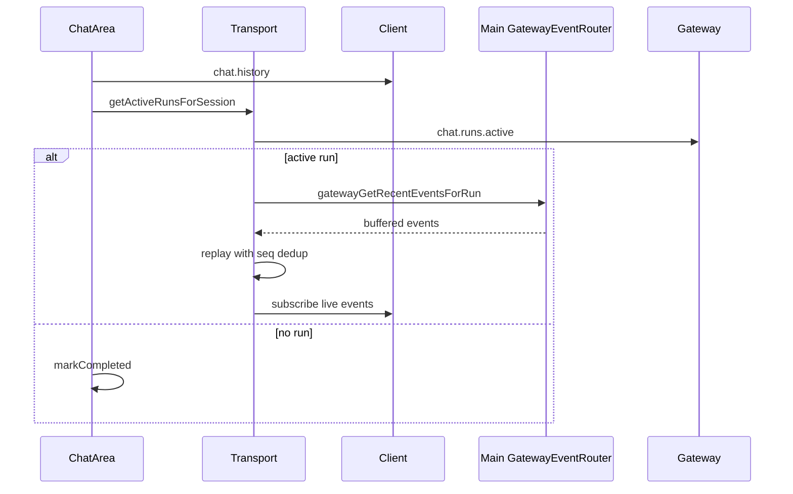
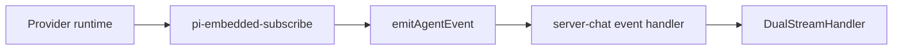
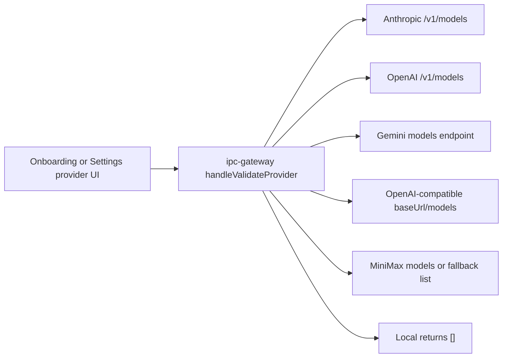

# Renderer Main Gateway Transport And Events Contract

Source rows: `BND-01` through `BND-04`; shared by `CHAT-*`, `CODE-*`, `SET-04`, and `ONB-02`

Entry path: any Chat send, provider validation, or Code workspace panel action

Status: Draft, source-anchored

## Chat Send

This sequence explains the full handoff from a visible Chat submit action to gateway/provider execution and back into rendered UI chunks. Use it to distinguish renderer responsibilities from Electron main, gateway, provider runtime, and stream-normalization responsibilities.

Read the sequence in this order:

| Step | Actor                                              | Purpose                                                     | Contract result                                                      |
| ---- | -------------------------------------------------- | ----------------------------------------------------------- | -------------------------------------------------------------------- |
| 1    | `User` -> `ChatComposer`                           | User submits a prompt from the composer.                    | Visible UI validation has a concrete user action to process.         |
| 2    | `ChatComposer` -> `ChatArea` -> `useChat`          | Renderer accepts the send and creates optimistic run state. | Message list can show the submitted user message.                    |
| 3    | `useChat` -> `OpenClawChatTransport`               | UI message payload is normalized for transport.             | Renderer leaves component code and enters transport code.            |
| 4    | `ElectronGatewayClient` -> `Main ipc-gateway`      | Renderer calls the typed gateway facade over IPC.           | Main process handles the WebSocket gateway call.                     |
| 5    | `Gateway chat.ts` -> `Provider runtime`            | Gateway starts the run and dispatches the inbound message.  | Provider/runtime work begins and an ack returns `{ runId, status }`. |
| 6    | `Provider runtime` -> `Gateway chat.ts`            | Provider emits agent events while the run progresses.       | Gateway broadcasts chat and agent events.                            |
| 7    | `ElectronGatewayClient` -> `OpenClawChatTransport` | Renderer receives gateway events from the subscription.     | Events are scoped back to the active Chat run.                       |
| 8    | `DualStreamHandler` -> `useChat`                   | Raw gateway events become UI message chunks.                | Text, reasoning, tool, final, abort, and error parts can render.     |
| 9    | `chat.history`                                     | Transport refreshes canonical history after the run.        | UI can reconcile persisted transcript after terminal events.         |

Evidence:

- Transport send pipeline: `apps/electron/src/renderer/src/lib/protocol-bridge.ts:86`
- Main IPC relay: `apps/electron/src/main/ipc-gateway.ts:375`
- Gateway `chat.send`: `src/gateway/server-methods/chat.ts:1347`
- Gateway dispatch call: `src/gateway/server-methods/chat.ts:1748`
- Tool event bridge: `src/agents/pi-embedded-subscribe.handlers.tools.ts:374`
- Reasoning event bridge: `src/agents/pi-embedded-subscribe.ts:587`
- Gateway tool broadcast: `src/gateway/server-chat.ts:760`

## Abort

This sequence explains how the visible Stop action becomes both a gateway abort request and a local fallback. The fallback matters because the renderer must leave streaming state even if a terminal abort event does not arrive quickly.

Read the sequence in this order:

| Step | Actor                                                  | Purpose                                                 | Contract result                                                                                                   |
| ---- | ------------------------------------------------------ | ------------------------------------------------------- | ----------------------------------------------------------------------------------------------------------------- |
| 1    | `User` -> `ChatComposer`                               | User clicks Stop during a run.                          | The UI starts abort handling.                                                                                     |
| 2    | `ChatComposer` -> `useChat` -> `OpenClawChatTransport` | Hook aborts the active transport controller.            | Local stream consumption is asked to stop.                                                                        |
| 3    | `OpenClawChatTransport` -> `DualStreamHandler`         | Handler records that abort was requested.               | Later events can be interpreted as abort-related.                                                                 |
| 4    | `OpenClawChatTransport` -> `Gateway`                   | Renderer sends `chat.abort(sessionKey, runId)`.         | Gateway is asked to terminate one run; gateway callers can omit `runId` to abort every active run in the session. |
| 5    | `Gateway` -> `DualStreamHandler`                       | If a terminal abort event arrives in time, use it.      | UI closes the stream from canonical gateway state.                                                                |
| 6    | `DualStreamHandler` fallback                           | If no terminal event arrives, synthesize a local abort. | Composer and message list is not left stuck in streaming state.                                                   |

Evidence:

- Abort transport: `apps/electron/src/renderer/src/lib/protocol-bridge.ts:253`
- Abort fallback timer: `apps/electron/src/renderer/src/lib/dual-stream-handler.ts:58`; `apps/electron/src/renderer/src/lib/dual-stream-handler.ts:497`
- Gateway `chat.abort`: `src/gateway/server-methods/chat.ts:1266`

## Reconnect

This sequence explains how a Chat view recovers an unfinished run after navigation, reload, or late subscription. It pairs persisted history with active-run metadata and buffered events so the user sees a continuous message list.

Read the sequence in this order:

| Step | Actor                                  | Purpose                                             | Contract result                                        |
| ---- | -------------------------------------- | --------------------------------------------------- | ------------------------------------------------------ |
| 1    | `ChatArea` -> `Client`                 | Load persisted transcript for the session.          | Existing messages render before or alongside recovery. |
| 2    | `ChatArea` -> `Transport` -> `Gateway` | Query active runs for the same session.             | Renderer knows whether reconnect is needed.            |
| 3    | `Transport` -> `GatewayEventRouter`    | If a run exists, request recent buffered events.    | Missed chunks can be replayed.                         |
| 4    | `Transport`                            | Replay buffered events with sequence deduplication. | UI catches up without duplicating chunks.              |
| 5    | `Transport` -> `Client`                | Subscribe to live events after replay.              | The same run continues streaming in real time.         |
| 6    | `ChatArea`                             | If no run exists, mark bootstrap completed.         | Composer returns to ready state.                       |

Evidence:

- ChatArea reconnect bootstrap: `apps/electron/src/renderer/src/components/chat/ChatArea.tsx:361`
- Transport reconnect: `apps/electron/src/renderer/src/lib/protocol-bridge.ts:523`
- Client recent events call: `apps/electron/src/renderer/src/lib/electron-gateway-client.ts:83`
- Gateway event router: `apps/electron/src/main/gateway-event-router.ts:27`

## IPC Bridge Surface

| IPC channel                                                            | Direction        | Maps to                                           | Evidence                                                                        |
| ---------------------------------------------------------------------- | ---------------- | ------------------------------------------------- | ------------------------------------------------------------------------------- |
| `gatewayCall`                                                          | Renderer to main | `gatewayManager.call(method, params)` over WS     | `apps/electron/src/main/ipc-gateway.ts:419`                                     |
| `gatewayGetRecentEventsForRun`                                         | Renderer to main | Event router buffered run events                  | `apps/electron/src/main/ipc-gateway.ts:416`                                     |
| `gatewayGetActiveRunsForSession`                                       | Renderer to main | Event router active runs                          | `apps/electron/src/main/ipc-gateway.ts:417`                                     |
| `gatewayGetStatus` / `gatewayStart` / `gatewayStop` / `gatewayRestart` | Renderer to main | Gateway process lifecycle                         | `apps/electron/src/main/ipc-gateway.ts:412`                                     |
| `providerValidate`                                                     | Renderer to main | Direct provider `/models` fetch                   | `apps/electron/src/main/ipc-gateway.ts:420`                                     |
| `providerList` / `providerSave` / `providerRemove`                     | Renderer to main | Provider config management                        | `apps/electron/src/main/ipc-gateway.ts:421`                                     |
| `gatewayEvent`                                                         | Main to renderer | Broadcast gateway WS events and synthetic seq gap | `apps/electron/src/main/ipc-gateway.ts:434`                                     |
| `gatewayStatus`                                                        | Main to renderer | Gateway status changes                            | `apps/electron/src/main/ipc-gateway.ts:431`                                     |
| `workspace:*` file/device/project channels                             | Renderer/main    | Code IDE and Agent Authoring workspace operations | `apps/electron/src/main/ipc-channels.ts:46`                                     |
| `terminal:*`                                                           | Renderer/main    | Code terminal panel                               | `apps/electron/src/main/ipc-terminal.ts:5`                                      |
| `openDirectory`                                                        | Renderer to main | Native directory picker                           | `apps/electron/src/preload/index.ts:106`; `apps/electron/src/main/index.ts:753` |

## Gateway Chat Methods

| Method             | Purpose                                                                                                                                                                                                                                                                                 | Validator                      | Evidence                                                                                 |
| ------------------ | --------------------------------------------------------------------------------------------------------------------------------------------------------------------------------------------------------------------------------------------------------------------------------------- | ------------------------------ | ---------------------------------------------------------------------------------------- |
| `chat.runs.active` | List active runs for session                                                                                                                                                                                                                                                            | `validateChatRunsActiveParams` | `src/gateway/server-methods/chat.ts:1157`                                                |
| `chat.history`     | Return paged persisted `GatewayMessage[]` plus session run-option state (`thinkingLevel`, `fastMode`, `verboseLevel`)                                                                                                                                                                   | `validateChatHistoryParams`    | `src/gateway/server-methods/chat.ts:1187`; `src/gateway/server-methods/chat.ts:1255`     |
| `chat.abort`       | Abort one run with `{ sessionKey, runId }`, or all active runs for a session with `{ sessionKey }`                                                                                                                                                                                      | `validateChatAbortParams`      | `src/gateway/protocol/schema/logs-chat.ts:81`; `src/gateway/server-methods/chat.ts:1266` |
| `chat.send`        | Start a run from `{ sessionKey, message, idempotencyKey, attachments?, thinking?, fastMode?, deliver?, originatingChannel?, originatingTo?, originatingAccountId?, originatingThreadId?, timeoutMs?, systemInputProvenance?, systemProvenanceReceipt? }` and return `{ runId, status }` | `validateChatSendParams`       | `src/gateway/protocol/schema/logs-chat.ts:61`; `src/gateway/server-methods/chat.ts:1347` |
| `chat.inject`      | Inject assistant turn from external integrations                                                                                                                                                                                                                                        | `validateChatInjectParams`     | `src/gateway/server-methods/chat.ts:1936`                                                |

## Gateway Broadcast Streams

| Stream             | Payload shape                                                           | Producer evidence                                                                                    |
| ------------------ | ----------------------------------------------------------------------- | ---------------------------------------------------------------------------------------------------- |
| `chat` delta       | cumulative `{ type: "text", text, thinking?, textSignature? }`          | `src/gateway/server-chat.ts:580`; `src/gateway/server-chat.ts:587`; `src/gateway/server-chat.ts:633` |
| `chat` terminal    | final/aborted/error state                                               | `src/gateway/server-chat.ts:677`                                                                     |
| `agent.tool`       | `{ phase, name, toolCallId, args?, partialResult?, result?, isError? }` | `src/gateway/server-chat.ts:760`                                                                     |
| `agent.assistant`  | assistant text/media deltas                                             | `src/gateway/server-chat.ts:891`                                                                     |
| `agent.thinking`   | rewritten into `chat.delta.thinking`                                    | `src/gateway/server-chat.ts:870`                                                                     |
| `agent.lifecycle`  | start/end/error with stop reason                                        | `src/gateway/server-chat.ts:893`                                                                     |
| `agent.error`      | seq-gap notification                                                    | `src/gateway/server-chat.ts:780`                                                                     |
| `session.tool`     | session-scoped tool mirror                                              | `src/gateway/server-chat.ts:839`                                                                     |
| `sessions.changed` | session lifecycle snapshot                                              | `src/gateway/server-chat.ts:944`                                                                     |

## Broadcast Invariants

| Invariant                    | Behavior                                                                                                                                                                 | Evidence                                                                                          | Coverage                             |
| ---------------------------- | ------------------------------------------------------------------------------------------------------------------------------------------------------------------------ | ------------------------------------------------------------------------------------------------- | ------------------------------------ |
| Pre-tool text flush          | Before broadcasting `tool.start`, gateway flushes buffered chat text so pre-tool text renders above the tool card.                                                       | `src/gateway/server-chat.ts:811`                                                                  | Covered by gateway agent event tests |
| Tool-event capability gating | UI WS clients with tool-event capability receive full `result` / `partialResult`; non-UI channel/node subscribers may receive trimmed payloads when verbose is not full. | `src/gateway/server-chat.ts:764`; `src/gateway/server-chat.ts:779`                                | Partial                              |
| Thinking rewrite             | `agent.thinking` is rewritten into `chat.delta.thinking`; renderer receives the same cumulative snapshot path as text.                                                   | `src/gateway/server-chat.ts:870`; `apps/electron/src/renderer/src/lib/dual-stream-handler.ts:137` | Covered                              |
| Session lifecycle broadcast  | Lifecycle start/end/error can broadcast `sessions.changed` snapshots.                                                                                                    | `src/gateway/server-chat.ts:944`                                                                  | Partial                              |
| Seq-gap notification         | Gap detection emits an `agent.error` event so renderer can recover from missing events.                                                                                  | `src/gateway/server-chat.ts:780`                                                                  | Covered                              |

## Agent Event Pipeline

This diagram explains the repo-local normalization boundary for agent events. Provider-specific wire events should be translated before the gateway and UI consume them.

Repo-local invariant: gateway consumes normalized repo-local agent events, not raw provider wire payloads.

Read the pipeline left to right:

| Step | Node                        | Purpose                                                         |
| ---- | --------------------------- | --------------------------------------------------------------- |
| 1    | `Provider runtime`          | Produces provider/runtime-specific output while a run executes. |
| 2    | `pi-embedded-subscribe`     | Converts runtime callbacks into repo-local event shapes.        |
| 3    | `emitAgentEvent`            | Emits normalized agent events onto the internal bus.            |
| 4    | `server-chat event handler` | Converts normalized events into gateway broadcasts.             |
| 5    | `DualStreamHandler`         | Converts gateway broadcasts into renderer UI message chunks.    |

Evidence:

- `emitAgentEvent`: `src/infra/agent-events.ts:77`
- Tool emit: `src/agents/pi-embedded-subscribe.handlers.tools.ts:374`; `src/agents/pi-embedded-subscribe.handlers.tools.ts:435`; `src/agents/pi-embedded-subscribe.handlers.tools.ts:554`
- Assistant emit: `src/agents/pi-embedded-subscribe.handlers.messages.ts:329`; `src/agents/pi-embedded-subscribe.handlers.messages.ts:412`
- Reasoning emit: `src/agents/pi-embedded-subscribe.ts:570`
- Lifecycle emit: `src/agents/pi-embedded-subscribe.handlers.lifecycle.ts:25`; `src/agents/pi-embedded-subscribe.handlers.lifecycle.ts:73`; `src/agents/pi-embedded-subscribe.handlers.lifecycle.ts:91`

Repo-local boundary rule: the gateway consumes normalized repo-local `agent.tool`, `agent.assistant`, `agent.thinking`, and `agent.lifecycle` events. This contract does not assert raw Anthropic, OpenAI, Gemini, or other provider wire payload shapes unless a repo source or test anchors that specific claim.

## Provider Validation Boundary

Provider configuration and key validation are handled directly in Electron main, not through the gateway chat loop.

Read the flow in this order:

| Step | Node                                 | Purpose                                                                 | Contract result                                               |
| ---- | ------------------------------------ | ----------------------------------------------------------------------- | ------------------------------------------------------------- |
| 1    | `Onboarding or Settings provider UI` | User enters provider credentials or endpoint details.                   | Validation starts from a visible setup surface.               |
| 2    | `ipc-gateway handleValidateProvider` | Electron main handles provider validation.                              | Validation does not start a gateway Chat run.                 |
| 3    | Provider endpoint nodes              | Main probes the provider-specific models endpoint or fallback behavior. | UI receives reachable models or a validation error.           |
| 4    | `Local returns []`                   | Local providers are validated without remote model listing.             | Local setup can continue with an empty discovered-model list. |

Evidence: `apps/electron/src/main/ipc-gateway.ts:102`; `apps/electron/src/main/ipc-gateway.ts:129`; `apps/electron/src/main/ipc-gateway.ts:161`; `apps/electron/src/main/ipc-gateway.ts:204`; `apps/electron/src/main/ipc-gateway.ts:324`; `apps/electron/src/main/ipc-gateway.ts:349`.
