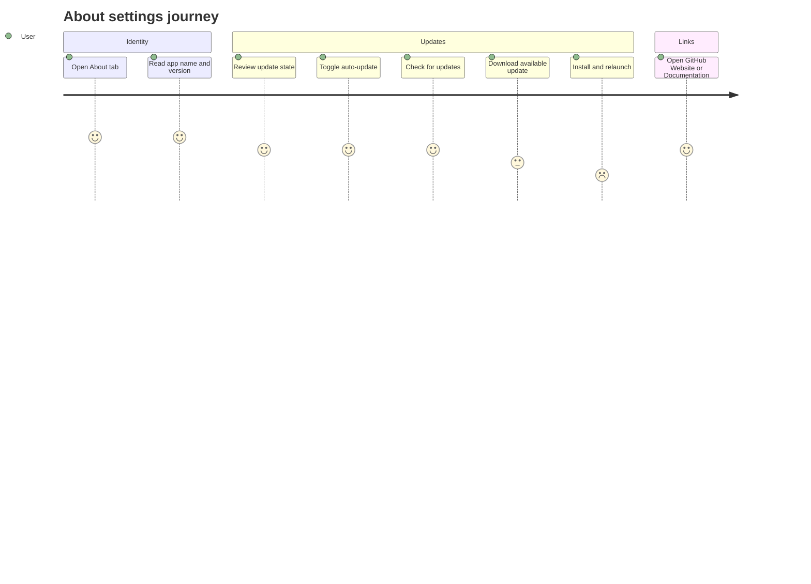

# Settings About

Source rows: `SET-10`
Entry path: Settings -> About
Status: Draft

## User Journey

### Overview

| Attribute      | Value                                                                                |
| -------------- | ------------------------------------------------------------------------------------ |
| Priority       | Medium                                                                               |
| User type      | Returning user checking app identity, updates, and support links                     |
| Frequency      | Occasional                                                                           |
| Success metric | User can understand update state and complete available update actions from Settings |

### User Goal

> "I want to confirm what version I am running, update it if needed, and find the project resources."

### Preconditions

- Settings dialog is open on About.
- Electron update bridge may be available.
- App build info and app settings bridge may be available.

### Journey Map



### Journey Steps

#### Step 1: Read app identity

**User action:** The user opens About.
**System response:** App name and display version load from Electron build info when available.
**Success criteria:**

- [ ] Fallback app name and version are present before bridge data resolves.
- [ ] Version text is immediately visible.
- [ ] License text remains visible at the bottom.

#### Step 2: Manage updates

**User action:** The user toggles auto-update, checks for updates, downloads, or installs.
**System response:** Update status message reflects current update state; actions appear only when allowed by state.
**Success criteria:**

- [ ] Check button disables while checking, downloading, or installing.
- [ ] Download appears only for available updates.
- [ ] Install and Relaunch appears only for downloaded updates.
- [ ] Auto-update toggle rolls back on save failure.

**Potential friction:**

- Update state changes arrive asynchronously through a listener, so users may see transient state changes after clicking an action.

#### Step 3: Open project links

**User action:** The user clicks GitHub, Website, or Documentation.
**System response:** Electron opens the URL externally, or the renderer falls back to `window.open`.
**Success criteria:**

- [ ] Links are grouped in a dedicated section.
- [ ] External navigation does not close Settings.
- [ ] Bridge-unavailable fallback still works in browser-like environments.

### Error Scenarios

#### E1: Check or download update fails

**Trigger:** Update bridge action rejects.
**User sees:** Error toast.
**Recovery path:** Retry the action after network or update service recovers.
**Test:** Main update manager has tests; AboutTab UI is No test.

#### E2: Auto-update save fails

**Trigger:** `updateAppSettings({ autoUpdate })` rejects.
**User sees:** Error toast and switch returns to previous value.
**Recovery path:** Retry toggle or inspect app settings bridge.
**Test:** No focused AboutTab test.

### Metrics To Track

- Update check attempts and latest/available/error outcomes.
- Download and install action failures.
- Auto-update toggle rate.
- External link clicks.

### E2E Test Reference

Future L3 scenario: `SET-10 checks for updates, handles an available update, and opens documentation`.

## UI Surface

### Wireframe

```text
+--------------------------------------------------------------------------------+
| [NH] noraharness                                                                |
|      Version 0.2.13                                                             |
|      Your AI assistant, running locally.                                        |
+--------------------------------------------------------------------------------+
| Auto-update                                                   [switch]          |
| Check NoraHarness Version for signed macOS arm64 update packages.              |
| Update status unavailable / Ready to check / Version <x> is available.         |
| [Check for Updates] [Download <version>] [Install and Relaunch]                |
+--------------------------------------------------------------------------------+
| Links                                                                          |
| [external] GitHub                                                               |
| [external] Website                                                              |
| [external] Documentation                                                        |
+--------------------------------------------------------------------------------+
| MIT License                                                                     |
+--------------------------------------------------------------------------------+
```

- App icon placeholder, app name, app version, and descriptive copy.
- Auto-update switch.
- Update status message.
- Check for Updates button.
- Conditional Download button when an update is available.
- Conditional Install and Relaunch button when an update is downloaded.
- GitHub, Website, and Documentation links.
- License text.

## Interaction Contract

| User action               | UI precondition                                             | UI result                                                                                                     | Backend/API path                                                            | Evidence                                                                                                                                                                                                                                                                                                                                                                       | Test coverage                                                |
| ------------------------- | ----------------------------------------------------------- | ------------------------------------------------------------------------------------------------------------- | --------------------------------------------------------------------------- | ------------------------------------------------------------------------------------------------------------------------------------------------------------------------------------------------------------------------------------------------------------------------------------------------------------------------------------------------------------------------------ | ------------------------------------------------------------ |
| Load About state          | About tab mounts.                                           | App name, display version, auto-update state, and update status populate from Electron bridge when available. | `getAppBuildInfo`, `getAppSettings`, `getUpdateState`, and `onUpdateState`. | `apps/electron/src/renderer/src/components/settings/AboutTab.tsx:131`; `apps/electron/src/renderer/src/components/settings/AboutTab.tsx:135`; `apps/electron/src/renderer/src/components/settings/AboutTab.tsx:143`; `apps/electron/src/renderer/src/components/settings/AboutTab.tsx:148`; `apps/electron/src/preload/index.ts:129`; `apps/electron/src/preload/index.ts:136` | No focused AboutTab test.                                    |
| Toggle auto-update        | Auto-update switch is visible.                              | Switch updates optimistically, persists through app settings, and rolls back on failure.                      | `window.electronAPI.updateAppSettings({ autoUpdate })`.                     | `apps/electron/src/renderer/src/components/settings/AboutTab.tsx:189`; `apps/electron/src/renderer/src/components/settings/AboutTab.tsx:193`; `apps/electron/src/renderer/src/components/settings/AboutTab.tsx:233`; `apps/electron/src/preload/index.ts:112`                                                                                                                  | No focused AboutTab test.                                    |
| Check for updates         | Update manager is not checking, downloading, or installing. | Button disables while checking state is active; toast reports latest or available update result.              | `window.electronAPI.checkForUpdates()`.                                     | `apps/electron/src/renderer/src/components/settings/AboutTab.tsx:158`; `apps/electron/src/renderer/src/components/settings/AboutTab.tsx:246`; `apps/electron/src/preload/index.ts:138`                                                                                                                                                                                         | Main update manager tests exist, but AboutTab UI is No test. |
| Download available update | Update state is `available`.                                | Download button appears and calls update download; toast reports success or failure.                          | `window.electronAPI.downloadUpdate()`.                                      | `apps/electron/src/renderer/src/components/settings/AboutTab.tsx:171`; `apps/electron/src/renderer/src/components/settings/AboutTab.tsx:256`; `apps/electron/src/preload/index.ts:140`                                                                                                                                                                                         | Main update manager tests exist, but AboutTab UI is No test. |
| Install downloaded update | Update state is `downloaded`.                               | Install and Relaunch button appears and calls install update; toast reports relaunch attempt.                 | `window.electronAPI.installUpdate()`.                                       | `apps/electron/src/renderer/src/components/settings/AboutTab.tsx:180`; `apps/electron/src/renderer/src/components/settings/AboutTab.tsx:268`; `apps/electron/src/preload/index.ts:142`                                                                                                                                                                                         | Main update manager tests exist, but AboutTab UI is No test. |
| Open external link        | Link list is visible.                                       | External URL opens through Electron bridge or browser fallback.                                               | `window.electronAPI.openExternal(url)` or `window.open`.                    | `apps/electron/src/renderer/src/components/settings/AboutTab.tsx:202`; `apps/electron/src/renderer/src/components/settings/AboutTab.tsx:282`; `apps/electron/src/preload/index.ts:149`                                                                                                                                                                                         | No focused AboutTab test.                                    |

## Data And Events

- Update state variants: `disabled`, `idle`, `checking`, `available`, `downloading`, `downloaded`, `installing`, `error`.
- Electron IPC bridge: `getAppBuildInfo`, `getAppSettings`, `updateAppSettings`, `getUpdateState`, `checkForUpdates`, `downloadUpdate`, `installUpdate`, `onUpdateState`, `openExternal`.
- Links: `https://github.com/openclaw/openclaw`, `https://openclaw.ai`, `https://docs.openclaw.ai`.

## Gaps

- No L2 coverage for AboutTab update state rendering, auto-update toggle, or update action buttons.
- No stable selectors for update status, update buttons, auto-update switch, or links.
- Update state behavior is covered lower in main-process update manager tests, not at the Settings UI contract layer.
