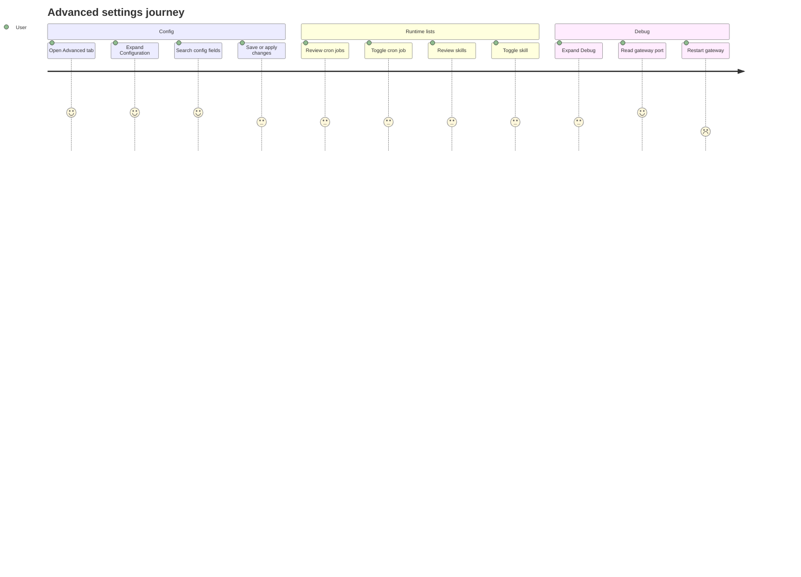

# Settings Advanced

Source rows: `SET-09`
Entry path: Settings -> Advanced
Status: Draft

## User Journey

### Overview

| Attribute      | Value                                                                                  |
| -------------- | -------------------------------------------------------------------------------------- |
| Priority       | Medium                                                                                 |
| User type      | Power user or maintainer diagnosing gateway config, cron, skills, and runtime state    |
| Frequency      | Occasional, usually during troubleshooting                                             |
| Success metric | User can inspect advanced state and apply config changes without editing files by hand |

### User Goal

> "I want one place to inspect and change low-level OpenClaw settings when normal controls are not enough."

### Preconditions

- Settings dialog is open on Advanced.
- Gateway config schema, cron, skills, and restart RPCs may be available.
- Electron reveal-path bridge may be available for opening the config file.

### Journey Map



### Journey Steps

#### Step 1: Edit configuration from schema

**User action:** The user searches for a setting, edits fields, and clicks Save or Apply.
**System response:** ConfigEditor filters visible surfaces, validates form state, and persists draft or applied changes.
**Success criteria:**

- [ ] Loading and schema-unavailable states are explicit.
- [ ] Search narrows settings without losing the current draft.
- [ ] Dirty state controls Save and Apply availability.

**Potential friction:**

- Advanced config edits can affect many runtime surfaces; the UI depends on schema hints for clarity.

#### Step 2: Toggle cron and skills

**User action:** The user expands Cron Jobs or Skills and toggles an item.
**System response:** The row updates local enabled state after the gateway RPC succeeds.
**Success criteria:**

- [ ] Empty cron state is clear.
- [ ] Skill status badge remains visible beside the toggle.
- [ ] Failed updates do not silently change the row.

#### Step 3: Use debug controls

**User action:** The user expands Debug and clicks Restart Gateway.
**System response:** Gateway port and static log level are shown; restart button enters Restarting state while the RPC runs.
**Success criteria:**

- [ ] Gateway port is readable when present.
- [ ] Restart failures show an error toast.
- [ ] Debug restart does not require leaving Settings.

### Error Scenarios

#### E1: Config schema unavailable

**Trigger:** ConfigEditor cannot load schema or value.
**User sees:** Destructive alert with schema unavailable message.
**Recovery path:** Refresh schema or inspect gateway availability.
**Test:** Partial ConfigEditor tests exist.

#### E2: Cron or skill toggle fails

**Trigger:** `cron.update` or `skills.update` rejects.
**User sees:** Failure toast and previous local row state remains.
**Recovery path:** Retry after gateway recovers.
**Test:** No focused AdvancedTab test.

### Metrics To Track

- Config search terms with no results.
- Save versus Apply usage.
- Config validation failure count.
- Cron and skill toggle failure rate.
- Debug restart success/failure rate.

### E2E Test Reference

Future L3 scenario: `SET-09 searches config, saves a draft, toggles a cron job, and restarts gateway from Debug`.

## UI Surface

### Wireframe

```text
+--------------------------------------------------------------------------------+
| Advanced                                                                       |
| Power-user settings and diagnostics.                                           |
+--------------------------------------------------------------------------------+
| v Configuration                                                                |
| [Search advanced settings                         ] [Open] [Update] [Refresh] |
| [Save] [Apply]                                                                 |
| [Chat] [Providers] [Channels] [Tools] ...                                      |
| config field groups, validation issues, and controls                           |
+--------------------------------------------------------------------------------+
| v Cron Jobs                                                                    |
| nightly sync                                Every 1h                 [switch] |
| No cron jobs configured.                                                       |
+--------------------------------------------------------------------------------+
| v Skills                                                                       |
| openclaw-release-maintainer                         [active]         [switch] |
+--------------------------------------------------------------------------------+
| > Debug                                                                        |
| Gateway port                                      18790                         |
| Log level                                         info                          |
| [Restart Gateway]                                                              |
+--------------------------------------------------------------------------------+
```

- Advanced heading.
- Collapsible sections: Configuration, Cron Jobs, Skills, Debug.
- Config editor with loading/schema unavailable states, search, Open, Update, Refresh, Save, Apply, surface shortcut buttons, validation/issues, and field controls.
- Cron job list with schedule labels and enabled switches.
- Skill list with status badges and enabled switches.
- Debug fields for gateway port and log level, plus Restart Gateway button.

## Interaction Contract

| User action                     | UI precondition                         | UI result                                                                 | Backend/API path                                            | Evidence                                                                                                                                                                                                                                                                                         | Test coverage                                                                                                                 |
| ------------------------------- | --------------------------------------- | ------------------------------------------------------------------------- | ----------------------------------------------------------- | ------------------------------------------------------------------------------------------------------------------------------------------------------------------------------------------------------------------------------------------------------------------------------------------------ | ----------------------------------------------------------------------------------------------------------------------------- |
| Load advanced data              | Advanced tab mounts.                    | Cron jobs and skills populate when RPCs resolve.                          | `client.cronList()` and `client.skillsStatus()`.            | `apps/electron/src/renderer/src/components/settings/AdvancedTab.tsx:72`; `apps/electron/src/renderer/src/lib/electron-gateway-client.ts:327`; `apps/electron/src/renderer/src/lib/electron-gateway-client.ts:346`                                                                                | Config editor has focused tests in `apps/electron/src/renderer/test/config-editor.test.tsx:168`; full AdvancedTab is No test. |
| Expand or collapse a section    | Advanced tab is visible.                | Section content toggles open or closed locally.                           | Local `CollapsibleSection` state.                           | `apps/electron/src/renderer/src/components/settings/AdvancedTab.tsx:42`; `apps/electron/src/renderer/src/components/settings/AdvancedTab.tsx:54`; `apps/electron/src/renderer/src/components/settings/AdvancedTab.tsx:126`                                                                       | No focused AdvancedTab test.                                                                                                  |
| Search config editor            | Config schema and value are loaded.     | Visible surfaces and fields filter to matching settings.                  | Local config editor search state.                           | `apps/electron/src/renderer/src/components/settings/config-editor/ConfigEditor.tsx:1683`; `apps/electron/src/renderer/src/components/settings/config-editor/ConfigEditor.tsx:1724`; `apps/electron/src/renderer/src/components/settings/config-editor/ConfigEditor.tsx:1742`                     | Covered in `apps/electron/src/renderer/test/config-editor.test.tsx:264`.                                                      |
| Open config file                | Config editor has a snapshot path.      | File is revealed in the OS file viewer.                                   | `window.electronAPI.revealPath(editor.snapshot.path)`.      | `apps/electron/src/renderer/src/components/settings/config-editor/ConfigEditor.tsx:1753`; `apps/electron/src/renderer/src/components/settings/config-editor/ConfigEditor.tsx:1759`; `apps/electron/src/preload/index.ts:150`                                                                     | No focused open-file assertion.                                                                                               |
| Refresh schema or reload config | Config editor is available.             | Update refreshes schema; Refresh reloads current config.                  | Config editor hook methods, ultimately gateway config RPCs. | `apps/electron/src/renderer/src/components/settings/config-editor/ConfigEditor.tsx:1765`; `apps/electron/src/renderer/src/components/settings/config-editor/ConfigEditor.tsx:1775`                                                                                                               | Partial: config editor behavior covered, exact toolbar interactions not fully mapped.                                         |
| Save config draft               | Config editor is dirty.                 | Save button shows Saving and persists without applying restart semantics. | Config editor `saveDraft()`.                                | `apps/electron/src/renderer/src/components/settings/config-editor/ConfigEditor.tsx:1788`; `apps/electron/src/renderer/src/components/settings/config-editor/ConfigEditor.tsx:1793`                                                                                                               | Partial: config editor tests cover save-related behavior.                                                                     |
| Apply config changes            | Config editor is dirty.                 | Apply button shows Applying and applies changes through config API.       | Config editor `applyChanges()`.                             | `apps/electron/src/renderer/src/components/settings/config-editor/ConfigEditor.tsx:1799`; `apps/electron/src/renderer/src/components/settings/config-editor/ConfigEditor.tsx:1803`                                                                                                               | Partial: config editor tests cover apply-related behavior.                                                                    |
| Toggle cron job                 | Cron Jobs section is open and has jobs. | Switch updates local job enabled state and shows toast.                   | `client.cronUpdate(job.id, { enabled })`.                   | `apps/electron/src/renderer/src/components/settings/AdvancedTab.tsx:77`; `apps/electron/src/renderer/src/components/settings/AdvancedTab.tsx:138`; `apps/electron/src/renderer/src/components/settings/AdvancedTab.tsx:151`; `apps/electron/src/renderer/src/lib/electron-gateway-client.ts:336` | No focused AdvancedTab test.                                                                                                  |
| Toggle skill                    | Skills section is open and has skills.  | Switch updates local skill enabled and status values.                     | `client.skillToggle(skill.id, enabled)`.                    | `apps/electron/src/renderer/src/components/settings/AdvancedTab.tsx:89`; `apps/electron/src/renderer/src/components/settings/AdvancedTab.tsx:165`; `apps/electron/src/renderer/src/components/settings/AdvancedTab.tsx:183`; `apps/electron/src/renderer/src/lib/electron-gateway-client.ts:366` | No focused AdvancedTab test.                                                                                                  |
| Restart gateway from Debug      | Debug section is open.                  | Button shows Restarting while busy; success or error toast appears.       | `client.restartGateway()`.                                  | `apps/electron/src/renderer/src/components/settings/AdvancedTab.tsx:105`; `apps/electron/src/renderer/src/components/settings/AdvancedTab.tsx:197`; `apps/electron/src/renderer/src/components/settings/AdvancedTab.tsx:207`                                                                     | No focused AdvancedTab test.                                                                                                  |

## Data And Events

- Gateway client methods: `cron.list`, `cron.update`, `skills.status`, `skills.update`, `config.schema`, `config.get`, config save/apply paths inside ConfigEditor.
- Electron bridge: `revealPath`.
- App store field: `gatewayDetails.port` for Debug.

## Gaps

- Full AdvancedTab L2 coverage is missing outside ConfigEditor unit/integration tests.
- Config editor toolbar actions are only partially mapped to tests.
- No stable selectors for section toggles, config toolbar buttons, cron rows, skill rows, or debug restart.
