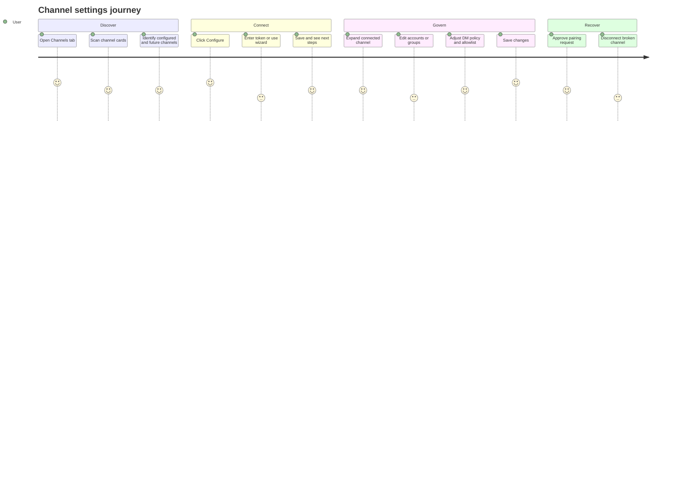

# Settings Channels

Source rows: `SET-05`
Entry path: Settings -> Channels
Status: Draft

## User Journey

### Overview

| Attribute      | Value                                                                                |
| -------------- | ------------------------------------------------------------------------------------ |
| Priority       | Critical for external messaging users                                                |
| User type      | Returning user connecting OpenClaw to chat channels                                  |
| Frequency      | Setup-time, then occasional account and policy maintenance                           |
| Success metric | User can connect a channel, manage access, and recover from config or pairing issues |

### User Goal

> "I want to connect people to my agent through the right chat channel while keeping access policy under control."

### Preconditions

- Settings dialog is open on Channels.
- Gateway can report channel status and config snapshots.
- Channel-specific setup components are available for token-based, Slack, Signal, and WhatsApp flows where applicable.

### Journey Map



### Journey Steps

#### Step 1: Review channels

**User action:** The user opens Channels and scans channel cards.
**System response:** Cards show configured, connected, error, configurable, or future-channel states.
**Success criteria:**

- [ ] Configured channels expose Connected, Edit, Disconnect, and enabled switch.
- [ ] Unconfigured supported channels expose Configure.
- [ ] Future channels are visibly unavailable rather than actionable.

**Potential friction:**

- Channel ordering and availability depend on gateway status metadata, so the list can change between environments.

#### Step 2: Connect or edit a channel

**User action:** The user clicks Configure or Edit.
**System response:** Token modal, Slack wizard, or generic setup wizard opens; Save patches config and triggers a refresh after gateway restart.
**Success criteria:**

- [ ] Token fields are password inputs.
- [ ] Save & Connect is disabled until required token input exists.
- [ ] Setup success leads to next-step guidance.

**Potential friction:**

- Gateway restart and status refresh are asynchronous; the card is optimistic before the backend proves the channel is running.

#### Step 3: Govern connected access

**User action:** The user expands a configured card, manages accounts/groups, changes DM policy or allowlist, and saves.
**System response:** Expanded controls persist through `config.patch`; pairing inbox appears when policy is pairing.
**Success criteria:**

- [ ] Collapsed pairing notify-only state remains subscribed.
- [ ] Config conflicts surface a reload recovery action.
- [ ] Account delete prevents removing the default root account from the wrong place.

### Error Scenarios

#### E1: Config conflict while saving policy

**Trigger:** `config.patch` rejects with a base hash conflict.
**User sees:** Error toast with Reload action.
**Recovery path:** Reload channel state, reapply policy changes, then save again.
**Test:** No focused ChannelsTab test.

#### E2: Channel disconnect partly fails

**Trigger:** Logout or config patch fails during disconnect.
**User sees:** Failure toast.
**Recovery path:** Retry Disconnect or inspect the channel-specific setup state.
**Test:** No focused ChannelsTab test.

### Metrics To Track

- Channel setup completion by channel id.
- Pairing approve/deny rates.
- Policy save conflict rate.
- Disconnect success/failure rate.

### E2E Test Reference

Future L3 scenario: `SET-05 configures Telegram, expands policy controls, saves pairing policy, and handles a config conflict`.

## UI Surface

### Wireframe

```text
+--------------------------------------------------------------------------------+
| Channels                                                                       |
| Set up a channel to let people message your AI agent.                          |
+--------------------------------------------------------------------------------+
| > Telegram                  Connected        [Edit] [Disconnect] [switch]      |
|   Connected and running                                                        |
+--------------------------------------------------------------------------------+
| v Discord                   Connected        [Edit] [Disconnect] [switch]      |
|   Account list: default, work-bot                         [Add Account]        |
|   Group list: #general, #ops                              [Edit Group]         |
|   DM Policy: [Pairing v]                                                       |
|   Allow From: [user ids / handles]                                             |
|   Pairing Inbox: pending requests                                              |
|                                                               [Save Changes]   |
+--------------------------------------------------------------------------------+
| Slack                                                   [Configure]            |
| Google Chat                                             [Coming soon]          |
+--------------------------------------------------------------------------------+

Token modal:
+--------------------------------------+
| Configure Telegram                   |
| Account Name [default              ] |
| Bot Token    [••••••••••••        ] |
|                    [Cancel] [Save & Connect] |
+--------------------------------------+
```

- Channel list with loading state.
- Channel cards for currently reported channels, including Discord, Signal, Slack, Telegram, WhatsApp when present from gateway status.
- Future or non-configurable cards shown with version or Coming soon badge.
- Configured channel state: Connected indicator, Edit, Disconnect, enabled switch, expand/collapse.
- Token setup modal with account name, token input, Cancel, Save & Connect, success/error messages.
- Slack setup wizard and generic channel setup wizard.
- Next-steps dialogs after setup.
- Expanded detail section: account list, group list, DM policy selector, allow-from editor, pairing inbox, Save Changes.
- Add Account and Edit Account dialogs.

## Interaction Contract

| User action                             | UI precondition                                                | UI result                                                                                                                                      | Backend/API path                                                                          | Evidence                                                                                                                                                                                                                                                                                                                                                                                                                                                    | Test coverage                                                                                                                               |
| --------------------------------------- | -------------------------------------------------------------- | ---------------------------------------------------------------------------------------------------------------------------------------------- | ----------------------------------------------------------------------------------------- | ----------------------------------------------------------------------------------------------------------------------------------------------------------------------------------------------------------------------------------------------------------------------------------------------------------------------------------------------------------------------------------------------------------------------------------------------------------- | ------------------------------------------------------------------------------------------------------------------------------------------- |
| Load channels                           | Channels tab mounts.                                           | Loading text appears, then channel cards render from normalized channel status and config-derived policy state.                                | `client.channelsStatus()` and `client.configGet()` inside `loadChannels`.                 | `apps/electron/src/renderer/src/components/settings/ChannelsTab.tsx:1001`; `apps/electron/src/renderer/src/lib/electron-gateway-client.ts:235`                                                                                                                                                                                                                                                                                                              | No focused ChannelsTab test.                                                                                                                |
| Configure token-based channel           | Channel is configurable and not configured.                    | Configure modal opens; user enters optional account name and token; Save & Connect patches config and optimistically marks channel configured. | `client.configGet()` then `client.call('config.patch', { baseHash, raw })`.               | `apps/electron/src/renderer/src/components/settings/ChannelsTab.tsx:516`; `apps/electron/src/renderer/src/components/settings/ChannelsTab.tsx:614`; `apps/electron/src/renderer/src/components/settings/ChannelsTab.tsx:624`; `apps/electron/src/renderer/src/components/settings/ChannelsTab.tsx:1265`; `apps/electron/src/renderer/src/components/settings/ChannelsTab.tsx:1325`                                                                          | No focused ChannelsTab test.                                                                                                                |
| Configure wizard channel                | Channel is wizard-managed, such as Slack, Signal, or WhatsApp. | Slack wizard or generic setup wizard opens; on save, channel is optimistically marked configured and next-steps dialog opens.                  | Wizard-specific components call config APIs through `GatewayClient`.                      | `apps/electron/src/renderer/src/components/settings/ChannelsTab.tsx:510`; `apps/electron/src/renderer/src/components/settings/ChannelsTab.tsx:555`; `apps/electron/src/renderer/src/components/settings/ChannelsTab.tsx:1239`; `apps/electron/src/renderer/src/components/settings/ChannelsTab.tsx:1343`                                                                                                                                                    | No focused ChannelsTab test.                                                                                                                |
| Expand connected channel                | Channel card is configured.                                    | Expand/collapse toggles detail section; collapsed pairing notify-only subscriber remains mounted when DM policy is pairing.                    | Local `expandedChannel` state; PairingInbox uses gateway pairing APIs.                    | `apps/electron/src/renderer/src/components/settings/ChannelsTab.tsx:1025`; `apps/electron/src/renderer/src/components/settings/ChannelsTab.tsx:1129`; `apps/electron/src/renderer/src/components/settings/ChannelsTab.tsx:1135`; `apps/electron/src/renderer/src/lib/electron-gateway-client.ts:304`                                                                                                                                                        | No focused ChannelsTab test.                                                                                                                |
| Toggle configured channel enabled state | Channel is configured.                                         | Switch changes enabled setting and gateway restarts or refreshes after config patch.                                                           | `client.channelToggle(id, enabled)` -> `config.patch`.                                    | `apps/electron/src/renderer/src/components/settings/ChannelsTab.tsx:1090`; `apps/electron/src/renderer/src/components/settings/ChannelsTab.tsx:1093`; `apps/electron/src/renderer/src/lib/electron-gateway-client.ts:294`                                                                                                                                                                                                                                   | No focused ChannelsTab test.                                                                                                                |
| Disconnect channel                      | Channel is configured.                                         | Channel is optimistically marked not configured; WhatsApp logs out first; config patch clears credentials or wizard-owned config.              | Optional `client.call('channels.logout')`, then `client.call('config.patch')`.            | `apps/electron/src/renderer/src/components/settings/ChannelsTab.tsx:657`; `apps/electron/src/renderer/src/components/settings/ChannelsTab.tsx:662`; `apps/electron/src/renderer/src/components/settings/ChannelsTab.tsx:677`; `apps/electron/src/renderer/src/components/settings/ChannelsTab.tsx:1080`                                                                                                                                                     | No focused ChannelsTab test.                                                                                                                |
| Save DM policy                          | Channel detail section is expanded.                            | DM policy and allow-from changes persist; config conflict shows reload action; gateway refresh follows.                                        | `client.configGet()` then `client.call('config.patch', { baseHash, raw })`.               | `apps/electron/src/renderer/src/components/settings/ChannelsTab.tsx:697`; `apps/electron/src/renderer/src/components/settings/ChannelsTab.tsx:722`; `apps/electron/src/renderer/src/components/settings/ChannelsTab.tsx:1191`; `apps/electron/src/renderer/src/components/settings/ChannelsTab.tsx:1215`                                                                                                                                                    | DM policy helper validation is covered in `apps/electron/src/renderer/test/dm-policy-validation.test.ts`; full ChannelsTab flow is No test. |
| Manage channel account                  | Expanded channel has accounts and supports account actions.    | User can set default account, toggle account, edit account, delete account, or add account.                                                    | `config.patch` with account fields; Slack delegates to Slack wizard for account edit/add. | `apps/electron/src/renderer/src/components/settings/ChannelsTab.tsx:750`; `apps/electron/src/renderer/src/components/settings/ChannelsTab.tsx:766`; `apps/electron/src/renderer/src/components/settings/ChannelsTab.tsx:781`; `apps/electron/src/renderer/src/components/settings/ChannelsTab.tsx:824`; `apps/electron/src/renderer/src/components/settings/ChannelsTab.tsx:898`; `apps/electron/src/renderer/src/components/settings/ChannelsTab.tsx:1138` | No focused ChannelsTab test.                                                                                                                |

## Data And Events

- Channel status RPC: `channels.status`.
- Channel toggle: `config.patch` with `{ channels: { [id]: { enabled } } }`.
- Pairing RPCs: `channel.pairing.approve`, `channel.pairing.list`.
- Config patch paths include channel token fields, `enabled`, `name`, `dmPolicy`, `allowFrom`, `accounts`, and `defaultAccount`.
- Pairing policy state is local per channel until Save Changes.

## Gaps

- No L2 coverage for channel card rendering, setup modal, wizard save handoff, disconnect, account management, DM policy save, or pairing inbox visibility.
- No stable selectors for channel cards, Configure/Edit/Disconnect buttons, enabled switches, expansion controls, account rows, DM policy controls, allowlist editor, pairing requests, or Save Changes.
- Channel behavior depends on gateway-reported channel metadata; this contract only documents repo-local UI and RPC paths.
