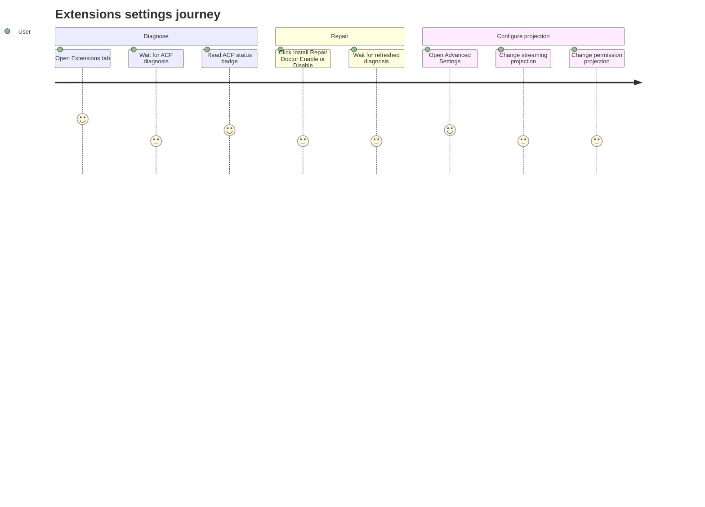

# Settings Extensions

Source rows: `SET-06`
Entry path: Settings -> Extensions
Status: Draft

## User Journey

### Overview

| Attribute      | Value                                                                                 |
| -------------- | ------------------------------------------------------------------------------------- |
| Priority       | Medium                                                                                |
| User type      | Returning user managing Electron-owned runtime integrations                           |
| Frequency      | Occasional setup and troubleshooting                                                  |
| Success metric | User can diagnose and repair the visible ACP runtime surface without leaving Settings |

### User Goal

> "I want to see whether the bundled runtime is healthy and adjust what activity gets shown back to chat surfaces."

### Preconditions

- Settings dialog is open on Extensions.
- Electron extensions bridge is available.
- ACP-specific routing and permission semantics are covered by `docs/hardware_harness/ui-contracts/agent-ui-contracts-via-acp.md`; this contract owns the visible Settings controls and state transitions.

### Journey Map



### Journey Steps

#### Step 1: Read extension status

**User action:** The user opens Extensions.
**System response:** Loading card appears, then ACP diagnosis renders with status badge and available actions.
**Success criteria:**

- [ ] Loading state is visible while bridge request is pending.
- [ ] ACP status is legible as Healthy, Broken, Degraded, Installed, Enabled, or Not installed.
- [ ] Bridge errors surface as toasts.

**Potential friction:**

- Only ACP is currently visible, so the plural Extensions tab can look broader than the implemented surface.

#### Step 2: Run a maintenance action

**User action:** The user clicks Install, Repair, Doctor, Enable, or Disable.
**System response:** The clicked action enters a Working state and the returned diagnosis updates the card.
**Success criteria:**

- [ ] The busy action cannot be double-submitted.
- [ ] Success updates both local diagnosis state and runtime store.
- [ ] Parsed bridge errors remain readable.

#### Step 3: Adjust visible ACP projection

**User action:** The user expands Advanced Settings and changes streaming or permission projection controls.
**System response:** The bridge updates ACP settings and returns a fresh diagnosis for the card.
**Success criteria:**

- [ ] Advanced controls are hidden until expanded.
- [ ] Streaming toggles affect only visible projection controls in this contract.
- [ ] Permission controls document visible settings only, not ACP runtime semantics.

### Error Scenarios

#### E1: Extensions bridge unavailable

**Trigger:** `window.electronAPI.extensions` is missing.
**User sees:** Error toast from the bridge wrapper.
**Recovery path:** Run inside Electron or restore the preload bridge.
**Test:** No focused ExtensionsTab test.

### Metrics To Track

- ACP diagnosis load failures.
- Install/repair/doctor action success rate.
- Advanced Settings expansion rate.
- Streaming or permission projection update failures.

### E2E Test Reference

Future L3 scenario: `SET-06 opens ACP extension status, runs Doctor, and changes streaming projection`.

## UI Surface

### Wireframe

```text
+--------------------------------------------------------------------------------+
| Extensions                                                                      |
| Productized runtime management for Electron-managed extensions.                 |
+--------------------------------------------------------------------------------+
| ACP                                                   [Healthy]                  |
| Manage the bundled ACP runtime used by /acp in Electron.                        |
| [Install] [Repair] [Doctor] [Enable] [Disable]                                  |
|                                                                                |
| > Advanced Settings                                                             |
|   Streaming                                                                     |
|   Delivery Mode [Final only v]                                                  |
|   Show Tool Calls [switch]  Show Usage Updates [switch]  Show Plans [switch]    |
|   Permissions                                                                   |
|   Default Behavior [Ask in chat v]  Read [inherit] Write [inherit] Exec [deny] |
+--------------------------------------------------------------------------------+
```

- Extensions heading and description.
- Loading extensions status card.
- ACP card with status badge.
- ACP action buttons: Install, Repair, Doctor, Enable, Disable when exposed by diagnosis state.
- Advanced Settings collapsible.
- Streaming controls: Delivery Mode, Show Tool Calls, Show Usage Updates, Show Plans.
- ACP permission controls: Default Behavior, Read, Write, Exec.

## Interaction Contract

| User action                      | UI precondition                                               | UI result                                                                                           | Backend/API path                                                      | Evidence                                                                                                                                                                                                                                                                                                   | Test coverage                  |
| -------------------------------- | ------------------------------------------------------------- | --------------------------------------------------------------------------------------------------- | --------------------------------------------------------------------- | ---------------------------------------------------------------------------------------------------------------------------------------------------------------------------------------------------------------------------------------------------------------------------------------------------------- | ------------------------------ |
| Load extension status            | Extensions tab mounts.                                        | Loading card appears, then ACP diagnosis is applied to local component state and ACP runtime store. | `getAcpDiagnosis()` through Electron extensions bridge.               | `apps/electron/src/renderer/src/components/settings/ExtensionsTab.tsx:40`; `apps/electron/src/renderer/src/components/settings/ExtensionsTab.tsx:43`; `apps/electron/src/renderer/src/lib/extensions-client.ts:19`                                                                                         | No focused ExtensionsTab test. |
| Run ACP action                   | ACP card exposes an action button.                            | Button shows Working while busy; diagnosis refreshes; success or error toast appears.               | `installAcp`, `repairAcp`, `doctorAcp`, `enableAcp`, or `disableAcp`. | `apps/electron/src/renderer/src/components/settings/ExtensionsTab.tsx:54`; `apps/electron/src/renderer/src/components/settings/ExtensionsTab.tsx:82`; `apps/electron/src/renderer/src/components/settings/extensions/AcpCard.tsx:83`; `apps/electron/src/renderer/src/lib/extensions-client.ts:23`         | No focused ExtensionsTab test. |
| Open Advanced Settings           | ACP diagnosis is available.                                   | Collapsible expands to show streaming and permissions controls.                                     | Local `advancedOpen` state.                                           | `apps/electron/src/renderer/src/components/settings/extensions/AcpCard.tsx:113`; `apps/electron/src/renderer/src/components/settings/extensions/AcpCard.tsx:136`; `apps/electron/src/renderer/src/components/settings/extensions/AcpCard.tsx:158`                                                          | No focused ExtensionsTab test. |
| Change ACP streaming projection  | Advanced Settings is open.                                    | Diagnosis is refreshed after update; visible toggle/select state follows returned diagnosis.        | `updateAcpStreaming(patch)` through Electron extensions bridge.       | `apps/electron/src/renderer/src/components/settings/ExtensionsTab.tsx:100`; `apps/electron/src/renderer/src/components/settings/extensions/AcpCard.tsx:172`; `apps/electron/src/renderer/src/components/settings/extensions/AcpCard.tsx:201`; `apps/electron/src/renderer/src/lib/extensions-client.ts:43` | No focused ExtensionsTab test. |
| Change ACP permission projection | Advanced Settings is open and permission callback is present. | Diagnosis is refreshed after update; visible permission select state follows returned diagnosis.    | `updateAcpPermissions(patch)` through Electron extensions bridge.     | `apps/electron/src/renderer/src/components/settings/ExtensionsTab.tsx:103`; `apps/electron/src/renderer/src/components/settings/extensions/AcpCard.tsx:241`; `apps/electron/src/renderer/src/components/settings/extensions/AcpCard.tsx:255`; `apps/electron/src/renderer/src/lib/extensions-client.ts:49` | No focused ExtensionsTab test. |

## Data And Events

- Electron bridge namespace: `window.electronAPI.extensions`.
- ACP diagnosis fields consumed by UI: `summary.status`, `stream.deliveryMode`, `stream.toolCall`, `stream.usageUpdate`, `stream.plan`, `permissions.defaultBehavior`, `permissions.read`, `permissions.write`, `permissions.exec`.
- Busy actions: `install`, `repair`, `doctor`, `enable`, `disable`.

## Gaps

- ACP semantics are covered by `docs/hardware_harness/ui-contracts/agent-ui-contracts-via-acp.md`; this file documents visible Settings controls and bridge calls.
- No L2 coverage for Extensions tab or ACP card interactions.
- No stable selectors for ACP action buttons, advanced section, streaming controls, or permission selects.
