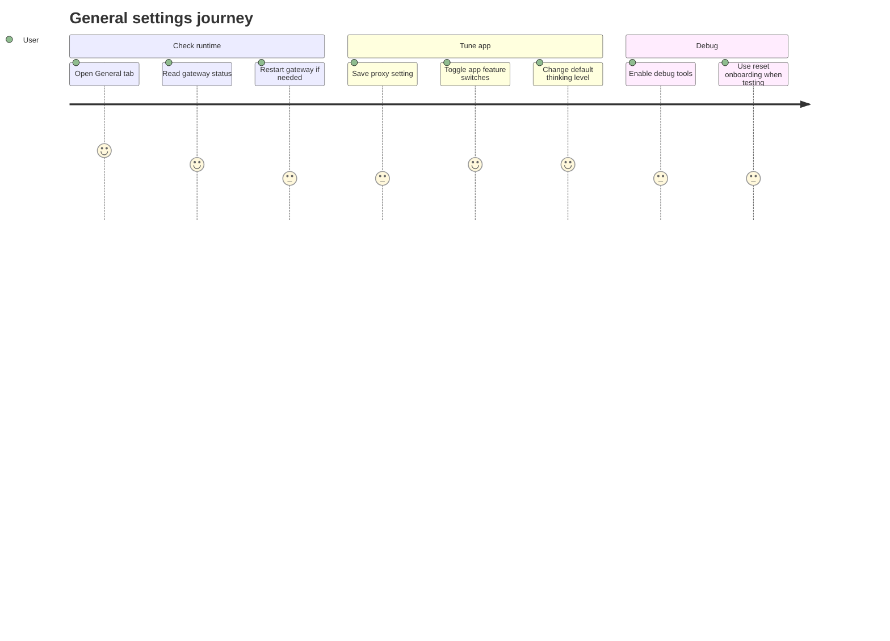

# Settings General

Source rows: `SET-02`
Entry path: Settings -> General
Status: Draft

## User Journey

### Overview

| Attribute      | Value                                                                                 |
| -------------- | ------------------------------------------------------------------------------------- |
| Priority       | High                                                                                  |
| User type      | Returning user tuning app-level Electron behavior                                     |
| Frequency      | Occasional, with repeated use during setup and troubleshooting                        |
| Success metric | User can understand gateway health and persist app defaults without config-file edits |

### User Goal

> "I want to check whether OpenClaw is running, adjust app behavior, and set sane defaults for future conversations."

### Preconditions

- Settings dialog is open on the General tab.
- Gateway client is available for health, restart, and config calls.
- Electron app settings bridge may be available; localStorage fallback is used for selected app preferences when it is not.

### Journey Map



### Journey Steps

#### Step 1: Check gateway state

**User action:** The user opens General and reads the Gateway Status card.
**System response:** The UI shows Running or Stopped, last check metadata, agent count, and Restart.
**Success criteria:**

- [ ] Gateway status is visible without opening Advanced.
- [ ] Restart is available in the same card.
- [ ] Unknown status is legible when health cannot be read.

**Potential friction:**

- Restart success is toast-only, so a user can miss the confirmation if they switch tabs quickly.

#### Step 2: Configure network and app features

**User action:** The user edits HTTP Proxy or toggles feature switches.
**System response:** Settings save through the Electron bridge, with optimistic UI updates and rollback on failure.
**Success criteria:**

- [ ] Proxy save triggers on blur or Enter.
- [ ] App switches are disabled while saving their setting.
- [ ] Failed updates restore the previous value.

**Potential friction:**

- Proxy reachability warning does not block saving; this is helpful for TUN mode but can be confusing.

#### Step 3: Set default thinking level

**User action:** The user changes Default Thinking Level.
**System response:** The selected level updates, then gateway config is rewritten with the new default.
**Success criteria:**

- [ ] All supported levels are available.
- [ ] Save failure rolls the select back.
- [ ] New conversations use the persisted default after config save.

**Potential friction:**

- This setting writes gateway config while other General toggles write app settings, so conflict recovery is more complex.

### Error Scenarios

#### E1: Gateway restart fails

**Trigger:** `client.restartGateway()` rejects.
**User sees:** Error toast.
**Recovery path:** Retry Restart or inspect Advanced diagnostics.
**Test:** No focused GeneralTab test.

#### E2: Default thinking config save fails

**Trigger:** `configApply` rejects.
**User sees:** Error toast and previous select value restored.
**Recovery path:** Retry after resolving config conflict or gateway availability.
**Test:** No focused GeneralTab test.

### Metrics To Track

- Gateway restart success/failure rate from General.
- Proxy save warning rate.
- Default thinking level save failures.
- Debug reset onboarding usage.

### E2E Test Reference

Future L3 scenario: `SET-02 updates General settings and recovers from failed gateway config save`.

## UI Surface


General shows gateway health, restart, network proxy, feature toggles, and the default thinking level in one scrollable tab.

### Wireframe

```text
+--------------------------------------------------------------------------------+
| General                                                                         |
| App-level settings and gateway status.                                          |
+--------------------------------------------------------------------------------+
| Gateway Status                                             [Running] [Restart] |
| Last check: <time> | <N> agent(s)                                               |
+--------------------------------------------------------------------------------+
| Network                                                                         |
| HTTP Proxy                                      [ http://127.0.0.1:7890       ] |
|                                                Auto-detected: <proxy>           |
+--------------------------------------------------------------------------------+
| Features                                                                        |
| Play menu bar icon animations                                      [switch]     |
| Launch at Login                                                    [switch]     |
| Dock Icon                                                          [switch]     |
| Allow Canvas                                                       [switch]     |
| Enable debug tools                                                 [switch]     |
| Default Thinking Level                                      [medium v]          |
+--------------------------------------------------------------------------------+
| Developer (only when debug tools enabled)                                       |
| Reset Onboarding                                                   [button]     |
+--------------------------------------------------------------------------------+
```

- Gateway Status card with Running or Stopped badge, last check text, agent count, and Restart button.
- Network section with HTTP Proxy input and auto-detected proxy hint.
- Feature switches: Play menu bar icon animations, Launch at Login, Dock Icon, Allow Canvas, Enable debug tools.
- Default Thinking Level select with off, minimal, low, medium, high, xhigh, adaptive.
- Developer section appears only when debug tools are enabled.

## Interaction Contract

| User action                   | UI precondition                           | UI result                                                                                           | Backend/API path                                                                                            | Evidence                                                                                                                                                                                                                                                                                           | Test coverage               |
| ----------------------------- | ----------------------------------------- | --------------------------------------------------------------------------------------------------- | ----------------------------------------------------------------------------------------------------------- | -------------------------------------------------------------------------------------------------------------------------------------------------------------------------------------------------------------------------------------------------------------------------------------------------- | --------------------------- |
| View gateway status           | General tab mounts.                       | Status card shows Running or Stopped and last check metadata if health is available.                | `client.health()`.                                                                                          | `apps/electron/src/renderer/src/components/settings/GeneralTab.tsx:92`; `apps/electron/src/renderer/src/components/settings/GeneralTab.tsx:249`; `apps/electron/src/renderer/src/components/settings/GeneralTab.tsx:257`                                                                           | No focused GeneralTab test. |
| Restart gateway               | Status card is visible.                   | Restart button disables while running; success or error toast appears; health refreshes on success. | `client.restartGateway()` then `client.health()`.                                                           | `apps/electron/src/renderer/src/components/settings/GeneralTab.tsx:226`; `apps/electron/src/renderer/src/components/settings/GeneralTab.tsx:229`; `apps/electron/src/renderer/src/components/settings/GeneralTab.tsx:264`                                                                          | No focused GeneralTab test. |
| Load app settings             | General tab mounts inside Electron.       | App feature switch state and proxy field update from persisted app settings.                        | `window.electronAPI.getAppSettings()`.                                                                      | `apps/electron/src/renderer/src/components/settings/GeneralTab.tsx:129`; `apps/electron/src/preload/index.ts:111`                                                                                                                                                                                  | No focused GeneralTab test. |
| Save HTTP proxy               | Proxy input blurs or user presses Enter.  | Proxy value is trimmed and saved; optional reachability warning or success toast appears.           | `window.electronAPI.updateAppSettings({ proxy })`, optional `window.electronAPI.probeProxy(proxy)`.         | `apps/electron/src/renderer/src/components/settings/GeneralTab.tsx:157`; `apps/electron/src/renderer/src/components/settings/GeneralTab.tsx:292`; `apps/electron/src/preload/index.ts:112`; `apps/electron/src/preload/index.ts:126`                                                               | No focused GeneralTab test. |
| Toggle app feature switch     | Feature section is visible.               | Switch optimistically updates, saves app setting, rolls back and shows error on failure.            | `window.electronAPI.updateAppSettings({ [key]: value })`; localStorage fallback when bridge is unavailable. | `apps/electron/src/renderer/src/components/settings/GeneralTab.tsx:187`; `apps/electron/src/renderer/src/components/settings/GeneralTab.tsx:207`; `apps/electron/src/renderer/src/components/settings/GeneralTab.tsx:330`                                                                          | No focused GeneralTab test. |
| Change default thinking level | Default Thinking Level select is visible. | Selected level updates, persists to localStorage, and patches gateway config; rollback on failure.  | `client.configGet()` then `client.configApply(JSON.stringify(newConfig), config.hash)`.                     | `apps/electron/src/renderer/src/components/settings/GeneralTab.tsx:105`; `apps/electron/src/renderer/src/components/settings/GeneralTab.tsx:404`; `apps/electron/src/renderer/src/components/settings/GeneralTab.tsx:413`; `apps/electron/src/renderer/src/components/settings/GeneralTab.tsx:427` | No focused GeneralTab test. |
| Reveal developer reset        | Enable debug tools is on.                 | Developer section appears with reset onboarding control.                                            | Local `debugEnabled` state and app store reset action.                                                      | `apps/electron/src/renderer/src/components/settings/GeneralTab.tsx:83`; `apps/electron/src/renderer/src/components/settings/GeneralTab.tsx:457`                                                                                                                                                    | No focused GeneralTab test. |

## Data And Events

- App settings keys: `launchAtLogin`, `dockIcon`, `menuBarAnimations`, `canvasEnabled`, `debugEnabled`, `proxy`.
- Gateway config path for thinking level: `agents.defaults.thinkingDefault`.
- Local fallback storage prefix: `openclaw:settings:general:`.
- Electron IPC bridge: `getAppSettings`, `updateAppSettings`, `detectSystemProxy`, `probeProxy`.

## Gaps

- No L2 coverage for gateway restart from General.
- No L2 coverage for proxy save, proxy probe warning, or bridge-unavailable fallback.
- No L2 coverage for default thinking level config patch and rollback.
- No stable selectors for the General tab controls.
