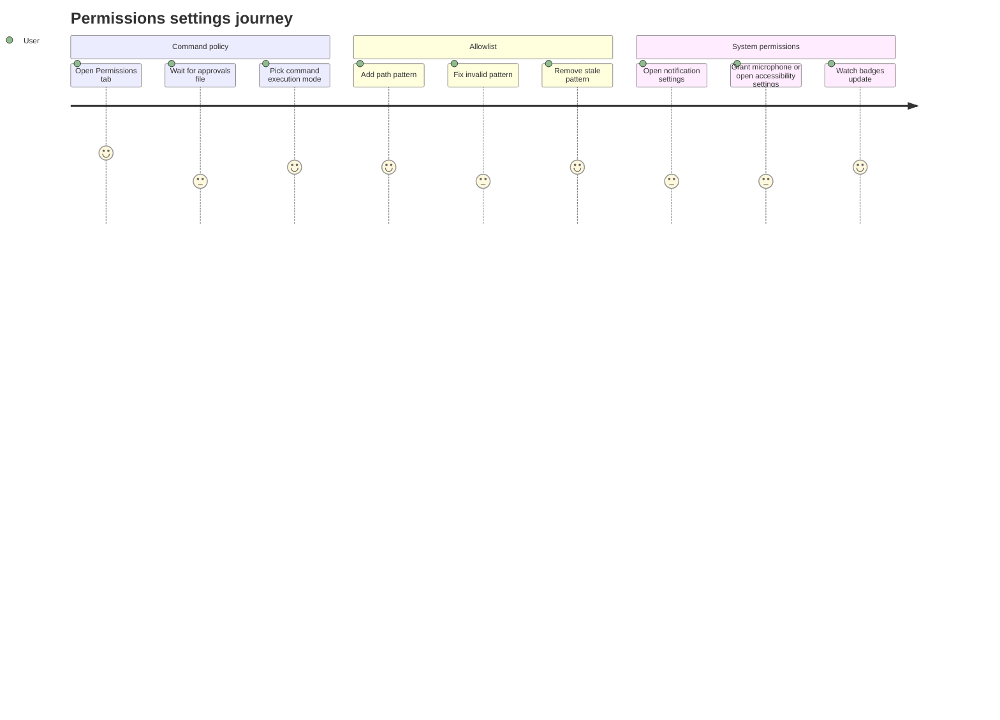

# Settings Permissions

Source rows: `SET-07`
Entry path: Settings -> Permissions
Status: Draft

## User Journey

### Overview

| Attribute      | Value                                                                              |
| -------------- | ---------------------------------------------------------------------------------- |
| Priority       | Critical                                                                           |
| User type      | Returning user controlling local command and macOS permission risk                 |
| Frequency      | Setup-time and whenever trust boundaries change                                    |
| Success metric | User can choose command approval behavior and recover from invalid allowlist edits |

### User Goal

> "I want to decide what the agent can run on my machine and grant only the system permissions I mean to grant."

### Preconditions

- Settings dialog is open on Permissions.
- Gateway exec approvals RPCs are available.
- Electron system permission bridge may be available for macOS-specific actions.

### Journey Map



### Journey Steps

#### Step 1: Choose command execution mode

**User action:** The user selects Never run commands, Ask before running, or Auto-run all commands.
**System response:** The selection persists to the exec approvals file, with rollback on failure. Later Chat/Code runs use this policy to decide whether a command can run automatically, is blocked, or pauses in the conversation until the user sends `/approve <id> allow-once` or `/approve <id> deny`.
**Success criteria:**

- [ ] Dangerous auto-run state is visibly marked.
- [ ] Loading and saving states disable controls.
- [ ] Failed persistence restores the previous selected mode.

**Potential friction:**

- Mode labels are user-facing, but the persisted file maps to lower-level `security` and `ask` fields.

#### Step 2: Maintain command allowlist

**User action:** The user adds or removes path-pattern allowlist entries.
**System response:** Valid patterns persist; empty, basename-only, or duplicate entries show inline validation.
**Success criteria:**

- [ ] Input hint explains path-pattern requirement.
- [ ] Add is disabled when the input is blank.
- [ ] Removing a pattern is reversible only by re-adding it.

#### Step 3: Manage macOS permissions

**User action:** The user opens notification settings or grants microphone/accessibility access.
**System response:** Electron opens System Settings or requests microphone permission and polls permission state changes.
**Success criteria:**

- [ ] Granted permissions do not show unnecessary action buttons.
- [ ] Accessibility uses System Settings rather than pretending direct grant is possible.
- [ ] Buttons show checking/opening state while a request is in flight.

### Error Scenarios

#### E1: Invalid allowlist pattern

**Trigger:** User adds an empty pattern, basename-only command, or duplicate.
**User sees:** Inline validation message.
**Recovery path:** Enter a path pattern containing `/`, `~`, or `\`.
**Test:** No focused PermissionsTab test.

#### E2: System Settings bridge unavailable

**Trigger:** Permission action runs outside Electron or without bridge support.
**User sees:** Informational toast.
**Recovery path:** Use the Electron app, then retry.
**Test:** No focused PermissionsTab test.

### Metrics To Track

- Approval mode changes by mode.
- Allowlist validation failure reasons.
- Permission grant/open attempts and success rate.
- Poll timeout rate for system permission changes.

### E2E Test Reference

Future L3 scenario: `SET-07 changes approval mode, adds/removes an allowlist pattern, and opens microphone recovery`.

## UI Surface

### Wireframe

```text
+--------------------------------------------------------------------------------+
| Permissions                                                                     |
| Control how the AI agent interacts with your system.                            |
+--------------------------------------------------------------------------------+
| Command Execution                                                               |
| ( ) Never run commands                                                          |
| (x) Ask before running                                                          |
| ( ) Auto-run all commands                                      [Danger]         |
+--------------------------------------------------------------------------------+
| Command Allowlist                                                               |
| /usr/local/bin/npm                                             [x]              |
| [Add allowlist path pattern (e.g., /usr/local/bin/npm)] [+]                     |
| Path patterns only. Basename entries like "echo" are ignored.                  |
+--------------------------------------------------------------------------------+
| Notifications                                                                   |
| Notification settings                                      [Open Settings]      |
+--------------------------------------------------------------------------------+
| System Permissions                                                              |
| Microphone                               [Not Granted] [Grant]                  |
| Accessibility                            [Unknown]     [Open Settings]          |
+--------------------------------------------------------------------------------+
```

- Permissions heading and loading state.
- Command Execution radio group: Never run commands, Ask before running, Auto-run all commands with Danger badge.
- Command Allowlist list, path-pattern input, add button, remove buttons, validation message.
- Notifications card with Open Settings button.
- System Permissions rows with Granted, Not Granted, or Unknown badges and Grant or Open Settings buttons.
- Runtime effect note: Ask-before-running can surface as a conversation approval request in Chat/Code; the user response is sent through the composer as `/approve <id> allow-once` or `/approve <id> deny`.

## Interaction Contract

| User action                                     | UI precondition                                            | UI result                                                                                                            | Backend/API path                                                                 | Evidence                                                                                                                                                                                                                                                                                                                                                     | Test coverage                   |
| ----------------------------------------------- | ---------------------------------------------------------- | -------------------------------------------------------------------------------------------------------------------- | -------------------------------------------------------------------------------- | ------------------------------------------------------------------------------------------------------------------------------------------------------------------------------------------------------------------------------------------------------------------------------------------------------------------------------------------------------------ | ------------------------------- |
| Load command permissions                        | Permissions tab mounts.                                    | Loading state appears, approval mode and allowlist are populated.                                                    | `client.call('exec.approvals.get')`.                                             | `apps/electron/src/renderer/src/components/settings/PermissionsTab.tsx:143`; `apps/electron/src/renderer/src/components/settings/PermissionsTab.tsx:146`; `apps/electron/src/renderer/src/components/settings/PermissionsTab.tsx:343`                                                                                                                        | No focused PermissionsTab test. |
| Change command execution mode                   | Approval mode radio group is enabled.                      | Radio selection updates optimistically; gateway approval file is persisted; rollback on failure; future runtime turns can auto-run, block, or pause for a conversation `/approve` response based on the saved policy. | `exec.approvals.get` then `exec.approvals.set`.                                  | `apps/electron/src/renderer/src/components/settings/PermissionsTab.tsx:186`; `apps/electron/src/renderer/src/components/settings/PermissionsTab.tsx:205`; `apps/electron/src/renderer/src/components/settings/PermissionsTab.tsx:215`; `apps/electron/src/renderer/src/components/settings/PermissionsTab.tsx:356`; `electron-user-journeys-hierarchy-v2/06-runtime-model-permission/runtime-model-permission.pm.md` | No focused PermissionsTab test. |
| Add allowlist pattern                           | Command Allowlist input contains a non-empty path pattern. | Pattern appears in list and persists; invalid or duplicate patterns show validation message.                         | `exec.approvals.get` then `exec.approvals.set`.                                  | `apps/electron/src/renderer/src/components/settings/PermissionsTab.tsx:61`; `apps/electron/src/renderer/src/components/settings/PermissionsTab.tsx:228`; `apps/electron/src/renderer/src/components/settings/PermissionsTab.tsx:431`; `apps/electron/src/renderer/src/components/settings/PermissionsTab.tsx:446`                                            | No focused PermissionsTab test. |
| Remove allowlist pattern                        | Pattern is present in allowlist.                           | Pattern is removed optimistically and persisted; rollback on failure.                                                | `exec.approvals.get` then `exec.approvals.set`.                                  | `apps/electron/src/renderer/src/components/settings/PermissionsTab.tsx:254`; `apps/electron/src/renderer/src/components/settings/PermissionsTab.tsx:419`                                                                                                                                                                                                     | No focused PermissionsTab test. |
| Load system permissions                         | Permissions tab mounts inside Electron.                    | Permission badges reflect Electron bridge results or fallback Unknown.                                               | `window.electronAPI.getSystemPermissions()`.                                     | `apps/electron/src/renderer/src/components/settings/PermissionsTab.tsx:133`; `apps/electron/src/preload/index.ts:152`; `apps/electron/src/renderer/src/components/settings/PermissionsTab.tsx:507`                                                                                                                                                           | No focused PermissionsTab test. |
| Open notification settings                      | Notifications card is visible.                             | Button shows Opening while request is in flight; toast reports System Settings result.                               | `window.electronAPI.openSystemSettings('notifications')`.                        | `apps/electron/src/renderer/src/components/settings/PermissionsTab.tsx:315`; `apps/electron/src/renderer/src/components/settings/PermissionsTab.tsx:484`; `apps/electron/src/preload/index.ts:153`                                                                                                                                                           | No focused PermissionsTab test. |
| Grant microphone or open accessibility settings | System permission is not granted.                          | Microphone attempts direct permission request first; accessibility opens System Settings; UI polls permission state. | `requestMicrophonePermission`, `openSystemSettings`, and `getSystemPermissions`. | `apps/electron/src/renderer/src/components/settings/PermissionsTab.tsx:266`; `apps/electron/src/renderer/src/components/settings/PermissionsTab.tsx:274`; `apps/electron/src/renderer/src/components/settings/PermissionsTab.tsx:292`; `apps/electron/src/renderer/src/components/settings/PermissionsTab.tsx:536`; `apps/electron/src/preload/index.ts:159` | No focused PermissionsTab test. |

## Data And Events

- Approval file shape: `version`, `defaults.security`, `defaults.ask`, `agents['*'].allowlist`.
- UI modes: `deny`, `ask`, `allow`.
- Exec approval RPCs: `exec.approvals.get`, `exec.approvals.set`.
- System permission names: `notifications`, `microphone`, `accessibility`.
- Conversation approval commands: `/approve <id> allow-once`, `/approve <id> deny`.

## Gaps

- No L2 coverage for approval mode mapping, allowlist validation, optimistic persistence, or rollback.
- No L2 coverage for System Settings and polling behavior.
- No stable selectors for radio items, allowlist input/add/remove, notification settings button, or system permission rows.
