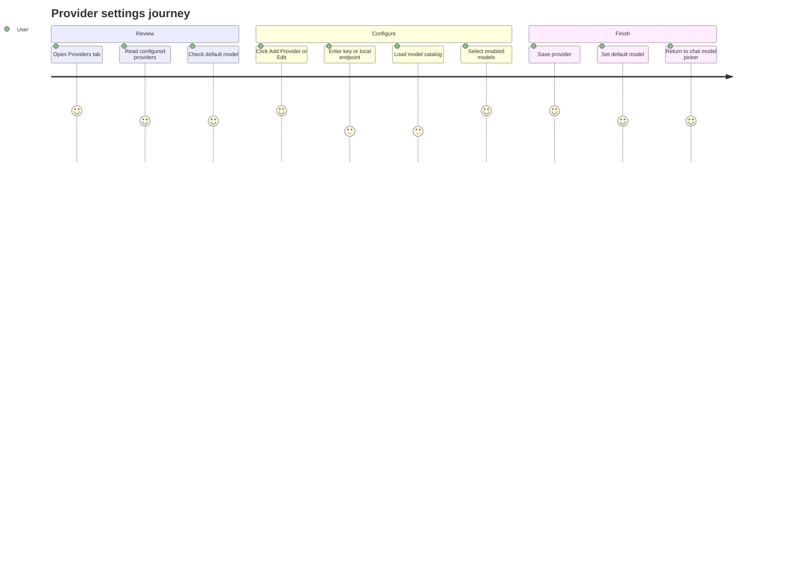
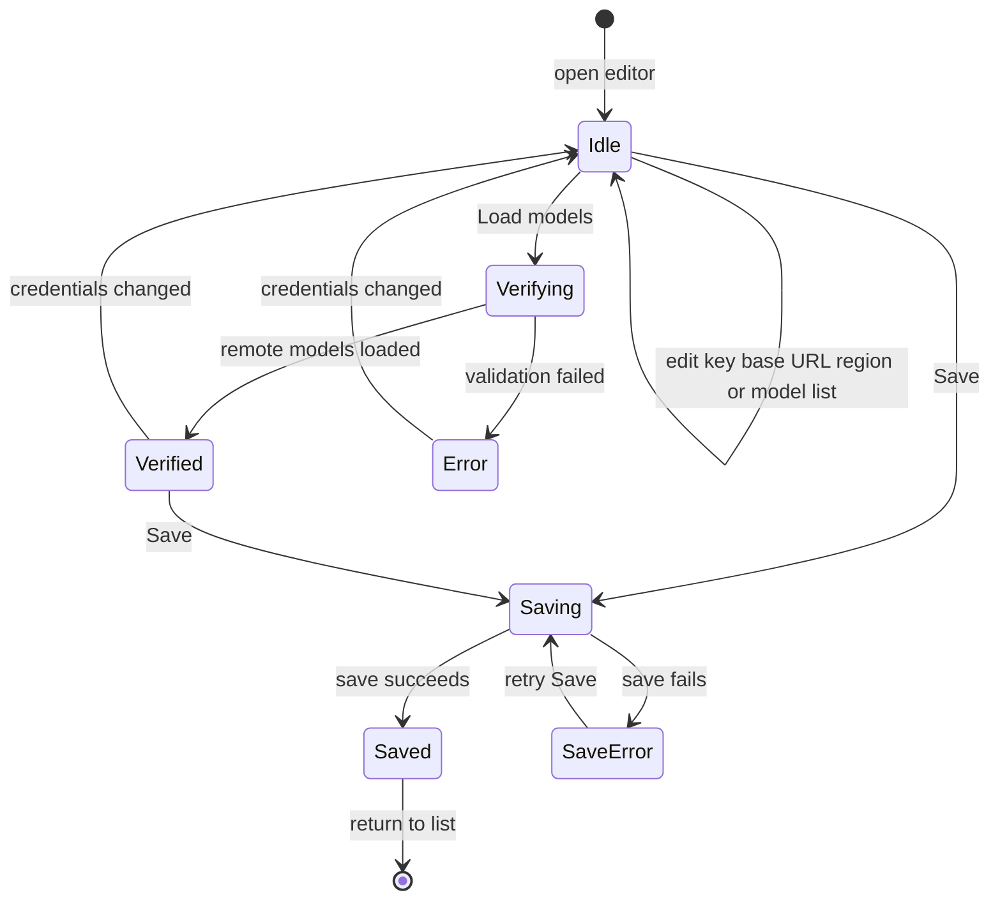

# Settings Providers

Source rows: `SET-04`
Entry path: Settings -> Providers
Status: Draft

## User Journey

### Overview

| Attribute      | Value                                                                                |
| -------------- | ------------------------------------------------------------------------------------ |
| Priority       | Critical                                                                             |
| User type      | New or returning user configuring model access                                       |
| Frequency      | Setup-time and whenever models/providers change                                      |
| Success metric | User can add a provider, enable at least one model, and select a valid default model |

### User Goal

> "I want to connect my model provider and make sure OpenClaw will use the right model before I send messages."

### Preconditions

- Settings dialog is open on Providers.
- Electron provider IPC is available for unredacted provider config and validation.
- Gateway config APIs are available for default model and provider persistence.

### Journey Map



### Journey Steps

#### Step 1: Review provider state

**User action:** The user opens Providers.
**System response:** The list loads configured providers and the current default model label.
**Success criteria:**

- [ ] Empty state gives a direct Add Provider action.
- [ ] Existing providers show enabled model counts.
- [ ] Default model state is visible before editing a provider.

**Potential friction:**

- A default model can refer to a removed or disabled provider; the UI labels that fallback but users still need to choose a replacement.

#### Step 2: Add or edit provider

**User action:** The user opens Add Provider or Edit Provider, enters credentials or a local endpoint, and loads models.
**System response:** The editor validates local fields, loads dynamic models where supported, and displays enabled-model controls.
**Success criteria:**

- [ ] Save disabled reason explains what blocks saving.
- [ ] Model loading errors stay inline.
- [ ] Static, dynamic, cached, and stale models remain distinguishable enough to make a safe choice.

**Potential friction:**

- Dynamic provider validation uses network calls in main process; failures can feel like provider setup failures even when the key is correct but network is blocked.

#### Step 3: Save and choose default

**User action:** The user saves the provider and optionally sets an enabled model as default.
**System response:** Provider config persists, list mode returns, model store refreshes after gateway restart, and default model label updates.
**Success criteria:**

- [ ] Save cannot proceed with zero enabled models.
- [ ] Save failure keeps the draft on screen.
- [ ] Removing a provider that owns the default clears the default in UI state.

### Error Scenarios

#### E1: Provider validation fails

**Trigger:** `provider:validate` rejects or returns no usable models.
**User sees:** Inline error or model-loading failure toast.
**Recovery path:** Fix key/base URL/region, then click Load models again.
**Test:** IPC provider validators are listed as No test in `../tests/coverage-index.md`.

#### E2: Save disabled by invalid draft

**Trigger:** Missing key, validation error, loading state, or no enabled models.
**User sees:** Disabled Save plus disabled reason.
**Recovery path:** Complete the missing field, wait for loading, or select at least one model.
**Test:** No focused ProvidersTab test.

### Metrics To Track

- Provider add completion rate.
- Model validation failure rate by provider id.
- Save disabled reason frequency.
- Default model missing or stale rate.

### E2E Test Reference

Future L3 scenario: `SET-04 adds a provider, enables a model, sets default model, and recovers from validation failure`.

## UI Surface

### Wireframe

```text
+--------------------------------------------------------------------------------+
| Providers                                                                      |
+--------------------------------------------------------------------------------+
| Default model                                                                  |
| gpt-5.4 - OpenAI                                               [Change/Select] |
+--------------------------------------------------------------------------------+
| OpenAI                                             3 enabled models   [Edit]    |
| Anthropic                                          2 enabled models   [Edit]    |
| + Add Provider                                                                 |
+--------------------------------------------------------------------------------+

Editor mode:
+--------------------------------------------------------------------------------+
| <- Back                                                                         |
| Add Provider / Edit Provider                                                    |
+--------------------------------------------------------------------------------+
| Provider                                      [OpenAI v]                         |
| API Key                                       [••••••••••••]                    |
| Region                                        [Global v]                         |
| Enabled models                               3 enabled                           |
| Filter models...                             [                           ]       |
| [x] gpt-5.4                                                                    |
| [ ] gpt-5.4-mini                                                               |
| [x] o4-mini may no longer be available                                          |
| [Load models / Reload models] [Remove provider]                         [Save] |
| Save disabled reason, when present                                               |
+--------------------------------------------------------------------------------+
```

- Loading providers state.
- Empty state with Add Provider.
- Default model card with enabled-model selector. Current screenshots show this as a compact card such as `DEFAULT MODEL auto · OpenRouter` with a native select.
- Provider rows with enabled-model count and edit affordance, for example `DeepSeek - 1 models enabled` and `OpenRouter - 3 models enabled`.
- Add Provider row.
- Provider editor with Back, provider select, API key or local endpoint input, region select when applicable, enabled-model count, filter input, model checkboxes, local model id input, stale model markers, Load models or Reload models, Remove provider, Save, and disabled save reason.

## Provider Editor State Machine

This diagram covers the add/edit editor pane. The list and default-model selector sit outside this machine and update after save/remove/default-model actions.



State responsibilities:

| State       | Meaning                                                         | User-facing responsibility                                                                                     |
| ----------- | --------------------------------------------------------------- | -------------------------------------------------------------------------------------------------------------- |
| `Idle`      | Editor is open and no provider validation request is in flight. | Show current draft, disabled-save reason, static/cached/local model controls, and Load models when applicable. |
| `Verifying` | Dynamic provider model validation is in flight.                 | Show loading and prevent ambiguous model-save state.                                                           |
| `Verified`  | Dynamic validation returned a model list.                       | Show `Verified`, enabled-model choices, and allow save when draft is valid.                                    |
| `Error`     | Dynamic validation failed.                                      | Keep draft visible and show inline validation error.                                                           |
| `Saving`    | Provider config save/remove path is in flight.                  | Disable duplicate save and keep the editor context.                                                            |
| `SaveError` | Save failed after local validation passed.                      | Preserve the draft and show a retry path.                                                                      |
| `Saved`     | Provider config persisted.                                      | Refresh list/default state and return to list mode.                                                            |

Transition labels:

| Label                  | Trigger                                                      | Expected result                                                                 |
| ---------------------- | ------------------------------------------------------------ | ------------------------------------------------------------------------------- |
| `Load models`          | User clicks the model loading action for a dynamic provider. | Main-process provider validation starts.                                        |
| `remote models loaded` | `provider:validate` returns model rows.                      | Model choices and verified status render.                                       |
| `credentials changed`  | User edits key, base URL, region, or provider id.            | Verification status resets so stale models are not treated as freshly verified. |
| `Save`                 | User submits a valid draft.                                  | Provider config is persisted through Electron IPC and gateway config.           |
| `save succeeds`        | `provider:save` resolves.                                    | Editor closes and list/default state refreshes.                                 |
| `save fails`           | `provider:save` rejects.                                     | Draft stays on screen with an error toast.                                      |

## Interaction Contract

| User action           | UI precondition                                                                 | UI result                                                                                                                           | Backend/API path                                                                              | Evidence                                                                                                                                                                                                                                                                                                                  | Test coverage                                                                                                |
| --------------------- | ------------------------------------------------------------------------------- | ----------------------------------------------------------------------------------------------------------------------------------- | --------------------------------------------------------------------------------------------- | ------------------------------------------------------------------------------------------------------------------------------------------------------------------------------------------------------------------------------------------------------------------------------------------------------------------------- | ------------------------------------------------------------------------------------------------------------ |
| Load providers        | Providers tab mounts.                                                           | Loading state clears into empty state or provider list; default model label is read from config when available.                     | `client.listProviders()` plus `client.configGet()`.                                           | `apps/electron/src/renderer/src/components/settings/ProvidersTab.tsx:357`; `apps/electron/src/renderer/src/lib/electron-gateway-client.ts:173`; `apps/electron/src/main/ipc-gateway.ts:254`                                                                                                                               | No focused ProvidersTab test.                                                                                |
| Set default model     | Provider list has at least one enabled model.                                   | Default model label updates; model store is refreshed after gateway restart; error toast on failure.                                | `client.configGet()` then `client.call('config.patch', { raw, baseHash })`.                   | `apps/electron/src/renderer/src/components/settings/ProvidersTab.tsx:372`; `apps/electron/src/renderer/src/components/settings/ProvidersTab.tsx:378`; `apps/electron/src/renderer/src/components/settings/ProvidersTab.tsx:379`                                                                                           | No focused ProvidersTab test.                                                                                |
| Start Add Provider    | Providers tab is in list mode.                                                  | Provider editor opens in create mode using first addable provider option.                                                           | Local editor state.                                                                           | `apps/electron/src/renderer/src/components/settings/ProvidersTab.tsx:460`; `apps/electron/src/renderer/src/components/settings/ProvidersTab.tsx:956`                                                                                                                                                                      | No focused ProvidersTab test.                                                                                |
| Start Edit Provider   | Provider row is visible.                                                        | Provider editor opens in edit mode with provider draft copied from current config.                                                  | Local editor state.                                                                           | `apps/electron/src/renderer/src/components/settings/ProvidersTab.tsx:474`; `apps/electron/src/renderer/src/components/settings/ProvidersTab.tsx:696`                                                                                                                                                                      | No focused ProvidersTab test.                                                                                |
| Load or reload models | Editor is open for a dynamic provider and key validation permits model loading. | Verification state becomes loading, model list populates, and cached dynamic models are persisted; inline error appears on failure. | `client.validateProviderKey(providerId, apiKey, baseUrl)` through Electron IPC.               | `apps/electron/src/renderer/src/components/settings/ProvidersTab.tsx:525`; `apps/electron/src/renderer/src/components/settings/ProvidersTab.tsx:533`; `apps/electron/src/renderer/src/lib/electron-gateway-client.ts:197`; `apps/electron/src/main/ipc-gateway.ts:311`                                                    | No focused ProvidersTab test; IPC provider validators are listed as No test in `../tests/coverage-index.md`. |
| Select enabled models | Editor displays remote model checkboxes.                                        | Model id is added to or removed from draft enabled models; enabled count updates.                                                   | Local draft state until Save.                                                                 | `apps/electron/src/renderer/src/components/settings/ProvidersTab.tsx:512`; `apps/electron/src/renderer/src/components/settings/ProvidersTab.tsx:840`; `apps/electron/src/renderer/src/components/settings/ProvidersTab.tsx:879`                                                                                           | No focused ProvidersTab test.                                                                                |
| Save provider         | Editor draft has valid provider settings and at least one enabled model.        | Save button shows Saving; provider list updates and editor closes on success; error toast on failure.                               | `client.saveProvider(nextConfig)` -> Electron IPC `provider:save` -> gateway `config.set`.    | `apps/electron/src/renderer/src/components/settings/ProvidersTab.tsx:607`; `apps/electron/src/renderer/src/components/settings/ProvidersTab.tsx:624`; `apps/electron/src/renderer/src/lib/electron-gateway-client.ts:181`; `apps/electron/src/main/ipc-gateway.ts:285`; `apps/electron/src/main/ipc-gateway.ts:420`       | No focused ProvidersTab test.                                                                                |
| Remove provider       | Editor is open for an existing provider and user confirms.                      | Provider is removed from list; default model clears if owned by removed provider; editor closes on success.                         | `client.removeProvider(editingId)` -> Electron IPC `provider:remove` -> gateway `config.set`. | `apps/electron/src/renderer/src/components/settings/ProvidersTab.tsx:651`; `apps/electron/src/renderer/src/components/settings/ProvidersTab.tsx:666`; `apps/electron/src/renderer/src/components/settings/ProvidersTab.tsx:673`; `apps/electron/src/main/ipc-gateway.ts:299`; `apps/electron/src/main/ipc-gateway.ts:426` | No focused ProvidersTab test.                                                                                |

## Data And Events

- Provider config fields: `id`, `name`, `apiKey`, `baseUrl`, `enabledModels`, `enabled`.
- Default model config path patched as `agents.defaults.model.primary`.
- Provider IPC methods: `provider:list`, `provider:validate`, `provider:save`, `provider:remove`.
- Provider validation supports 14 Settings provider ids in `apps/electron/src/main/ipc-gateway.ts:315`: `anthropic`, `deepseek`, `google`, `groq`, `huggingface`, `local`, `minimax`, `mistral`, `moonshot`, `openai`, `openrouter`, `perplexity`, `together`, and `xai`.
- OpenAI-compatible validation covers `deepseek`, `groq`, `huggingface`, `mistral`, `moonshot`, `openai`, `openrouter`, `perplexity`, `together`, and `xai`, each with its provider-specific base URL. Anthropic, Google, MiniMax, and Local Models use their own branches.

## Gaps

- No L2 coverage for provider list load, default model patching, create/edit transitions, validation, save, remove, or stale model display.
- No main-process tests for `providerValidate`, `providerList`, `providerSave`, or `providerRemove`.
- No stable selectors for provider rows, Add Provider, default model selector, model filter, model checkboxes, Load models, Save, or Remove provider.
