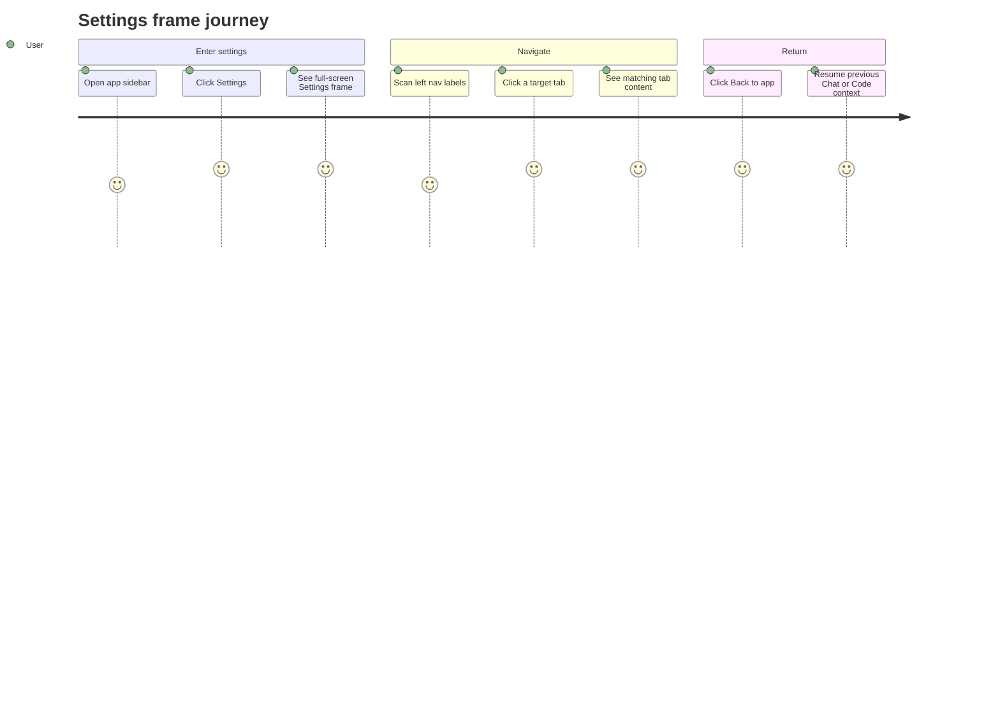

# Settings Frame

Source rows: `SET-01`
Entry path: App boot -> sidebar Settings button -> Settings dialog
Status: Draft

## User Journey

### Overview

| Attribute      | Value                                                                                     |
| -------------- | ----------------------------------------------------------------------------------------- |
| Priority       | High                                                                                      |
| User type      | Returning user configuring the Electron IDE                                               |
| Frequency      | Frequent when setting up providers, permissions, channels, and diagnostics                |
| Success metric | User can enter Settings, find the right tab, and return to the app without losing context |

### User Goal

> "I want to open Settings, move directly to the area I need, and get back to my work without feeling like I left the IDE."

### Preconditions

- The Electron renderer has mounted either Chat or Code layout.
- The sidebar Settings entry is available.
- `SettingsDialog` receives a `GatewayClient` from the app frame.

### Journey Map



### Journey Steps

#### Step 1: Open Settings

**User action:** The user clicks `Settings` from the sidebar.
**System response:** A full-window Settings dialog opens with the requested default tab or General.
**Success criteria:**

- [ ] The Settings frame replaces the main work area clearly.
- [ ] The active tab is visible in the left nav.
- [ ] The previous Chat or Code context is preserved behind the dialog.

**Potential friction:**

- There are no stable selectors yet for L3 automation to assert the frame root or active tab.

#### Step 2: Switch tabs

**User action:** The user clicks a tab in the left nav.
**System response:** The active tab changes and only the matching tab component renders.
**Success criteria:**

- [ ] Tab labels are visible without scrolling.
- [ ] The active tab state is distinct.
- [ ] Switching tabs does not close Settings.

**Potential friction:**

- A user who arrives through a route such as pairing focus needs the correct tab and focused sub-state to be obvious.

#### Step 3: Return to the app

**User action:** The user clicks `Back to app` or closes the dialog.
**System response:** Settings closes and the user returns to the previous IDE mode.
**Success criteria:**

- [ ] Close action is immediate.
- [ ] No gateway call is required to leave Settings.
- [ ] The previous app mode remains intact.

### Error Scenarios

#### E1: Invalid requested tab

**Trigger:** Settings opens with a `defaultTab` value that is not in the known tab list.
**User sees:** General tab content.
**Recovery path:** User can navigate to any valid tab from the left nav.
**Test:** No focused Settings frame test.

### Metrics To Track

- Time from clicking Settings to first tab content visible.
- Tab switch frequency and failed-open rate.
- Settings close rate without a successful tab action.

### E2E Test Reference

Future L3 scenario: `SET-01 opens Settings, switches tabs, and returns to the app`.

## UI Surface


The Settings frame uses full-window navigation with a persistent Back to app action, a left tab rail, and one active tab panel.

### Wireframe

```text
+--------------------------------------------------------------------------------+
| Settings frame                                                                  |
+------------------------------+-------------------------------------------------+
| [<-] Back to app              | Active tab content                              |
|                               |                                                 |
| General                      | e.g. General, Workspace, Providers, Channels    |
| Workspace                    |                                                 |
| Providers                    | Only one tab panel is mounted at a time         |
| Extensions                   |                                                 |
| Permissions                  |                                                 |
| Voice                        |                                                 |
| Channels                     |                                                 |
| Advanced                     |                                                 |
| About                        |                                                 |
+------------------------------+-------------------------------------------------+
```

- Full-screen Settings dialog.
- Back to app button.
- Left nav tabs: General, Workspace, Providers, Extensions, Permissions, Voice, Channels, Advanced, About.
- One active tab content area.
- Hidden dialog title for accessibility.

## Interaction Contract

| User action                   | UI precondition                                                   | UI result                                                      | Backend/API path                                                                                                           | Evidence                                                                                                                                                                                                                            | Test coverage                                                                                                                               |
| ----------------------------- | ----------------------------------------------------------------- | -------------------------------------------------------------- | -------------------------------------------------------------------------------------------------------------------------- | ----------------------------------------------------------------------------------------------------------------------------------------------------------------------------------------------------------------------------------- | ------------------------------------------------------------------------------------------------------------------------------------------- |
| Open Settings                 | Main layout is mounted and Settings state opens the dialog.       | Settings dialog renders with the default tab or requested tab. | Local app store opens the Settings dialog; `SettingsDialog` receives `open`, `defaultTab`, `focusChannelId`, and `client`. | `apps/electron/src/renderer/src/components/settings/SettingsDialog.tsx:55`; `apps/electron/src/renderer/src/components/settings/SettingsDialog.tsx:62`                                                                              | Partial: sidebar button callback is covered in `apps/electron/src/renderer/test/session-sidebar.test.tsx:157`; full dialog open is No test. |
| Close with Back to app        | Settings dialog is open.                                          | Dialog calls `onClose` and returns to the prior app view.      | Local `onClose`; no gateway call.                                                                                          | `apps/electron/src/renderer/src/components/settings/SettingsDialog.tsx:84`; `apps/electron/src/renderer/src/components/settings/SettingsDialog.tsx:86`                                                                              | No focused Settings frame test.                                                                                                             |
| Close through dialog state    | Settings dialog is open and Radix reports `nextOpen=false`.       | Dialog calls `onClose`.                                        | Local `onOpenChange`.                                                                                                      | `apps/electron/src/renderer/src/components/settings/SettingsDialog.tsx:70`                                                                                                                                                          | No test.                                                                                                                                    |
| Switch Settings tab           | Settings dialog is open.                                          | Active tab changes and the matching tab component is mounted.  | Local `setActiveTab(tab.id)`.                                                                                              | `apps/electron/src/renderer/src/components/settings/SettingsDialog.tsx:94`; `apps/electron/src/renderer/src/components/settings/SettingsDialog.tsx:99`; `apps/electron/src/renderer/src/components/settings/SettingsDialog.tsx:118` | No focused Settings frame test.                                                                                                             |
| Open with invalid default tab | Dialog opens with a default tab value that is not in `MAIN_TABS`. | Active tab falls back to General.                              | Local `resolveTab`.                                                                                                        | `apps/electron/src/renderer/src/components/settings/SettingsDialog.tsx:49`; `apps/electron/src/renderer/src/components/settings/SettingsDialog.tsx:51`; `apps/electron/src/renderer/src/components/settings/SettingsDialog.tsx:62`  | No test.                                                                                                                                    |

## Data And Events

- Local props: `open`, `onClose`, `defaultTab`, `focusChannelId`, `client`.
- Local state: `activeTab`.
- Tab ids: `general`, `workspace`, `providers`, `extensions`, `permissions`, `voice`, `channels`, `advanced`, `about`.
- Gateway client is passed down to all tabs except Extensions and About.

## Gaps

- No stable selectors for Settings frame, tab buttons, or tab panels.
- No L2 test that opens `SettingsDialog`, verifies tab fallback, switches tabs, and closes.
- No L3 scenario for Settings navigation.
