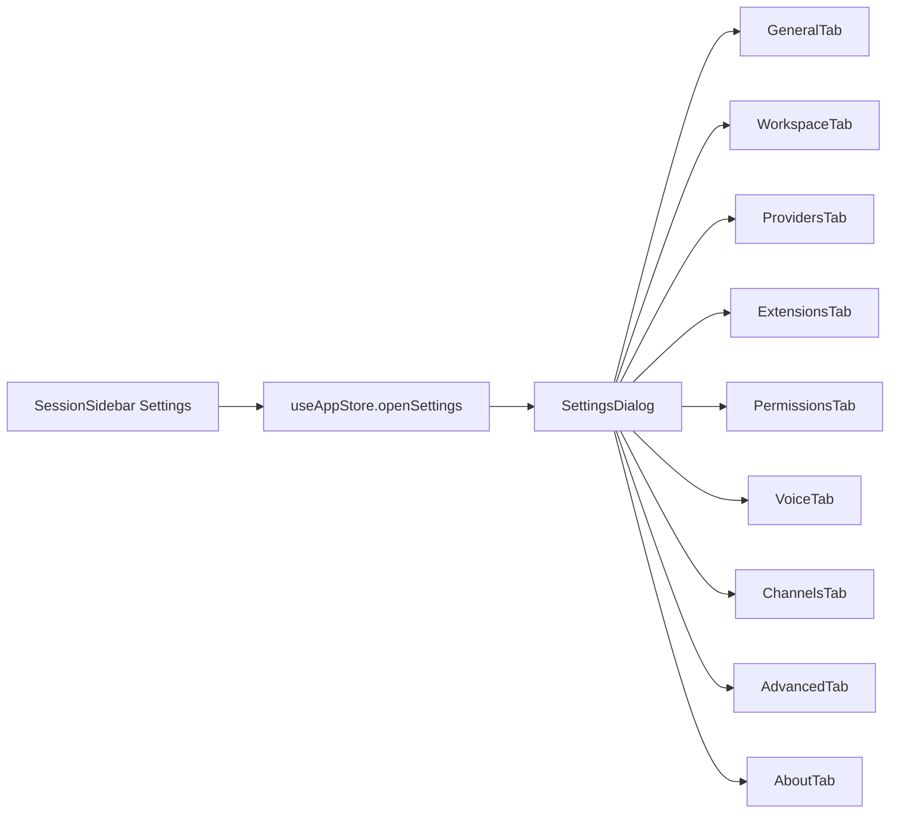

# Settings Runtime Contract

Source rows: `SET-01` through `SET-10`

Entry path: Sidebar → Settings

Status: Draft, source-anchored

## Settings Frame

Settings opens from the shared sidebar in both Chat and Code. `SettingsDialog` keeps track of the active tab and renders one Settings tab at a time.

Read the flow in this order:

| Step | Node                       | Purpose                                               | User-visible outcome                                                                                                    |
| ---- | -------------------------- | ----------------------------------------------------- | ----------------------------------------------------------------------------------------------------------------------- |
| 1    | `SessionSidebar Settings`  | User opens Settings from the shared sidebar.          | App leaves the normal sidebar action and enters settings state.                                                         |
| 2    | `useAppStore.openSettings` | Stores the selected tab and optional route context.   | Settings can open to a default or targeted tab.                                                                         |
| 3    | `SettingsDialog`           | Owns frame-level navigation and Back-to-app behavior. | Left navigation and active tab content are visible.                                                                     |
| 4    | Tab components             | Each tab covers one settings area.                    | General, Workspace, Providers, Extensions, Permissions, Voice, Channels, Advanced, and About render their own controls. |

Evidence:

- Settings button: `apps/electron/src/renderer/src/components/sidebar/SessionSidebar.tsx:232`
- Dialog state: `apps/electron/src/renderer/src/components/settings/SettingsDialog.tsx:37`
- Back to app: `apps/electron/src/renderer/src/components/settings/SettingsDialog.tsx:84`
- Tab nav: `apps/electron/src/renderer/src/components/settings/SettingsDialog.tsx:95`

## Tab Contracts

| Row      | Tab         | Visible controls and states                                                                                                                                                      | Backend/API path                                                                                                                   | Evidence                                                                                                                                                                                                                                                                                                                                                                                                | Coverage                                   |
| -------- | ----------- | -------------------------------------------------------------------------------------------------------------------------------------------------------------------------------- | ---------------------------------------------------------------------------------------------------------------------------------- | ------------------------------------------------------------------------------------------------------------------------------------------------------------------------------------------------------------------------------------------------------------------------------------------------------------------------------------------------------------------------------------------------------- | ------------------------------------------ |
| `SET-01` | Frame       | Back to app, left nav tabs: General, Workspace, Providers, Extensions, Permissions, Voice, Channels, Advanced, About.                                                            | Local settings state                                                                                                               | `apps/electron/src/renderer/src/components/settings/SettingsDialog.tsx:37`; `apps/electron/src/renderer/src/components/settings/SettingsDialog.tsx:84`; `apps/electron/src/renderer/src/components/settings/SettingsDialog.tsx:95`                                                                                                                                                                      | L2 partial                                 |
| `SET-02` | General     | Gateway status, Running/Stopped badge, Restart, HTTP Proxy, auto-detected hint, feature switches, default thinking, reset onboarding when debug enabled.                         | Gateway lifecycle IPC, config RPC/IPC                                                                                              | `apps/electron/src/renderer/src/components/settings/GeneralTab.tsx:226`; `apps/electron/src/renderer/src/components/settings/GeneralTab.tsx:249`; `apps/electron/src/renderer/src/components/settings/GeneralTab.tsx:283`; `apps/electron/src/renderer/src/components/settings/GeneralTab.tsx:324`; `apps/electron/src/renderer/src/components/settings/GeneralTab.tsx:382`                             | L2 partial                                 |
| `SET-03` | Workspace   | Refresh, SOUL/IDENTITY/USER/AGENTS/TOOLS/HEARTBEAT/MEMORY tabs, status markers, Markdown editor, toolbar, Save, Refresh/Retry.                                                   | Workspace file IPC                                                                                                                 | `apps/electron/src/renderer/src/components/settings/WorkspaceTab.tsx:44`; `apps/electron/src/renderer/src/components/settings/WorkspaceTab.tsx:191`; `apps/electron/src/renderer/src/components/settings/WorkspaceTab.tsx:217`; `apps/electron/src/renderer/src/components/settings/WorkspaceTab.tsx:241`; `apps/electron/src/renderer/src/components/settings/WorkspaceTab.tsx:245`                    | L2 partial                                 |
| `SET-04` | Providers   | Default model selector, provider rows, edit/add, Back, provider select, API key/service URL, validation, enabled models, filter, checkboxes, Load models, Save.                  | `provider:list`, `provider:validate`, `provider:save`, `provider:remove`, `config.get`, `config.patch`                             | `apps/electron/src/renderer/src/components/settings/ProvidersTab.tsx:357`; `apps/electron/src/renderer/src/components/settings/ProvidersTab.tsx:525`; `apps/electron/src/renderer/src/components/settings/ProvidersTab.tsx:701`; `apps/electron/src/renderer/src/components/settings/ProvidersTab.tsx:901`; `apps/electron/src/renderer/src/components/settings/ProvidersTab.tsx:967`                   | L2 partial                                 |
| `SET-05` | Channels    | Channel cards, Configure, disabled future cards, connected/edit/disconnect/enable states, token modal, setup wizards, groups, DM policy, allowlist, pairing inbox, Save Changes. | Channel config APIs and provider-specific IPC                                                                                      | `apps/electron/src/renderer/src/components/settings/ChannelsTab.tsx:453`; `apps/electron/src/renderer/src/components/settings/ChannelsTab.tsx:1017`; `apps/electron/src/renderer/src/components/settings/ChannelsTab.tsx:1025`; `apps/electron/src/renderer/src/components/settings/ChannelsTab.tsx:1090`; `apps/electron/src/renderer/src/components/settings/ChannelsTab.tsx:1216`                    | L2 partial                                 |
| `SET-06` | Extensions  | ACP card, status badge, Install/Repair/Doctor/Enable/Disable actions, Advanced Settings, Delivery Mode, Show Tool Calls/Usage/Plans, ACP permission controls.                    | Extension/ACP IPC and config APIs; ACP semantics are covered by `docs/hardware_harness/ui-contracts/agent-ui-contracts-via-acp.md` | `apps/electron/src/renderer/src/components/settings/ExtensionsTab.tsx:47`; `apps/electron/src/renderer/src/components/settings/ExtensionsTab.tsx:75`; `apps/electron/src/renderer/src/components/settings/extensions/AcpCard.tsx:102`; `apps/electron/src/renderer/src/components/settings/extensions/AcpCard.tsx:126`; `apps/electron/src/renderer/src/components/settings/extensions/AcpCard.tsx:247` | ACP semantics covered by root ACP contract |
| `SET-07` | Permissions | Command execution radios, Danger badge, allowlist input plus/remove, notification settings card with Open Settings, system permission actions.                                   | Config IPC and macOS settings bridge                                                                                               | `apps/electron/src/renderer/src/components/settings/PermissionsTab.tsx:180`; `apps/electron/src/renderer/src/components/settings/PermissionsTab.tsx:344`; `apps/electron/src/renderer/src/components/settings/PermissionsTab.tsx:425`; `apps/electron/src/renderer/src/components/settings/PermissionsTab.tsx:464`; `apps/electron/src/renderer/src/components/settings/PermissionsTab.tsx:513`         | L2 partial                                 |
| `SET-08` | Voice       | Voice Wake, Push-to-Talk display, microphone select/Refresh, trigger word chips, add trigger word, wake/send chime.                                                              | Audio device IPC/config APIs                                                                                                       | `apps/electron/src/renderer/src/components/settings/VoiceTab.tsx:167`; `apps/electron/src/renderer/src/components/settings/VoiceTab.tsx:229`; `apps/electron/src/renderer/src/components/settings/VoiceTab.tsx:248`; `apps/electron/src/renderer/src/components/settings/VoiceTab.tsx:326`; `apps/electron/src/renderer/src/components/settings/VoiceTab.tsx:377`                                       | L2 partial                                 |
| `SET-09` | Advanced    | Collapsible sections, config editor, search, Open/Update/Refresh, surface shortcuts, field controls, Save, Apply, cron/skill/debug controls.                                     | Config editor APIs                                                                                                                 | `apps/electron/src/renderer/src/components/settings/AdvancedTab.tsx:42`; `apps/electron/src/renderer/src/components/settings/config-editor/ConfigEditor.tsx:1683`; `apps/electron/src/renderer/src/components/settings/config-editor/ConfigEditor.tsx:1788`; `apps/electron/src/renderer/src/components/settings/AdvancedTab.tsx:148`                                                                   | L2 partial                                 |
| `SET-10` | About       | Auto-update, Check for Updates, Download, Install and Relaunch, GitHub/Website/Documentation links.                                                                              | Update IPC and external links                                                                                                      | `apps/electron/src/renderer/src/components/settings/AboutTab.tsx:206`; `apps/electron/src/renderer/src/components/settings/AboutTab.tsx:268`; `apps/electron/src/renderer/src/components/settings/AboutTab.tsx:286`; `apps/electron/src/renderer/src/components/settings/AboutTab.tsx:301`                                                                                                              | No L3 test                                 |

## Provider Tab API Detail

| User action                   | API / IPC                                                       | Evidence                                                                                                                                       |
| ----------------------------- | --------------------------------------------------------------- | ---------------------------------------------------------------------------------------------------------------------------------------------- |
| Load configured providers     | IPC `provider:list`; gateway RPC `config.get` for default model | `apps/electron/src/renderer/src/components/settings/ProvidersTab.tsx:357`; `apps/electron/src/renderer/src/lib/electron-gateway-client.ts:173` |
| Set default model             | Gateway RPC `config.patch`                                      | `apps/electron/src/renderer/src/components/settings/ProvidersTab.tsx:372`                                                                      |
| Validate/load provider models | IPC `provider:validate`, direct main-process provider fetch     | `apps/electron/src/renderer/src/components/settings/ProvidersTab.tsx:525`                                                                      |
| Save provider                 | IPC `provider:save`                                             | `apps/electron/src/renderer/src/components/settings/ProvidersTab.tsx:607`; `apps/electron/src/main/ipc-gateway.ts:423`                         |
| Remove provider               | IPC `provider:remove`                                           | `apps/electron/src/renderer/src/components/settings/ProvidersTab.tsx:651`; `apps/electron/src/main/ipc-gateway.ts:426`                         |

## Permissions Tab Notification Detail

The Permissions tab has two notification-related behaviors:

1. Opening the tab requests notification permission through the Electron bridge.
2. The visible `Notification settings` card opens the macOS Notifications settings pane.

This tab does not own channel pairing desktop notifications. Pairing notifications are created by the Channels pairing inbox and routed by the main-window route contract.

| User-visible surface       | User action / trigger                | API / IPC                                               | Evidence                                                                                                                                                 |
| -------------------------- | ------------------------------------ | ------------------------------------------------------- | -------------------------------------------------------------------------------------------------------------------------------------------------------- |
| Permissions tab open       | Tab mounts                           | `window.electronAPI.requestNotificationPermission()`    | `apps/electron/src/renderer/src/components/settings/PermissionsTab.tsx:173`; `apps/electron/src/renderer/src/components/settings/PermissionsTab.tsx:179` |
| Notification settings card | Click `Open Settings`                | `handleOpenSystemSettings("notifications")`             | `apps/electron/src/renderer/src/components/settings/PermissionsTab.tsx:471`; `apps/electron/src/renderer/src/components/settings/PermissionsTab.tsx:488` |
| System permissions list    | Render microphone/accessibility rows | Filters out `notifications` from the status/action list | `apps/electron/src/renderer/src/components/settings/PermissionsTab.tsx:501`; `apps/electron/src/renderer/src/components/settings/PermissionsTab.tsx:508` |

## Gaps

- Full Settings e2e is not wired.
- Advanced config editor covers a lot of UI. Split it into focused files if Settings gets more detail later.
- ACP runtime behavior in Extensions is covered by `docs/hardware_harness/ui-contracts/agent-ui-contracts-via-acp.md`; this file covers the visible Settings controls and state.
