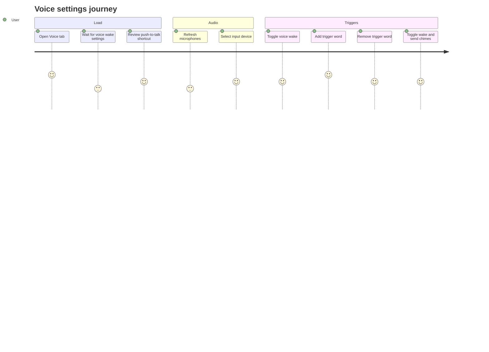

# Settings Voice

Source rows: `SET-08`
Entry path: Settings -> Voice
Status: Draft

## User Journey

### Overview

| Attribute      | Value                                                                            |
| -------------- | -------------------------------------------------------------------------------- |
| Priority       | Medium                                                                           |
| User type      | Returning user configuring voice wake and audio preferences                      |
| Frequency      | Setup-time and whenever audio devices or trigger words change                    |
| Success metric | User can select an input device and update trigger words without losing settings |

### User Goal

> "I want voice wake to listen on the right microphone and respond to the words I actually use."

### Preconditions

- Settings dialog is open on Voice.
- Gateway voice wake RPCs are available.
- Browser media device enumeration may be available.
- Electron app settings bridge may be available for microphone and chime preferences.

### Journey Map



### Journey Steps

#### Step 1: Load voice state

**User action:** The user opens Voice.
**System response:** Voice wake enabled state and trigger words load from the gateway; audio preferences load from app settings.
**Success criteria:**

- [ ] Failure to load voice wake falls back to default trigger words.
- [ ] Audio setting failures do not block trigger-word editing.
- [ ] Push-to-Talk shortcut is visible even though it is static.

#### Step 2: Choose microphone

**User action:** The user refreshes the device list or selects a microphone.
**System response:** Audio inputs are enumerated, deduped, and persisted through app settings.
**Success criteria:**

- [ ] Refresh shows a busy state.
- [ ] Device labels fall back to numbered microphone labels when browser labels are absent.
- [ ] Failed persistence rolls back the selected microphone.

**Potential friction:**

- Browser device labels can be blank until OS/browser microphone permission exists.

#### Step 3: Update trigger behavior

**User action:** The user toggles Voice Wake, adds/removes trigger words, or toggles chimes.
**System response:** Voice wake and trigger changes persist through the gateway; chimes persist through app settings.
**Success criteria:**

- [ ] Duplicate or blank trigger words are ignored.
- [ ] Trigger mutation disables controls while saving.
- [ ] Chime toggles roll back on bridge failure.

### Error Scenarios

#### E1: Microphone enumeration fails

**Trigger:** `enumerateDevices()` rejects.
**User sees:** Failure toast, previous microphone list remains.
**Recovery path:** Grant microphone permission or retry Refresh.
**Test:** No focused VoiceTab test.

#### E2: Voice wake save fails

**Trigger:** `voicewake.set` rejects.
**User sees:** Failure toast.
**Recovery path:** Retry toggle or trigger-word action after gateway recovers.
**Test:** No focused VoiceTab test.

### Metrics To Track

- Microphone refresh failures.
- Voice wake toggle success/failure rate.
- Trigger word add/remove rate.
- Chime preference save failures.

### E2E Test Reference

Future L3 scenario: `SET-08 refreshes microphones, selects a mic, edits trigger words, and handles voicewake.set failure`.

## UI Surface

### Wireframe

```text
+--------------------------------------------------------------------------------+
| Voice                                                                          |
| Configure voice wake and audio settings.                                       |
+--------------------------------------------------------------------------------+
| Voice Wake                                                   [switch]          |
| Trigger words and the enabled state are synced with the gateway.               |
+--------------------------------------------------------------------------------+
| Push-to-Talk                                      Hold Right Option            |
+--------------------------------------------------------------------------------+
| Microphone                                                   [Refresh]         |
| [Default microphone v]                                                          |
| Available input devices are read from the current system audio device list.    |
+--------------------------------------------------------------------------------+
| Trigger Words                                                                  |
| [openclaw x] [claude x] [computer x]                                           |
| [Add trigger word                                      ] [+]                   |
+--------------------------------------------------------------------------------+
| Sounds                                                                         |
| Wake chime                                                   [switch]          |
| Send chime                                                   [switch]          |
+--------------------------------------------------------------------------------+
```

- Voice heading.
- Voice Wake switch with loading/saving disabled states.
- Push-to-Talk static shortcut display.
- Microphone select and Refresh button.
- Trigger word chips with remove buttons.
- Add trigger word input and plus button.
- Wake chime and Send chime switches.

## Interaction Contract

| User action               | UI precondition                         | UI result                                                                                     | Backend/API path                                                          | Evidence                                                                                                                                                                                                                                                                                   | Test coverage             |
| ------------------------- | --------------------------------------- | --------------------------------------------------------------------------------------------- | ------------------------------------------------------------------------- | ------------------------------------------------------------------------------------------------------------------------------------------------------------------------------------------------------------------------------------------------------------------------------------------ | ------------------------- |
| Load voice wake settings  | Voice tab mounts.                       | Voice Wake and trigger words populate from gateway or fallback defaults are shown on failure. | `client.call('voicewake.get')`.                                           | `apps/electron/src/renderer/src/components/settings/VoiceTab.tsx:42`; `apps/electron/src/renderer/src/components/settings/VoiceTab.tsx:45`                                                                                                                                                 | No focused VoiceTab test. |
| Load app audio settings   | Voice tab mounts inside Electron.       | Microphone, wake chime, and send chime values populate.                                       | `window.electronAPI.getAppSettings()`.                                    | `apps/electron/src/renderer/src/components/settings/VoiceTab.tsx:61`; `apps/electron/src/renderer/src/components/settings/VoiceTab.tsx:68`; `apps/electron/src/preload/index.ts:111`                                                                                                       | No focused VoiceTab test. |
| Refresh microphone list   | Media device enumeration is available.  | Refresh button spins; available audio inputs update.                                          | `navigator.mediaDevices.enumerateDevices()`.                              | `apps/electron/src/renderer/src/components/settings/VoiceTab.tsx:80`; `apps/electron/src/renderer/src/components/settings/VoiceTab.tsx:267`; `apps/electron/src/renderer/src/components/settings/VoiceTab.tsx:273`                                                                         | No focused VoiceTab test. |
| Select microphone         | Microphone select is enabled.           | Selected microphone updates optimistically and persists to app settings; rollback on failure. | `window.electronAPI.updateAppSettings({ microphone })`.                   | `apps/electron/src/renderer/src/components/settings/VoiceTab.tsx:118`; `apps/electron/src/renderer/src/components/settings/VoiceTab.tsx:143`; `apps/electron/src/renderer/src/components/settings/VoiceTab.tsx:301`; `apps/electron/src/preload/index.ts:112`                              | No focused VoiceTab test. |
| Toggle voice wake         | Voice Wake switch is enabled.           | Gateway voice wake enabled state updates; trigger words refresh from returned payload.        | `client.call('voicewake.set', { enabled })`.                              | `apps/electron/src/renderer/src/components/settings/VoiceTab.tsx:185`; `apps/electron/src/renderer/src/components/settings/VoiceTab.tsx:188`; `apps/electron/src/renderer/src/components/settings/VoiceTab.tsx:241`                                                                        | No focused VoiceTab test. |
| Add trigger word          | Input contains a unique non-empty word. | Trigger word list persists through gateway and input clears on success.                       | `client.call('voicewake.set', { triggers })`.                             | `apps/electron/src/renderer/src/components/settings/VoiceTab.tsx:170`; `apps/electron/src/renderer/src/components/settings/VoiceTab.tsx:200`; `apps/electron/src/renderer/src/components/settings/VoiceTab.tsx:348`; `apps/electron/src/renderer/src/components/settings/VoiceTab.tsx:360` | No focused VoiceTab test. |
| Remove trigger word       | Trigger word chip is visible.           | Trigger word list persists without the removed word.                                          | `client.call('voicewake.set', { triggers })`.                             | `apps/electron/src/renderer/src/components/settings/VoiceTab.tsx:214`; `apps/electron/src/renderer/src/components/settings/VoiceTab.tsx:329`; `apps/electron/src/renderer/src/components/settings/VoiceTab.tsx:335`                                                                        | No focused VoiceTab test. |
| Toggle wake or send chime | Sound switches are enabled.             | Chime setting updates optimistically and persists to app settings; rollback on failure.       | `window.electronAPI.updateAppSettings({ wakeChime })` or `{ sendChime }`. | `apps/electron/src/renderer/src/components/settings/VoiceTab.tsx:154`; `apps/electron/src/renderer/src/components/settings/VoiceTab.tsx:382`; `apps/electron/src/renderer/src/components/settings/VoiceTab.tsx:392`; `apps/electron/src/preload/index.ts:119`                              | No focused VoiceTab test. |

## Data And Events

- Voice wake RPCs: `voicewake.get`, `voicewake.set`.
- Voice wake payload: `enabled`, `triggers`.
- App settings keys: `microphone`, `wakeChime`, `sendChime`.
- Browser API: `navigator.mediaDevices.enumerateDevices()` and `devicechange` listener.

## Gaps

- No L2 coverage for voice wake RPCs, trigger word mutation, microphone enumeration, or audio app settings persistence.
- No stable selectors for Voice Wake, microphone select, Refresh, trigger chips, add-word input, or sound switches.
- Push-to-Talk is static display only here; no repo-local interaction contract is exposed in this tab.
