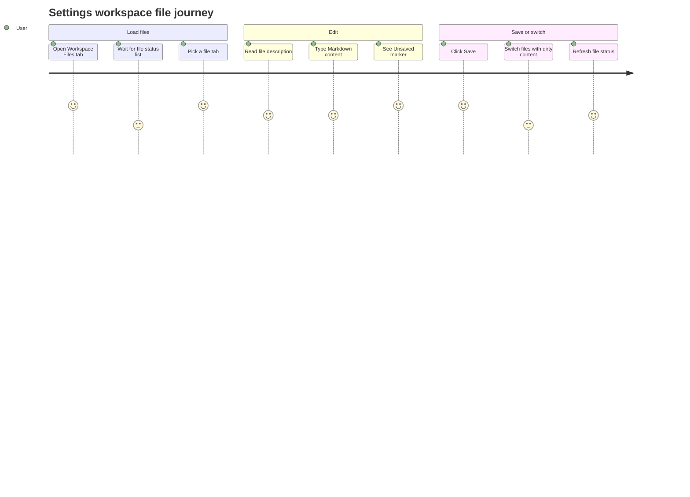

# Settings Workspace Files

Source rows: `SET-03`
Entry path: Settings -> Workspace Files
Status: Draft

## User Journey

### Overview

| Attribute      | Value                                                                          |
| -------------- | ------------------------------------------------------------------------------ |
| Priority       | High                                                                           |
| User type      | Returning user editing the default agent workspace files                       |
| Frequency      | Occasional during setup; frequent while tuning the main agent                  |
| Success metric | User can edit and save workspace Markdown files without losing unsaved content |

### User Goal

> "I want to edit my agent's core workspace files from Settings and know exactly what has saved."

### Preconditions

- Settings dialog is open on the Workspace Files tab.
- Gateway agent file RPCs can list, read, and write files for agent id `main`.
- The user is editing one of the fixed workspace Markdown files.

### Journey Map



### Journey Steps

#### Step 1: Load workspace files

**User action:** The user opens Workspace Files.
**System response:** The tab loads file status for the fixed file list and then reads the selected file content.
**Success criteria:**

- [ ] Loading and error states are explicit.
- [ ] Missing files are marked Empty instead of hiding the tab.
- [ ] The selected file description explains the file's purpose.

**Potential friction:**

- The file list is fixed to `main`, so users with multiple agents may expect a selector that is not present here.

#### Step 2: Edit selected content

**User action:** The user changes Markdown in the editor.
**System response:** The tab marks the file Unsaved and schedules an autosave.
**Success criteria:**

- [ ] Dirty state is visible near the file description.
- [ ] The editor remains usable while file status can be refreshed separately.
- [ ] Autosave does not clear the user's content before the write completes.

**Potential friction:**

- Autosave is delayed and toast-based, so users may still click Save for reassurance.

#### Step 3: Save or switch files

**User action:** The user clicks Save or selects a different file tab.
**System response:** Explicit Save writes the selected file; switching with dirty content saves the current file before changing selection.
**Success criteria:**

- [ ] Save is disabled when there is no dirty content.
- [ ] Save failure keeps the edited content available.
- [ ] Switching files does not silently discard dirty content.

### Error Scenarios

#### E1: File list load fails

**Trigger:** `agents.files.list` rejects on initial load.
**User sees:** Error text and Retry button.
**Recovery path:** Click Retry after gateway or file availability recovers.
**Test:** No focused WorkspaceTab test.

#### E2: Save fails

**Trigger:** `agents.files.set` rejects.
**User sees:** Failure toast.
**Recovery path:** Keep editing and retry Save.
**Test:** No focused WorkspaceTab test.

### Metrics To Track

- Time to first editable file.
- Save success/failure rate per workspace file.
- Frequency of dirty switch autosaves.
- Retry usage after file list failures.

### E2E Test Reference

Future L3 scenario: `SET-03 edits SOUL.md, saves, switches to AGENTS.md, and recovers from a list error`.

## UI Surface

### Wireframe

```text
+--------------------------------------------------------------------------------+
| Workspace Files                                                  [Refresh]      |
| Edit your agent's personality and configuration files.                          |
+--------------------------------------------------------------------------------+
| [SOUL ✓] [IDENTITY Empty] [USER ✓] [AGENTS ✓] [TOOLS ✓] [HEARTBEAT] [MEMORY]   |
+--------------------------------------------------------------------------------+
| SOUL.md - Your agent's personality, tone, and boundaries     Unsaved [Save]     |
+--------------------------------------------------------------------------------+
|                                                                                |
| Markdown editor for the selected file                                           |
|                                                                                |
+--------------------------------------------------------------------------------+
```

- Workspace heading and description.
- Refresh button with loading spinner.
- File tabs for SOUL, IDENTITY, USER, AGENTS, TOOLS, HEARTBEAT, MEMORY.
- Empty or check status marker per file tab.
- Selected file label, description, Unsaved marker, Save button.
- Markdown editor with content loading state.
- Whole-tab loading and error/retry states.

## Interaction Contract

| User action             | UI precondition                                                 | UI result                                                                                                       | Backend/API path                                                                                                                             | Evidence                                                                                                                                                                                                                                                                                                   | Test coverage                                                                                                                                |
| ----------------------- | --------------------------------------------------------------- | --------------------------------------------------------------------------------------------------------------- | -------------------------------------------------------------------------------------------------------------------------------------------- | ---------------------------------------------------------------------------------------------------------------------------------------------------------------------------------------------------------------------------------------------------------------------------------------------------------- | -------------------------------------------------------------------------------------------------------------------------------------------- |
| Load workspace files    | Workspace Files tab mounts.                                     | Loading state appears until file list resolves; error state shows Retry if initial list fails.                  | `client.workspaceFilesList('main')`.                                                                                                         | `apps/electron/src/renderer/src/components/settings/WorkspaceTab.tsx:44`; `apps/electron/src/renderer/src/components/settings/WorkspaceTab.tsx:139`; `apps/electron/src/renderer/src/lib/electron-gateway-client.ts:372`                                                                                   | No focused WorkspaceTab test.                                                                                                                |
| Refresh workspace files | Workspace Files tab is loaded.                                  | Refresh button disables and spins, file list reloads, success toast may appear.                                 | `client.workspaceFilesList('main')`.                                                                                                         | `apps/electron/src/renderer/src/components/settings/WorkspaceTab.tsx:191`; `apps/electron/src/renderer/src/components/settings/WorkspaceTab.tsx:194`; `apps/electron/src/renderer/src/components/settings/WorkspaceTab.tsx:196`                                                                            | No focused WorkspaceTab test.                                                                                                                |
| Select file tab         | File tabs are visible.                                          | Selected file changes; dirty current content is saved before switching.                                         | Current file: `client.workspaceFilesSet('main', selectedFile, content)` when dirty; next file: `client.workspaceFilesGet('main', fileName)`. | `apps/electron/src/renderer/src/components/settings/WorkspaceTab.tsx:123`; `apps/electron/src/renderer/src/components/settings/WorkspaceTab.tsx:130`; `apps/electron/src/renderer/src/components/settings/WorkspaceTab.tsx:217`; `apps/electron/src/renderer/src/lib/electron-gateway-client.ts:382`       | No focused WorkspaceTab test.                                                                                                                |
| Edit Markdown content   | A file is selected and content loaded.                          | Content updates, Unsaved marker appears, autosave timer schedules a save after 2 seconds.                       | Local state then `client.workspaceFilesSet('main', selectedFile, content)`.                                                                  | `apps/electron/src/renderer/src/components/settings/WorkspaceTab.tsx:104`; `apps/electron/src/renderer/src/components/settings/WorkspaceTab.tsx:112`; `apps/electron/src/renderer/src/components/settings/WorkspaceTab.tsx:243`; `apps/electron/src/renderer/src/components/settings/WorkspaceTab.tsx:263` | Markdown editor has separate tests in `apps/electron/src/renderer/src/components/ui/markdown-editor.test.tsx`; WorkspaceTab flow is No test. |
| Click Save              | Current content differs from original and not currently saving. | Save button disables while saving; original content updates; file list reloads; toast shows success or failure. | `client.workspaceFilesSet('main', selectedFile, content)`.                                                                                   | `apps/electron/src/renderer/src/components/settings/WorkspaceTab.tsx:83`; `apps/electron/src/renderer/src/components/settings/WorkspaceTab.tsx:91`; `apps/electron/src/renderer/src/components/settings/WorkspaceTab.tsx:245`                                                                              | No focused WorkspaceTab test.                                                                                                                |

## Data And Events

- Fixed agent id: `main`.
- Workspace files: `SOUL.md`, `IDENTITY.md`, `USER.md`, `AGENTS.md`, `TOOLS.md`, `HEARTBEAT.md`, `MEMORY.md`.
- Gateway RPCs through `GatewayClient`: `agents.files.list`, `agents.files.get`, `agents.files.set`.
- Local state: `files`, `selectedFile`, `content`, `originalContent`, `loading`, `contentLoading`, `saving`, `refreshing`, `error`, `autoSaveTimer`.

## Gaps

- No L2 test for Workspace Files tab loading, retry, file switching, autosave, or Save behavior.
- No stable selectors for file tabs, status markers, Save, Refresh, or the editor container.
- Autosave timer behavior is not documented by a test and should be covered with fake timers before L3 relies on it.
